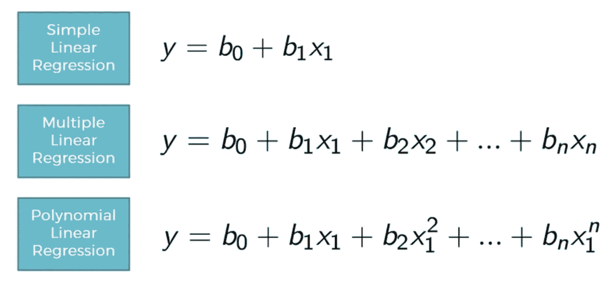

# 机器学习项目 3:使用多项式回归预测工资

> 原文：<https://medium.com/analytics-vidhya/machine-learning-project-3-predict-salary-using-polynomial-regression-7024c7bace4f?source=collection_archive---------2----------------------->

今天，我将看看多项式回归的例子。

图片来源:A-Z 机器学习 Udemy

**# 100 daysofml code # 100 projects inml**

我将使用 Udemy 上的 A-Z 机器学习课程中的例子。

如果你看上面的图片，它列出了所有 3 种类型的回归方程-你会注意到在多项式…