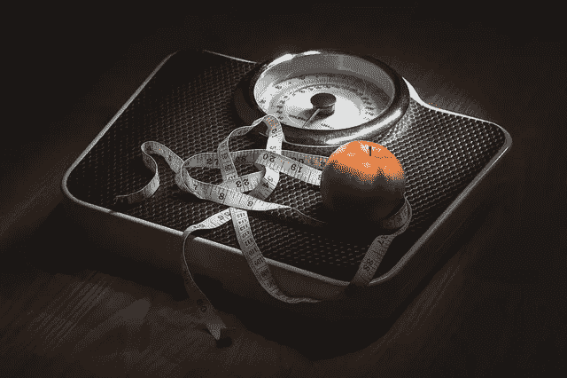

# 机器学习项目 8:使用线性回归预测体重

> 原文：<https://medium.com/analytics-vidhya/machine-learning-project-7-predict-weight-using-linear-regression-fa8cf7294162?source=collection_archive---------0----------------------->

来源 pixabay.com

我今天想到了在 Kaggle 数据集上工作，但同时我也在寻找一个非常简单的项目。我偶然发现了这个列出人们身高和体重的数据集。你可以点击查看[。](https://www.kaggle.com/jamesbasker/height-weight-single-variable-data-101-series-10)

我们将在接下来的项目中讨论一些更复杂和更大的数据集。但是在这个项目中——我将引入两个新的话题——“***检查***……