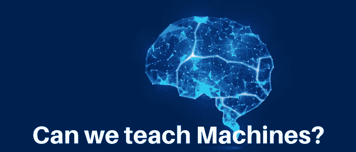
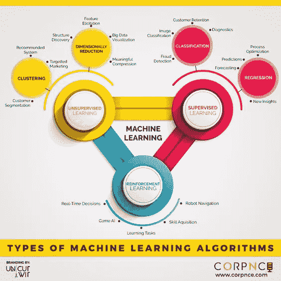
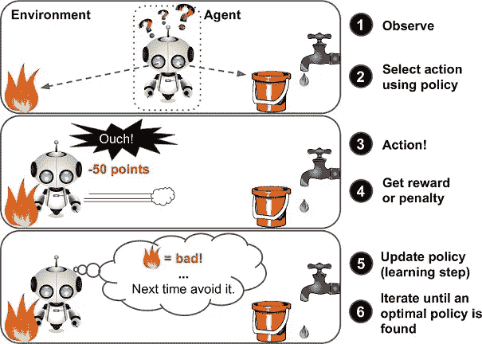

# 机器学习序言

> 原文：<https://medium.com/analytics-vidhya/machine-learning-prolusion-8aefa8dea291?source=collection_archive---------34----------------------->

> “机器智能是人类需要创造的最后一项发明。”~尼克·博斯特罗姆

机器学习顾名思义就是让机器学习。可以认为是人工智能的子集。这是我们身边最新的流行词，它应该成为计算机科学中最有趣的领域之一。机器学习的用途是从数据中学习，并在不过度拟合的情况下从数据中概括预测。

**我们身边有很多使用机器学习的例子。**

分类系统

> 邮件分类

每当我们打开 Gmail 时，我们都会看到某些分类，如垃圾邮件、促销和许多其他分类。

人脸识别

> 人脸识别系统

生物识别和 snapchat 过滤器就是最好的例子，它们不仅可以识别我们的脸，还可以识别它的各种特征。

> 推荐系统

当我们在网上购物时，我们会得到某些推荐，比如经常一起购买的*或社交媒体(LinkedIn 或 Instagram)向我们推荐*你可能认识的人*。*

*P 机器学习的 ipeline*

*   *数据收集→生成我们自己的数据集或从现有来源或通过网络搜集收集。*
*   *数据清理(特征工程)→我们只想要某些相关的细节，所以去掉那些没用的。*
*   *寻找有趣模式的算法*(主要任务)**
*   *部署*

# ***机器学习的分类***

**

1.  ***监督学习→** 在这种类型的学习中，我们得到标记数据，即我们被给定 x 的某个 y。算法从训练数据中学习，确定 x 和 y 之间的关系。*

> *当我们想预测房价时。因此，我们将使用其特征来训练我们的模型，如位置、面积、房间数量、与市场和医院的距离(训练时会给出 x 和 y)，然后我们将使用价格的历史来预测。*

*在监督学习中，我们可以将算法分为两种类型→*

*   *回归算法→通常对连续有帮助*
*   *分类算法*

***2。无监督学习→** 顾名思义，学习是无监督的，即没有标签，所以我们需要将相似的数据分组在一起(这被称为*聚类*)。*

> *假设我们想算出有多少推文是受欢迎的，有多少是不受欢迎的！无论何时我们打开任何一个显示新闻的网站，它都会在某个类别下有文章。*

***3。半监督学习→** 当数据的一部分被标记而另一半未被标记时，或者有时我们标记我们的一些数据(在未标记的数据中)以改进我们算法的工作。*

***4。强化学习** →和我们人类的学习方式非常相似。为了得到一个想法，让我们回到记忆中，当我们最初学习骑自行车时，我们不能保持平衡，我们不断地向左向右摔倒，或者摔倒，但是通过这次经历的学习，我们学会了。*

*这是一种尝试和学习。击中(错误)有助于我们学习，因为它涉及到一定的分数或时间成本。*

> *比如 AI 机器人为我们支付游戏或者一个马里奥游戏。下图很好地说明了这一点。或者寻找最短路径问题。*

**

*强化学习*

*LML 中使用的语言*

*   *计算机编程语言*
*   *稀有*
*   *朱莉娅*
*   *口齿不清*

> *Jupyter，Google Colab 可用于开发目的。*