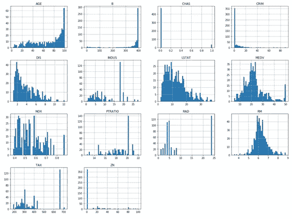
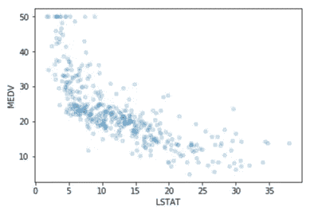

# Python 中波士顿住房数据集的机器学习回归和数据分析—第 1 部分

> 原文：<https://medium.com/analytics-vidhya/machine-learning-regression-and-data-analysis-with-the-boston-housing-dataset-in-python-part-1-c7bc47f4d7bf?source=collection_archive---------16----------------------->

作为一名刚刚起步的数据科学家，他的背景是数据分析师，主要使用 SQL(和 SAS ),这些角色之间的主要区别是使用 Python(或 R)和机器学习进行预测工作。

作为一名分析师，我总是感觉自己被要求说出数据中有什么，数据科学家被问及我们能从数据中预测吗。我们做出假设，并在数据中检验它们，这就是科学发挥作用的地方。

我想随着我职业生涯的进展，我会看到是否真的是这样，但开始学习构建 ML 模型并从中学习似乎是一个好主意。

# 波士顿房价

图片来源:swamsyank at en . Wikipedia[CC BY-SA 3.0([https://creativecommons.org/licenses/by-sa/3.0](https://creativecommons.org/licenses/by-sa/3.0))]

多年来，我学习了 Python 的各种课程，阅读了大量关于 ML 的资料，因此我决定从一个相对知名的数据集(在此处找到)开始，这个数据集经常被 ML 的新来者使用，它包含了波士顿各个地区的详细信息以及它们的中值房价。

然后，我们的目标是建立一个模型，在给定这些细节的情况下，预测新区域的中值。我有意避免阅读任何其他对这个数据集的分析，以便使这个分析成为我自己的，尽管很大程度上是基于[这本书](http://shop.oreilly.com/product/0636920052289.do)和[这个 EdX](https://courses.edx.org/courses/course-v1:IBM+DA0101EN+3T2018/course/) 课程中介绍的方法，顺便说一下，这两本书都很棒。

完整的代码可以在[这里](https://github.com/CheekyDave/Boston_Machine_Learning)找到。

# 数据集

在任何数据科学项目中，第一个障碍是导入数据，并将其转换成我们可以在 ML 模型中使用的格式。在 Python 中，这看起来几乎总是一个熊猫数据框架，至少在开始时是这样，所以我启动了一个 Jupyter 笔记本(它以前曾使用 PyCharm 学习 Python，似乎是一个更适合数据科学项目的界面，尽管我会考虑 PyCharm 编写大量代码，因为它有一些非常好的重构功能)并开始破解。

快速看一下数据输入的文本文件，我需要做一些清理工作来把它转换成数据帧，这不是一个好的简单的 CSV 格式。它的顶部有 20 多行说明性文本，然后这些行由空格分隔，并分布在两行上。对于这些方面的资深专家来说足够简单，但对于像我这样的新手来说却是大量的工作。这最终在一个周六的下午花了两个小时，但最终我得到了我需要的数据，以一种漂亮干净的表格格式(如果你想更好地理解这一点，可以在数据集中找到每个特性的解释)。

# 探索性分析

一些探索性的数据分析表明，数据集中没有空值/缺失值(正如我所说，这显然是一个供初学者使用的数据集，在现实生活中不太可能！).数据集中有一些稍微有问题的值，例如，50k 处的房价峰值，除此之外没有任何值，这表明这些值已经封顶(下图中的 MEDV)。

我也想了解各种值的峰值，但鉴于我无法获得更多关于数据的信息，也无法与收集数据的人交谈，我选择在假设这些都是正确的情况下进行，在此阶段我不会过滤掉任何内容。

接下来，我在数据中寻找相关性，看看什么最有可能解释给定地区的房价。很明显，从这个角度看，RM(一个地区一所房子的平均房间数)与房子的价值有很强的正相关性，这似乎是完全符合逻辑的。散点图显示，似乎有一个非常简单的，接近线性的关系。

值得注意的是，在 50k 处似乎有一些异常值。同样，还不清楚这些是否是错误，或者是否有模型需要捕捉的东西，所以我决定把它们留在这里。我还试图在图表中加入其他变量，看看这些异常值中是否有某种模式，但没有明显的变化。一种想法是，这些可能是高价格的城市地区，在那里较小的公寓将非常昂贵。

以类似的方式，我研究了 LSTAT 特征(一个地区中“较低地位”人口的百分比)。这里似乎有一个明显的负相关，这也是合乎逻辑的。与房间数量相比，这种关系的线性程度较低，在开始时急剧下降，随后随着时间的推移呈下降曲线。

其他特征也显示了一些相关性，但没有这两个显著。在这个阶段，我们可以选择将数据集包含的要素数量减少到只有这两个，或者一两个，但我选择将它们都保留下来，看看结果会是什么。然而，我认为任何模型都应该主要使用这些特征来预测一个地区的房价。

现在我们有了一个干净的数据集和对数据中模式的理解，我们准备继续并开始构建一些 ML 模型，我将在第 2 部分中谈到，你可以在这里阅读。