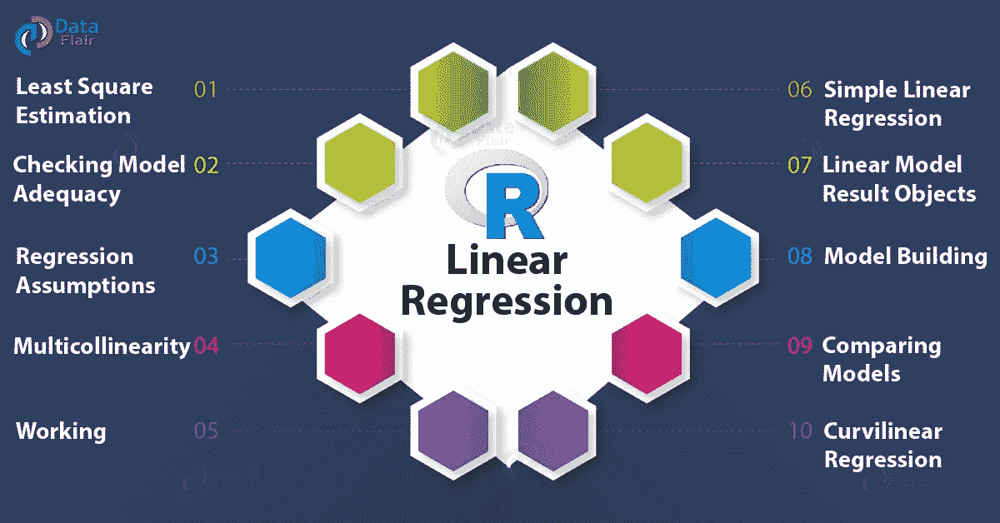

# 机器学习:回归

> 原文：<https://medium.com/analytics-vidhya/machine-learning-regression-e636141e0553?source=collection_archive---------29----------------------->

***什么是回归？*** 在统计建模中，**回归分析**是一组统计过程，用于估计因变量(通常称为“结果变量”)和一个或多个自变量(通常称为“预测变量”、“协变量”或“特征”)之间的关系。

***什么是回归模型？***