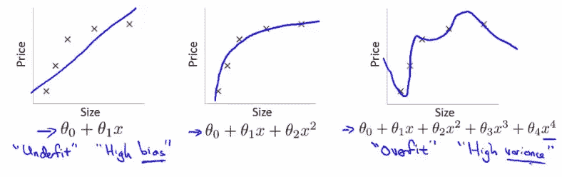

# 什么是虚拟机器学习正则化

> 原文：<https://medium.com/analytics-vidhya/machine-learning-regularization-theory-for-dummies-9814acf81445?source=collection_archive---------1----------------------->

## 初学者的理论介绍

[杰瑞米·托马斯](https://unsplash.com/@jeremythomasphoto?utm_source=medium&utm_medium=referral)在 [Unsplash](https://unsplash.com?utm_source=medium&utm_medium=referral) 上拍照

我四处阅读关于正规化的文章，但找不到直接而愚蠢的东西，所以我想我应该着手写一篇。

在我们讨论什么是正则化之前，我们需要知道我们为什么要关心它？

我的意思是，如果度量分数很高，输出也能很好地预测，为什么还要费事去正则化这些特性呢？

用更少的数据点制作一个 ML 模型并使用它来预测输出类似于给一个有 4 小时睡眠和红牛的考试，你会怎么问？

因为，一个用较少的数据包含所有特征的模型(很好地适合所有数据点)将不得不做出大的假设，这通常会破坏模型的主干逻辑。

它认为所有的特性都同等重要，而不是给出一个最接近的可能解决方案(我们在寻找一个猜测，记得吗？)但是它给了我们一个精确解。

你可能会说，得到一个精确的解有什么问题，我会说，问题是当你给机器新的数据时，它会以先前数据点的偏差运行，这意味着如果先前的数据点都是棒球迷，当你给机器新的名字时，他们的最爱。运动几乎总是棒球，即使他们的照片是踢足球，观察偏见？

> 因此，如果你有更少的数据点，而机器说模型有 99%的准确性，这可能会导致过度拟合，而你现在已经给了函数一个偏差，所以你添加的任何新数据都将被赋予一个先前的偏差。

在现实生活中，我们永远不知道哪些数据点是 100%正确的，但我们知道其中一些不会是 100%正确的，我们只是不知道哪些是正确的。

图 1

结帐图 1，我们的问题是，我们有 5 个训练数据，并希望找到一个函数，f(x)的基础上。

根据您的观点，(图 1)模型 3 是最正确的吗？

因为它完美地覆盖了所有的训练数据，但是如果我告诉你新数据上的预测差得很远呢？

为什么？

这是因为你已经给了所有 5 个数据点相等的权重来形成函数 f(x)，f(x)没有忽略可能是噪声或者甚至是不正确的数据点的自由，但是如果没有机器探索的自由，你就通过要求机器遵从你说的任何事情而剥夺了它的思考和推理能力(这被称为偏差)。

因此，模型看起来很好，准确性得分也很高，但它肯定会过度拟合，导致预测的准确性。

在 ML 模型中，如果偏差没有任何自由度(这被称为方差)，那么它对模型来说是一个非常大的负担，偏差和方差彼此负相关，如果你为它们中的每一个找到一个好的数字，你就会在某个地方找到一个最佳点。

## 对图 1 的回答

模型 2 会工作得很好，因为它只是一条曲线，不会根据任何数据点进行调整，它可以自由地不覆盖曲线下的任何数据点，但仍然覆盖了足够多的数据点，可以给出良好的预测。

为了帮助我们解决过度拟合的问题，我们使用了**正则化。**

正则化帮助我们预测一个模型，该模型帮助我们解决训练数据的偏差。

实现这一点的方法可能会有所不同，可以是测量损失函数，然后对其进行迭代，可以是向预测器添加学习超参数，或者为某些特征分配权重，使其突出或淡化。

## 对于包含噪声且第一个预测值小于 95–98%的模型，正则化是必须的。

下面是我强烈推荐的一个正规化库，继续玩吧-

 [## sklearn.feature_selection。RFE-sci kit-学习 0.20.3 文档

### 给定一个为特征分配权重的外部估计器(例如，线性模型的系数)，目标是…

scikit-learn.org](https://scikit-learn.org/stable/modules/generated/sklearn.feature_selection.RFE.html) 

如果你有任何问题，和理论有关的，请随时传送给我。

愿原力与你同在。