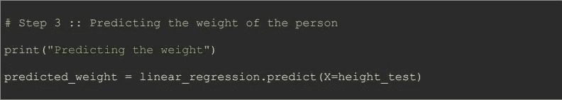

# 机器学习—简单线性回归

> 原文：<https://medium.com/analytics-vidhya/machine-learning-simple-linear-regression-ead2b5306c62?source=collection_archive---------30----------------------->

# 先决条件

*   [机器学习—数据预处理](/analytics-vidhya/machine-learning-data-prepossessing-661d18f063c3)

# 概观

以下是我们将在博客中涉及的话题。

*   揭秘简单线性回归
*   简单线性回归的常见例子
*   趋势线和简单线性回归
*   简单线性回归的实现
    **-** 步骤 1:数据预处理
    **-** 步骤 2:训练模型
    -**-**步骤 3:预测
    -**-**步骤 4:可视化对训练和测试数据的预测

# 揭秘简单线性回归

线性回归模型允许我们在两个连续(定量)变量之间建立关系。它是最简单的“回归”形式，通过对观察到的数据拟合一条线来描述变量之间的关系。下面的等式代表一个简单的线性回归模型:

简单的线性模型用图形表示为:

这里，

*   **y** 为因变量。被预测的变量或方程求解的变量。
*   **x** 是自变量，用于预测因变量的值。
*   **b1** 是自变量的系数。它代表自变量(x)发生单位变化时因变量(y)的变化。
*   **b0** 是常数，表示直线感兴趣的垂直轴上的点。

# 简单线性回归的常见例子

1.  对学生的学习时间和平均成绩进行分析。找出学生学习的小时数和他们获得的 GPA 之间的关系。这里，小时数是因变量，GPA 是因变量。在这种情况下，等式将为:
    **GPA = b0 + b1*小时数**
2.  分析一个人的工资是如何随着他所拥有的经验年限而变化的。在这里，工作年限是因变量，工资是因变量。这种情况下，等式会是:
    **工资= b0 + b1 *经验**

# 趋势线和简单线性回归

如前所述，回归模型通过对观察数据进行直线拟合来描述变量之间关系。这条线被称为“趋势线”。它是最符合数据的线。

现在的问题是，简单的线性回归如何找到最符合数据的直线。实际上，它使用了一种称为**“普通最小二乘法”**的技术来寻找趋势线。该算法将绘制尽可能多的线，然后为每条线计算数据点到 y-y '线的距离。之后，计算所有数据点到直线距离的平方和，即 SUM(y-y ')*。*现在，将对每条绘制的线进行计算。最后，该算法将选择具有最小距离平方和的线，并将该线用作趋势线。

# 简单线性回归的实现

我将使用来自 Kaggle 的身高和体重数据集，可以在这里找到。对于这个数据集，我们必须根据身高预测这个人的体重。那么，我们开始吧。

# 步骤 1:预处理数据

数据预处理是建立机器学习模型的必要步骤。要阅读更多关于数据预处理的内容，请阅读我的博客[机器学习—数据预处理](/analytics-vidhya/machine-learning-data-prepossessing-661d18f063c3)。

如果您打开数据文件，您会看到没有丢失值或分类数据，所以不需要处理它们。此外，正如我在[机器学习—数据预处理](/analytics-vidhya/machine-learning-data-prepossessing-661d18f063c3)博客中提到的，我们必须扩展特征，以便准确预测。在这里，我没有这样做，因为对于许多机器学习算法，scikit-learn 库为我们处理它，这是简单线性回归的情况。

# 第二步:培训模式

在数据预处理之后，我们必须训练简单的线性回归模型，然后用于进行预测。

以下代码将用于在训练数据集上训练模型。

# 第三步:做预测

在训练了机器学习模型之后，我们将在测试集上进行预测，因为我们必须测试模型。这就是我们将数据集分为训练和测试部分的原因。这里的目标是检查机器学习模型的准确性。

下面是根据身高预测一个人体重的代码。

# 步骤 4:可视化对训练和测试数据的预测

对于可视化的工作，我们已经完成了，我们将从 matplotlib 库得到帮助。

下面是可视化模型结果的代码。

代码的结果将是:

这里我们可以看到，在训练数据集上，预测非常准确，但另一方面，对于测试数据，我们有一些异常。

人们一定会想，为什么它对训练数据集非常有效，而对测试数据却无效呢？

让我用一个简单的例子来解释这种行为，如果一个学生已经知道了试卷，并且在我们的例子中，知道了正在发生的事情，他就会在考试中名列前茅。我们的模型是在训练数据集上训练的，这就是为什么它预测准确，而另一方面在测试数据上表现不佳的原因。

模型在测试数据集上表现不佳的另一个原因是缺少数据。随着训练数据大小的增加，模型的准确性也增加。如果学生对考试中包含的题目了解很多，就会得到好成绩。

我们终于做出了第一个简单的线性回归模型。

如果有任何问题或需要澄清，请让我知道。

# 资源:

你可以在我的 [GitHub 库](https://github.com/iftikhar1995/Machine-Learning)的博客中找到我写的代码。