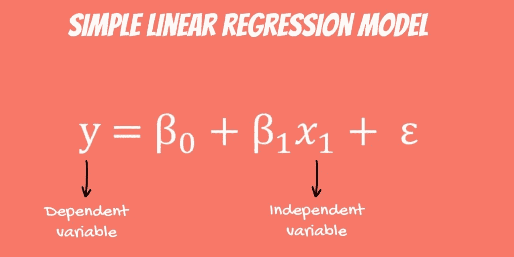
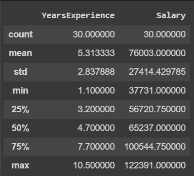
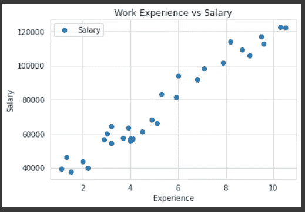
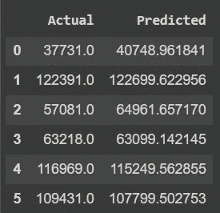
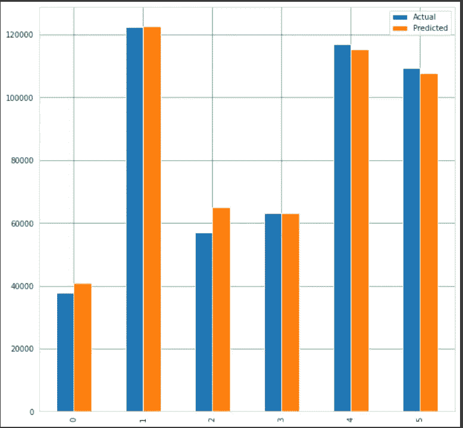
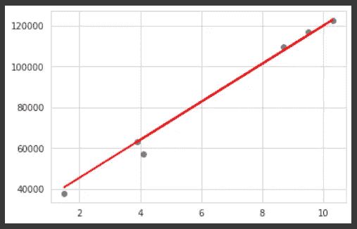

# 机器学习:使用 Python 的简单线性回归

> 原文：<https://medium.com/analytics-vidhya/machine-learning-simple-linear-regression-using-python-7d13e8ac8300?source=collection_archive---------13----------------------->



随着经验和年龄的增长，我们人类会变得更好。想知道机器如何在数据科学领域变得更好吗？数据建模使用机器学习算法，其中机器从历史数据中学习，以开发一个模型来预测新数据。

机器学习模型分为两类:

1.  **监督学习法**:这种方法有带标签的历史数据。回归和分类算法属于这一类。
2.  **无监督学习方法**:没有给历史数据分配预定义的标签。聚类算法属于这一类。

当函数 f 从输入变量 X 映射到输出变量 Y 时:

*分类算法*的任务是预测离散的类别标签。
例如，电子邮件或文本可以被分类为属于两类之一:“垃圾邮件”和“非垃圾邮件”是一个分类问题。

*回归算法*是预测一个连续量的任务。
例如，根据历史数据预测一家公司在收入方面的表现就是一个回归问题。

要了解更多关于机器学习中模型的分类，你可以点击我的文章[这里](/analytics-vidhya/parametric-and-nonparametric-models-in-machine-learning-a9f63999e233)。

## 什么是回归分析，什么时候可以用？

回归分析是一种预测建模方法，它探索了因变量(目标变量)和预测变量之间的关系。这种方法用于预测、建模时间序列以及寻找变量之间的因果关系。换句话说，回归就是把变量之间的点连接起来。

例如，如果一家公司必须雇用一名员工并协商工资，那么它会考虑**的特征**，如经验、教育水平、角色、他们工作的城市等等。在一个回归问题案例中，我们将公司的每个员工相关数据视为一个**观察值。**

> 为了更容易理解，我们可以把它理解为 **:**
> 
> 在回归分析中，我们通常会考虑一些感兴趣的现象并有一些观察值。每个观察值有两个或多个特征。遵循(至少)一个特征依赖于其他特征的假设，我们试图在它们之间建立一种关系。

包括我自己在内的人们在学习数据科学算法时，可能经常会觉得线性和逻辑回归是唯一的回归形式，但重要的是要知道在预测建模领域有几种类型的技术:

1.  简单和多元线性回归
2.  多项式回归
3.  岭回归和套索回归(线性回归的升级)
4.  决策树回归
5.  支持向量机(SVM)

在这篇文章中，让我们把我们的学习限制在对简单线性回归的透彻理解上，这是一种重要且常用的回归技术。

为了在变量之间的线性关系的粒度级别上获得我们的基础知识，最好加入像“*这样的词，展示两个相关量*成正比的变化。

注:基于维度的线性回归模型:
在二维是一条*直线*
在三维是一个*平面；*
在三维以上，一个*超平面*。

# Y=a+bx

**线性函数**有一个自变量和一个因变量。自变量为 ***x*** ，因变量为 ***y*** 。

*   ***a*** 是常数项或 y 截距。是 ***x*** = 0 时因变量的值。
*   ***b*** 是自变量的系数。它也被称为斜率，给出了因变量的变化率。

让我们用工资预测数据集来建立线性回归模型。
这里有一个到[数据集](https://www.kaggle.com/karthickveerakumar/salary-data-simple-linear-regression)的链接供参考。

```
#importing the librariesimport numpy as np
import pandas as pd
import matplotlib.pyplot as plt
import seaborn as snsdataset.describe()
```



将事实形象化总比盲目地将等式记在脑子里要好，对吧！我们可以用散点图来看两个变量是如何分布的吗？让我们将数据点绘制在二维图上，以查看我们的数据集，并看看我们是否能发现值之间的任何关系。

```
dataset.plot(x=’YearsExperience’, y=’Salary’, style=’o’)
plt.title(‘Work Experience vs Salary’)
plt.xlabel(‘Experience’)
plt.ylabel(‘Salary’)
plt.show()
```



人们很容易引用“工资随着工作经验年限的增加而增加”这句话。但是从上面的图表来看，情况并非如此，我们可以注意到，3 年经验的人比 5 年经验的人挣得多！！。这就是我们的失望之处，所有的观察都不在一条线上。也就是说，我们找不到计算(y)值的方程式。:(

哦，等等，没我们想的那么糟，所以别担心。现在，再次仔细观察散点图。你看到什么模式了吗？所有点不在一条直线上，但它们在一条直线上！ ***这是线性的！***

我们还可以检查工资值在给定数据集中是如何分布的。

```
sns.set_style("whitegrid")
plt.figure(figsize=(20,8))
plt.subplot(1,2,1)
plt.title('Salary Distribution Plot')
sns.distplot(dataset.Salary)
plt.show()
```


从上面的情节，我们可以推断出工资分布在 40000 到 125000 之间。

## Python 代码:

*   `X`:包含年经验数组的第一列
*   `y`:包含薪资数组的最后一列

接下来，我们使用下面的代码将 80%的数据分割成训练集，而将 20%的数据分割成测试集。
test _ size 变量是我们实际指定测试集比例的地方。

```
X = dataset[‘YearsExperience’].values.reshape(-1,1)
y = dataset[‘Salary’].values.reshape(-1,1)
```

*   `regressor = LinearRegression()`:我们的训练模型，将实现线性回归。
*   `regressor.fit`:在这一行中，我们通过包含**年资**的值的`X_train`和包含**具体薪资**的值的`y_train`来组成模型。这是训练过程。

```
from sklearn.model_selection import train_test_split
from sklearn.linear_model import LinearRegressionX_train, X_test, y_train, y_test = train_test_split(X, y, test_size=0.2, random_state=0)regressor = LinearRegression()
regressor.fit(X_train, y_train) #training the algorithm
```

耶，我们已经建立了我们的模型，现在我们可以用它来计算(预测)*X 的任何值取决于 y* 或*y 的任何值取决于 X* 。我们是这样做的:

```
y_pred = regressor.predict(X_test)
```

我们还可以比较模型给出的实际值和预测值，以确定模型的效果如何。

```
df = pd.DataFrame({‘Actual’: y_test.flatten(), ‘Predicted’: y_pred.flatten()})
```



```
df1 = df.head(25)
df1.plot(kind=’bar’,figsize=(10,10))
plt.grid(which=’major’, linestyle=’-’, linewidth=’0.5', color=’green’)
plt.grid(which=’minor’, linestyle=’:’, linewidth=’0.5', color=’black’)
plt.show()
```



现在，任务是在上面的散点图中找到最符合的**线，这样我们就可以预测任何新特征值的响应。(即数据集中不存在的 x 值)。这条线叫做**回归线**。**

```
plt.scatter(X_test, y_test, color=’gray’)
plt.plot(X_test, y_pred, color=’red’, linewidth=2)
plt.show()
```



从上面的结果来看，我们可以自信地说我们的模型很好用。

> 我们可以控制的值是截距和斜率。根据截距和斜率的值，可以有多条直线。基本上，线性回归算法所做的是拟合数据点上的多条线，并返回导致最小误差的线。

让我们找到斜率和截距的值，以形成回归线。

```
#To retrieve the intercept:
print(regressor.intercept_)#For retrieving the slope:
print(regressor.coef_)Intercept of the model: 25202.887786154883
Coefficient of the line: [9731.20383825]
```

我们打电话说函数是，**y = 9731.2*x*+25202.88** 如果我们要查看 5 年经验的工资，那么从上面的函数我们得到 y = 73,858.8..预测不错！！！