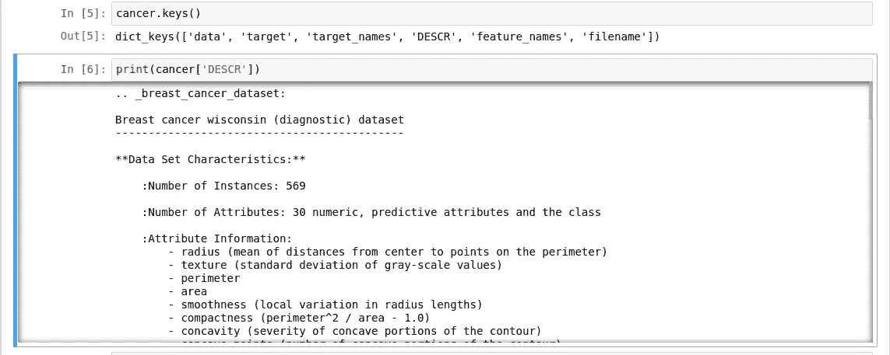
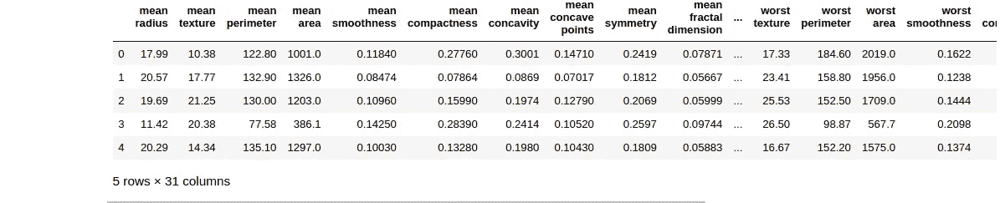
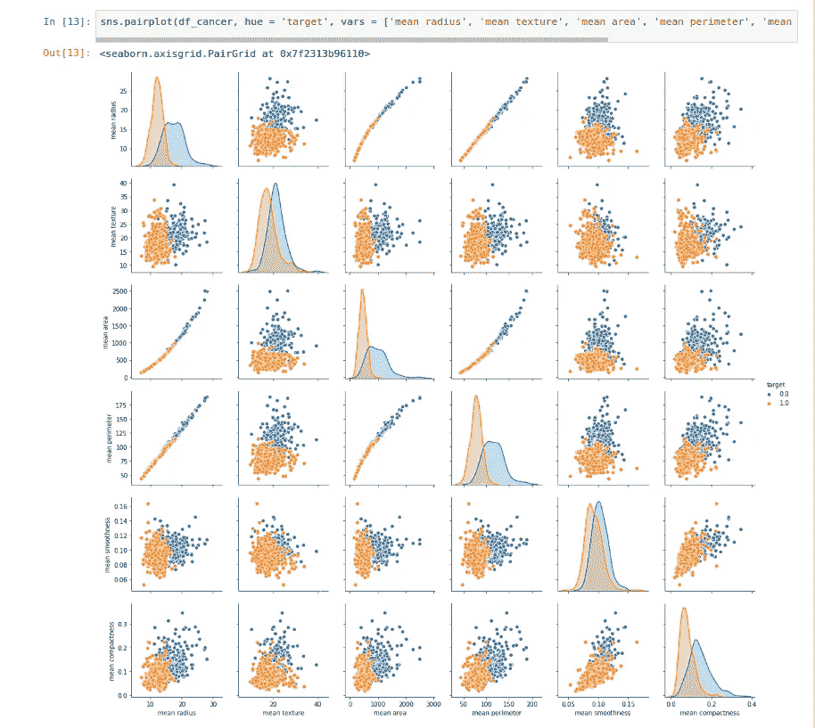
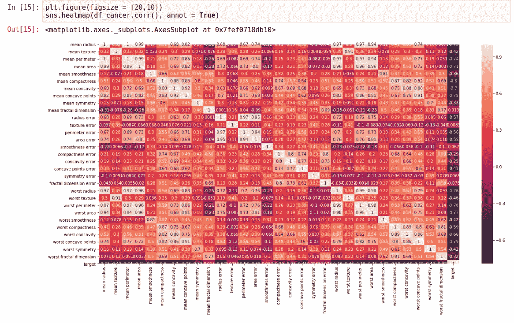
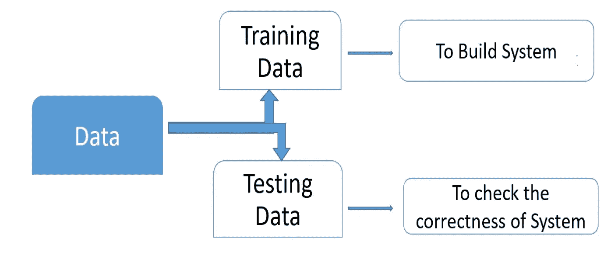
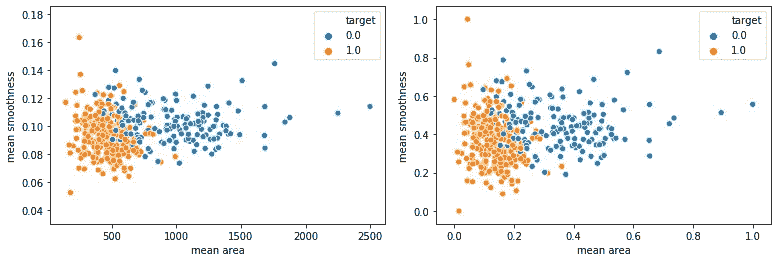
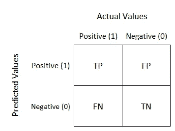
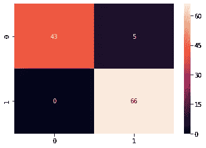
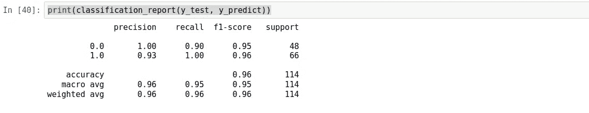

# 具有乳腺癌检测的机器学习启动器

> 原文：<https://medium.com/analytics-vidhya/machine-learning-starter-with-breast-cancer-detection-ead09f42df5c?source=collection_archive---------8----------------------->

从现实世界的问题开始学习机器学习吧！


> **乳腺癌是女性最常见的癌症，也是第二大常见癌症。2018 年新增病例超过 200 万例，成为当今一个重大的健康问题。**

乳腺癌检测中的关键挑战是将肿瘤分类为恶性或良性。**恶性**是指癌细胞可以侵入并杀死附近的组织，并扩散到你身体的其他部位。与癌性肿瘤(恶性)不同，**良性**不会扩散到身体其他部位，在某种程度上是安全的。机器学习技术可以用来显著提高早期诊断的准确性。

*在本文中，我们的目标是通过使用从细胞图像中提取的数据集，使用机器学习技术将肿瘤分类为恶性或良性。*

# **阶段 1:环境设置**

你可以按照这个 [*链接*](https://docs.anaconda.com/anaconda/install/linux/) 在你的系统上安装 Anaconda。现在打开你的终端，输入`jupyter notebook`启动 Jupyter 笔记本应用。笔记本界面将出现在新的浏览器窗口或选项卡中。你可以通过这个[文档](https://jupyter-notebook-beginner-guide.readthedocs.io/en/latest/execute.html)来熟悉 jupyter 笔记本。

# 阶段 2:导入库和数据集

```
#import libraries
import pandas as pd
import numpy as np
import matplotlib.pyplot as plt
import seaborn as sns#import dataset
from sklearn.datasets import load_breast_cancer
cancer = load_breast_cancer()
```

我们可以通过在单元格中运行`cancer`来查看所有数据。

# 阶段 3:数据可视化

为了以更好的格式查看数据，我们可以使用`cancer.keys()`，它将返回字典中的所有键。我们可以用`print(cancer['DESCR])`查看任何特定的列。



我们将使用 pandas DataFrame 来展示我们所有的数据。我们将用我们的癌症数据和目标数据创建一个数据框架。这将有助于我们在一个数据帧中存储所有的输入和输出。接下来，我们把癌症`feature_names`和`target`加在一起。

```
df_cancer = pd.DataFrame(np.c_[cancer['data'], cancer['target']],columns = np.append(cancer['feature_names'], ['target']))df_cancer.head()
```



图:数据帧

`df_cancer.head()`将返回包含目标数据的前几行。

我们将使用 pairplot 来可视化使用 seaborn 库的所有数据。我们使用前六个特征来绘制数据，但您可以尝试使用所有 30 个特征。

```
sns.pairplot(df_cancer, hue = 'target', vars = ['mean radius', 'mean texture', 'mean area', 'mean perimeter', 'mean smoothness', 'mean compactness'])
```



这里，蓝色点表示威胁生命的恶性病例，橙色点表示良性病例。为了显示特性之间的相关性，我们可以使用 seaborn heatmap。



图:热图

如果我们观察热图，我们可以看到所有值都在 0 和 1 之间。该值越高，这两个特征之间的相关性就越高。您可以浏览相关矩阵，以获得数据相关值之间的概览。

# 阶段 4:模型培训

我们需要从数据框架中删除目标列`x = df_cancer.drop(['target'], axis=1)`来训练我们的模型。下一步我们将通过执行`y = df_cancer['target']`在 y 中定义我们的输出/目标列。

为了训练出我们的模型，我们需要将数据分为训练数据和测试数据。在模型被训练之后，我们将使用测试数据来预测癌症。



我们不可能手动分割数据集，我们还需要以随机方式分割数据集。为了帮助我们完成这项任务，我们将使用一个名为 *train_test_split* 的 SciKit 库。我们将把 80%的数据集用于训练，20%用于测试。

```
from sklearn.model_selection import train_test_splitX_train, X_test, y_train, y_test = train_test_split(x, y, test_size=0.2, random_state=5)
```

我们需要使用数据标准化将所有数据的范围设定在 0 到 1 之间。这将有助于我们的模型在训练中获得更好的准确性。


图:数据标准化公式

```
min_train = X_train.min()
range_train = (X_train - min_train).max()
X_train_scaled = (X_train - min_train)/ range_trainsns.scatterplot(x = X_train['mean area'], y = X_train['mean smoothness'], hue = y_train)sns.scatterplot(x = X_train_scaled['mean area'], y = X_train_scaled['mean smoothness'], hue = y_train)
```



图:左(归一化前)和右(归一化后)

我们还需要对我们的测试数据集进行规范化。

```
in_test = X_test.min()
range_test = (X_test - min_test).max()
X_test_scaled = (X_test - min_test)/ range_test
```

我们在模型中使用支持向量分类器(SVC)。它是一个线性模型分类和回归。它可以解决线性和非线性问题。支持向量机用超平面将两类分类分开。我们在机器学习中的目标是推广模型，在该模型中，它可以识别大多数图像，无论它是恶性的还是良性的，即使它以前没有被看到过。


图:支持向量机

# 阶段 5:模型评估

我们将使用混淆矩阵来显示测试数据集的结果，并相应地评估我们的模型。



图:混淆矩阵

如果我们的预测结果是真实的，那么我们都是好的。我们可以计算正确分类的真实类的总数。然而，如果我们的预测告诉我们患者患有癌症(FP ),但是真实类别是阴性的，这导致错误的预测，但是并不严重，那么它可以被注释为类型 1 错误。此外，如果我们的预测告诉我们患者没有患癌症，但是真实类别是阳性的，这导致错误的预测，它可以被注释为类型 2 错误。我们需要不惜一切代价避免 2 型错误，因为这是一种威胁生命的疾病。

```
from sklearn.svm import SVC
from sklearn.metrics import classification_report, confusion_matrix
svc_model = SVC()svc_model.fit(X_train_scaled, y_train)
y_predict = svc_model.predict(X_test_scaled)cm = confusion_matrix(y_test, y_predict)
ax = sns.heatmap(cm, annot = True)
ax.set_ylim(2.0, 0)
```



图:混淆矩阵的预测结果

在这里，我们可以看到总共有 109 个正确预测和 5 个类型 1 错误。如上所述，1 型错误并不严重，但是我们已经成功地避免了所有 2 型错误。

从分类报告中，我们可以从我们的预测中得到我们性能的总结。我们模型的准确率是 96%。



就是这样，我们成功地创建了使用机器学习检测乳腺癌的程序。我们能够利用机器学习技术有效地对癌症进行分类。

# 资源:

[1][https://towards data science . com/understanding-confusion-matrix-a9ad 42 dcfd 62](https://towardsdatascience.com/understanding-confusion-matrix-a9ad42dcfd62)

[2][https://www . Java point . com/machine-learning-support-vector-machine-algorithm](https://www.javatpoint.com/machine-learning-support-vector-machine-algorithm)

[3][https://towards data science . com/intro-to-data-analysis-for-every one-part-3-d8f 02690 FBA 0](https://towardsdatascience.com/intro-to-data-analysis-for-everyone-part-3-d8f02690fba0)

[4][https://www . learn tek . org/blog/WP-content/uploads/2018/11/Ml-and-pr . jpg](https://www.learntek.org/blog/wp-content/uploads/2018/11/Ml-and-PR.jpg)