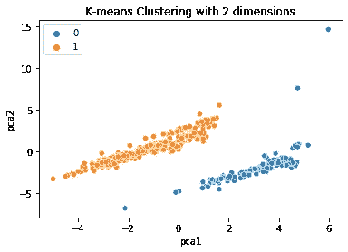
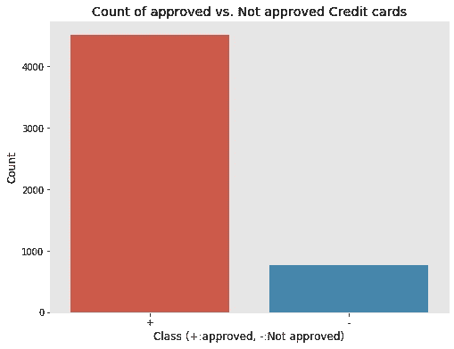
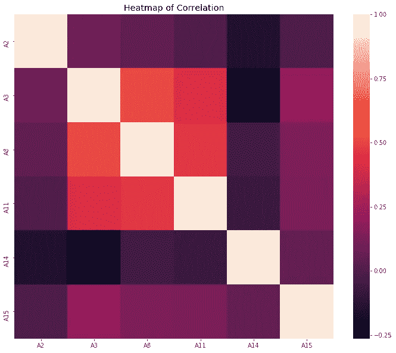
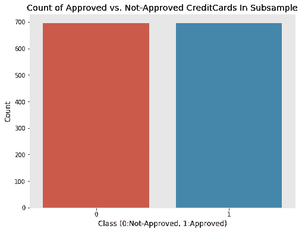

# 使用信用卡审批数据集解释机器学习步骤

> 原文：<https://medium.com/analytics-vidhya/machine-learning-steps-explained-using-credit-card-approval-dataset-b18555c48b5a?source=collection_archive---------15----------------------->

在这篇文章中，我解释了我如何处理信用卡审批数据集，以建立一个预测信用卡是否必须被批准的机器学习模型。


# **定义目标**

机器学习的第一步是定义问题陈述。这里，我们的目标是建立一个模型，根据用户提供的一些细节来预测信用卡是否必须被批准。

# 数据采集

现在目标很明确。现在是收集与问题陈述相关的数据的时候了，这里是信用卡批准，因此将收集年收入、经验和许多银行熟知的特征等细节。我从[https://archive . ics . UCI . edu/ml/machine-learning-databases/credit-screening/](https://archive.ics.uci.edu/ml/machine-learning-databases/credit-screening/)收集数据集

# 数据清理

众所周知的事实是，数据从来不是结构化的，它总是有一些异常，如丢失值，不一致，冗余数据。一个好的机器学习模型可以用好的数据集来构建。因此，在训练模型之前，要确保数据集没有这些错误。现在观察我们的信用卡数据集，它有 16 列，其中最后一列是必须预测的一列。数据集的一些细节如下

1.  标题:信用审批
2.  相关信息:该文件涉及信用卡申请。为了保护数据的机密性，所有的属性名称和值都已更改为无意义的符号。
    这个数据集很有趣，因为它很好地混合了
    属性——连续的、带有少量
    值的名义值，以及带有大量值的名义值。还有
    也有一些缺失值。
3.  实例数量:690
4.  属性数量:15 +类属性
5.  属性信息:

A1: b，a.
A2:连续。
A3:连续。
A4: u，y，l，t.
A5: g，p，gg。
A6: c、d、cc、I、j、k、m、r、q、w、x、e、aa、ff。
A7: v，h，bb，j，n，z，dd，ff，o.
A8:连续。
A9: t，f.
A10: t，f.
A11:连续。
A12: t，f.
A13: g，p，s.
A14:连续。
A15:连续。
A16: +，-(类属性)

6.缺失属性值:
37 例(5%)有一个或多个缺失值。特定属性中缺少的
值是:

a1:12
A2:12
A4:6
A5:6
A6:9
A7:9
A14:13

7.阶层分布

+:307(44.5%)
-:383(55.5%)

这些是关于数据集的一些可用的详细信息。

数据集中总共有 690 个实例，其中 37 个实例有缺失值，总共有 67 个缺失值，我们必须在本节中注意这些情况。

处理缺失值的不同方法:

1.  删除缺少值的行。
2.  如果变量是连续的，用属性的平均值或中值替换所有缺失的值。
3.  如果分类中的变量替换为该变量最常见的值
4.  对于分类变量，替换变量的每个值，然后执行聚类以获得最佳数据分析。

现在我使用的方法是第四种，也是最好的一种，因为没有数据丢失，每个值都会有合适的结果。

最初使用 pandas 读取数据集

```
import pandas as pddata = pd.read_csv(“creditcard.csv”)
```

现在确定在这个数据集中，缺失的值表示为“？”因此，检查有缺失值的行。我将所有这些行放入另一个数据框，如果发现连续变量的任何值丢失，则用该变量的平均值替换。如果发现任何分类变量丢失，则通过用连续变量的不同可能值替换来创建行。现在有机会创建重复的行，所以我从数据框中删除了重复的行。

现在，丢失值被替换的行可能没有正确的输出(类)，我认为它是没有标签的数据，并使用两个聚类执行聚类算法。我使用 K-Means 聚类来创建聚类。幸运的是，数据能够形成没有重叠的定义良好的集群。

应用 K-均值聚类分析数据

```
kmeans = KMeans(n_clusters=2)y = kmeans.fit_predict(df)df['Cluster'] = y
### Run PCA on the data and reduce the dimensions in pca_num_components dimensions
reduced_data = PCA(n_components=2).fit_transform(df)
results = pd.DataFrame(reduced_data,columns=['pca1','pca2'])sns.scatterplot(x="pca1", y="pca2", hue=y, data=results)
plt.title('K-means Clustering with 2 dimensions')
plt.show()
```



现在预测了丢失值被更新的行的输出

# 探索性数据分析

这是机器学习中非常重要的一步，你必须成为一名侦探，观察数据中的一些模式，在此基础上，你必须找到适合当前数据的算法。

```
#importing packages
import scipy.stats as stats
import numpy as np
import matplotlib.pyplot as plt
import seaborn as sns
import pandas as pd
plt.style.use('ggplot')
```

更新后的数据集中存在的行和列(没有缺失值的数据集)

```
#shape
print('This data frame has {} rows and {} columns.'.format(data.shape[0], data.shape[1]))
```

现在我们来看一个数据样本，以了解数据的情况

```
data.sample(5)
```

要了解每个属性及其数据类型

```
data.info()
```

现在根据批准和未批准的实例数量绘制数据

```
plt.figure(figsize=(8,6))
sns.barplot(x=counts.index, y=counts)
plt.title('Count of approved vs. Not approved Credit cards')
plt.ylabel('Count')
plt.xlabel('Class (+:approved, -:Not approved)')
```



我们可以发现没有被批准的卡变少了。

现在观察连续变量之间的相关性。

```
#heatmap
corr = data.corr()
plt.figure(figsize=(12,10))
heat = sns.heatmap(data=corr)
plt.title('Heatmap of Correlation')
```



如果一个变量是分类的，我们就不能处理它，因为算法可以理解有数字数据的数据。所以分类变量必须转换成数字。

现在，它将增加数据集的大小，因为它为分类数据中的每个值创建新列，现在 16 列将变成 47 列。

现在将数据分为训练和测试，从中创建一个子样本。

```
splittig the data into train and test
#manual train test split using numpy's random.rand
mask = np.random.rand(len(X)) < 0.9
train = X[mask]
test = X[~mask]
print('Train Shape: {}\nTest Shape: {}'.format(train.shape, test.shape))no_of_notapprov = train.A16.value_counts()[0]
not_approv = train[train['A16'] == 0]
approv = train[train['A16'] == 1]
selected = approv.sample(no_of_notapprov)
subsample = pd.concat([selected, not_approv])
len(subsample)
```

现在寻找子样本中的数据。

```
#shuffling our data set
subsample = subsample.sample(frac=1).reset_index(drop=True)
subsample.head(10)
```

创建子样本是为了使两个类别分布相等。在子样本中，批准和未批准的实例数量相等。现在我们可以进行分析了

```
new_counts = subsample.A16.value_counts()
plt.figure(figsize=(8,6))
sns.barplot(x=new_counts.index, y=new_counts)
plt.title(‘Count of Approved vs. Not-Approved CreditCards In Subsample’)
plt.ylabel(‘Count’)
plt.xlabel(‘Class (0:Not-Approved, 1:Approved)’)
```



现在执行 T-SNE 来降低数据的维度。在这里，数据维度减少到 2。

```
from sklearn.manifold import TSNEx = X.drop('A16', axis=1)
y = X['A16']
X_reduced_tsne = TSNE(n_components=2, random_state=42).fit_transform(x.values)
import matplotlib.patches as mpatchesf, ax = plt.subplots(figsize=(24,16))blue_patch = mpatches.Patch(color='#0A0AFF', label='Approved')
red_patch = mpatches.Patch(color='#AF0000', label='Not Approved')ax.scatter(X_reduced_tsne[:,0], X_reduced_tsne[:,1], c=(y == 1), cmap='coolwarm', label='Approved', linewidths=2)
ax.scatter(X_reduced_tsne[:,0], X_reduced_tsne[:,1], c=(y == 0), cmap='coolwarm', label='Not Approved', linewidths=2)
ax.set_title('t-SNE', fontsize=14)ax.grid(True)ax.legend(handles=[blue_patch, red_patch])
```

# 构建模型

这一步之后必须进行交叉验证，评估不同算法的准确性，并从中选择最佳算法。首先，我们必须确定这是哪种类型的问题，这显然是分类问题，因为我们必须预测输出属于哪个类别(批准或不批准)。评估分类算法的性能，如逻辑回归、SVM、决策树、随机森林、第 k 个最近邻。

因为这里的数据是线性可分的，SVM 给出了最好的准确性。用支持向量机算法训练数据。

```
from sklearn.preprocessing import StandardScaler, scale
from sklearn.svm import LinearSVC
from sklearn.metrics import confusion_matrixfrom sklearn.svm import SVC
svclassifier = SVC(kernel='linear')
svclassifier.fit(X_train, y_train)
```

# 预测产量

现在模型构建已经完成，是时候预测结果并在测试数据集上检查模型的准确性了。

```
y_pred = svclassifier.predict(X_test)
from sklearn.metrics import classification_report, confusion_matrix
print(confusion_matrix(y_test,y_pred))
print(classification_report(y_test,y_pred))
```

最后，使用混淆矩阵评估模型性能。如果模型性能不佳，我们可以采用不同的方法，如改变算法的参数、增加数据集的大小、交叉验证。