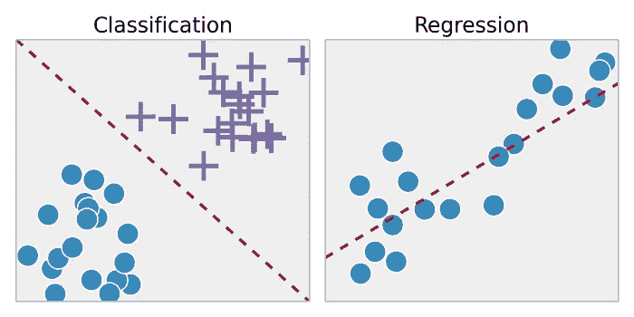
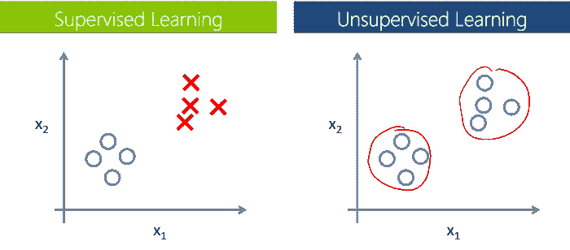

# 机器学习:有人监督还是无人监督？

> 原文：<https://medium.com/analytics-vidhya/machine-learning-supervised-or-unsupervised-bc90a5ea4b14?source=collection_archive---------18----------------------->

机器学习的使用案例从游戏到欺诈检测，再到证券交易所的统计分析。它被用于构建像网飞和 Spotify 这样的系统，这些系统根据用户的访问历史、收藏夹和其他数据向用户推荐音乐和/或视频，或者用于构建找到某一天所有类似新闻文章的系统。它还可以用于根据性别(体育、经济、政治、福利等)对网页进行自动分类，或者将电子邮件标记为垃圾邮件。机器学习的用途比我在这篇文章中所能描述的要多得多，几种机器学习方法被用来解决各种各样的问题。在这篇文章中，我将重点介绍两种最常用的方法——监督学习和非监督学习。

首先，我将从机器学习的定义开始:

[**Arthur Samuel**](https://en.wikipedia.org/wiki/Arthur_Samuel) 将其描述为:*“在没有被明确编程的情况下赋予计算机学习能力的研究领域”*，这是一个更古老的非正式定义。

[**汤姆·米切尔**](https://en.wikipedia.org/wiki/Tom_M._Mitchell) 提供了一个更现代的定义:

> *如果由 P 测量的计算机程序在 T 中的任务上的性能随着经验 E 而提高，则称该计算机程序从关于某类任务 T 和性能测量 P 的经验 E 中学习*

***举例:*** *玩跳棋*

**E** =多次下跳棋的经历
**T** =下跳棋的任务。
**P** =程序赢下一局的概率。

# 监督学习

我们得到了一组标记的数据，我们已经知道哪个是正确的输出，并且必须与该组数据相似，因为我们知道输入和输出之间存在关系。

监督学习问题分为*【回归】**【分类】*问题。在回归问题中，我们试图预测连续输出的结果，这意味着我们试图将输入变量映射到某个连续函数。在分类问题中，我们试图预测离散输出的结果。换句话说，我们试图将输入变量映射到不同的类别中。

***例 1:***

给定一组关于房地产市场房屋面积的数据，试着预测一下它们的价格。基于大小的价格是一个连续产出，所以这是一个回归问题。

我们也可以把这个例子转化为一个分类问题，而不是我们的生产是房子“卖得比要价高还是低。”在这里，我们根据价格将房屋分为两个不同的类别。

***例二:***

**回归:**给定一个男人/女人的图像，我们必须根据图像数据预测他们的年龄。

**分类:**给定一个癌症肿瘤的例子，我们必须根据它的大小和患者的年龄来预测它是良性的还是恶性的。

分类和回归示例

银行广泛使用的分类的另一个例子是根据客户的信用历史决定是否接受他们的贷款。

许多算法用于创建监督学习器，最常见的是神经网络、支持向量机(SVM)和朴素贝叶斯分类器。

# 无监督学习

另一方面，无监督学习允许我们在很少或根本不知道我们的结果应该是什么样的情况下处理问题。我们可以推导出数据结构，而不必知道变量的影响。

我们可以根据数据中变量之间的关系对数据进行分组，从而得到这种结构。它还可以用来减少数据集中的维数，以便只关注最有用的属性或检测趋势。

在无监督学习中，没有基于预测结果的反馈，也就是说，没有老师来纠正它。

***例 1:***

***聚类:*** 给定来自一所大学的 1000 个搜索集合，找到一种方法来自动将这些搜索分组为在某种程度上相似或通过不同变量相关的组，例如词的频率、短语、页数等。

***例二:***

另一个非聚类的例子是“鸡尾酒会算法”，它可以在杂乱无章的数据结构中找到如何识别个人的声音和音乐。

常见的无监督学习方法包括 K 均值存储、层次聚类和自组织映射。

不同学习方法的例子

一个以简单方式实现机器学习的项目的例子是 [**Apache Mahout**](http://mahout.apache.org/) ，它旨在为快速创建可伸缩的高性能机器学习应用程序构建一个环境。

为了结束这篇文章，我留下丹尼尔·凯斯·莫兰的下面一句话:

> 你可以有没有信息的数据，但你不能有没有数据的信息。

好了，今天就到这里吧，留下你的评论，下次见！！！