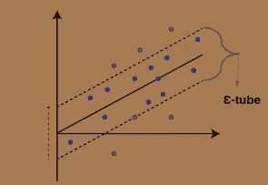

# 机器学习:支持向量回归

> 原文：<https://medium.com/analytics-vidhya/machine-learning-support-vector-regression-181aea35bedf?source=collection_archive---------5----------------------->

*我们即将讨论 SVR(支持向量回归)。那么，我们来讨论一下回归实际上是什么？在统计建模中，* ***回归分析*** *是一组统计过程，用于估计因变量(通常称为“结果变量”)和一个或多个自变量(通常称为“预测变量”、“协变量”或“特征”)之间的关系。回归问题是分类问题的一般化，其中模型返回连续值输出，而不是来自有限集的输出。换句话说，回归模型估计连续值的多元函数。*

> **支持向量机:**
> 
> 如上所述，回归问题是分类问题的推广。因此，让我们来看一下支持向量机(SVMs ),它是一种分类算法，通过凸优化问题来解决二进制分类问题。优化问题处理寻找分离超平面的最大间隔，同时正确地分类尽可能多的训练点。支持向量机代表超平面和支持向量。SVM 的分散解和良好的推广使它们适合于回归问题。

**支持向量机。来源:谷歌图片。**

> **支持向量回归:**
> 
> SVR(支持向量回归)没有 SVM(支持向量机)流行。但是，支持向量回归已被证明是实值函数估计的有效工具。作为一种监督学习方法，SVR 使用对称损失函数进行训练，该函数同等地惩罚高和低错误估计。
> 
> 如同在分类中一样，SVR 的特征在于使用核、稀疏解、VC 对支持向量的余量和数量的控制。
> 
> SVM 推广到 SVR 是通过在函数周围引入一个ɛ-insensitive 区域来实现的，称为**ɛ-tube**。该管道将优化问题转化为寻找最接近连续值函数的管道。试管试图平衡模型的**复杂度**和**预测误差**。更具体地说，关于管的创建，通过首先定义要最小化的凸ɛ-insensitive 损失函数并找到包含大多数训练实例的最平坦的管，SVR 被公式化为优化问题。超平面用支持向量表示，支持向量是位于管边界之外的训练样本。如在 SVM，SVR 中的支持向量是影响管子形状的最有影响力的实例，并且**训练**和**测试**数据被假定为**独立且同分布**。

**支持向量回归。来源:谷歌图片。**

> ***SVR:数学和图形表示:***
> 
> SVR 问题的公式化通常最好从几何的角度来推导。处理两种类型的数据:
> 
> **一维数据:**被逼近的连续值函数的数学实现可以写成下面的等式

**表示一维公式的方程。**

**一维线性支持向量回归机。来源:谷歌图片。**

> SVR 将这个函数近似问题公式化为一个优化问题，该优化问题试图找到以表面为中心的最窄的管，同时最小化预测误差，即预测输出和期望输出之间的距离。前一个条件产生等式中的目标函数，其中||w||是被逼近表面的法向量的大小:

**最小化距离的公式。**

> **多维数据:**我们将 x 增加 1，并将 b 包含在 w 向量中，以简化数学符号，并获得以下等式中的多元回归-

**表示多维公式的方程。**

> 这里，M 是用于逼近函数的多项式的阶。随着向量 w 的大小增加，越来越多的 wi 是非零的，从而导致更高阶的解。水平线是 0 阶多项式解，与所需输出有很大偏差，因此误差较大。线性函数(一阶多项式)对一部分数据产生了更好的近似，但仍不足以拟合训练数据。6 阶解决方案在函数平坦度和预测误差之间取得了最佳平衡。最高阶的解决方案没有误差，但是复杂度很高，并且很可能会使解决方案过度适应尚未看到的数据。w 的大小充当正则项，并提供对解的平坦性的优化问题控制。

**解各种命令。来源:谷歌图片。**

> **损失函数:**如果 e 减小，管的边界向内移动。因此，边界周围的数据点越多，表示支持向量越多。同样，增加ɛ将导致边界周围的点减少。因为它对噪声输入不太敏感，所以 e 不敏感区域使模型更健壮。可以采用几种损失函数，包括线性、二次和休伯ɛ.

**损失函数:a)线性 b)二次和 c)胡伯。来源:谷歌图片。**

> **不对称损失函数:**采用类似于 SVM 中采用的软裕度方法，可以添加松弛变量ɛ、ɛ*以防止异常值。这些变量决定了管外可以容忍多少点。c 是一个正则化参数——因此，对于这个多目标优化问题，它是一个可调参数，为最小化平坦度或误差提供了更大的权重。

**优化配方。**

**支持向量回归。来源:谷歌图片。**

***结论:****SVR 的主要优点是它的计算复杂度不依赖于输入空间的维数。此外，它还具有很好的泛化能力和很高的预测精度。修正的 SVR 可以应用于对函数进行估计或严格限制低估是非常必要的情况。*

> "感谢您在宝贵的时间阅读这个关于机器学习算法之一的博客."