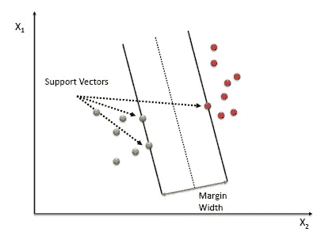
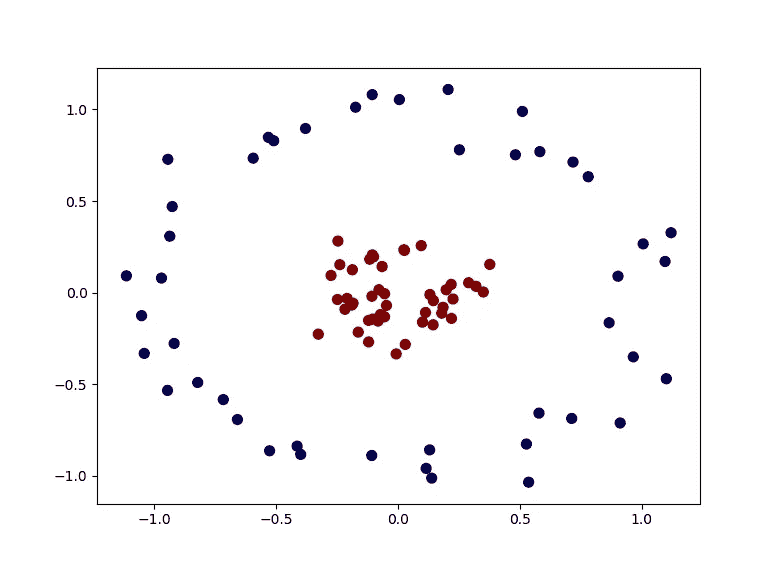
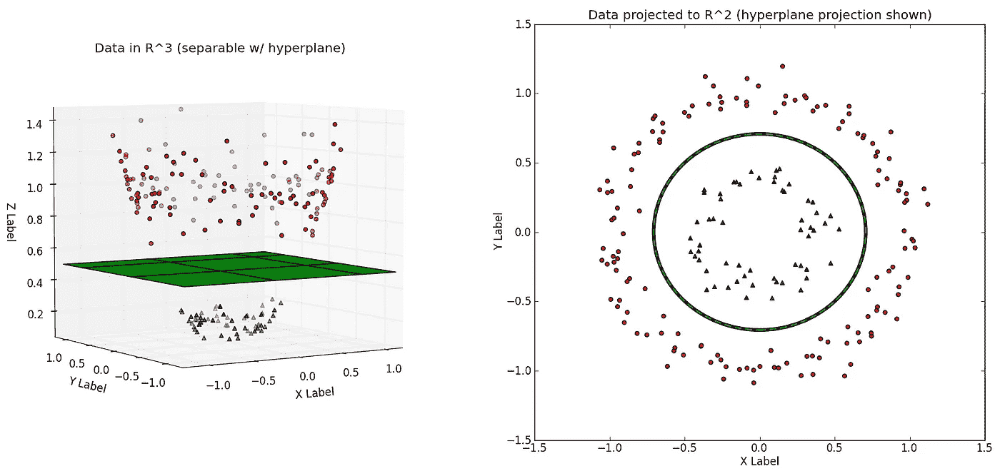
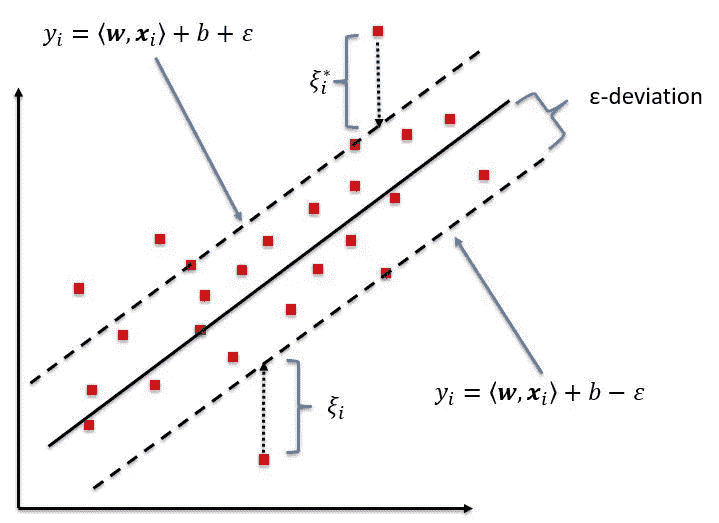

# 机器学习:支持向量回归(SVR)

> 原文：<https://medium.com/analytics-vidhya/machine-learning-support-vector-regression-svr-854524391634?source=collection_archive---------13----------------------->

在这篇博客中，我们将介绍另一种有趣的机器学习算法，称为支持向量回归(SVR)。但是在学习支持向量机之前，我们先来学习一下支持向量机(SVM)，因为支持向量机是基于 SVM 的。

SVM 是一种监督学习算法，它通过分析数据和识别模式，尝试基于分类或回归来预测值。用于分类的算法称为 SVC(支持向量分类器),用于回归的算法称为 SVR(支持向量回归)。

让我们了解一些基本概念

*   **超平面**:超平面是一个平面，用于根据类别的值来划分类别。超平面总是比用于绘制结果或分析的实际平面小 1 维。例如，在具有 1 个特征和 1 个结果的线性回归中，我们可以制作一个 2-D 平面来描述关系，并且拟合到该平面的回归线是 1-D 平面。因此，这个平面称为超平面。类似地，对于三维关系，我们得到一个二维超平面。

*   **支持向量**:支持向量是空间中距离超平面较近的点，也决定了超平面的方向。所画的线或平面称为支持向量线或支持向量平面。

*   **边距宽度**:两条支持向量线或平面的垂直距离称为边距宽度。

# 核心诡计

在上图中，我们看到我们的数据是线性可分的。但是考虑下面的情况。

在这种情况下，简单的线性划分是不可能的。所以，SVM 内核给它增加了一个维度。添加另一个维度后，数据可以用一个平面来分离。可以得出以下直觉。

SVM 算法试图在支持向量和位于支持向量平面之上或之下的点之间画一个具有最高边界宽度的超平面，即负侧上的那些点保持在负超平面之下，而正侧上的点保持在正超平面之上。

# 支持向量回归

假设有一个数据集，我们试图用一个雇员的年龄来预测他的工资。因此，我们可以创建一个线性回归模型，这将有助于我们。在线性回归中，我们试图拟合一条尽可能减小误差的直线。但是通过支持向量机，我们将拟合一条线(对于 2-d)或一个超平面(对于 n-d ),试图将误差限制在一定程度。

SVR 背后的主要直觉是，大多数点位于超平面上，其余点位于正负超平面内。但是在 SVC 中，我们试图画一个超平面，使得负的点位于负的超平面之下，正的点位于正的超平面之上。

因此，在 SVR 中，我们试图找到这样的平面，使得位于正或负超平面之外的点被减少。

设“a”是支持向量线到超平面的距离。

1 —设超平面的方程为:

## **Y= wx + b**

2 —正超平面的方程是:

## +a = wx + b

3 —负超平面的方程是:

## -a = wx + b

4-因此我们的超平面应该满足以下条件:

# -a < Y-wx+b < +a

因此，我们应该选择“a ”,使支持向量位于其中，误差最小。

感谢你们阅读这篇文章。敬请关注更多博客。祝你有愉快的一天。