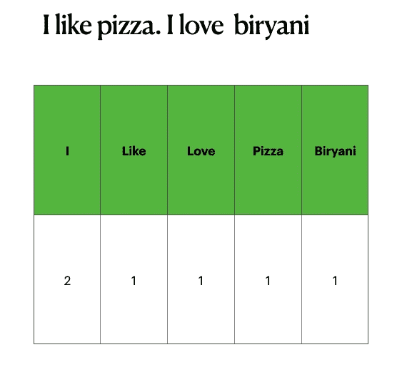
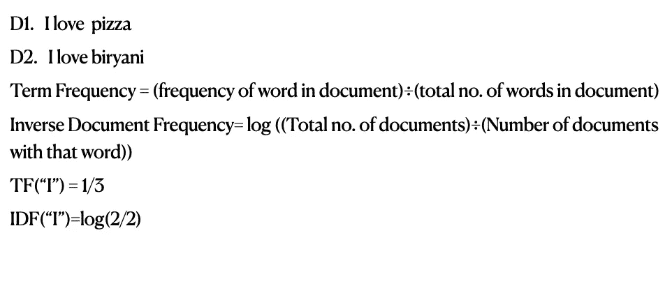
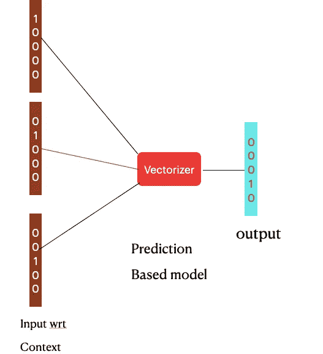
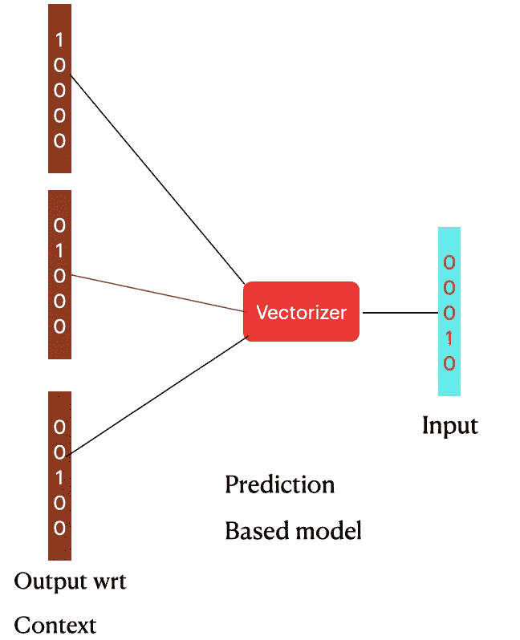
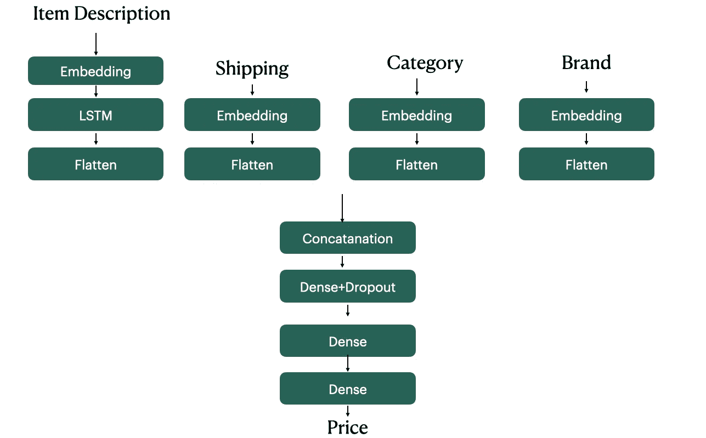
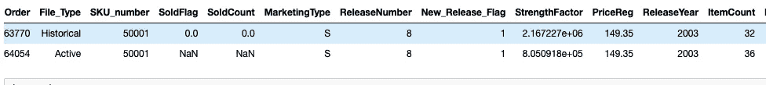
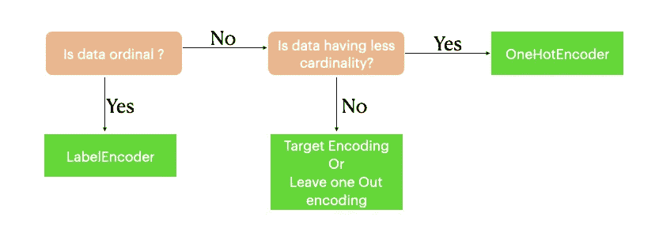

# 产品定价的机器学习技术

> 原文：<https://medium.com/analytics-vidhya/machine-learning-techniques-for-pricing-a-product-5a95aaa3e7c1?source=collection_archive---------14----------------------->

随着技术的快速发展，网上购物正在世界各地兴起。一种产品可以在不同的购物网站买到。有几件事可以影响客户，如在该网站的产品反馈，产品价格，卖方的反馈和交货时间。

在顾客的众多想法中，产品的价格对他/她的决定起着关键作用。因此，销售者应该想出能使收入最大化并在竞争中获胜价格。

在本文中，我们将研究在产品定价中发挥关键作用的功能，并研究我们可以应用机器学习或深度学习技术的场景。

# 与价格相关的特征

1.  竞争对手价格
2.  天气
3.  产品需求
4.  运输费用
5.  项目说明
6.  品牌
7.  使用的营销策略

让我们看看在不同情况下使用的不同技术

# 带有项目说明的定价项目

2018 年，在 Kaggle 举办的 Mercari 价格建议挑战赛。在这种竞争中，需要用商品描述和一些其他分类变量来预测产品的价格。

在这个场景中，我们需要使用 NLP 技术来处理物品的描述。您必须知道的一些 NLP 技术有:

1.  堵塞物
2.  词汇化
3.  单词嵌入

## 堵塞物

词干是切割单词边缘的过程。这个过程将这个单词还原成它的词根形式。结果可能有机会获得无意义的单词。实际使用的梗丝机是波特·斯特梅尔和斯诺鲍·梗丝机。

单词:喝酒

词干:饮料

过度堵塞:直接还原铁

词干不足:饮酒

## 词汇化

词汇化是将给定的词转换成有意义的词根的过程。作为结果获得的单词是字典形式的。这个过程需要初步的语言知识。对于英语，我们使用 WORDNET lemmetaizer。

词:醉了

词汇化:喝酒

## 单词嵌入

深度学习或者机器学习模型是不能用文字来喂的。他们需要数字形式的输入。当我们对分类数据执行一个热编码、标签编码或均值编码时，NLP 具有不同的嵌入算法。这些算法要么基于频率，要么基于预测。

## 1.计数向量:



通过这种方式，计数矢量器根据单词的频率为每个文档生成一个矢量。

## 2.TF-IDF 矢量化:



通过这种方式，TF-IDF 矢量器为每个单词给出一个 TF-IDF 分数。这是

## 3.Word2Vec:

这是 CBOW 和 Skip-Gram 模型的组合。



CBOW



跳跃图

该方法在预测时考虑单词的局部统计。

## 4.手套

名字本身就说明 Glove 考虑了单词的全局关系和局部关系。

```
Embedding(input,output,seq_length)
```

“输入”=词汇的大小，即独特单词的数量

‘输出’=每个字的输出尺寸

seq_length' =文档的最大长度。

现在，我们将把嵌入的文本输入到 LSTM 或 1-D conolution 网络中进行价格预测。

输入特征是项目描述、运输、类别和品牌。

这些特征被输入到我们的模型中以获得价格。



价格预测模型

可以通过添加更密集的层或 LSTM 层来改变模型，以获得更高的精度。

按照这个程序，如果我们最初只有项目描述，我们可以获得项目的价格。

我们可以对价格列应用宁滨以获得更好的结果(减少过度拟合)，即价格在 10 到 100 之间作为 bin_a，在 100 到 1000 之间作为 bin_b，依此类推..

# 具有历史数据的定价项目

物品描述并非始终可用。但是，如果我们有如下 SKU 的历史数据，我们可以应用机器学习技术



在这里，我们需要估计 SoldFlag(该项目将保持销售或未销售)。忘记 SoldFlag，考虑一种情况，其中活动 SKU 的价格不可用，我们需要预测价格。

在这种情况下，特征工程起着关键作用。

1.  逻辑上删除列，即在模型的学习过程中不起作用的列。
2.  使用标准偏差或 [pyOD](https://pyod.readthedocs.io/en/latest/) 中可用的技术移除异常值。
3.  如有必要，进行数值和分类宁滨以减少过度拟合。宁滨支持模型上的正则化。在分类变量的情况下，将箱分配给不太频繁的实例有助于提高模型性能。
4.  使用标准化或规范化来缩放数值变量有助于提高模型的性能。
5.  对分类列进行编码也是特征工程中的一个关键步骤。下图有助于确定编码技术。



特征工程之后，选择好的模型也很重要。我们可以从中选择

1.  随机森林回归量
2.  XGBRegressor
3.  LightGBM 回归器

这两种情况可能会帮助你解决你的定价问题。

# 结论

列出了可能与价格相关的功能。

提到了用物品描述或历史数据为物品定价时你需要知道的技巧。

感谢阅读:)

## 参考

[https://www . analyticsvidhya . com/blog/2017/06/word-embeddings-count-word 2 veec/](https://www.analyticsvidhya.com/blog/2017/06/word-embeddings-count-word2veec/)