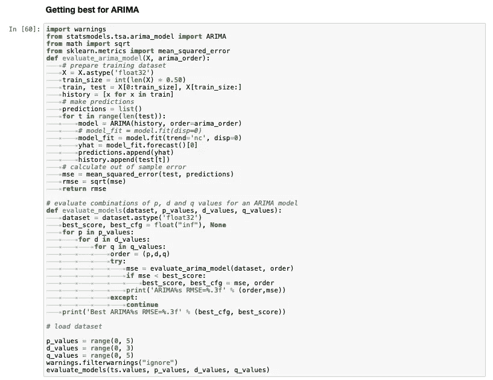
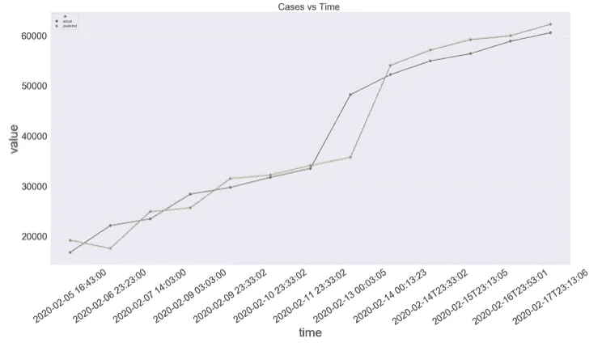

# 冠状病毒的机器学习技术

> 原文：<https://medium.com/analytics-vidhya/machine-learning-techniques-on-corona-virus-a76f6f241f48?source=collection_archive---------10----------------------->

# **冠状病毒概述**

冠状病毒(CoV)是一个大的病毒家族，可导致从普通感冒到更严重疾病的疾病，如[中东呼吸综合征(MERS-CoV)](https://www.who.int/emergencies/mers-cov/en/) 和[严重急性呼吸综合征(SARS-CoV)](https://www.who.int/csr/sars/en/) 。一种新的冠状病毒是一种新的毒株，以前没有在人类中发现。

冠状病毒是人畜共患的，这意味着它们在动物和人之间传播。详细的调查发现，SARS-CoV 由果子狸传播给人类，MERS-CoV 由单峰骆驼传播给人类。几种已知的冠状病毒正在尚未感染人类的动物中传播。

感染的常见症状包括呼吸道症状、发烧、咳嗽、呼吸急促和呼吸困难。在更严重的情况下，感染会导致肺炎、严重急性呼吸综合征、肾衰竭甚至死亡。

预防感染传播的标准建议包括定期洗手，咳嗽和打喷嚏时捂住口鼻，彻底煮熟肉类和鸡蛋。避免与任何有呼吸道疾病症状(如咳嗽和打喷嚏)的人密切接触。


# **探索冠状病毒**

kaggle 上发布了一个关于 corona 病毒的数据集。你可以点击下载数据集[。](https://www.kaggle.com/sudalairajkumar/novel-corona-virus-2019-dataset)

> data = PD . read _ CSV("//用户//maheshsai//桌面//小说-电晕-病毒-2019-数据集//2019 _ nCoV _ data . CSV ")
> data . head()


让我们从数据中制作一些有趣的图表

确诊、死亡和康复患者的日间分布如下


一段时间内收到的案例比率为


一段时间内注意到的死亡率是


随着时间的推移，寻回人员的比率为


我们可以清楚地看到许多人康复了。所以不要慌，要意识到症状。

我也绘制了死亡和康复的图表。


> 截至 2 月 15 日，来自 30 个不同国家和 62 个不同城市的人感染了冠状病毒。

截至 2 月 15 日的国家确认列表是


截至 2 月 15 日的城市明智确认名单是


使用以下数据框绘制上述图


这些信息也被标绘在世界地图上，以便更好地可视化


以上情节是国家明智的。中国受影响城市的信息也单独绘制


# **对数据进行时间序列预测**

如果第二天收到的案例数量有所估计，那么我们可以计划更好的服务。

除了 AR、MA 和 ARIMA 等标准预测模型，我还应用神经网络来预测收到的案件数量。我开始预测来自世界各地的病例数量。然后，我对特定国家和特定城市的案例进行预测。

我写了一个在 ARIMA 模型中选择最佳 p，d，q 值的函数。



ARIMA 模型的结果是



> 计算 ARIMA 预测的置信区间有助于估计病例，即我们可以预期病例在下限和上限之间。

我们可以将时间序列数据输入递归神经网络进行预测。您可以在此详细了解预测和拟合数据到神经网络模型[的数据准备。](https://machinelearningmastery.com/how-to-get-started-with-deep-learning-for-time-series-forecasting-7-day-mini-course/)

我使用的构建简单神经网络的代码是

```
model = Sequential()
model.add(LSTM(50, activation=’relu’, input_shape=(3, 1)))
model.add(Dense(1))
model.compile(optimizer=’adam’, loss=’mse’)
```

我们可以使用预测功能进行预测


我还应用了*克罗斯顿*模型，该模型用于预测我们数据的间歇模式。我用来建立克罗斯顿模型的函数是


克罗斯顿模型的结果是


克罗斯顿模型预测的置信区间在 29，454 和 49，506 之间，也就是说，我们可以预期案例在 29，454 和 49，506 之间。

正如我提到的，我提取了中国确诊病例的数据，并用同样的模型进行了预测。结果是


使用 ARIMA 模型的预测绘制


使用克罗斯顿模型的预测进行绘图

置信区间的计算有助于估计国内的病例。

我还应用神经网络来预测一个国家的数据。你可以从[这里](https://github.com/maheshsai252/complete-corona)访问代码和预测。

我的实际想法是应用城市预测。因此可以完美地计划要提供的服务。我会在下一篇文章中提出更多的见解。

我将以回答一个重要问题来结束这篇文章，

## **冠状病毒会通过空气传播吗？**

许多消息来源已经得出“不”的结论。我试图从数据集中可用的数据证明这一点。

让我们看看哪些国家第一天没有受到影响，第二天就受到了影响。


从列表中选择一个城市，并分析数据集中可用的邻近城市。这座城市在第一天可能会也可能不会受到影响。让我们看看那个特定城市的数据。


在对各种可能的组合进行了详细的观察后，许多附近的城市在前一天受到的影响较小或没有受到影响。此外，前一天受到严重影响的城市与后一天受到影响的城市相距甚远。*所以通过空气传播的机会可能会更少*。

# **结论**

我们对这个数据集进行了探索性的数据分析。我们还对案例数量进行了时间序列预测，以规划更好的服务。最后，我们试图证明冠状病毒不会通过空气传播。这种分析需要大量的数据预处理。你可以从[这里](https://github.com/maheshsai252/complete-corona)访问完整的代码。

感谢阅读:)