# 预测出租车费用的机器学习——第一部分:探索性分析

> 原文：<https://medium.com/analytics-vidhya/machine-learning-to-predict-taxi-fare-part-one-exploratory-analysis-6b7e6b1fbc78?source=collection_archive---------0----------------------->

## 数据清理、可视化、特征工程

## **我正在学习 Python 进行数据分析，并希望将这些概念应用到真实的数据集上——瞧，我在** [**Kaggle**](https://www.kaggle.com/) **上发现了纽约出租车费用预测问题。**

在这个挑战中，我们在训练数据中获得了自 2009 年以来纽约 5500 万次出租车旅行的训练集，在测试数据中获得了 9914 条记录。该挑战的目标是在已知上下车地点、上车日期时间和乘客人数的情况下，预测出租车行程的费用。

在任何分析项目中，80%的时间和精力都花在数据清理、探索性分析和衍生新功能上。在这篇文章中，我们旨在清理数据，可视化变量之间的关系，并找出更好地预测出租车费用的新功能。

**数据**

关于这个问题的数据可以在[地图](https://www.kaggle.com/c/new-york-city-taxi-fare-prediction/data)上找到。出于此分析的目的，我只从训练数据的 55M 行中导入了 6M 行。数据中出现的字段如下:

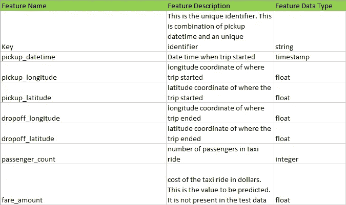

**假设生成**

解决任何分析问题的下一步是列出一组假设，在我们的情况下，这些假设是影响出租车旅行成本的因素。

1.  **行程距离**:行程距离越长，车费越高。
2.  **出行时间**:在交通高峰期，出租车费用可能会高一些。
3.  **出行日期**:工作日和周末的票价可能不同
4.  天气状况:如果下雪，出租车的数量可能会减少，因此车费也会提高。
5.  **是否是往返机场的旅程**:往返机场的旅程一般都有固定的票价。
6.  **接送邻居**:根据邻居的类型，费用可能会有所不同。
7.  出租车的可用性:如果某个地方有很多出租车，价格可能会更低。

# **数据清理和探索**

在本节中，我们将讨论用于清理数据和理解变量之间关系的各种步骤，并利用这种理解来创建更好的特性(参见:I[ntroductory Jupyter notebook](https://www.kaggle.com/aiswaryaramachandran/eda-and-feature-engineering)

1.  **票价金额分配**

我们首先查看票价金额的分布，发现有 262 条票价为负的记录。因为旅行费用不可能是负数，所以我们从数据中删除了这样的实例。此外，票价服从长尾分布。为了更好地理解票价金额的分布，我们在移除负票价后进行对数变换，这使得分布接近正态分布

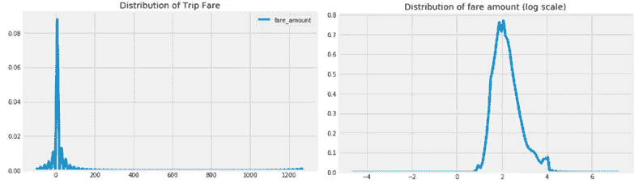

2.**地理特征分布**

纬度和经度的范围分别在-90°至 90°和-180°至 180°之间。但是在训练数据集中，我们观察到纬度和经度在(-3488.079513，3344.459268)的范围内，这是不可能的。在进一步的探索中，我们还发现了一组 114K 的记录，这些记录在赤道上具有拾取和放下坐标。因为这些数据是纽约出租车的数据，所以我们从分析中删除了这些行。这种异常在试验数据中没有发现。

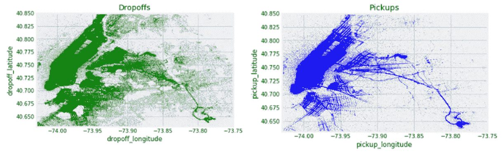

纽约上下客点的分布

我们可以看到，JFK 和拉瓜迪亚机场附近的皮卡密度很高。然后，我们查看了与火车数据中的所有行程相比，前往 JFK 的接送平均费用金额，并观察到机场行程的费用较高。基于这一观察，我们创建了一些功能来检查是否有人在纽约的三个机场(JFK 机场、EWR 机场或拉瓜迪亚机场)取货或卸货

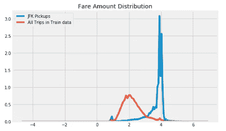

JFK 皮卡和所有皮卡的车费金额(对数标度)

下一步是检查我们的假设，即纽约市分为 5 个区，即曼哈顿、皇后区、布鲁克林、史坦顿岛和布朗克斯区，每个接送点都被划分到这 5 个区中，是否特定区域的票价高于其他区域。是的，我们的假设是正确的——除了曼哈顿有最多的接送乘客，其他所有的社区，接送乘客的费用分布都有所不同。此外，与其他社区相比，皇后区的平均接送费用更高。

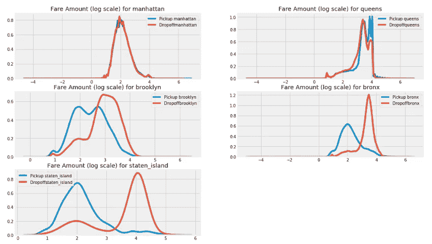

纽约不同街区的票价金额分布(对数标度)

3.**行程距离分布**

使用接送坐标，我们根据**哈弗森距离计算行程距离(英里)。**出行距离就像票价服从长尾分布一样，我们采取对数变换使其接近正态分布

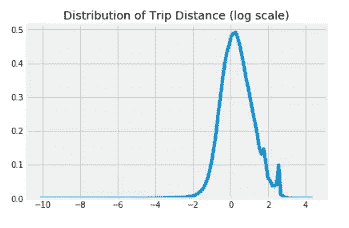

行程距离(英里)分布

我们的一个假设是，理想情况下，票价应该随着出行距离的增加而增加。出行距离和费用金额之间的散点图显示，尽管存在线性关系，但每英里费用(斜率)较低，并且有许多距离大于 50 英里的出行，但费用非常低。为了检查这种情况是否是因为机场旅行，我们去除了机场旅行并绘制了分布图。然后，我们观察到每英里的费用更高，并且观察到另一个行程距离> 50 英里的小集群。

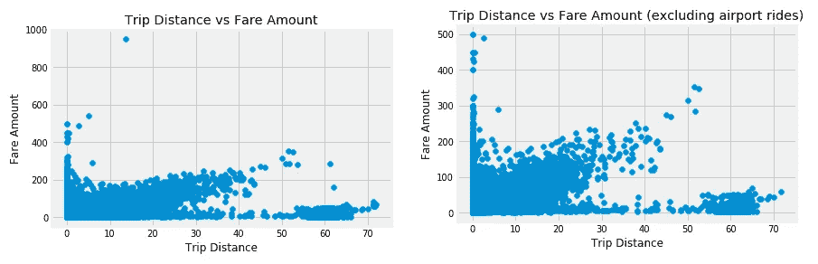

行程距离与票价金额

下一步是查看是否有观察到行程距离> 50 英里的特定区域。这表明，有很多来自曼哈顿下城的乘客。这就产生了一个新功能——pick up _ is _ lower _ Manhattan 和 dropoff_is_low_manhattan。

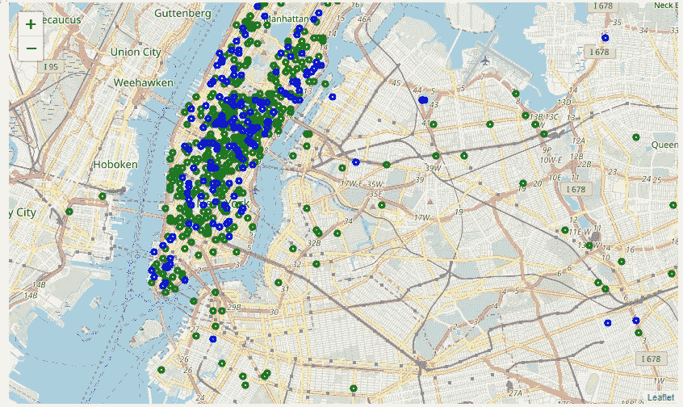

行程距离> 50 英里的接送(蓝点)和下车(绿点)

**4。配送取货日期时间**

分析票价如何随时间变化的第一步是根据取件日期时间创建小时、星期几、日、月、年等特征。提取这些特征的代码如下

```
train['pickup_datetime']=pd.to_datetime(train['pickup_datetime'],format='%Y-%m-**%d** %H:%M:%S UTC')
train['pickup_date']= train['pickup_datetime'].dt.date
train['pickup_day']=train['pickup_datetime'].apply(lambda x:x.day)
train['pickup_hour']=train['pickup_datetime'].apply(lambda x:x.hour)
train['pickup_day_of_week']=train['pickup_datetime'].apply(lambda x:calendar.day_name[x.weekday()])
train['pickup_month']=train['pickup_datetime'].apply(lambda x:x.month)
train['pickup_year']=train['pickup_datetime'].apply(lambda x:x.year)
```

不出所料，多年来，平均出租车费一直在上涨。

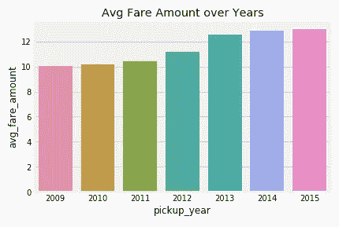

历年票价金额分布

几个月来，尽管从 7 月到 12 月接客量有所减少，但平均票价在几个月内几乎保持不变

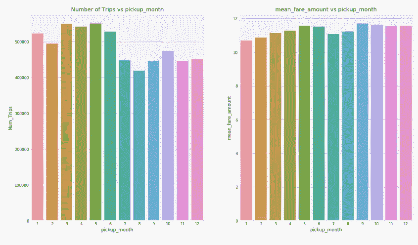

跨月分布

我们观察到，尽管周六的接送人数较多，但平均车费金额较低。在周日和周一，虽然出行次数较少，但平均票价较高

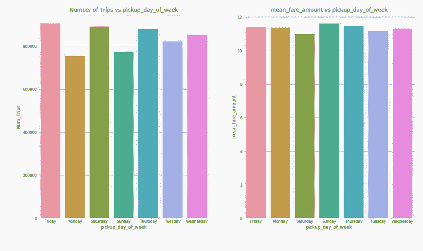

一周中各天的分布

早上 5 点的平均票价最高，而早上 5 点的车次最少。这是因为，在早上 5 点，83%的行程是去机场。18 和 19 小时的出行次数最多

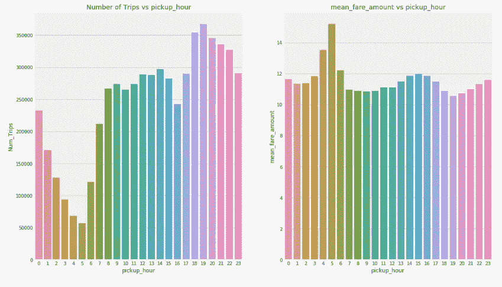

跨小时分布

**结尾注释**

基于使用这种探索性分析创建的特性，使用 XGBoost 的基线模型在公共排行榜上获得了 3.03760 的 RMSE，位于前 15 个百分点。这个帖子的代码可以在[这里](https://www.kaggle.com/aiswaryaramachandran/eda-and-feature-engineering)找到。

在本文的下一部分中，我们将看到如何使用通过探索性分析识别的特征来创建机器学习模型，并了解如何评估模型。我希望这篇文章对你有用，并帮助你建立信心来解决 Kaggle 上的这个挑战。一如既往，欢迎所有讨论和建议。