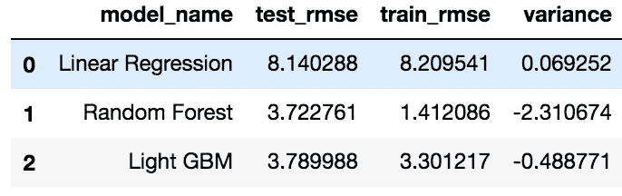

# 预测出租车费用的机器学习—第二部分:预测模型

> 原文：<https://medium.com/analytics-vidhya/machine-learning-to-predict-taxi-fare-part-two-predictive-modelling-f80461a8072e?source=collection_archive---------1----------------------->

## 模型评估、模型调整


欢迎来到使用机器学习预测出租车费用系列的第二部分！这是一个独特的挑战，你说呢？我们定期乘坐出租车(有时甚至每天！)，然而当我们点击“立即预订”按钮时，我们依赖于手动即时计算，而不是核心的 ML 计算。这就是我在这里想要展示的。

在之前的[帖子](/analytics-vidhya/machine-learning-to-predict-taxi-fare-part-one-exploratory-analysis-6b7e6b1fbc78)中，我们查看了清理数据和探索数据，以确定变量之间的关系，并了解将对出租车费用产生影响的各种功能。

在本文中，我们将了解如何构建机器学习模型来预测出租车费用，并了解特征工程在此过程中发挥的重要影响。这篇文章的代码可以在[这里](https://github.com/AiswaryaSrinivas/DataScienceWithPython/blob/master/New%20York%20Taxi%20Fare%20Prediction/Modelling.ipynb)找到。

# **路线图**

在数据清理和探索性分析阶段之后，我们最终到达了模型构建阶段。这一阶段结束时的结果质量取决于数据质量和用于建模的特征。在本文中，我们将详细了解以下步骤:

1.  建模的数据准备
2.  创建基线预测
3.  不使用特征工程构建模型
4.  使用特征工程构建模型

# 数据准备

这一步包括清理数据，删除不需要的列，将分类变量转换为机器可理解的格式，最后将训练数据拆分为训练集和验证集。

我们将删除所有负票价金额和大于 7 的乘客计数，正如我们在第 1 部分中所做的那样。

数据准备的下一步是将训练数据分为训练数据集和验证数据集。几乎所有机器学习项目都遵循这一步骤，并且这是允许我们评估模型的最关键步骤之一。

验证数据集有助于我们了解使用训练数据拟合的模型如何对任何看不见的数据起作用。这有助于我们判断模型是过拟合还是欠拟合。过度拟合是当训练误差较低，但测试误差较高时使用的术语。这是复杂模型的一个常见问题，因为它们倾向于记住底层数据，因此对看不见的数据表现不佳。

像线性回归这样的简单模型不会记住基础数据，而是对数据进行简单的假设。因此，这些模型有很高的误差(高偏差)，但方差低。验证数据集将帮助我们评估基于方差和偏差的模型。在这个分析中，我们将保留 25%的数据作为验证数据。

```
from sklearn.model_selection import train_test_split
X=train.drop([fare_amount],axis=1)
y=train[fare_amount]
X_train, X_test, y_train, y_test = train_test_split(X,y, test_size=0.25,random_state=123)#test_size is the proportion of data that is to be kept aside for validation
```

# 基线模型

基线模型是不应用任何机器学习技术的问题的解决方案。我们建立的任何模型都必须改进这个解决方案。建立基线模型的一些方法是在分类时采用最常见的值，在回归问题中计算平均值。在此分析中，由于我们预测票价金额(这是一个定量变量)，因此我们将预测平均票价金额。**这导致了 9.71 的 RMSE。所以我们建立的任何模型都应该有低于 9.71 的 RMSE。**

```
avg_fare=round(np.mean(y_train),2) #11.31
baseline_pred=np.repeat(avg_fare,y_test.shape[0])
baseline_rmse=np.sqrt(mean_squared_error(baseline_pred, y_test))
print("Basline RMSE of Validation data :",baseline_rmse)
```

# 模型建立和评估

## 1.没有特征工程

在这一步中，我们将仅使用日期时间要素，而不包括任何其他要素，如行程距离、机场距离或从行政区的上车距离。为了理解和评估模型，我们将考虑以下 ML 算法:

*   线性回归
*   随机森林
*   轻型 GBM

除了线性回归，其余的模型都是决策树的集合，但它们在决策树的创建方式上有所不同。在我们进一步讨论之前，让我们先了解我们将使用的几个关键术语的定义。

1.  **Bagging** :该方法创建多个模型，输出预测是不同模型的平均预测。在 Bagging 中，你获取数据集的引导样本(替换)，每个样本训练一个弱学习者。随机森林使用这种方法进行预测。在随机森林中，创建多个决策树，输出是这些树的平均预测。为了使这种方法有效，基线模型必须具有较低的偏差(错误率)。
2.  **Boosting** :在这种方法中，多个弱学习器被集成以创建强学习器。Boosting 使用所有数据来训练每个学习者。但是被先前的学习者错误分类的实例被给予更多的权重，以便后续的学习者可以在训练期间给予它们更多的关注。XGBoost 和 Light GBM 都是基于这种方法。它们都是梯度推进决策树(GBDTs)的变体。在 GBDTs 中，决策树是迭代训练的，即一次训练一棵树。XGBoost 和 Light GBM 在生长决策树时使用**逐叶**生长策略。在训练每个决策树和拆分数据时，XGBoost 遵循逐层策略，而 Light GBM 遵循逐叶策略。

终于到了建立我们的模型的时候了！

1.  **线性回归:**用于寻找目标与一个或多个预测值之间的线性关系。主要想法是确定一条最符合数据的线。最佳拟合线是预测误差最小的线。这种算法不是很灵活，并且有很高的偏差。线性回归也很容易受到异常值的影响，因为它试图最小化误差平方和。

```
lm = LinearRegression()
lm.fit(X_train,y_train)
y_pred=np.round(lm.predict(X_test),2)
lm_rmse=np.sqrt(mean_squared_error(y_pred, y_test))
lm_train_rmse=np.sqrt(mean_squared_error(lm.predict(X_train), y_train))
lm_variance=abs(lm_train_rmse - lm_rmse)
print("Test RMSE for Linear Regression is ",lm_rmse)
print("Train RMSE for Linear Regression is ",lm_train_rmse)
print("Variance for Linear Regression is ",lm_variance)
```

**线性回归模型的检验 RMSE 为 8.14，训练 RMSE 为 8.20。**该模型是对基线预测的改进。尽管方差很低(0.069)，但这个模型的错误率仍然很高。接下来让我们尝试一个更复杂的模型。

2.**随机森林**

随机森林比线性回归模型灵活得多。这意味着更低的偏差，它可以更好地拟合数据。复杂的模型通常会记住底层数据，因此不能很好地概括。参数调整用于避免这个问题。

```
rf = RandomForestRegressor(n_estimators = 100, random_state = 883,n_jobs=-1)
rf.fit(X_train,y_train)
rf_pred= rf.predict(X_test)
rf_rmse=np.sqrt(mean_squared_error(rf_pred, y_test))
print("RMSE for Random Forest is ",rf_rmse)
```

**随机森林模型的验证数据 RMSE 为 3.72，训练 RMSE 为 1.41。**在训练和验证 RMSE 中有巨大的变化，表明过度拟合。为了减少过度拟合，我们可以调整这个模型。

3. **LightGBM**

LightGBM 是一种基于提升树的算法。轻量级 GBM 和其他基于树的算法的区别在于，轻量级 GBM 是逐叶增长的，而不是逐层增长的。该算法选择将导致最大增量损失的节点来分割。轻量级 GBM 速度非常快，运行时占用的内存很少，并且注重结果的准确性。

```
train_data=lgb.Dataset(X_train,label=y_train)
param = {'num_leaves':31, 'num_trees':5000,'objective':'regression'}
param['metric'] = 'l2_root'
num_round=5000
cv_results = lgb.cv(param, train_data, num_boost_round=num_round, nfold=10,verbose_eval=20, early_stopping_rounds=20,stratified=False)
lgb_bst=lgb.train(param,train_data,len(cv_results['rmse-mean']))
lgb_pred = lgb_bst.predict(X_test)
lgb_rmse=np.sqrt(mean_squared_error(lgb_pred, y_test))
print("RMSE for Light GBM is ",lgb_rmse)
```

**该模型在验证数据上给出了 3.78 的 RMSE**，但偏差高于随机森林。另一方面，这个模型的方差是 0.48，而我们的随机森林模型是 2.31。



差分模型的偏差和方差

由于 LightGBM 的错误率与 Random Forest 相当，并且方差更低，运行速度更快，因此我们将使用 Light GBM 作为我们的模型进行进一步分析

## 2.特征工程和模型调整

特征工程是将原始数据转换为输入最终模型的特征的过程。目的是提高模型的准确性。拥有好的特性意味着我们可以使用简单的模型来产生更好的结果。好的特征描述了数据中固有的结构。

正如在第 1 部分中所讨论的，我们将使用在 EDA 阶段确定的特征，如离机场的接送距离、离每个区的接送距离(接送是来自还是去往机场，以及接送来自哪个区)。

**将上述相同的轻型 GBM 模型应用于该特征工程数据，得出 RMSE 为 3.641(从 3.78 下降)，方差为 0.48。**

下一步是调整这个模型。好的模型具有较低的偏差和方差(以避免过度拟合)。LightGBM 中可以优化以减少过拟合的几个重要特性是:

1.  **max_depth** :表示树的最大深度。由于 LightGBM 在没有调优的情况下遵循逐叶增长，因此与其他基于树的算法相比，其深度要高得多。
2.  **子样本**:这表示在每次迭代中使用数据的多少部分，它用于加速算法和控制过度拟合。
3.  **colsample_bytree** :这是在树构建过程的每次迭代中要使用的部分特征。
4.  **min_child_samples:** 这表示一个叶节点中可以出现的最小样本数。这有助于控制过度拟合。

我已经用 Python 中的 *hyperopt* 库调优了模型。 ***Hyperopt* 是一个超参数搜索包，它实现了各种搜索算法，以在搜索空间内找到最佳的超参数集。**要使用 *Hyperopt，*我们必须指定一个目标/损失函数来最小化搜索空间和试验数据库(可选，MongoTrials 可用于并行搜索)。对于我们的问题，目标是最小化 RMSE 和确定最佳参数集。我们将使用 hyperopt 调整 max_depth、subsample 和 colsample_bytree 参数。

在给定一组参数的情况下，用于调整的目标函数是最小化 LightGBM 回归器中的 RMSE。

搜索空间定义了给定参数可以取的一组值。在定义了目标函数和搜索空间之后，我们运行 100 次试验，并对验证数据的试验结果进行评估，以确定最佳参数。

```
def objective(space):clf = lgb.LGBMRegressor(
          objective = 'regression',
          n_jobs = -1, # Updated from 'nthread'
          verbose=1,
          boosting_type='gbdt',
        num_leaves=60,
        bagging_freq=20,
       subsample_freq=100,
    max_depth=int(space['max_depth']),
    subsample=space['subsample'],
        n_estimators=5000,
    colsample_bytree=space['colsample'])
          #metric='l2_root')eval_set=[( X_train, y_train), ( X_test,y_test)]clf.fit(X_train, np.array(y_train),
            eval_set=eval_set,eval_metric='rmse',
            early_stopping_rounds=20)pred = clf.predict(X_test)
    rmse = np.sqrt(mean_squared_error(y_test, pred))
    print("SCORE:", rmse)return{'loss':rmse, 'status': STATUS_OK }space ={
        'max_depth': hp.quniform("x_max_depth", 5, 30, 3),

        'subsample': hp.uniform ('x_subsample', 0.8, 1),
        'colsample':hp.uniform ('x_colsample', 0.3, 1)
    }trials = Trials()
best = fmin(fn=objective,
            space=space,
            algo=tpe.suggest,
            max_evals=100,
            trials=trials)print(best)
```

我们通过特征工程为 LightGBM 获得的最佳参数是:

```
{'max_depth': 24.0, 'subsample': 0.9988461076307639, 'colsample_bytree': 0.38429620148564814}
```

**使用这些参数，LightGBM 模型得出的 RMSE 为 3.633，方差为 0.44。**我们可以通过调整其他参数(如 *num_leaves* )以及添加 L1 和 L2 正则化参数来进一步改进该模型。

# **结尾注释**

特征工程显著提高了我们机器学习模型的预测能力。另一种提高模型准确性的方法是增加训练数据量，和/或建立集合模型。如果数据中有很多维度(特征)，降维技术也可以帮助提高模型的准确性。

我希望这篇文章对你有所帮助。如果您有任何问题或反馈，请随时在下面的评论区联系我们。