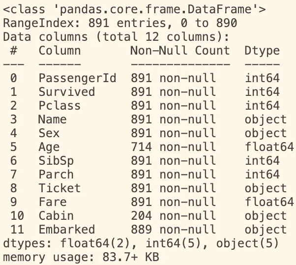
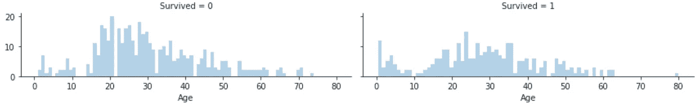
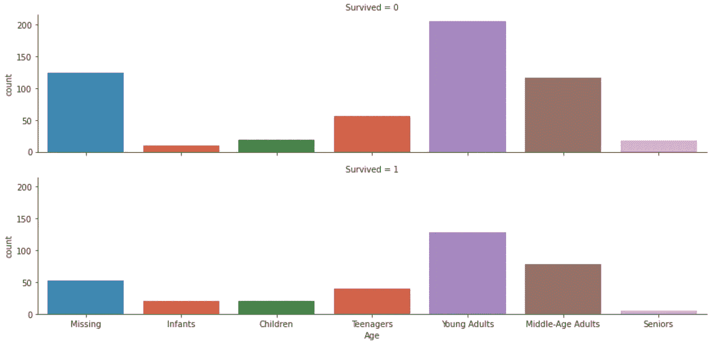
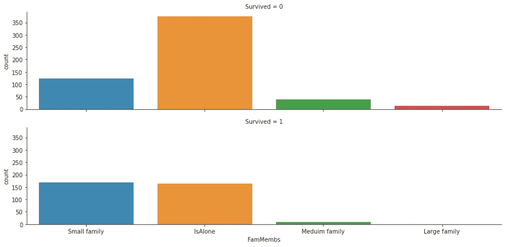
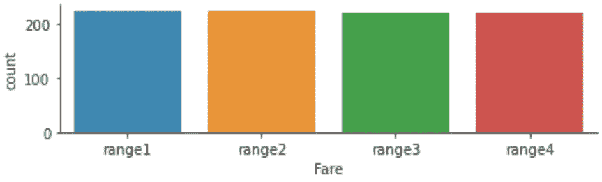
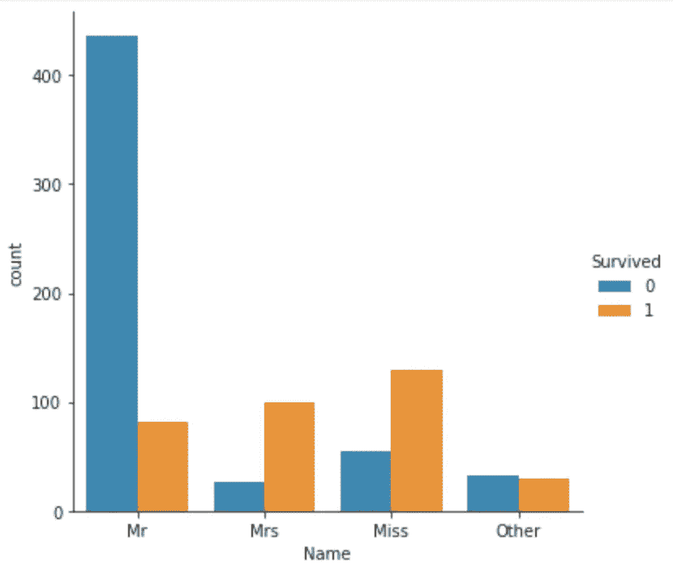
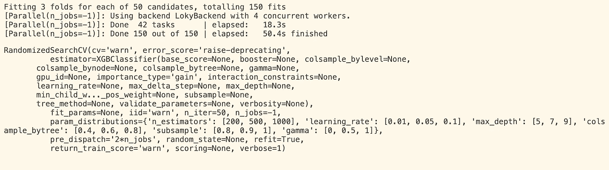

# 机器学习预测泰坦尼克号的幸存者

> 原文：<https://medium.com/analytics-vidhya/machine-learning-to-predict-the-survivals-of-titanic-5968167e5ece?source=collection_archive---------7----------------------->

泰坦尼克号生存预测项目是一个为数据科学领域的初学者所熟知的项目。它涵盖了数据清理、数据探索、数据可视化和机器学习的所有基础知识。

在这篇文章中，我将解释我是如何应对这个挑战以达到 0.8 的准确率，并在 Kaggle 的泰坦尼克号比赛中取得前 9%的成绩。

# 1.必要的库

该项目中使用的库/包有:

*   [pandas](https://pandas.pydata.org/) :用于数据分析处理的库。
*   [matplotlib](https://matplotlib.org/) :用于数据可视化的库。这是 Python 的绘图库。
*   [seaborn](https://seaborn.pydata.org/) :建立在 matplotlib 之上的库。它还用于数据可视化。
*   [scikit-learn](https://scikit-learn.org/stable/) :支持各种监督和非监督学习算法的机器学习库。
*   [XGBoost](https://xgboost.readthedocs.io/en/latest/) :一个提供梯度增强决策树的库。它以高性能和高速度著称。

> ***有趣的事实:)*** *熊猫的名字是对“Python 数据分析”的一种文字游戏。根据* [*维基百科*](https://en.wikipedia.org/wiki/Pandas_(software)) *的说法，该名称来源于“panel data”，这是计量经济学中的一个术语，用来描述包含同一个体多个时间段的观察值的数据集。*

```
import pandas as pd
import matplotlib.pypolt as plt 
import seaborn as snsfrom sklearn.model_selection import train_test_split
from xgboost import XGBClassifier
from sklearn.model_selection import RandomizedSearchCV
```

# 2.获取数据

任何数据科学项目的第一步都是获取数据。数据可以以多种形式出现。在这个项目中，训练和测试数据是结构化的，标记为从 CSV 文件导入的数据。

```
train_data = pd.read_csv("train.csv")
test_data = pd.read_csv("test.csv")
```

# 3.探索和预处理数据

在这一部分，借助数据可视化对数据进行分析，并根据分析结果对数据进行预处理。注意，在训练数据上完成的所有数据预处理也应该在测试数据上完成。

Python 中的 *train_data.info()* 有助于获得数据集的简短摘要

```
train_data.info()
```



```
columns = train_data.columnsfor col in columns:
   print("unique values in {} column is: {}". format(col,
   train_data[col].value_counts().size))
____________________________________________________________________***unique values in PassengerId column is: 891 
unique values in Survived column is: 2 
unique values in Pclass column is: 3 
unique values in Name column is: 891 
unique values in Sex column is: 2 
unique values in Age column is: 88 
unique values in SibSp column is: 7 
unique values in Parch column is: 7 
unique values in Ticket column is: 681 
unique values in Fare column is: 248 
unique values in Cabin column is: 147 
unique values in Embarked column is: 3*** ____________________________________________________________________
```

训练集由 891 行组成。每个乘客都有一个唯一的 PassengerId。摘要显示某些功能缺少值，并且有三种不同类型的功能:int64、float64 和 object。

*train_data[col]。value_counts()。size* 允许了解每一列的唯一值/元素的数量(即:特性)。[*pandas . series . value _ counts*](https://pandas.pydata.org/pandas-docs/stable/reference/api/pandas.Series.value_counts.html)*返回系列中唯一值的大小。*

*第 3.1-3.8 节描述了这些特性，并讨论了如何处理它们。*

# *3.1 性*

*性别特征用于获得船上性别分布的概况。*

```
*print("Total number of male passengers:")
print(train_data.loc[train_data.Sex=="male"].Sex.size)
print("Total number of female passengers:")
print(train_data.loc[train_data.Sex=="female"].Sex.size)
____________________________________________________________________ ***Total number of male passengers: 577 
Total number of female passengers: 314*** ____________________________________________________________________*
```

*尽管男性乘客比女性多，但数据显示女性比男性有更多的生存机会。*

```
*print("The percentage of survived with respect to Sex:")
print(100 * train_data.groupby("Sex").Survived.mean())
____________________________________________________________________***The percentage of survived with respect to Sex: 
Sex 
female    74.203822 
male      18.890815 
Name: Survived, dtype: float64*** ____________________________________________________________________*
```

# *3.2 年龄*

*因为年龄是 float64 类型，所以使用直方图来理解存活和年龄特征之间的关系。*

```
*g = sns.FacetGrid(col="Survived", data=train_data, height = 2, aspect=3)
g.map(sns.distplot, "Age", kde=False, bins=80)*
```

**

*直方图显示，儿童有更高的生存机会。为了更好的理解，使用 [*pandas.cut*](https://pandas.pydata.org/pandas-docs/stable/reference/api/pandas.cut.html) 对年龄特征进行分类。*

```
*def cut_age(df, cut_values, label_names): *# fill missing values with -0.5* df["Age"] = df["Age"].fillna(-0.5)
   df["Age"]=pd.cut(df["Age"], bins=cut_values, labels=label_names)
   return dfcut_values=[-1, 0, 3, 12, 19, 35, 60, 80]label_names=["Missing", "Infants", "Children", "Teenagers", "Young    Adults", "Middle-Age Adults", "Seniors"]train_data=cut_age(train_data, cut_values, label_names)
test_data=cut_age(test_data, cut_values, label_names)sns.catplot(x="Age", row="Survived", kind="count", height=3, aspect=4, data=train_data)*
```

**

```
*print(100 * train_data.groupby("Age").Survived.mean())
____________________________________________________________________***Age 
Missing              29.378531 
Infants              66.666667 
Children             51.282051 
Teenagers            41.052632 
Young Adults         38.438438 
Middle-Age Adults    40.000000 
Seniors              22.727273 
Name: Survived, dtype: float64*** ____________________________________________________________________*
```

*结果确实证明，儿童比其他年龄组存活的时间更长。*

# *3.3 SibSp 和炒制*

*   *SibSp 特征指示乘客与兄弟姐妹(即:兄弟/姐妹)和配偶(即:丈夫/妻子)的关系*
*   *Parch 特征表示乘客与船上父母(即:父亲/母亲)或子女的关系*

```
*print("The percentage of survived with respect to SibSp:")
print(100 * train_data.groupby("Age").Survived.mean())
____________________________________________________________________***The percentage of survived with respect to SibSp: 
SibSp 
0    34.539474 
1    53.588517 
2    46.428571 
3    25.000000 
4    16.666667 
5     0.000000 
8     0.000000 
Name: Survived, dtype: float64*** ____________________________________________________________________print("The percentage of survived with respect to Parch:")
print(100 * train_data.groupby("Parch").Survived.mean())
____________________________________________________________________***The percentage of survived with respect to Parch: 
Parch 
0    34.365782 
1    55.084746 
2    50.000000 
3    60.000000 
4     0.000000 
5    20.000000 
6     0.000000 
Name: Survived, dtype: float64*** ____________________________________________________________________*
```

*结果显示，独自一人(没有家庭成员)的个体比有 1 到 3 个家庭成员在船上的个体有更少的生存机会。但是，当家庭成员超过 3 个时，生存机会下降。更准确地说，Parch 和 SibSp 特性将合并成一个特性，称为 Fam_membs。*

```
*def Cr_fam_membs(df):
   df["FamMembs"]= df["Parch"] + df["SibSp"]
   df=df.drop(["SibSp", "Parch"], axis=1)
   return dftrain_data=Cr_fam_membs(train_data)
test_data=Cr_fam_membs(test_data)print(100 * train_data.groupby("FamMembs").Survived.mean())
***____________________________________________________________________
FamMembs 
0     30.353818 
1     55.279503 
2     57.843137 
3     72.413793 
4     20.000000 
5     13.636364 
6     33.333333 
7      0.000000 
10     0.000000 
Name: Survived, dtype: float64*** ____________________________________________________________________*
```

*为了限制 Fam_membs 功能中的类别数量，它将被分为以下 4 个类别:*

*   *IsAlone: 0 个家庭成员*
*   *小家庭:1-3 个成员*
*   *中等家庭:4-6 个家庭成员*
*   *大家庭:7-10 个成员*

```
*train_data["FamMembs"]=train_data["FamMembs"].apply(lambda s:    "IsAlone" if s==0 else s)
train_data["FamMembs"]=train_data["FamMembs"].apply(lambda s: "Small family" if (s==1 or s==2 or s==3) else s)
train_data["FamMembs"]=train_data["FamMembs"].apply(lambda s: "Meduim family" if (s==4 or s==5 or s==6) else s)
train_data["FamMembs"]=train_data["FamMembs"].apply(lambda s: "Large family" if (s==7 or s==10) else s)test_data["FamMembs"].value_counts()
***____________________________________________________________________*** 
***IsAlone          253 
Small family     145 
Meduim family     14 
Large family       6 
Name: FamMembs, dtype: int64*** ____________________________________________________________________*
```

*家庭成员特征使人们更容易理解家庭规模如何影响生存机会。*

```
*print("The percentage of survived with respect to Fam_membs:")
print(100 * train_data.groupby("FamMembs").Survived.mean())
____________________________________________________________________***The percentage of survived with respect to Fam_membs: 
FamMembs 
IsAlone          30.353818 
Large family      0.000000 
Meduim family    20.408163 
Small family     57.876712 
Name: Survived, dtype: float64*** ____________________________________________________________________sns.catplot(x="FamMembs", row="Survived", kind="count", height=3, aspect=4, data=train_data)*
```

**

# *3.4 Pclass*

*Pclass 代表乘客的等级。它被分为一、二、三三等。正如所料，属于一等舱的乘客存活率最高，属于三等舱的乘客存活率最低。*

```
*print(“The percentage of survived with respect to Pclass:”)
print(100 * train_data.groupby(“Pclass”).Survived.mean())
____________________________________________________________________***The percentage of survived with respect to Pclass: 
Pclass 
1    62.962963 
2    47.282609 
3    24.236253 
Name: Survived, dtype: float64*** ____________________________________________________________________*
```

# *3.5 上船*

*装船港是 C =瑟堡，Q =皇后镇和 S =南安普敦。由于装载特征中的缺失值仅限于 2，因此在训练数据中，它们由最频繁出现的值填充。*

```
*train_data["Embarked"]=train_data["Embarked"].fillna(train_data["Embarked"].mode()[0])*
```

# *3.6 票价*

*与年龄特征相似，票价采用 [*熊猫分类。qcut*](https://pandas.pydata.org/pandas-docs/stable/reference/api/pandas.qcut.html) 。*大熊猫之间的主要区别在于*大熊猫。qcut* 会创建相同大小的箱子，而*大熊猫。cut* 用于精确指定箱子的边缘。*熊猫。cut* 不使用，因为不清楚票价是如何分配的，以及它与其他特征之间的关系；因此，箱子的边缘不容易确定。查看本[笔记本](https://github.com/kheirie/First-ML-Project---Titanic/blob/main/towards-machine-learning-with-titanic.ipynb)了解更多关于如何针对 Pclass 和 loaded 特性分析 Fare 特性的详细信息。**

```
*def qcut_fare(df, q, labels):
   df["Fare"]=pd.qcut(df["Fare"], q, labels=labels)
   return dflabels=["range1", "range2", "range3", "range4"]
train_data=qcut_fare(train_data, 4, labels)*
```

*q=4 用于根据 [*大熊猫的默认百分位数进行数据划分。系列描述*](https://pandas.pydata.org/pandas-docs/stable/reference/api/pandas.Series.describe.html) (即:范围 1: min-0.25，范围 2: 0.25-0.5，范围 3: 0.5-0.75，范围 4: 0.75-max)。*

```
*train_data[“Fare”].describe()
____________________________________________________________________***count    891.000000
mean      32.204208
std       49.693429
min        0.000000
25%        7.910400
50%       14.454200
75%       31.000000
max      512.329200
Name: Fare, dtype: float64*** ____________________________________________________________________sns.catplot(x="Fare", data=train_data, kind="count", height=2, aspect=3)*
```

**

# *3.7 姓名*

*很容易认为名称功能没有用，因为每个人都有一个唯一的名字。然而，仔细观察这个特性，你会发现名字有标题，这对预测很有用。*

```
*train_data["Name"]
____________________________________________________________________***0                                Braund, Mr. Owen Harris
1      Cumings, Mrs. John Bradley (Florence Briggs Th...
2                                 Heikkinen, Miss. Laina
3           Futrelle, Mrs. Jacques Heath (Lily May Peel)
4                               Allen, Mr. William Henry
                             ...                        
886                                Montvila, Rev. Juozas
887                         Graham, Miss. Margaret Edith
888             Johnston, Miss. Catherine Helen "Carrie"
889                                Behr, Mr. Karl Howell
890                                  Dooley, Mr. Patrick
Name: Name, Length: 891, dtype: object*** ____________________________________________________________________*
```

*名称特征中的名称由头衔(即:先生、夫人、小姐)(如果有的话)或“其他”(在没有头衔或头衔非常罕见的情况下)代替。*

```
*train_data["Name"]=train_data["Name"].apply(lambda s: s.split(', ')[1].split('.')[0])train_data["Name"].value_counts()____________________________________________________________________***Mr              517
Miss            182
Mrs             125
Master           40
Dr                7
Rev               6
Major             2
Col               2
Mlle              2
Mme               1
Sir               1
Ms                1
the Countess      1
Capt              1
Jonkheer          1
Don               1
Lady              1
Name: Name, dtype: int64*** ____________________________________________________________________train_data["Name"]=train_data["Name"].replace(["Ms", "Mlle"], "Miss")
train_data["Name"]=train_data["Name"].replace(["Sir"], "Mr")
train_data["Name"]=train_data["Name"].replace(["Mme"], "Mrs")
train_data["Name"]=train_data["Name"].replace(["Dr", "Rev", "Col", "Major", "Capt", "Master", "Lady", "the Countess", "Don", "Dona", "Jonkheer"], "Other")sns.catplot(x="Name", hue="Survived", kind="count", data=train_data)*
```

**

*根据性别特征推断，上图证明女性(“夫人”和“小姐”)比男性(“先生”)有更多的生存机会。*

# *3.8 舱室*

*即使“机舱”功能有许多缺失值，也不会直接删除。它用于创建一个名为“甲板”的新功能。舱室位于不同的甲板上，即:A、B、C、D、E、F、G 和 t。*

```
**# fill the missing values with "Unknown"*
train_data[“Cabin”]=train_data[“Cabin”].fillna(“Unknown”) *# remove digits to create the deck feature* train_data["Deck"]=train_data["Cabin"].str.replace("([0-9\s])+","")train_data["Deck"].value_counts()
____________________________________________________________________***Unknown    687
C           51
B           36
D           32
E           32
A           15
F            9
BB           7
CC           4
G            4
CCC          4
FG           3
BBB          2
BBBB         2
FE           1
T            1
DD           1
Name: Deck, dtype: int64*** ____________________________________________________________________*
```

*数据显示，一些乘客有不止一个客舱。其中一些在同一层甲板上，另一些在不同的甲板上。为了解决这个问题，创建了一个新功能来指示每个乘客的客舱总数。如果乘客舱未知，则为 0。对于由一个以上字母组成的甲板，取第一个字母。*

```
*def total_cabins(row):
   if row.Deck == "Unknown":
      row["TotalCab"] = 0
   elif len(row.Deck) > 1:
      row["TotalCab"] = len(row.Deck)
   else:
      row["TotalCab"] = 1
   return rowtrain_data=train_data.apply(total_cabins, axis=1)train_data["TotalCab"].value_counts()
____________________________________________________________________***0    687
1    180
2     16
3      6
4      2
Name: TotalCab, dtype: int64*** ____________________________________________________________________train_data["Deck"]=train_data["Deck"].apply(lambda s: s[0] if s != "Unknown" else s)train_data["Deck"].value_counts()
____________________________________________________________________***Unknown    687
C           59
B           47
D           33
E           32
A           15
F           13
G            4
T            1
Name: Deck, dtype: int64*** ____________________________________________________________________*
```

# *3.9 删除不必要的栏目*

```
*train_data=train_data.drop(["Survived", "Cabin", "Ticket"], axis=1)*
```

# *4.处理分类价值*

*机器学习模型只理解数值。 [*一热编码*](https://scikit-learn.org/stable/modules/generated/sklearn.preprocessing.OneHotEncoder.html) 用于将非数字数据转换为数字数据。*

```
*from sklearn.preprocessing import OneHotEncoderOHE = OneHotEncoder(handle_unknown='ignore', sparse=False)features = ["Pclass", "Name", "Sex", "Age", "Fare", "Embarked",
            "FamMembs", "Deck", "TotalCab"]OHE_train_cols=pd.DataFrame(OHE.fit_transform(train_data[features]))OHE_train_cols.index=train_data.index

num_train=train_data.drop(features, axis=1)train_data = pd.concat([num_train, OHE_train_cols], axis=1)print(train_data.shape)
____________________________________________________________________***(891, 42)*** ____________________________________________________________________*
```

# *5.使用 RandomizedSearchCV 调整 XGBoost 参数*

*[XGBoost](https://xgboost.ai/) 代表极限梯度提升。这是一种基于决策树的模型集成算法，实现了梯度推进框架。它专为速度和性能而设计。XGBoost 在处理结构化/表格数据时证明了它的优越性，这个项目就是这样。*

*我们在这个项目中解决的问题被认为是一个分类问题，因为结果要么是 1(幸存)，要么是 0(未幸存)。在这种情况下使用 XGBClassifier。*

*[RandomizedSearchCV](https://scikit-learn.org/stable/modules/generated/sklearn.model_selection.RandomizedSearchCV.html) 用于寻找最佳参数。它传递给定的参数集，计算分数并给出最佳的参数集。这个过程有时被称为超参数调整。它还执行 train_test_split。*

```
*from xgboost import XGBClassifier
from sklearn.model_selection import RandomizedSearchCVxgb=XGBClassifier(objective='reg:logistic')params={
    'n_estimators': [200, 500, 1000],
    'learning_rate': [0.01, 0.05, 0.1],
    'max_depth': [5, 7, 9],
    'colsample_bytree': [ 0.4, 0.6, 0.8],
    'subsample': [0.8, 0.9, 1],
    'gamma': [0, 0.5, 1]
}*# split the data into train and validation data*
X_train, X_valid, y_train, y_valid = train_test_split(train_data, y, test_size=0.25)clf=RandomizedSearchCV(xgb, param_distributions=params, n_iter=50, n_jobs=-1, verbose=1)clf.fit(train_data, y)* 
```

**

```
*score=clf.best_score_
params=clf.best_params_
print("Best score: ",score)
print("Best parameters: ", params)____________________________________________________________________***Best score:  0.812874251497006 
Best parameters:  {'subsample': 1, 'n_estimators': 500, 'max_depth': 9, 'learning_rate': 0.01, 'gamma': 0.5, 'colsample_bytree': 0.4}*** ____________________________________________________________________*
```

*为了找到准确性，将预测与验证目标进行比较。*

```
*predictions = clf.predict(X_valid)count = 0
for i in range(len(predictions)):
   if predictions[i] == y_valid.to_list()[i]:
      count = count + 1 *# count if a match is found*accuracy = count/len(y_valid)print("accuracy is ", accuracy)
____________________________________________________________________***accuracy is  0.8251121076233184*** ____________________________________________________________________*
```

*泰坦尼克号生存预测项目被认为是开始数据科学之旅的最佳项目之一。在这个项目中，涵盖了数据可视化、数据预处理和特征工程等概念。此外，在处理结构化数据时，我们感受到了 XGBoost 模型的强大功能。*

*建设性的意见和问题总是受欢迎的！*

***其他有用资源:***

*   *尼克拉斯·唐加斯预测泰坦尼克号乘客的生存*
*   *[利用机器学习进行泰坦尼克号生存预测](/better-programming/titanic-survival-prediction-using-machine-learning-4c5ff1e3fa16)*
*   *[应用机器学习 XGBoost 的温和介绍](https://machinelearningmastery.com/gentle-introduction-xgboost-applied-machine-learning/#:~:text=XGBoost%20is%20an%20algorithm%20that,designed%20for%20speed%20and%20performance.)*