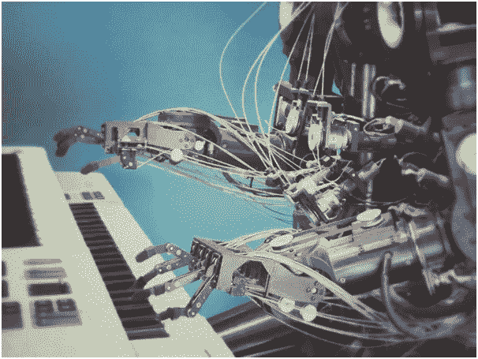

# 机器学习:训练、验证和测试集

> 原文：<https://medium.com/analytics-vidhya/machine-learning-training-validation-and-testing-sets-c62c78cebd84?source=collection_archive---------16----------------------->

机器学习是一个让我们感到兴奋的术语，它完全是关于让机器从任何给定的数据中发现和学习模式，并根据识别的模式做出预测，而不是使用基于规则的方法。

在 [unsplash](https://unsplash.com/photos/U3sOwViXhkY) 上由 [Franck V.](https://unsplash.com/@franckinjapan) 拍摄的照片

在基于规则的方法中，我们有一个预定义的条件集，根据满足哪个条件，程序做出某个…