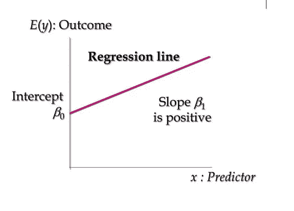
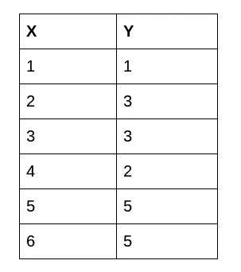
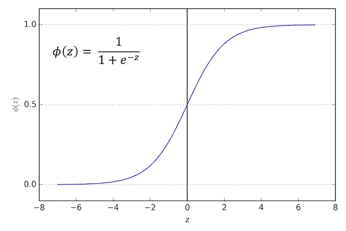
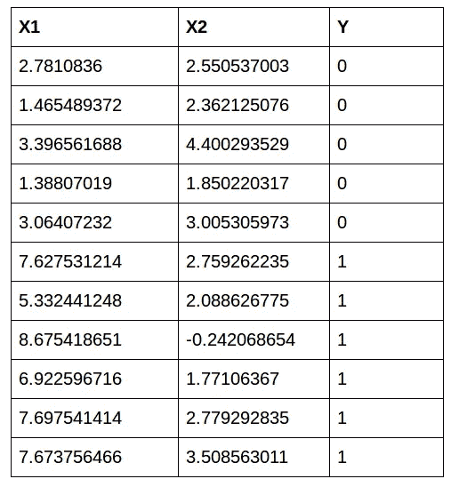

# 使用 C++的机器学习:线性和逻辑回归初学者指南

> 原文：<https://medium.com/analytics-vidhya/machine-learning-using-c-a-beginners-guide-to-linear-and-logistic-regression-b67f13dc45e4?source=collection_archive---------30----------------------->

# 为什么用 C++做机器学习？

机器学习的应用超越了边界和行业，所以我们为什么要让工具和语言阻碍我们呢？是的，Python 是目前业界的首选语言，但是我们中的很多人都没有学习过 Python！

大学里的计算机科学教师仍然在教授 C++编程——所以这是我们大多数人最终首先学习的东西。我理解你为什么应该学习 Python——它是这个行业的主要语言，它有你开始机器学习所需的所有库。

但是如果你的大学不教呢？嗯——这启发了我更深入地挖掘，并使用 C++来构建机器学习算法。因此，如果你是一名大学生，该行业的新生，或者只是对学习不同的机器学习语言感到好奇的人，这篇教程就是为你准备的！

在我关于使用 C++进行机器学习系列的第一篇文章中，我们将从基础开始。我们将了解如何使用 C++实现线性回归和逻辑回归！

我们开始吧！

*注:如果你是机器学习初学者，我推荐你参加综合* [*应用机器学习课程*](https://courses.analyticsvidhya.com/courses/applied-machine-learning-beginner-to-professional?utm_source=blog&utm_medium=machine-learning-using-c-linear-logistic-regression) *。*

# 使用 C++进行线性回归

在使用 C++实现线性回归之前，让我们先简单了解一下什么是线性回归以及它是如何工作的。

线性回归模型用于根据一个因素的值预测另一个因素的值。被预测的值称为因变量，用于预测因变量的值称为自变量。线性回归的数学方程是:

> Y=B0+B1 X

这里，

*   x:独立变量
*   y:因变量
*   B0:表示 X=0 时 Y 的值
*   B1:回归系数(这代表因变量基于自变量单位变化的变化)

例如，我们可以使用线性回归来了解是否可以根据吸烟持续时间来预测香烟消费量。在这里，你的因变量是“香烟消费量”，以每天消费的香烟数量来衡量，你的自变量是“吸烟持续时间”，以天数来衡量。

# 损失函数

损失是我们预测值 B0 和 B1 的误差。我们的目标是最小化这一误差，以获得 B0 和 B1 的最精确值，从而获得未来预测的最佳拟合线。

为简单起见，我们将使用以下损失函数:

> e(i) = p(i) - y(i)

这里，

*   e(I)*与*训练示例的误差
*   p(i):第个训练样本的*的预测值*
*   y(i):第个训练示例的*的实际值*

# 梯度下降算法概述

梯度下降是一种寻找函数最小值的迭代优化算法。在我们的例子中，这个函数就是我们的损失函数**。**

这里，我们的目标是找到损失函数的最小值(在我们的例子中非常接近于零)。梯度下降是实现这一点的有效算法。我们从系数 B0 和 B1 的随机初始值开始，基于每个实例的误差，我们将更新它们的值。

它是这样工作的:

1.  最初，让 B1 = 0，B0 = 0。设 L 为我们的学习率。这控制了 **B1** 的值随着每一步变化的程度。l 可以是一个小值，如 0.01，以获得良好的精度
2.  我们计算第一点的误差:e(1)= p(1)- y(1)
3.  我们将根据以下等式更新 B0 和 B1:

> b0(t+1) = b0(t) - L *误差
> b1(t+1) = b1(t) - L *误差

我们将对训练集的每个实例都这样做。这完成了一个时代。我们将对更多的时期重复这一过程，以获得更准确的预测。

您可以参考这些综合指南，以更深入地了解线性回归和梯度下降:

*   [线性、脊形和套索回归综合初学者指南](https://www.analyticsvidhya.com/blog/2017/06/a-comprehensive-guide-for-linear-ridge-and-lasso-regression/?utm_source=blog&utm_medium=machine-learning-using-c-linear-logistic-regression)
*   [机器学习中的梯度下降介绍](https://www.analyticsvidhya.com/blog/2017/03/introduction-to-gradient-descent-algorithm-along-its-variants/?utm_source=blog&utm_medium=machine-learning-using-c-linear-logistic-regression)

# 在 C++中实现线性回归

## 初始化阶段:

我们将从定义数据集开始。在本教程中，我们将使用这个数据集:

我们将针对前 5 个值训练数据集，并针对最后一个值进行测试:

接下来，我们将定义变量:

## 培训阶段

我们的下一步是梯度下降算法:

因为有 5 个值，我们运行整个算法 4 个时期，因此我们的迭代函数工作 20 次。变量 *p* 计算每个实例的预测值。变量 *err* 用于计算每个实例的误差。然后，我们更新 b0 和 b1 的值，如上文梯度下降部分所述。我们最后把误差推进误差向量。

你会注意到，B0 没有任何输入。这个系数通常被称为**偏差**或**截距**，我们可以假设它的输入值总是 1.0。当使用向量或数组实现算法时，这种假设会有所帮助。

最后，我们将对误差向量进行排序，以获得误差的最小值以及 b0 和 b1 的相应值。最后，我们将打印这些值:

## 测试阶段:

我们将输入测试值 6。我们得到的答案是 4.9753，非常接近 5。恭喜你！我们刚刚用 C++建立了一个线性回归模型，而且参数也很好。

## 最终实现的完整代码:

最终实现的完整代码可以在这里找到:[https://github . com/Alakhator/Machine-Learning-With-C-/blob/master/linear _ regession _ full . CPP](https://github.com/Alakhator/Machine-Learning-With-C-/blob/master/linear_regession_full.cpp)

# 用 C++实现逻辑回归

逻辑回归是用于二分类的最著名的机器学习算法之一。这是因为它是一个简单的算法，在广泛的问题上表现非常好。

这个算法的名字叫逻辑回归，因为我们在这个算法中使用了逻辑函数。该物流功能定义为:

> 预测值= 1 / (1 + e^-x)

逻辑回归模型采用实值输入，并预测输入属于默认类(类 0)的概率。如果概率> 0.5，我们可以将输出作为默认类(类 0)的预测，否则，该预测是针对另一个类(类 1)的。

# 逻辑回归的梯度下降

我们可以将随机梯度下降应用于寻找逻辑回归模型系数的问题，如下所示:

让我们假设对于示例数据集，逻辑回归与线性回归一样具有三个系数:

> 输出= b0 + b1*x1 + b2*x2

学习算法的工作将是基于训练数据发现系数(b0、b1 和 b2)的最佳值。

给定每个训练实例:

1.  使用系数的当前值计算预测。

> 预测= 1 / (1 + e^(-(b0 + b1*x1 + b2*x2))。

2.基于预测中的误差计算新的系数值。这些值根据以下等式进行更新:

> b = b+alpha *(y-预测)*预测*(1-预测)* x

其中 b 是我们正在更新的系数，预测是使用模型进行预测的输出。Alpha 是您必须在训练开始时指定的参数。这是学习率，控制着每次更新时系数(以及模型)的变化或学习程度。

就像我们之前讨论线性回归时看到的，B0 没有任何输入。这个系数称为偏差或截距，我们可以假设它的输入值总是 1.0。所以在更新的时候，我们会乘以 1.0。

重复该过程，直到模型足够精确(例如，误差下降到某个期望的水平)或者重复固定次数。

对于逻辑回归的初学者指南，看看这个— [逻辑回归简单指南](https://www.analyticsvidhya.com/blog/2015/11/beginners-guide-on-logistic-regression-in-r/)。

# 在 C++中实现逻辑回归

## 初始阶段

我们将从定义数据集开始:

我们将训练前 10 个值，并测试最后一个值:

接下来，我们将初始化变量:

## 培训阶段

由于有 10 个值，我们将运行一个包含 10 个步骤的纪元。我们将根据上面梯度下降部分描述的等式计算预测值:

> 预测= 1 / (1 + e^(-(b0 + b1*x1 + b2*x2)))

接下来，我们将根据上面描述的类似等式更新变量:

> b = b + alpha * (y 预测)*预测* (1 预测)* x

最后，我们将对误差向量进行排序，以获得误差的最小值以及 b0、b1 和 b2 的相应值。最后，我们将打印这些值:

## 测试阶段:

当我们输入 x1=7.673756466，x2= 3.508563011 时，得到 pred = 0.59985。所以最后我们将打印这个类:

所以模型打印出来的类是 1。是啊！我们的预测是正确的！

## 全面实施的最终代码

完整实现的最终代码可以在这里找到:[https://github . com/Alakhator/Machine-Learning-With-C-/blob/master/logistic _ regression _ full . CPP](https://github.com/Alakhator/Machine-Learning-With-C-/blob/master/logistic_regression_full.cpp)

# 结束注释

为了学习机器学习，更重要的一步是从零开始实现算法。简单的事实是，如果我们不熟悉算法的基础，我们就不能在 C++中实现它。

这是我用 C++在机器学习这个领域开始的冒险之一。我正在研究更先进的机器学习算法，请密切关注！

# 你也可以在分析 Vidhya 的 Android 应用上阅读这篇文章

【https://www.analyticsvidhya.com】原载于 2020 年 4 月 22 日**。**