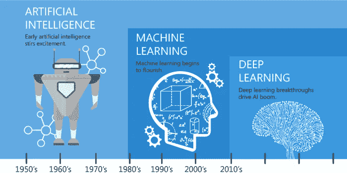
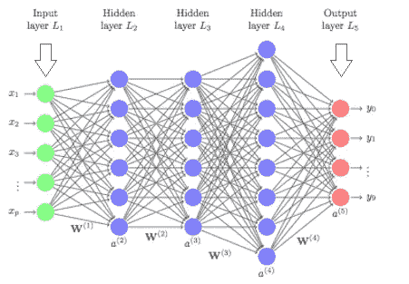
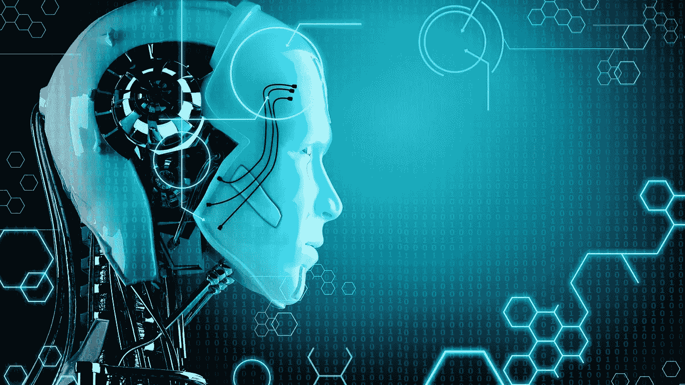

# 机器学习 vs 深度学习 vs 人工智能

> 原文：<https://medium.com/analytics-vidhya/machine-learning-vs-deep-learning-vs-ai-7bf97f57ddf8?source=collection_archive---------21----------------------->

我参加了一家大公司的面试，被问了很多问题，但有一个让我印象深刻的问题是，当面试官问“你知道**机器学习**、**深度学习**和**人工智能**之间的区别吗，因为没有多少人知道这种区别。”因此，我将讨论这三者之间的异同。

## 机器学习

**机器学习**是对改善整体体验的计算机算法的研究。这些算法可以是随机森林、逻辑回归、K 均值聚类等。

这基本上可以归结为当你想在葡萄酒数据集上使用简单的线性回归来找出是什么让一款好酒变得伟大。你向你的机器提供数据，并使用一种算法来帮助机器学习特性，以便找到最佳结果。

**机器学习**的一个例子是预测，如果你想更深入，那么机器学习也可以是医疗诊断。

## 深度学习

**深度学习**也是**机器学习**的一部分。**深度学习**基于人工神经网络。这些网络能够学习无监督的数据(非结构化数据或无标签数据)。

自动驾驶汽车就是深度学习的一个例子。他们使用神经网络来帮助处理计算机视觉，这使他们能够检测周围的物体。

## 人工智能

一切都连接回人工智能，这使得机器能够从经验中学习，适应新的输入，并执行类似人类的任务。

人工智能的一个例子是苹果的 Siri，谷歌的助手(我不知道它的名字)，Alexa 和电子邮件(当他们组织你的电子邮件并把它们分类时)。

# …

现在你知道当面试官问你这个问题时该说什么了。