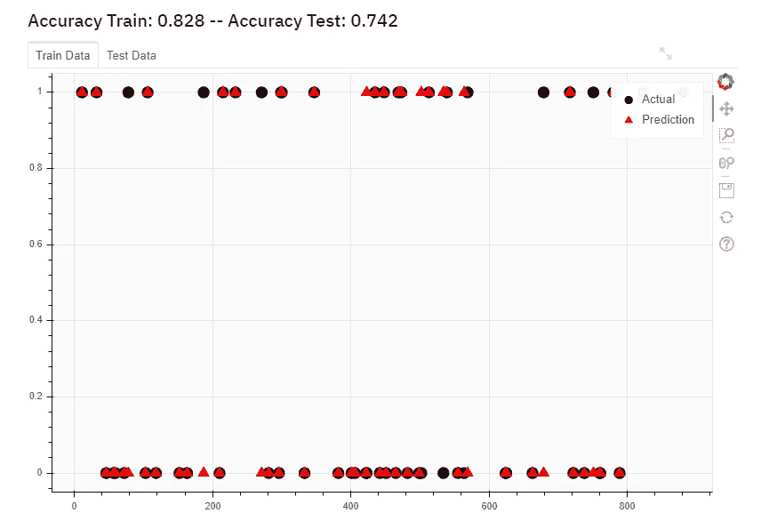

# 具有 Streamlit 的机器学习 Web 应用程序

> 原文：<https://medium.com/analytics-vidhya/machine-learning-web-app-with-streamlit-7864e04c1fbf?source=collection_archive---------4----------------------->


凯文·Ku 在 [Unsplash](https://unsplash.com?utm_source=medium&utm_medium=referral) 上的照片

Streamlit 是一个用于机器学习和数据科学的开源应用框架。在本文中，我们将使用它的视觉功能将我们的机器学习项目转换为 web 应用程序。您可以通过以下链接访问官方网站和文档:

[](https://www.streamlit.io/) [## streamlit——构建定制 ML 工具的最快方法

### Streamlit 是一个面向机器学习和数据科学团队的开源应用框架。在…中创建漂亮的数据应用程序

www.streamlit.io](https://www.streamlit.io/) 

## **1。文件输入:**

为了创建文件上传器模型来导入用户数据，我们将使用 Streamlit 的预定义文件上传器小工具。

首先我们需要将 streamlit 安装到我们的 pyhton 环境中:

```
pip install streamlit
```

现在，我们可以通过导入以下内容来开始使用 streamlit:

```
import streamlit as st
```

作为一个样本输入文件，我们将使用著名的泰坦尼克号数据集。您可以通过以下链接访问数据集:

[](https://www.kaggle.com/c/titanic/data) [## 泰坦尼克号:机器从灾难中学习

### 从这里开始！预测泰坦尼克号上的生存并熟悉 ML 基础知识

www.kaggle.com](https://www.kaggle.com/c/titanic/data) 

通过使用下面的代码，我们可以从用户那里读取数据:

```
**def file_selector(self):** file = st.sidebar.file_uploader("Choose a CSV file", type="csv")
   if file is not None:
      data = pd.read_csv(file)
      return data
   else:
      st.text("Please upload a csv file")
```

> 添加 streamlit 小工具时，在小工具调用之前使用“**ST . sidebar”**会将您的小工具添加到屏幕左侧的侧边栏中。但是，仅使用**“ST”**将在主面板上添加小工具。


Streamlit 的文件上传器小部件

***从数据中选择所需的列:***

在这里，“ ***multiselect*** ”小部件给了我们多重选择的机会。

```
**def set_features(self):**
   self.features = st.multiselect(‘Please choose the features including target variable that go into the model’, self.data.columns )
```


多选选择小工具

## **2。数据准备:**

```
**def prepare_data(self, split_data, train_test):**
   # Reduce data size
   data = self.data[self.features]
   data = data.sample(frac = round(split_data/100,2))
```

***估算“南”的数量特征和最常见的类别:***

```
 # Impute nans with mean for numeris and most frequent for categoricals
   cat_imp = SimpleImputer(strategy="most_frequent")
   if len(data.loc[:,data.dtypes == 'object'].columns) != 0:
      data.loc[:,data.dtypes == 'object'] = cat_imp.fit_transform(data.loc[:,data.dtypes == 'object'])
      imp = SimpleImputer(missing_values = np.nan, strategy="mean")
      data.loc[:,data.dtypes != 'object'] =      imp.fit_transform(data.loc[:,data.dtypes != 'object'])
```

***分类变量的一个热编码:***

```
 # One hot encoding for categorical variables
      cats = data.dtypes == 'object'
      le = LabelEncoder()
      for x in data.columns[cats]:
         data.loc[:,x] = le.fit_transform(data[x])
         onehotencoder = OneHotEncoder()      
         data.loc[:,~cats].join(pd.DataFrame(data=onehotencoder.
         fit_transform (data.loc[:,cats]).toarray(), columns= 
         onehotencoder.get_feature_names()))
```

***设置目标列:***

我们将通过在侧边栏面板上添加***【select box】***小部件来设置用户选择的目标列，如下所示:

```
# Set target column
target_options = data.columns
self.chosen_target = st.sidebar.selectbox("Please choose target column", (target_options))
```


用于目标选择的选择框小部件

***标准化特征数据:***

```
# Standardize the feature data
X = data.loc[:, data.columns != self.chosen_target]
scaler = MinMaxScaler(feature_range=(0,1))
scaler.fit(X)
X = pd.DataFrame(scaler.transform(X))
X.columns = data.loc[:, data.columns != self.chosen_target].columns
y = data[self.chosen_target]
```

***列车测试拆分:***

```
# Train test split
try:
   self.X_train, self.X_test, self.y_train, self.y_test =     train_test_split(X, y, test_size=(1 - train_test/100), random_state=42)except:
   st.markdown('<span style="color:red">With this amount of data and   split size the train data will have no records, <br /> Please change reduce and split parameter <br /> </span>', unsafe_allow_html=True)
```


## 3.选择算法:

现在我们将在侧边栏上添加另一个“ ***”选择框*** ，以启用类似于“**”*或“*”的算法选择。然后，根据之前的选择，我们将添加新的 selectbox，其中包含所选算法类型的可用方法。**

**另外，为了呈现算法参数选择，我们还添加了****滑块*** *小工具来接受用户的输入。****

****

**算法类型和方法选择**

****

**参数选择**

```
****def set_classifier_properties(self):** self.type = st.sidebar.selectbox(“Algorithm type”, (“Classification”, “Regression”)) if self.type == “Regression”:
      self.chosen_classifier = st.sidebar.selectbox(“Please choose a classifier”, (‘Random Forest’, ‘Linear Regression’, ‘Neural Network’)) if self.chosen_classifier == ‘Random Forest’:
      self.n_trees = st.sidebar.slider(‘number of trees’, 1, 1000, 1)
   elif self.chosen_classifier == ‘Neural Network’:
      self.epochs = st.sidebar.slider(‘number of epochs’, 1 ,100 ,10)
      self.learning_rate = float(st.sidebar.text_input(‘learning rate:’, ‘0.001’))
   elif self.type == “Classification”:
      self.chosen_classifier = st.sidebar.selectbox(“Please choose a classifier”, (‘Logistic Regression’, ‘Naive Bayes’, ‘Neural Network’))
   if self.chosen_classifier == ‘Logistic Regression’:
      self.max_iter = st.sidebar.slider(‘max iterations’, 1, 100, 10)
   elif self.chosen_classifier == ‘Neural Network’:
      self.epochs = st.sidebar.slider(‘number of epochs’, 1 ,100 ,10)
      self.learning_rate = float(st.sidebar.text_input(‘learning rate:’, ‘0.001’))
      self.number_of_classes = int(st.sidebar.text_input(‘Number of classes’, ‘2’))**
```

## **4.做出预测:**

```
****def predict(self, predict_btn):** if self.type == “Regression”:
      if self.chosen_classifier == ‘Random Forest’:
         self.alg = RandomForestRegressor(max_depth=2, random_state=0, n_estimators=self.n_trees)
         self.model = self.alg.fit(self.X_train, self.y_train)
predictions = self.alg.predict(self.X_test)
         self.predictions_train = self.alg.predict(self.X_train)
         self.predictions = predictions elif self.chosen_classifier==’Linear Regression’:
         self.alg = LinearRegression()
         self.model = self.alg.fit(self.X_train, self.y_train)
         predictions = self.alg.predict(self.X_test)
         self.predictions_train = self.alg.predict(self.X_train)
         self.predictions = predictions

      elif self.chosen_classifier==’Neural Network’:
         model = Sequential()
         model.add(Dense(500, input_dim = len(self.X_train.columns), activation=’relu’,))
         model.add(Dense(50, activation=’relu’))
         model.add(Dense(50, activation=’relu’))
         model.add(Dense(1))
         model.compile(loss= “mean_squared_error” ,    optimizer=’adam’, metrics=[“mean_squared_error”])
         self.model = model.fit(self.X_train, self.y_train, epochs=self.epochs, batch_size=40)
         self.predictions = model.predict(self.X_test)
         self.predictions_train = model.predict(self.X_train) elif self.type == “Classification”:
      if self.chosen_classifier == ‘Logistic Regression’:
          self.alg = LogisticRegression()
          self.model = self.alg.fit(self.X_train, self.y_train)
          predictions = self.alg.predict(self.X_test)
          self.predictions_train = self.alg.predict(self.X_train)
          self.predictions = predictions elif self.chosen_classifier==’Naive Bayes’:
         self.alg = GaussianNB()
         self.model = self.alg.fit(self.X_train, self.y_train)
         predictions = self.alg.predict(self.X_test)
         self.predictions_train = self.alg.predict(self.X_train)
         self.predictions = predictions      elif self.chosen_classifier==’Neural Network’:
         model = Sequential()
         model.add(Dense(500, input_dim = len(self.X_train.columns), activation=’relu’))
         model.add(Dense(50, activation=’relu’))
         model.add(Dense(50, activation=’relu’))
         model.add(Dense(self.number_of_classes, activation=’softmax’))
         optimizer = tf.keras.optimizers.SGD(lr=self.learning_rate, decay=1e-6, momentum=0.9, nesterov=True)
         model.compile(optimizer=’adam’, loss=’sparse_categorical_crossentropy’, metrics=[‘accuracy’])
         self.model = model.fit(self.X_train, self.y_train, epochs=self.epochs, batch_size=40)
         self.predictions = model.predict_classes(self.X_test)
         self.predictions_train = model.predict_classes(self.X_train)**
```

## **5.绘制结果并计算指标**

****

```
****def get_metrics(self):** self.error_metrics = {}
   if self.type == 'Regression':
      self.error_metrics['MSE_test'] = mean_squared_error(self.y_test, self.predictions)
      self.error_metrics['MSE_train'] = mean_squared_error(self.y_train, self.predictions_train) return st.markdown('### MSE Train: ' + str(round(self.error_metrics['MSE_train'], 3)) +' -- MSE Test: ' + str(round(self.error_metrics['MSE_test'], 3)))
   elif self.type == 'Classification':
      self.error_metrics['Accuracy_test'] = accuracy_score(self.y_test, self.predictions)
      self.error_metrics['Accuracy_train'] = accuracy_score(self.y_train, self.predictions_train)
      return st.markdown('### Accuracy Train: ' + str(round(self.error_metrics['Accuracy_train'], 3)) +' -- Accuracy Test: ' +  str(round(self.error_metrics['Accuracy_test'], 3)))**def plot_result(self):** output_file("slider.html")
   s1 = figure(plot_width=800, plot_height=500, background_fill_color="#fafafa")
   s1.circle(self.result_train.index, self.result_train.Actual_Train, size=12, color=Set3[5][3], alpha=1)
   s1.triangle(self.result_train.index, self.result_train.Prediction_Train, size=12, color=Set3[5][4], alpha=1)
   tab1 = Panel(child=s1, title="Train Data") if self.result.Actual is not None:
      s2 = figure(plot_width=800, plot_height=500, background_fill_color="#fafafa")
      s2.circle(self.result.index, self.result.Actual, size=12, color=Set3[5][3], alpha=1)
      s2.triangle(self.result.index, self.result.Prediction, size=12, color=Set3[5][4], alpha=1)
      tab2 = Panel(child=s2, title="Test Data")
      tabs = Tabs(tabs=[ tab1, tab2 ]) else:
      tabs = Tabs(tabs=[ tab1])
st.bokeh_chart(tabs)**
```

*****6。结论:*****

**通过从终端运行命令***" streamlit run main _ script . py "***，您可以在 ypur 默认网络浏览器上运行项目。**

****

**完整的应用程序如下所示:**

****

> *****这是第一章的结尾。在下一章，我们将在 Heroku 上部署这个应用程序。你可以在我的回购中找到完整的项目:*****

**[](https://github.com/utkuarik/ml_webapp) [## utkuarik/ml_webapp

### 在 GitHub 上创建一个帐户，为 utkuarik/ml_webapp 开发做贡献。

github.com](https://github.com/utkuarik/ml_webapp) 

> ***你也可以看看我的其他文章:***

[](/@utkuarik/introduction-to-pandas-and-data-analysis-19d299c7cb78) [## 熊猫简介和数据分析

### 1-从 kaggle 链接下载 FIFA 19 球员数据集:

medium.com](/@utkuarik/introduction-to-pandas-and-data-analysis-19d299c7cb78) [](/@utkuarik/chapter-1-a-kind-of-ising-schelling-model-902133cf6f85) [## 第一章-一类伊辛-谢林模型

### 在这篇文章中，我将简要介绍一类具有不同上下限的伊辛-谢林模型

medium.com](/@utkuarik/chapter-1-a-kind-of-ising-schelling-model-902133cf6f85) [](/@utkuarik/estimating-pi-value-with-monte-carlo-simulation-python-5d8a2cedbab9) [## 用蒙特卡罗模拟(Python)估算圆周率值

### 人们可以通过实施简单的模拟实验来容易地估计 pi 值。在下面的代码中，我们应用了基本的…

medium.com](/@utkuarik/estimating-pi-value-with-monte-carlo-simulation-python-5d8a2cedbab9)**