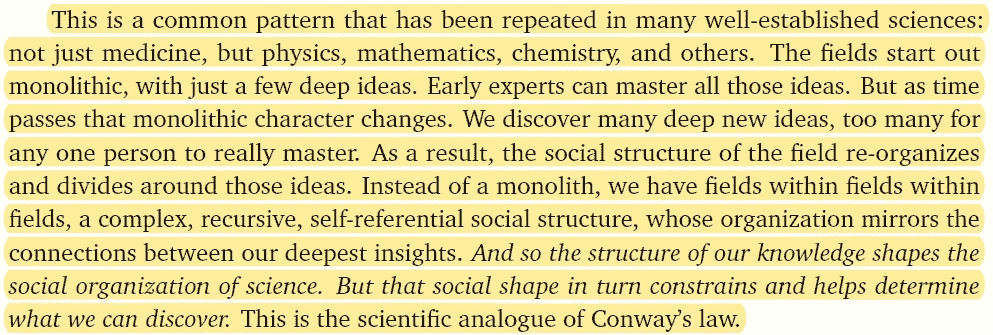
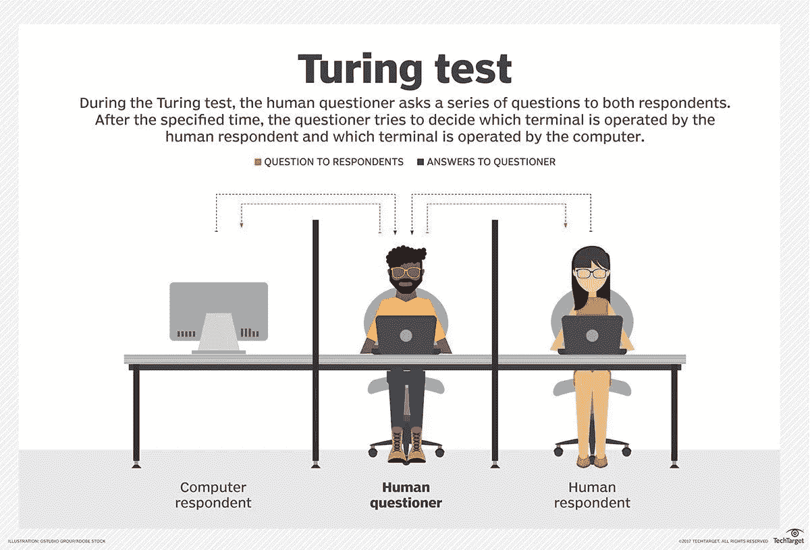
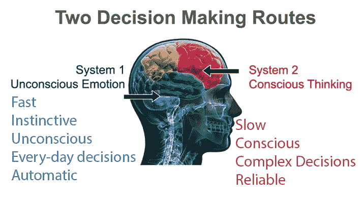
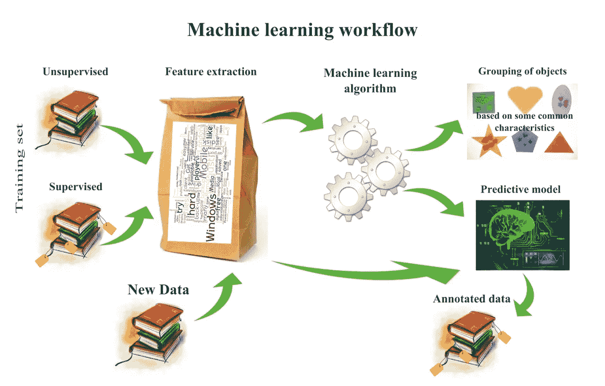

# 机器学习:何去何从？

> 原文：<https://medium.com/analytics-vidhya/machine-learning-which-way-to-go-e3cee6987254?source=collection_archive---------19----------------------->

当另一个十年即将结束时，见证机器学习(ML)领域，尤其是深度学习(DL)在过去几年中的发展是非常有趣的。此外，在阅读[神经网络和深度学习](http://neuralnetworksanddeeplearning.com/)时，其中一个观察引起了我的注意:

虽然我们中的许多人没有目睹数学、医学等许多领域的结构，但我们很幸运地目睹了 ML 以及更广泛的人工智能(AI)中的类似现象。虽然仍然有可能掌握 ML 的几个领域，但许多领域正在转向专业化，如强化学习和卷积神经网络。除此之外，目前有两个主要趋势，任何对该领域有热情的人都可以采纳。

# **历史概述**

自从 A.M. Turing 在 1950 年写的第一篇关于[计算机器和智能](https://phil415.pbworks.com/f/TuringComputing.pdf)的文章以来，ML 越来越受到关注。在那个时候，很多任务似乎是机器不可能完成的。随着计算机的进步，允许存储更多的数据和更快地处理，发生了一些突破，导致了今天的伟大状态。如今，ML 已经在许多任务中显示出它的潜力，如分类、语音识别、自然语言处理、电影推荐和其他有时比人类实现更好的性能的任务。

# ML Buzz

尽管取得了这些成就，这个领域似乎被高估了，尤其是被外部观察者高估了。通过深入当前的工作和挑战，在该领域达到成熟阶段之前，还有很长的路要走。从应用研究的角度来看，很容易看到 ML 以高效和有效的方式支持人类的案例。在其他一些风险很高的情况下，如药物，医生仍然很不情愿，也有很大的改进空间。从基础研究的角度来看，仍然有许多与参数调整试探法相关的问题，以及与智力相关的更神秘的问题。

# 模仿人脑

这可能是 ML 最令人兴奋的地方。现在 DL 领域有很多关于[从系统 1 转移到系统 2](https://www.youtube.com/watch?v=FtUbMG3rlFs) 的讨论。大脑的第一系统速度快且情绪化，而大脑的第二系统速度较慢且逻辑性强。例如，在分类任务中，机器的学习方式类似于我们大脑的系统 1。ML 的所有突破都是从人脑的系统 1 中得到启发的。尽管如此，如果系统 2 也以特定的方式被结合，许多面临的问题可以被解决。鉴于缺乏关于智力和意识等许多概念的信息，这项任务似乎非常复杂，但值得一试，并可能导致研究道路上的新发现。

# 人类水平的表现

在人类中，学生超过教授是很常见的。这主要是因为我们有能力超越我们所学或研究的东西进行概括。我们的大脑，以其独特的结构，让我们能够创造和创新。当谈到机器时，目睹它们在某些情况下超越人类的能力真的令人兴奋，例如图像分类。在日本，[东大机器人的](https://www.youtube.com/watch?v=BXcFEhl7ynM)表现好于东京大学入学考试中 80%的学生。这既令人着迷，因为机器能够超越人类水平的表现，这在许多日常任务中非常有用，也令人失望，因为在某些情况下，人类开始减少对事情“为什么”的关注，这凸显了我们全球教育系统的许多缺陷。

# 前瞻性方法

作为一个对这个领域充满热情的人，通过与许多其他人的一些见解交流，我想两个有前景的方法可能是重点。第一个是应用研究。凭借目前的成就，世界范围内的许多问题都可以使用机器学习来解决。有了可用的模型和适当的改进，许多项目可以有效地解决，特别是那些有助于整体利益而不是个人利润的项目。第二个是基础研究，这是一个新的神秘篇章，ML 与认知心理学和其他领域相互作用，以建立更强大的可以“思考”的模型。虽然第一种方式相对容易，但第二种方式风险更大。

# ML 领先

事实上，在许多只涉及我们大脑中一个类似系统的任务中，人工智能已经部分领先于人类。我们对模型的参数和结构调整得越多，我们就越能增加这些机器的能力。到目前为止，机器仍然是无法超越教授的学生，原因有很多，特别是缺少分布集外的概括能力，这与我们将类比系统 2 纳入其中的能力正相关。虽然这个任务似乎不可能实现，但我们可能会在未来几年目睹一些惊人的突破。虽然我们为机器提供了进化的工具，但我们应该继续思考有效解决政策、道德和社会影响话题的方法。

有了这些成就，这条道路看起来比以前更加令人兴奋和迷人。虽然目的地还不明确，还很遥远，但我们需要继续尽最大努力，尽情享受，并期待未来为我们准备的迷人发现。

你对这个话题有什么见解？我很期待听到他们:)。