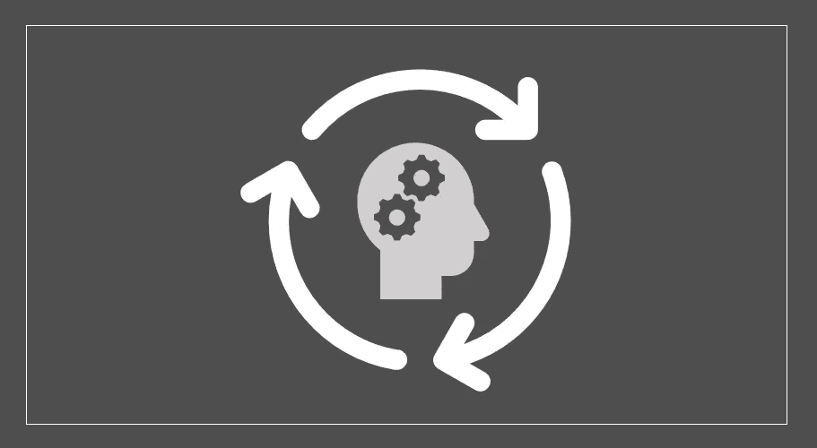
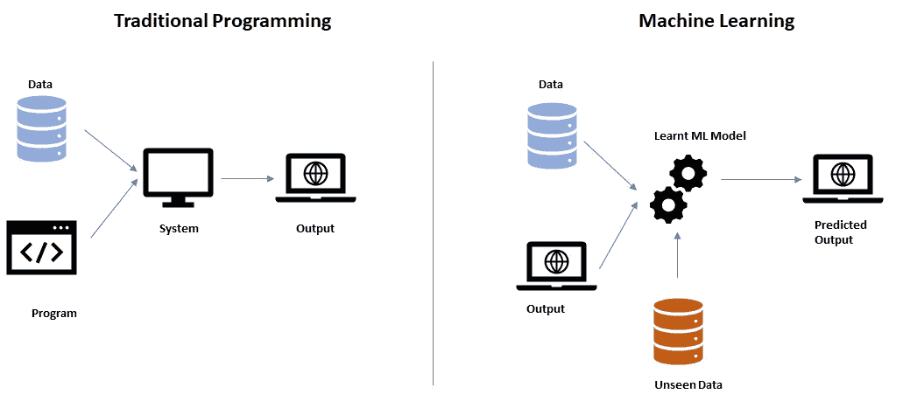
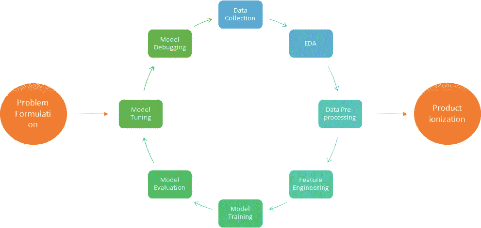
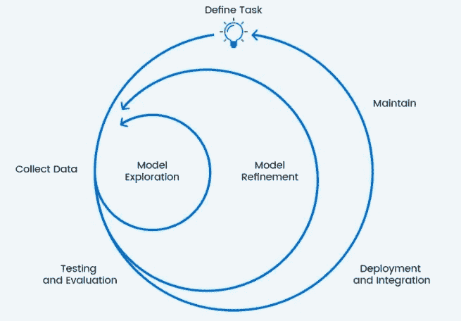
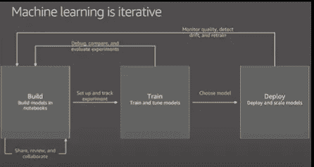

# 机器学习——为什么它是一个迭代过程？

> 原文：<https://medium.com/analytics-vidhya/machine-learning-why-it-is-an-iterative-process-bf709e3b69f2?source=collection_archive---------14----------------------->

多次提到机器学习的实现要经历一个迭代的周期。整个 ML 循环的每一步都被反复访问。

问题是——是什么让 ML 循环迭代？为什么有必要重复执行相同的步骤？

答案在于机器学习试图解决的问题的性质。让我们进一步理解这一点。

机器学习作为一个领域，在这个时间点上没有边界。这是一个不断发展的技术领域。随着新算法的开发，在现实世界中会发现新的解决机会，反之亦然。

机器学习作为一种解决方案，主要用于传统编程不再有可行解决方案的领域。为了前任。

*   太复杂的问题，无法编码，例如人脸识别、文本提取和理解各种不同语言的文档
*   大量的可用数据，如股市预测，政府机构正试图根据人口普查数据获得关于人口的有意义的见解
*   信息可用性的动态特性，如网飞、亚马逊等网站上的产品或电影推荐，这高度依赖于您的上一次交易或您正在执行的当前交易。

根据机器学习的本质，它适用于所有试图学习的应用程序/系统，并且不需要您显式编码来解决问题。但是，认为根本不需要编码是不对的。

> 机器学习领域允许你以某种方式编码，以便应用程序或系统**可以学习**来自己解决问题。

传统编程与机器学习

学习是一个反复的过程。即使当一个婴儿试图学习走路时，他也必须经历同样的过程:行走、跌倒、站立、行走、平衡等等..一次又一次直到它达到一定程度的自信可以独立行走和奔跑。

相同的基本概念也适用于机器学习，其中它重复地经历机器学习循环，直到达到期望的置信度。

机器学习迭代过程

经历这个循环是必要的，以确保机器学习模型从给定数据中捕获模式、特征和相互依赖性。

> *机器学习解决方案的好坏取决于驱动它的数据。*

你永远不能保证有一个完美的模型(阅读:一般化的模型，永远没有完美的模型)，直到它经历了大量的迭代，从数据中学习各种场景。

事实上，通过这个迭代过程，你正在试图获得最好的模型，它能够在看不见的数据上表现得同样好。术语“最佳”是通过基于手头问题的各种指标来衡量的，例如。在以连续变量作为输出的预测问题中，可以用 RMSE(均方根误差)或 R (R 平方)来度量。而对于分类问题，混淆矩阵更适合于度量模型性能。

机器学习周期(设计>开发>部署>优化)

# 摘要

为了实现期望的 ML 模型性能，拥有高质量的数据是一个至关重要的要求。然而，对于大多数现实世界的问题，主要有 3 个原因对任何 ML 模型的实施提出了挑战。

*   **实施|集成|数据质量**

因此，有必要重复下面提到的 ML 流水线步骤。

*   **建造**

1.  收集和准备培训数据—包括数据收集或数据工程，然后是 EDA —探索性数据分析
2.  数据预处理和特征工程
3.  选择算法

*   **列车**

1.  模特培训
2.  [超参数优化](/@niwratti2019/why-hyper-parameter-tuning-is-important-for-your-model-1ff4c8f145d3?source=friends_link&sk=7749444cf70c3cabd3bb477916e8b161)
3.  管理培训要求
4.  模型评估、调整和调试

*   **部署**

1.  在生产中部署模型
2.  满足可扩展性需求
3.  监控质量，检测偏差，必要时重新培训。

