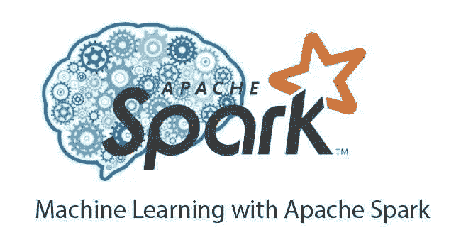

# 使用 Apache Spark 进行机器学习

> 原文：<https://medium.com/analytics-vidhya/machine-learning-with-apache-spark-1e2c0724f0a5?source=collection_archive---------12----------------------->


大数据现在是我们生活的一部分，大多数收集数据的公司都必须处理大数据，以便从中获得有意义的见解。虽然我们知道当我们有一个大数据集时，复杂的神经网络工作得非常漂亮和准确，但有时它们并不是最理想的。然而，在预测的复杂性很高的情况下，预测确实需要快速和有效。因此，我们需要一个可扩展的机器学习解决方案。

Apache spark 自带 SparkML。SparkML 具有强大的内置机器学习算法，这些算法针对并行处理进行了优化，因此在大数据上非常省时。在本文中，我们将以 SparkML 管道为例，对大数据进行清理、处理和生成预测。



我们将采用 JFK 机场的天气数据，并尝试 SparkML 中的几个内置分类器。数据集包含风速、湿度、站压等栏目。我们将尝试根据其他输入对风向进行分类。

让我们用 Spark 清理数据集。请注意，我会为这段代码留下一个到我的 GitHub repo 的链接，这样你就不必从这里复制它了。然而，我将在本文中解释代码

```
from pyspark import SparkContext, SparkConf
from pyspark.sql import SparkSession
from pyspark.ml.feature import OneHotEncoder, StringIndexer, VectorAssembler, Normalizer, MinMaxScaler
from pyspark.ml.linalg import Vectors
from pyspark.ml import Pipeline
import random
from pyspark.sql.functions import translate, col# spark context
sc = SparkContext.getOrCreate(SparkConf().setMaster("local[*]"))spark = SparkSession \
    .builder \
    .getOrCreate()# create a dataframe out of it by using the first row as field names # and trying to infer a schema based on contents
df = spark.read.option("header", "true").option("inferSchema","true").csv('noaa-weather-data-jfk-airport/jfk_weather.csv')# register a corresponding query table. we do this to save the data #in memory and run our operations on it. 
df.createOrReplaceTempView('df')# cleaning the data as it contains trailing charcters. Double is a #data type like float
# columns with no trailing charecters were straight converrted to double type, rest were first cleaned
df_cleaned = df \
    .withColumn("HOURLYWindSpeed", df.HOURLYWindSpeed.cast('double')) \
    .withColumn("HOURLYWindDirection", df.HOURLYWindDirection.cast('double')) \
    .withColumn("HOURLYStationPressure", translate(col("HOURLYStationPressure"), "s,", "")) \
    .withColumn("HOURLYPrecip", translate(col("HOURLYPrecip"), "s,", "")) \
    .withColumn("HOURLYRelativeHumidity", translate(col("HOURLYRelativeHumidity"), "*", "")) \
    .withColumn("HOURLYDRYBULBTEMPC", translate(col("HOURLYDRYBULBTEMPC"), "*", "")) \# the cleaned columsn were now changed to double types
df_cleaned =   df_cleaned \
                    .withColumn("HOURLYStationPressure", df_cleaned.HOURLYStationPressure.cast('double')) \
                    .withColumn("HOURLYPrecip", df_cleaned.HOURLYPrecip.cast('double')) \
                    .withColumn("HOURLYRelativeHumidity", df_cleaned.HOURLYRelativeHumidity.cast('double')) \
                    .withColumn("HOURLYDRYBULBTEMPC", df_cleaned.HOURLYDRYBULBTEMPC.cast('double')) \# Filtering for clean data set with no nulls and wind speed not 0
df_filtered = df_cleaned.filter("""
    HOURLYWindSpeed <> 0
    and HOURLYWindSpeed IS NOT NULL
    and HOURLYWindDirection IS NOT NULL
    and HOURLYStationPressure IS NOT NULL
    and HOURLYPressureTendency IS NOT NULL
    and HOURLYPrecip IS NOT NULL
    and HOURLYRelativeHumidity IS NOT NULL
    and HOURLYDRYBULBTEMPC IS NOT NULL
""")# saving the cleaned data set into CSV
df_filtered.write.csv('clean_df.csv')
```

上面的代码是我的预处理脚本，它将为我提供一个干净的数据框架来工作，并尝试不同的机器学习方法。在查看原始数据后，我得出了以下需要在预处理中解决的观察结果:

1.  数据类型是字符串，需要转换成算法可读的形式
2.  某些列有尾随字符，如“s”和“*”
3.  我们在目标列中有大量的空值和不可用的值，比如 0

代码的第一部分处理所需的尾部字符，并将其他列转换为类似浮点值的“double”类型。代码的第二部分将干净的列转换为 double 类型。代码的第三部分从预测值中过滤出所有空值，从目标变量中过滤出 0 值。最后，我们将文件作为干净的 df 保存到 CSV 中，我们将使用它进行机器学习操作。

我已经在我的主代码中尝试了几个分类器，以检查哪一个效果最好，然而，在本文中，我将只举一个逻辑回归的例子。再次没有必要从这里复制代码，因为我会提供我的 GitHub 回购链接。

```
from pyspark import SparkContext, SparkConf
from pyspark.sql import SparkSession
from pyspark.ml.feature import OneHotEncoder, StringIndexer, VectorAssembler, Normalizer, MinMaxScaler
from pyspark.ml.classification import LogisticRegression
from pyspark.ml.evaluation import MulticlassClassificationEvaluator
from pyspark.ml.feature import Bucketizer
from pyspark.ml.stat import Correlation
from pyspark.ml.linalg import Vectors
from pyspark.ml import Pipeline
import random# read our clean csv
df_filtered = spark.read.csv('clean_df.csv')# vector assembler
vectorAssembler = VectorAssembler(inputCols=["HOURLYWindSpeed","","HOURLYStationPressure"],
                                  outputCol="features")
df_pipeline = vectorAssembler.transform(df_filtered)# checking correlations
Correlation.corr(df_pipeline,"features").head()[0].toArray()# train test split 
splits = df_filtered.randomSplit([0.8, 0.2])
df_train = splits[0]
df_test = splits[1]# discretize the value using the Bucketizer, where we split the #column in buckets from above 0, 180 and then infinity
bucketizer = Bucketizer(splits=[ 0, 180, float('Inf') ],inputCol="HOURLYWindDirection", outputCol="HOURLYWindDirectionBucketized")# after the bucketizer we do one hot enncoding 
encoder = OneHotEncoder(inputCol="HOURLYWindDirectionBucketized", outputCol="HOURLYWindDirectionOHE")# funtion for ccuracy calculation
def classification_metrics(prediction):
    mcEval = MulticlassClassificationEvaluator().setMetricName("accuracy") .setPredictionCol("prediction").setLabelCol("HOURLYWindDirectionBucketized")
    accuracy = mcEval.evaluate(prediction)
    print("Accuracy on test data = %g" % accuracy)# logistic regression
# defining the model
lr = LogisticRegression(labelCol="HOURLYWindDirectionBucketized", maxIter=10)# new vector assembler
vectorAssembler = VectorAssembler(inputCols=["HOURLYWindSpeed","HOURLYDRYBULBTEMPC"],
                                  outputCol="features")# bew piplineline for lr
pipeline = Pipeline(stages=[bucketizer,vectorAssembler,normalizer,lr])# predictions
model = pipeline.fit(df_train)
prediction = model.transform(df_test)
classification_metrics(prediction)
```

上面的代码使用了 SparkMl 的一些常用功能，这是一个从事 spark 工作的数据科学家应该知道的。这些是:

1.  **向量组合器**:主要用于将所有特征连接成一个向量，该向量可以进一步传递给估计器或 ML 算法
2.  **相关性** : spark 为更好的特征工程提供了一个方便的工具来检查相关性
3.  **Bucketizer:** Bucketing 是一种将连续变量转换为分类变量的方法。我们在拆分中提供了一系列存储桶，这使我们能够进行分类并使用分类算法
4.  **OneHotEncoder**:One hotencoder 是一个过程，通过这个过程，分类变量被转换成一种可以提供给 ML 算法的形式，以便在预测中做得更好。
5.  **管道:**Spark 中的管道功能允许您定义一组特定的流程以及它们的执行顺序。管道也可以被保存并在以后使用，这使得它成为可伸缩性和可移植性的一个很好的工具。

在我的代码库中，我使用了其他几个模型，比如随机森林，梯度增强树。我还在同一数据集上预测风速时尝试了一个回归问题。如果您有疑问，请随时联系我们。

谢谢！

链接到我的 GitHub repo:

[https://github.com/manikmal/spark_ml](https://github.com/manikmal/spark_ml)