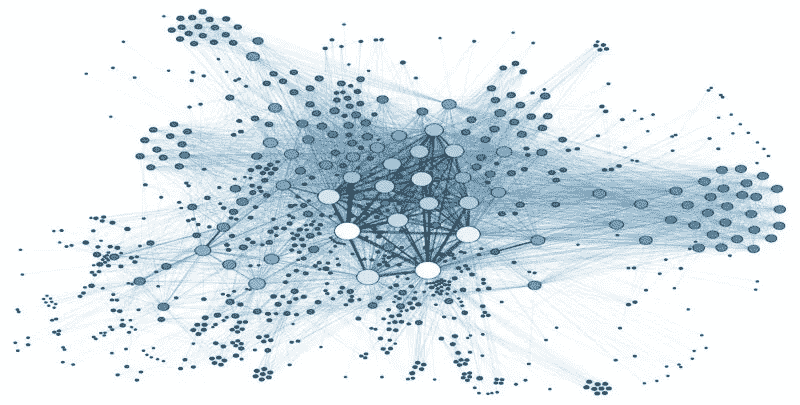

# 图的机器学习:课堂讲稿，第 1/4 部分

> 原文：<https://medium.com/analytics-vidhya/machine-learning-with-graphs-lecture-notes-part-1-4-9db47b4449fc?source=collection_archive---------19----------------------->

## 斯坦福课程机器学习用图表概括

最近看完了[斯坦福课程 CS224W 机器学习带图](http://web.stanford.edu/class/cs224w/)。在接下来的一系列博客文章中，我分享了我在听课时做的笔记。我希望它能让你对 ML 如何应用于图形有一个大概的了解。