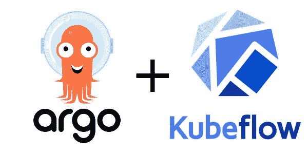

# 使用 Kubernetes 进行机器学习

> 原文：<https://medium.com/analytics-vidhya/machine-learning-with-kubernetes-50dd258a2d5d?source=collection_archive---------4----------------------->


随着信息不对称的减少，复杂的模型和算法变得更容易实现和使用，机器学习正在不断发展。像 scikit-learn 这样的 Python 库只需要几行代码(不包括 pre-proc)就可以使用 Random Forrest 这样复杂的高级集成学习技术进行拟合和预测。那么问题是什么给了你优势？

网上有许多指南和资源可以用来编写这几行代码并准确预测。挑战归结为如何有效和动态地使用 ML。在真实的用例中，我们知道我们不会仅仅使用一个模型来解决一个问题。我们使用数百种组合和优化程序来获得可能的最佳结果。

因此，出现了洗钱活动。其目的是促进复杂的机器学习管道和过程。MLOps 是一个非常新的领域，每天都在制定规则和流程。我将在下面添加一些文章的链接，您可以在那里了解更多关于 MLOps 的信息。在本文中，我将举一个机器学习工作流的小例子，展示我们如何在 Kubernetes 集群上高效地部署它。我将使用以下内容:

*   Kubernetes 集群(minikube 也可以工作)
*   南船星座
*   AWS S3
*   码头工人

**请注意，这些安装和设置是本文的先决条件** **。**

如前所述，一个复杂的机器学习工作流程有几个阶段。为了节省时间，我们将在一个单独的容器中运行所有这些流程。对于这个小示例，我们将在第一个容器中进行数据预处理，然后在第二个和第三个容器中训练两个不同的模型。

# 1.Python 代码

这将分为 3 个脚本，第一个脚本将是数据处理，第二和第三个脚本将是模型训练。

**注意:**数据需要被托管在某个地方，这样容器才能访问它

文件 1:预处理脚本

```
import pandas as pd
from sklearn.model_selection import train_test_split#any data i have hosted this 
df = pd.read_csv('http://localhost:8000/data/sales.csv')#for this small example, I will just remove a column as data preproc
df.drop('size', inplace=True)x = df.drop('sales', axis=1)
y = df['sales']x_train, x_test, y_train, y_test = train_test_split(df, test_size=0.3)df.to_csv('x_train.csv')
df.to_csv('x_test.csv')
df.to_csv('y_train.csv')
df.to_csv('y_test.csv')
```

文件 2:随机福里斯特回归

```
import pandas as pd
from sklearn.ensemble import RandomForestRegressor
from sklearn.metrics import mean_squared_error# reading the preproc data
x_train = pd.read_csv('x_train.csv')
x_test = pd.read_csv('x_test.csv')  
y_train = pd.read_csv('y_train.csv') 
y_test = pd.read_csv('y_test.csv')# Instantiate model with 1000 decision trees
rf = RandomForestRegressor(n_estimators = 1000, random_state = 42)# Train the model on training data
rf.fit(x_train, y_train)# Use the forest's predict method on the test data
predictions = rf.predict(x_test)# Calculate the MSE
mse = mean_squared_error(y_test, predictions)# Print out the mean absolute error (mse)
print('Mean Absolute Error:', mse)
```

文件 3:套索回归

```
from sklearn.linear_model import LassoCV
import pandas as pd# reading the preproc data
x_train = pd.read_csv('x_train.csv')
x_test = pd.read_csv('x_test.csv')  
y_train = pd.read_csv('y_train.csv') 
y_test = pd.read_csv('y_test.csv')# initialising and fitting the model
model = LassoCV()
model.fit(x_train, y_train)# Use the forest's predict method on the test data
predictions = model.predict(x_test)# Calculate MSE
mse = mean_squared_error(y_test, predictions)# Print out the mean absolute error (mse)
print('Mean Absolute Error:', mse)
```

# 2.创建图像

一旦我们准备好代码，我们就可以创建图像并将其推送到 docker hub(或任何其他图像存储库)。一个简单的 docker 文件就可以了

```
FROM python3.6RUN mkdir codesCOPY . codes/RUN pip3 install -r codes/requirements.txt
```

创建和推送图像

```
docker image build -t ml_pipeline .
docker image push ml_pipline
```

# 3.使用 Argo 定义 ml 管道

您可以使用下面的链接找到在 Kubernetes 集群上安装和设置 Argo 的快速设置指南:

 [## 安装 Argo 工作流 Kubernetes 的工作流引擎

### 编辑描述

argoproj.github.io](https://argoproj.github.io/argo/installation/) 

此外，确保建立一个工件存储库。我使用 AWS S3，但还有许多其他选项可用:

 [## 配置工件库——Argo 工作流 Kubernetes 的工作流引擎

### 要运行使用工件的 Argo 工作流，您必须配置和使用工件存储库。阿尔戈支持任何 S3…

argoproj.github.io](https://argoproj.github.io/argo/configure-artifact-repository/) 

**阿尔戈**



Argo 为我们提供了一个强大的工作流引擎，使我们能够实现工作流中的每个步骤，就像 Kubernetes 上的容器一样。Argo 使用 YML 文件来定义和编写管道。然而，有一个更受欢迎的替代阿尔戈被称为 Kubeflow。Kubeflow 使用 Argo 的引擎，并提供 python API 来定义管道。我将在这篇文章中使用 Argo，但在将来也会做一个关于 Kubeflow 的简短教程。

让我们开始构建我们的管道，我将把它命名为 pipline.yml

```
# Our pipeline
# We will make a DAG. That will allow us to do pre proc first 
# and then train models in parallel.
apiVersion: argoproj.io/v1alpha1
kind: Workflow
metadata:
  generateName: ml-pipeline-
spec:
  entrypoint: ml-pipeline
  templates:

  # definning the pipeline flow
  - name: ml-pipeline
    dag:
        tasks:
          - name: preprocessing
            template: preproc
          - name: training-rf
            dependencies: [preprocessing]
            template: randomforrest
            arguments:
              artifacts:
              - name: x_train
                from: tasks.preprocessing.outputs.artifacts.x_train
              - name: x_test
                from: tasks.preprocessing.outputs.artifacts.x_test
              - name: y_train
                from: tasks.preprocessing.outputs.artifacts.y_train
              - name: y_test
                from: tasks.preprocessing.outputs.artifacts.y_test                                                

          - name: training-lasso
            dependencies: [preprocessing]
            template: lasso
            arguments:
              artifacts:
              - name: x_train
                from: tasks.preprocessing.outputs.artifacts.x_train
              - name: x_test
                from: tasks.preprocessing.outputs.artifacts.x_test
              - name: y_train
                from: tasks.preprocessing.outputs.artifacts.y_train
              - name: y_test
                from: tasks.preprocessing.outputs.artifacts.y_test# defining the individual steps of our pipeline
    - name: preproc
      container: 
        image: docker.io/manikmal/ml_pipline
        command: [sh, -c]
        args: ["python3 codes/preproc.py"]
      outputs:
        artifacts:
        - name: x_train
          path: x_train.csv
        - name: x_test
          path: x_test.csv
        - name: y_train
          path: y_train.csv
        - name: y_test
          path: y_test.csv- name: randomforrest
      inputs: 
        artifacts:
        - name: x_train
          path: x_train.csv
        - name: x_test
          path: x_test.csv
        - name: y_train
          path: y_train.csv
        - name: y_test
          path: y_test.csv
      container:
        image: docker.io/manikmal/ml_pipline
        command: [sh, -c]
        args: ["python3 codes/rf.py"]- name: lasso
      inputs: 
        artifacts:
        - name: x_train
          path: x_train.csv
        - name: x_test
          path: x_test.csv
        - name: y_train
          path: y_train.csv
        - name: y_test
          path: y_test.csv
      container:
        image: docker.io/manikmal/ml_pipline
        command: [sh, -c]
        args: ["python3 codes/lasso.py"]
```

那是一个大文件！这就是为什么数据科学家更喜欢使用 Kubeflow 在 Kubernetes 上定义和运行 ML-pipeline 的原因之一。我会留下我的代码回购链接，所以不要担心从这里复制它。简而言之，上面的 YML 文件声明了我们的工作流，它定义了所需任务的顺序，然后分别定义了每个任务。

# 4.在 Kubernetes 集群上部署我们的 ML 管道

Argo 附带了一个方便的 CLI，用于提交我们的工作流并轻松获得结果。在主节点上，使用提交工作流

```
argo submit pipeline.yml --watch
```

监视功能将显示管道的运行情况。一旦完成，我们就可以使用

```
argo logs <name of the workflow>
```

你会得到你的结果！

我们看到的是，我们能够成功地部署机器学习工作流，并通过并行进行不同模型的训练过程，带来大量的时间和资源效率。这些管道是执行许多复杂工作流的电缆，这是一个非常基本的功能示例。因此，越来越多的人需要 MLOps 来给你带来优势。

如前所述，探索 MlOps 的链接:

 [## ml-ops.org

### 作为一个新兴领域，MLOps 正在数据科学家、ML 工程师和人工智能爱好者中迅速获得动力…

ml-ops.org](https://ml-ops.org/) [](https://towardsdatascience.com/ml-ops-machine-learning-as-an-engineering-discipline-b86ca4874a3f) [## ML Ops:作为工程学科的机器学习

### 随着 ML 从研究走向应用商业解决方案的成熟，我们是否需要提高其运营的成熟度…

towardsdatascience.com](https://towardsdatascience.com/ml-ops-machine-learning-as-an-engineering-discipline-b86ca4874a3f) 

该项目的 Git hub repo:

[](https://github.com/mnk-bot/mlpipeline_argo) [## mnk-bot/mlpipeline_argo

### 此时您不能执行该操作。您已使用另一个标签页或窗口登录。您已在另一个选项卡中注销，或者…

github.com](https://github.com/mnk-bot/mlpipeline_argo) 

谢谢！