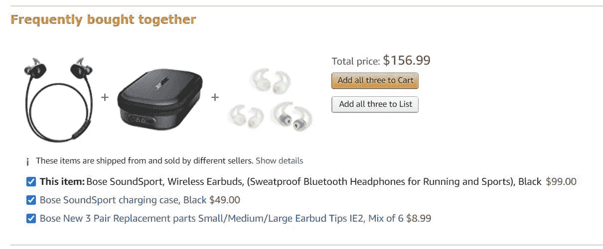
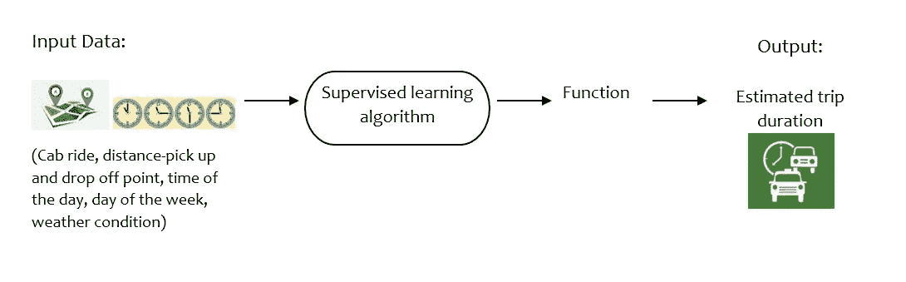
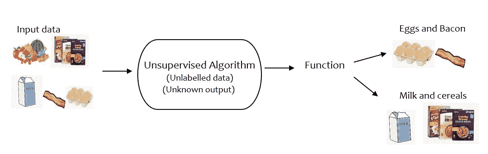

# 具有真实世界例子的机器学习

> 原文：<https://medium.com/analytics-vidhya/machine-learning-with-real-world-examples-3e79877d08b3?source=collection_archive---------16----------------------->

图片:[www.aquatechtrade.com](https://www.aquatechtrade.com/)

人工智能(AI)或其子集机器学习(ML)是科技界发展最快的领域之一。根据许多调查，人工智能和机器学习是 2020 年的顶级技术趋势。随着这些领域的高需求，越来越多的人正在推进他们在数据科学领域的职业生涯，并且在线提供了大量的课程和训练营，任何人都可以轻松掌握成为数据科学专业人员所需的技能。

人工智能是计算机科学的一个分支，机器被设计或训练来执行需要智能的活动。另一方面，机器学习可以称为人工智能的一个子集。

正如 Aurelien Geron 在 Hands-on-ML 一书中所定义的，

> "机器学习是给计算机编程的科学(和艺术)，这样它们就可以从数据中学习."

通俗地说，我们使用统计学(传统数学)来建立模型，当输入一段时间内收集的数据时，这些模型可以帮助我们预测结果。

我们大部分时间在日常活动中使用机器学习，甚至没有意识到这一点。用一个现实生活中的例子来解释，当你在亚马逊或任何其他网站上购物时，你可能会遇到关于类似产品的建议或购买所购产品的建议。你也会明白网飞是如何向你推荐你可能喜欢的电影的。机器学习让我们所有人的生活变得更加轻松，节省了我们很多时间。

一起买的产品的亚马逊推荐。(图片由作者提供)

数据以信息、图像、音频等形式在所有领域中快速增长。因此，通过机器学习，预测一些有用的东西或从提供的数据中学习模式是可能的。你用数据训练机器学习模型越多，它的预测就越准确。机器学习之所以广受欢迎，是因为它有可能产生有价值的见解。企业依赖它们，因为它通过突出主要影响领域来引导它们，并且对公司有益。

**机器学习有很多种类型，但在这里我想解释一下其中的两种主要类型。**

**1。监督学习**:在监督学习中，模型根据过去的输入及其相应的标记输出数据进行训练。学习算法创建一个函数，当输入数据时，该函数预测可能的输出。我们用数据训练模型越多，预测的结果就越准确。假设一家出租车服务公司想要计算乘坐的行程持续时间。它将使用数据(覆盖的距离、花费的时间、一天中的时间、天气条件等)训练模型。)的过往骑行。在用过去的乘坐细节来监督机器学习模型时，它可以准确地预测即将到来的乘坐细节。

监督学习(图片由作者提供)

**2。无监督学习**:在无监督学习中，没有关于数据的先验信息。由于数据没有被标记，机器应该学会根据它在数据中找到的相似性和模式对数据进行分类。这有助于我们获得数据中存在的特征之间的有趣关系。无监督机器学习的一个例子是超市想要增加收入。它决定对其销售的产品数据实施机器学习算法。据观察，经常购买谷类食品的顾客倾向于购买牛奶，或者购买鸡蛋的顾客倾向于购买熏肉。因此，重新设计商店并并排放置相关产品可以帮助他们了解消费者的心态并增加收入。

无监督学习(作者图片)

***总结:***
我已经尽量用最简单的方式来解释机器学习的基础知识。我希望这能激励你更多地探索机器学习及其应用。

如果你有任何问题或建议，可以在评论区联系我。