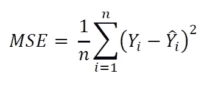

# 使用 Scikit-learn 进行机器学习

> 原文：<https://medium.com/analytics-vidhya/machine-learning-with-scikit-learn-e2da8fb47041?source=collection_archive---------9----------------------->

> 构建 ML 模型的初学者指南，重点是 Scikit-learn 库。

本博客概述了如何构建一个机器学习模型，并详细介绍了各个方面，如数据预处理、分割训练和测试数据、回归/分类以及最终的模型评估。

## 内容:

1)简介

2)预处理

3)训练和测试数据的拆分

4)分类/回归模型

5)模型评估

我们开始吧！

# 介绍

## 那么…什么是机器学习？

机器学习(ML)是人工智能的一个分支，基于系统可以从数据中学习、识别模式并做出决策的想法。ML 系统是经过训练的，而不是显式编程的。

## 为什么选择 Scikit-learn？

它为数据分析、数据预处理、模型构建、模型评估等提供了高效的工具。因此在这篇博客中，我们将借助 Scikit learn(sk-learn)实现各种 ML 模型，这是一个简单的开源机器学习库。它构建在 Numpy、Scipy 和 Matplotlib 库之上。

部署 ML 模型的一般方法

以下是构建模型时遵循的一般工作流程:

*   我们首先从数据预处理开始，这需要将数据转换成所需的格式。
*   然后是识别独立参数(X)和目标参数(y)。
*   一旦知道了这些参数，就应该将数据分为训练数据和测试数据。
*   若要训练模型，请根据训练数据拟合/训练模型，然后根据测试数据测试构建的模型。
*   最后，为了评估我们的模型表现如何，我们有一个比较实际值和预测值的度量函数。

因此，首先让我们继续用 Sklearn 探索数据预处理/数据清理。

# 2)预处理

**a)standard scaler:**sk learn 提供了几个内置的机器学习模型，称为估计器，使用这些估计器，数据集的标准化是一个常见的要求。例如，如果所有单个特征或多或少看起来不像标准的正态分布数据，则模型可能不会按预期执行。为了克服这个问题，scikit-learn 提供了 StandardScaler。

**b)缩放到一个范围:** Sk-learn 提供了另一个选项，使用 MinMaxScaler 将一个特征缩小到一个特定的最小值和最大值。

**c)规格化器**

具有至少一个非零分量的每个样本独立于其他样本被重新缩放，使得其范数等于 1，即，将实值度量属性缩放到范围 0 和 1 中。

**d)编码分类数据**

很多时候数据不是连续的数字形式，这样的数据被称为分类的，例如，['好'，'坏']，['男性'，'女性']这样的特征可以被编码为数值，例如，[1，0]，[1，0]。

要将分类数据转换为数字数据，可以使用 one-hot 或 dumming，OneHotEncoder 将每个具有 n_categories 可能值的分类特征转换为 n_categories 二元特征，其中一个为 1，所有其他为 0。

# 3)训练和测试数据的拆分

一旦数据预处理完成，我们将继续为我们的模型分割训练和测试数据。使用 Sklearn，数据按照给定的大小随机分成训练集和测试集。

# 4)分类/回归模型

重要的部分来了！在分类和回归模型之间进行选择。

简单回答这个问题，你的数据是连续的数值型的吗？如果是，继续使用回归模型，否则，如果您的数据是分类类型，即垃圾邮件/非垃圾邮件，好/坏，则继续使用分类模型。

让我们来看几个模型。

**a)线性回归**

线性回归试图通过将线性方程拟合到观察到的数据来模拟两个变量之间的关系。它的基本任务是根据给定的自变量(x)预测因变量值(y)。因此，这种回归技术找出了 x(输入)和 y(输出)之间的线性关系。因此，线性回归这个名字。查看这个[博客](https://towardsdatascience.com/how-does-linear-regression-actually-work-3297021970dd)，更好地理解线性回归。

**b)逻辑回归**

逻辑回归通过估计概率来衡量分类因变量和一个或多个自变量之间的关系。要理解核心概念，请查看这个[博客](https://towardsdatascience.com/an-introduction-to-logistic-regression-8136ad65da2e)。

**c)支持向量机**

**支持向量机**是一套用于[分类](https://scikit-learn.org/stable/modules/svm.html#svm-classification)、[回归](https://scikit-learn.org/stable/modules/svm.html#svm-regression)的监督学习方法。使用该算法，我们将每个数据项绘制为 n 维空间中的一个点，每个特征的值是特定坐标的值。然后，我们通过找到区分这两类的超平面来执行分类。跟随这个[博客](https://towardsdatascience.com/https-medium-com-pupalerushikesh-svm-f4b42800e989)深入了解 SVM。

**d)决策树**

**决策树(DTs)** 是用于分类和回归的监督学习方法。目标是创建一个模型，通过学习从数据特征推断的简单决策规则来预测目标变量的值。为了更好地理解决策树，请关注这个[博客](https://towardsdatascience.com/decision-trees-in-machine-learning-641b9c4e8052)。

**e)随机森林**

随机森林是一种用于分类、[回归](https://en.wikipedia.org/wiki/Regression_analysis)和其他任务的[集成学习](https://en.wikipedia.org/wiki/Ensemble_learning)方法，通过在训练时构建大量[决策树](https://en.wikipedia.org/wiki/Decision_tree_learning)并输出类(分类)或单个树的均值预测(回归)的[模式](https://en.wikipedia.org/wiki/Mode_(statistics))的类来操作。关于随机森林的介绍可以在这个[博客](https://towardsdatascience.com/random-forest-3a55c3aca46d) **中找到。**

下面是一个示例代码，演示了各种分类和回归模型的用法。

## 5)模型评估

最后，一旦我们的 ML 模型准备就绪，我们需要评估模型的表现如何，为了完成这一点，我们有“度量函数”。该模块实现了为特定目的评估预测误差的函数。

Sklearn 为分类和回归提供了各种评估指标，下面讨论了最常用的指标。

## a)分类模型评估

**i)准确度得分:**准确度是最简单和最常用的度量之一。它可以定义为模型做出的正确预测数除以预测总数。

**ii)精度得分:**精度是分类器将数据点适当分类为阳性或阴性的能力。是 tp/(tp+fp)的比值，其中 tp 是真阳性的数量，fp 是假阳性的数量。

**iii)召回分数:**召回是分类器在数据集中找到所有肯定/相关样本的能力。准确的说是 tp/(tp+fn)的比值，其中 tp 是真阳性的数量，fn 是假阴性的数量。

**iv) F1 得分:**在召回率&精确度之间经常有一个折衷，因此为了有一个最佳的混合，我们使用 F1 得分来组合这两个指标。它可以被解释为精确度和召回率的平均值，其中 F1 分数在 1 处达到其最佳值，在 0 处达到其最差分数。

**v)分类报告:**构建包含主要分类指标的报告。

**vi)混淆矩阵:**这是一个经常用来评估分类模型性能的表格。

***下面是一个代码示例，演示分类模型*** 的各种评估方法的用法

## b)回归模型评估

**i)平均绝对误差(MAE):** MAE 测量一组预测中的平均幅度误差。它是预测值和实际值之间绝对差值的平均值。与 MAE 相关的一个缺点是它不惩罚大的错误。

**ii)均方误差(MSE):** MSE 克服了 MAE 的缺点，即误差大。可以看出，这里我们不是取绝对值，而是取预测值和实际值之差的平方。然而，MSE 的另一个问题是目标变量(Y)的单位也是平方。

**iii)均方根误差(RMSE):** 为了解决上述与 MSE 相关的问题，我们有了 RMSE，它基本上执行 MSE 的平方根功能。

**iv) R2 评分:** R(决定系数)回归评分函数。最好的分数可能是 1，在最坏的情况下也可能是负数。

***下面是一个代码示例，演示了回归模型*** 的各种评估方法的用法

***终于！*** ***这里是*** [***链接***](https://scikit-learn.org/stable/tutorial/machine_learning_map/index.html) ***为 scikit-learn 的小抄，供快速参考。***

## 结论

这只是 Scikit-learn 的初学者方法。这篇博客的目的是介绍 Sklearn 和构建 ML 模型的过程，一旦你知道如何构建一个简单的机器学习模型，继续探索 sklearn 提供的机器学习世界。