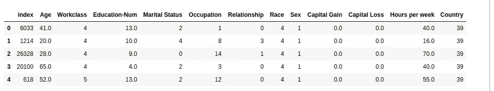

# 用 Python 实现机器学习模型的可解释性。

> 原文：<https://medium.com/analytics-vidhya/machine-mearning-model-interpretability-with-python-1ad8e6a464d1?source=collection_archive---------2----------------------->

## 全面的实践指南


## 简介:

机器学习改善任何业务的潜力不再是秘密。然而，我们建立的模型，大多数时候并没有解释为什么他们会对给定的样本做出某种预测，这对一些企业来说，是采用人工智能驱动战略的障碍。

在我之前的文章中，我们讨论了在生产环境中构建模型之前应该知道的 15 件事情。其中一个关键点强调了机器学习模型解释的重要性，以及它在一些业务中的重要性。

给定一个机器学习模型预测，**“为什么”**问题越来越成为需要回答的事情，为此，正在开发工具和软件包，将机器学习模型从黑盒变成白盒。

在这篇文章中，我们将教授如何使用一个叫做 [SHAP](https://github.com/slundberg/shap) 的工具来解释黑箱模型的预测。本教程中使用的数据是一个真实世界的数据集，即在 *UCI 回购*中可用的*成人数据集*，该数据是关于预测一个人的潜在收入是超过 5 万美元/年还是更少，所以让我们开始吧。

## 加载和检查数据:

首先，我们将加载我们将在本教程中使用的必要库和数据:

加载完数据后，让我们先看看它:



成人数据集功能

现在，我们的目标功能是什么:

```
target : {False: 24720, True: 7841}
```

所以我们的目标是二元的，有真值或假值，真值表示个人收入超过 5 万美元，假值表示低于 5 万美元。

我们的预测器(特征)怎么样？让我们检查它们的类型:

正如您所看到的，我们正在处理两种类型的特征:数字特征和分类特征。对于数字特征，它们都被设置好了。至于分类特征，我们首先要对它们进行预处理(编码)。

对于这个项目，我们将保持简单，只是标签编码，但是有其他方法来处理分类特征，如嵌入或目标编码。为了更清楚地了解这一点，你可以查看我的教程: [tensorflow 2 分类特征嵌入教程](/@errabia.oussama/tensorflow-2-tutorial-on-categorical-features-embedding-93dd81027ea9)

## 编码分类特征

所以让我们开始编码:

正如您所注意到的，我们已经为每个分类特性创建了一个 LabelEncoder，将它与该特性相匹配，然后将该特性转换为整数(对其进行编码)。我们还将编码器保存在字典中(保存它们是一个很好的做法)。

现在我们的数据已经准备好了，让我们继续训练我们的 LightGBM 模型。

首先，我们必须创建一个验证集，这样我们就可以评估我们训练好的模型的性能(我们不想花时间解释一个没有价值和糟糕分数的模型)。

我们使用 sklearn.model_selection 中的 train_test_split 函数将我们的数据分成一个训练集和一个值集。现在，我们可以移动以适应我们的模型。

我们首先定义 LightGBM 模型的参数:

现在适合:

## 评估:

让我们观察我们的混淆矩阵，看看我们的模型做得如何:


让我们来计算我们的验证分数:

正类(大于 50k $)的召回率和精确度:

> 建议:最好的做法总是手动计算分数，而不是总是依赖于某个函数，你从头开始做得越多，你就越能理解它们，理解你的度量标准是至关重要的。

**1 —召回**= TP/(TP+FN)= 1629/(1629+680)= 0.705(70%召回率)

**解释**:该模型能够预测 70%的人属于阳性类(> 50k$)

**2 —精度**= TP/(TP+FP)= 1629/(1629+566)= 0.74(74%精度)。

**解释:**该模型有 74%的准确性，这意味着每个预测的真阳性有 74%的概率是实际的真阳性。

对于一个不平衡的数据集来说，分数是相对较好的。在这种情况下，这两个类或多或少同等重要。另一方面，当在其他情况下，正类更重要时，需要做一些调整，以便有利于召回而不是精度，但这是另一篇文章的另一个教程，将在不久的将来发表。

# 模型诊断

## 了解 SHAP:

在我们开始解释我们的模型之前，让我们先解释一下我们将在研究中使用的工具:SHAP。

那么 SHAP 是如何运作的呢？让我解释一下(当然不要把事情复杂化):

首先，我们需要解释一个术语，即*基值，*那么它是什么呢？

基本值由 SHAP 公司内部使用，它只是训练集预测概率的平均值:

> base _ value = NP . mean(lgbm _ model . predict _ proba(train)[:，1])

既然我们知道了什么是基础价值，让我们深入研究一下 SHAP:

假设模型预测一个人拥有超过 5 万美元的概率为 0.6，SHAP 所做的是分解所有特征的(0.6- *基础值*)概率。同样，我们可以直观地看到哪些特征对该概率的贡献最大，并且请记住，在分解中，一些特征可能具有正值，而一些其他特征可能具有负值:

1-正值表示该特征增加了该实例向正类发展的概率(将该实例推向正类)。

2-负值表示该特征降低了该实例向负类发展的概率(将该实例推向负类)。

现在我们已经了解了 SHAP 是如何工作的，让我们开始了解是什么驱动我们的模型使用它对给定的数据点进行特定的预测。

## SHAP 全球模型解释:

首先，对于给定数量的样本，我们将通过可视化特征对 SHAP 给出的预测概率的影响来观察模型的整体解释:

> 备注:确保将 model_output 设置为“概率”,这样您将观察到的实际上是概率


那么你如何解读这个图表呢？让我解释一下:

> 首先请记住:
> 
> > > x 代表 shap 值，
> 
> > >这些点代表 10 个样品(每个样品都有一种颜色)

上图可以这样描述:

首先—功能从上到下排列，功能越高意味着影响越大。(根据我们使用的 10 个实例中 shap 值的绝对值的平均值对它们进行排序)

第二，我们拥有的特征集合对不同的样本产生不同的影响，有时它们通过增加概率做出贡献，而有时它们通过减少概率做出贡献。

第三，通过可视化更多的实例，我们可以对一些特征及其预测能力以及它们通常倾向于哪个类别有一个全局的感觉。类似地，我们可以仔细检查模型对这些特性的了解是否有意义。

## SHAP 本地模型解释:

让我们对模型做一个局部的解释，换句话说，在样本层面:

我们要做的是——

*   我们会随机抽取一个人，
*   检查它，它是真正的类，
*   检查由该模型预测的类别，
*   想象一下 SHAP 对那个例子的解释，
*   通过比较真实类、预测和 shap 所说的内容，得出结论。

让我们开始吧。

让我们以这个人为例:

```
Age                  32.0
Workclass             4.0
Education-Num        13.0
Marital Status        2.0
Occupation           13.0
Relationship          0.0
Race                  4.0
Sex                   1.0
Capital Gain      15024.0
Capital Loss          0.0
Hours per week       40.0
Country              39.0
Name: 2631, dtype: float64 
```

我们的模型预测此人年收入超过 50，000 美元，根据真实标签，这是一个正确的预测，因此让我们检查一下我们的特征是如何促成这一预测的:


如您所见，基值(模型起点)为 0.26，因此 shap 将对所有要素进行 1–0.263 = 0.737 的分解。此外，如您所见，资本收益是该概率的最大贡献者，其值为+0.49，这对于 15024 的高资本收益是有意义的。也 32 岁也说得通，也该受教育了——小水。

结论:在这种情况下，预测是正确的，给定特征值，一切都有意义，因此模型做得很好。

然而，根据我的经验，真正的洞察力来自于分析错误标记的实例。因此，让我们做一些真正的检查，看看一个假阴性样本(一个样本应该有类阳性，但模型预测类阴性)，看看是否有一些关于模型的解释。

我们将使用以下代码提取所有假阴性样本:

现在让我们检查这些 false_negative 实例的一个实例:

> 提醒:对于此人，模型预测了类别“ <usd but="" the="" actual="" class="" is="">USD 50K”</usd>


好的，非常有趣，让我们说出上面的输出:

模型已经预测了 0.36 的概率，0.263 来自于 base_value，至于其余的，来自于特性的贡献。

因此，如图所示，婚姻状况、年龄、关系和性别对预测有积极影响，这意味着他们正在将样本推向正确的方向，其概率大于 0.5。

相反，资本收益、受教育程度和职业则相反，它们会产生负值，从而降低概率。

现在我们能从这说些什么呢？

首先，考虑到资本收益，将实例设为负类是有意义的，因为该特性的值为 0，并且影响不大，所以我想这是可以的。

现在对于职业，最大的负贡献者，我们有一个值 7，通过使用我们的 LabelEncoder 我们得到“7 =机器-操作-检查:机器操作员检查员”。从我们的培训数据来看，我们的培训数据中有 1387 人从事该职业:其中 1209 人的收入低于 5 万美元，只有 178 人的收入超过 5 万美元。因此，当职业采用该值时，这种没有特征工程的基本模型做出这样的行为并做出负面贡献(推向负面类别)是有意义的，然而，这是在改进模型时要记住的重要见解。

如你所见，这就是模型诊断和解释如此重要的原因，这里列出一些显而易见的结论:

1 —它让你**信任**这个模型，因为现在你正在检查它的预测，并再次检查它们是否有意义(一个评估分数肯定是不够的)。和我们上面做的一样。

2-它让你**洞察**未来的改进，因为它帮助你诊断模型哪里出了问题。和我们上面做的一样。

3-它为您提供预测报告，这在一些业务中是必不可少的，当需要根据预测采取行动时(例如，如果模型显示客户将离开，您确实想让公司知道该客户决定背后的原因，而这项研究将帮助您做到这一点)。

因此，我们将停止本教程在这一点上，现在，更多的章节将在未来的主题。毫无疑问，SHAP 是一个很棒的工具，除了我们上面使用的功能之外，它还有更多的功能可以检查，比如依赖图，我们将在未来的学习课程中尝试覆盖它。

我希望你觉得这篇教程非常有见地和实用，我希望在读完所有这些文字后，你现在感觉自己是一个更好的数据科学家。

这是完整 Jupyter 笔记本的[代码，用于重现上述结果。](https://github.com/oussamaErra/machine-learning-interpretation/blob/master/know%20your%20model.ipynb)

下次告诉我，同时如果你有任何问题要问我，或者你对未来的教程有什么建议，我的联系方式在下面。

# 关于我

我是@ [智能电子商务公司](https://www.cleverecommerce.com/)的首席数据科学家，我们利用基于人工智能的强大技术，帮助企业创建和管理谷歌广告活动。

你可以通过链接的[或 Gmail:errabia.oussama@gmail.com 联系我。](https://www.linkedin.com/in/oussama-errabia-0b1a14b3/)