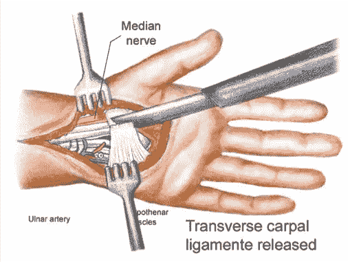

# 机器，抓住我的手:我的第一台诗歌生成器

> 原文：<https://medium.com/analytics-vidhya/machine-take-my-hand-5ab0aef44839?source=collection_archive---------25----------------------->



正如我在[上一篇文章](/python-in-plain-english/daunting-python-and-the-holy-poetry-generator-d9259913acb)中所描述的，我已经开始着手创建一个诗歌生成器。我头脑中的终极目标是崇高的，令人印象深刻的，在一片浓雾中依然模糊不清。然而，我创造了[一样东西](https://polar-earth-97611.herokuapp.com/)，在这篇文章中，我将描述我如何卷起袖子，弄脏我的手(我残疾的、腕骨有隧道的手)，并做出一些不完美的、相当简单的东西，朝着正确的方向迈出了一步。

## 收集一些文本！喜欢大量的文字

我决定从零开始，尽可能从 [PoetryDB](https://github.com/thundercomb/poetrydb) 获取一切，这是一个[项目，类似古腾堡](https://www.gutenberg.org/)的公共领域诗集，为“网络诗人”设计。它存在的原因是实际的:

> “互联网技术让文字变得无休止地被操纵，传统的诗人和作家正在被抛在后面。我想改变这种情况，让我们所有人都有一个更强大的未来。”

这是一个可以利用的好资源，也是一个完美的起点。站点[完全基于 API 调用；这里没有通航的道路，也没有 UX 可言。这是诗人和程序员的天堂。在弄清楚正确的 URL 语法之后，是时候创建一些函数并施展一些 API 魔法了。](http://poetrydb.org/index.html)

以下是我的操作顺序:

*   我收集了他们所有诗人的名单，
*   从中我收集了每位诗人的诗的标题列表，
*   我从中提取了每首诗的诗句。

把这些线连在一起，瞧！PoetryDB 上的 260 万个单词。你问 260 万？？嗯，算是吧。

隐藏在这一切之中的是我不得不在这个过程中做出的一些关键决定，这些决定让 260 万这个数字显得有些不精确。请允许我列举一些原因。

**当代化** 我们假设这是一个词。我对其他生成器的抱怨之一是对过去诗歌形式的模仿——即十四行诗和俳句。过去的事了，伙计！展望未来！


我的想法是:通过包含换行符(' \n ')和制表符(' \t ')，使我的生成器现代化。这比我想象的要复杂，因为 Python 将这些元素视为空白空间或其他东西。想象一下！啊，但是诗人看到了空虚中的实质。然而，如果你不小心，运行一个必要的功能将蒸发你所有的宝贵空间。

稍后会有更多的介绍…现在，我只知道我用换行符将所有的诗连接在一起…
然后所有的诗也用换行符连接在一起…
并将两个连续空格的所有实例转换成一个制表符…
给我留下一长串单词 *+* 总共 260 万个空格。嗯…基本上。

**标点还是不标点？** 这就是问题。考虑到当代诗歌的现状，我认为让所有的内容都小写并去掉大部分标点符号是一个相当稳妥的选择，但是你真的想解散已经筋疲力尽的团队吗？还是把*neer*变成 *neer* ？过去两周，我每天晚上都在问自己这些问题，你猜怎么着:我还是不知道。所以罗伯特·弗罗斯特该死！两条路我都走了。(而且最后肯定是两个不同的字数。)

**单词标记化 vs 分词** 这两个概念最终定义了我选择的每一条路径，也因此定义了我最终使用的两个版本的生成器，所以让我们来定义它们。

*单词标记化(即 nltk . Word _ token ize(str))*
简单来说，这是取一个单词串，返回该串中每个单词的列表，每个单词一般用空格或标点符号隔开。它可以变得更复杂，但是因为我已经去掉了所有不包含在单词中的标点符号，这就是我需要的所有符号化。

[NLTK](https://www.nltk.org/) 是金标准。我有一种感觉，在不久的将来，我会更深入地钻研文档。

令人惊讶的是，这可能是更复杂的术语，至少就代码如何工作而言。简单地说，这是将一串没有空格的单词分开的行为。这需要英语(或其他语言)的一些机器知识，然后使用它知道的单词的频率和它们出现的概率来将未分隔的文本分割成单词列表。

[单词忍者](https://github.com/keredson/wordninja)是我发现的最快和最直观的分词器，尽管还有其他的[选项](https://towardsdatascience.com/fast-word-segmentation-for-noisy-text-2c2c41f9e8da)。

基本上:

```
wordninja.split('thequickbrownfox')
```

变成了:

```
['the', 'quick', 'brown', 'fox']
```

标记化的问题是，它没有考虑可能被错误地挤在一起的单词，这在大型文本资源(如 Project Gutenberg 和 PoetryDB)中是必然会发生的。当运行我的生成器的第一个测试时，这些偶然的连接很快就显示出来了，它返回了 womp womps，如 *pluralsays* 和 okayyyys，如 *satanmeans* 。或者还有*恶臭 y-dight*……那到底是怎么进去的？

然后是 Word Ninja，它非常快速地完成一件非常复杂的事情(比我尝试过的所有其他分段器都快)，但仍然有过度分段单词的趋势。所以你最终可能会得到类似“con mig gs”的东西。不知何故“米格”和“gs”成了单词？

保存你的空瓶子！尽管有所不同，这些方法有一个(个人而言)令人沮丧的相似之处:它们跳过空白，有效地删除它们。我所有的宝贝都不见了！令牌化的一个变通方法相当简单:您可以用类似于“x2”和“y2”的东西来替换这些术语，然后在以后恢复它们。

但是对于单词忍者来说，‘x2’会变成‘x’和‘2’；似乎除了单词以外的任何东西都会被分割。尽管如此，你不能用任何旧词来替换它，因为它很有可能出现在文本中，所以你以后会过度还原它。幸运的是，考虑到源诗的年代久远，我可以用**‘飞机’**和**‘汽车’**来代替它们，这两个词没有出现在文本的任何地方，也没有被单词 Ninja 分割。万岁。

## **创建字典**

所以我们得到了我们的单词，2641563 个通过切分，2534938 个通过标记化。但是十万字算什么…

反正！从这个庞大的单词列表中，我们可以:

*   创建一个字典，其中每个唯一的单词都是一个键
*   每个键的值是一个列表，其中包含原始文本中该键后面的每个单词

然后是关键时刻，写一个函数把“飞机”和“汽车”还原到空白空间。

然后砰！一个 [21MB JSON 文件](https://files.cargocollective.com/c714448/poems_dictionary.json)。


在那里，您可以编写一个函数:

*   从字典中选择一个随机键
*   然后从下面的单词列表中随机选择一个单词
*   然后使用随机单词作为下一个密钥
*   继续下去，直到你达到你选择的字数。

## 当代诗歌押韵吗？

只要有时间！我的另一个目标是尝试 Allison Parrish 的[发音](https://github.com/aparrish/pronouncingpy)，它有一个押韵功能，可以列出输入单词的所有押韵。我创建了不同程度押韵的新功能，从用所选单词的押韵替换每行的结尾，用押韵替换整首诗中随机出现的单词，以及用押韵替换每个单词(如果有的话)。

咻！非常有趣！如果你一路过关斩将(即使你没有成功)，试试这里: [auto_pometizer](https://polar-earth-97611.herokuapp.com/) 。点击此处查看该项目的[回购](https://github.com/p-szymo/poetrydb_poem_generator)。

为了方便起见，下面是每个函数的一些简短示例:

segmented_auto_pometizer:

```
 encircle me 
 then take ismail and me i guess 	 
 for fooling swearing play 	 such things that it hail 
 with all things now feasts 
 returned
```

tokenized_auto_pometizer:

```
weaves rainbows to his footstep 
 love 's love is thy ruthless hand 
 a pyramid 
 whether through all besprent 
 above thine immortal town to pine 
 most
```

endline_rhyme_auto_pometizer:

```
ahem 
 we boldly to sayn 
 he leaped 
 that old wounds of those who for very own 
 or eternal mcbride 
 our 	 be to get long
```

random_rhyme_auto_pometizer:

```
asti ties of hours have brode 
 putt biz my tenth another 	 	 	 	 
 both wings 
 ang and fast towards our ingots bags 
 but tears
```

full_rhyme_auto_pometizer:

```
parched goard under-age nav moliere shove downbeat 
 	 fluoresce marquis leicht chiu beneficiary queue 
 corbu convert sai truthful dansie and ras superpower nies 
 trivette coo last
```


([来源](https://www.reddit.com/r/OldSchoolCool/comments/amnz4v/this_kid_with_the_power_glove_1989/))