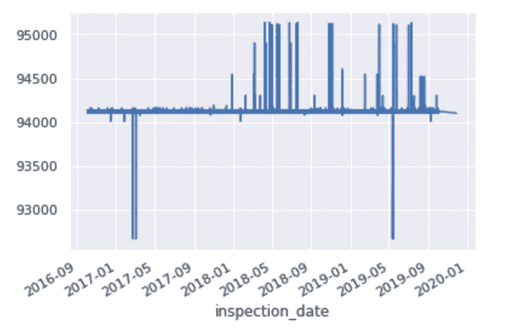
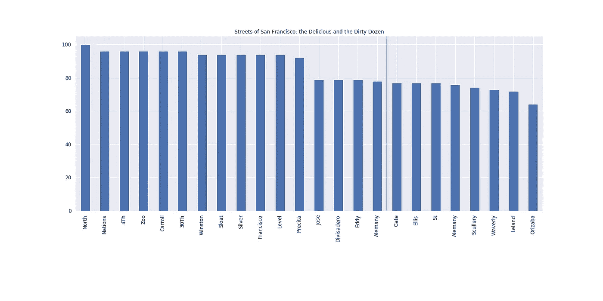
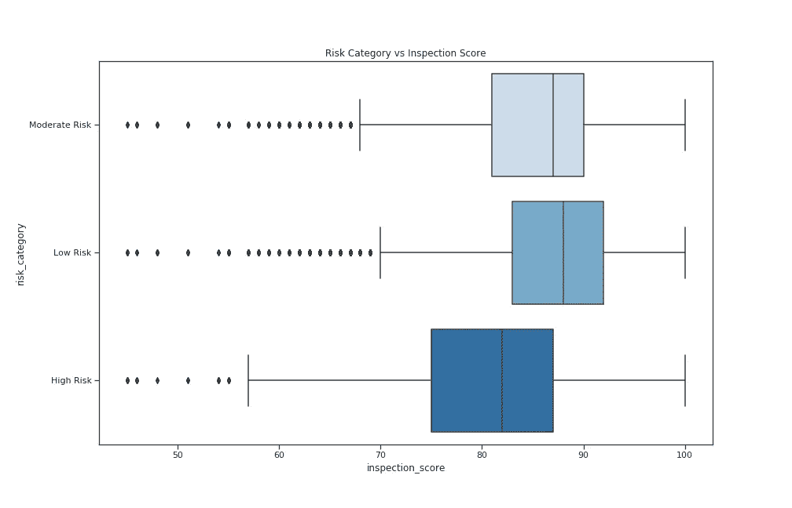
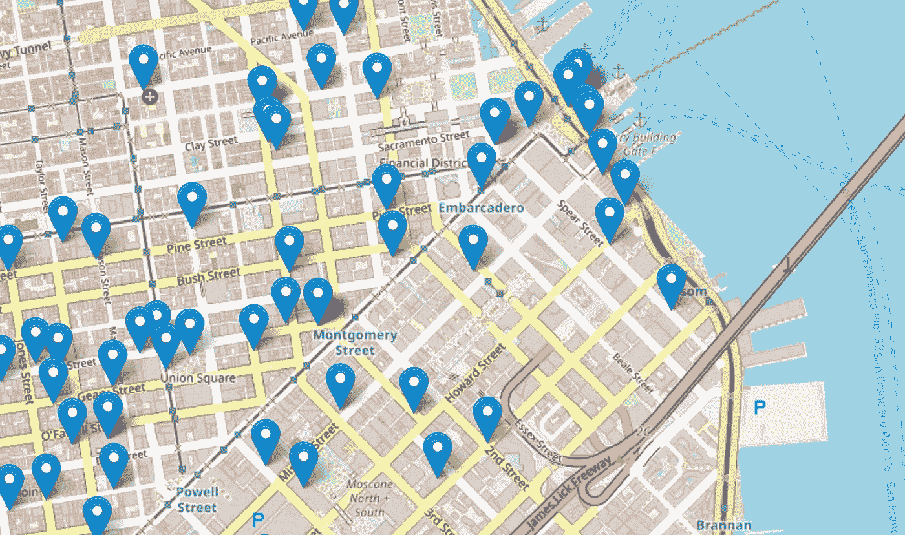
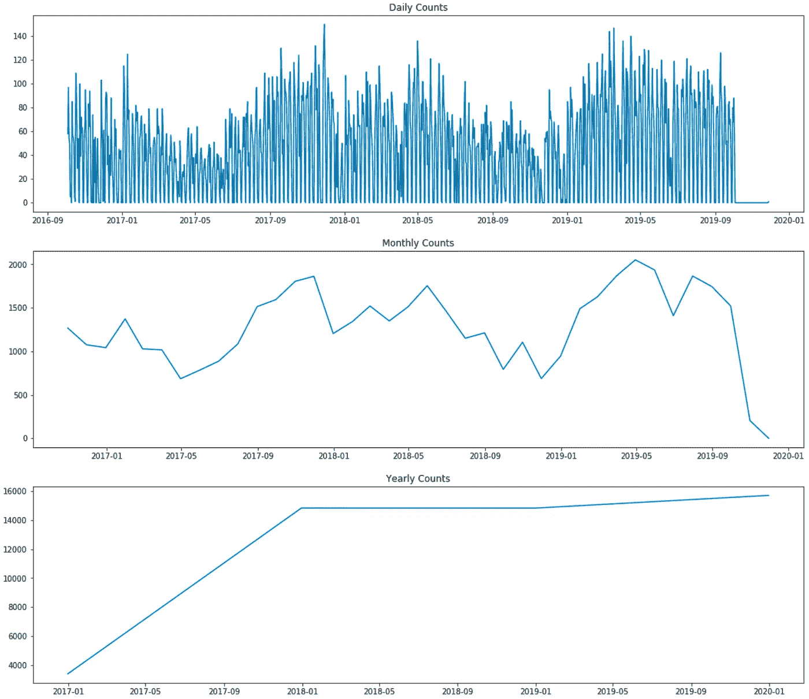
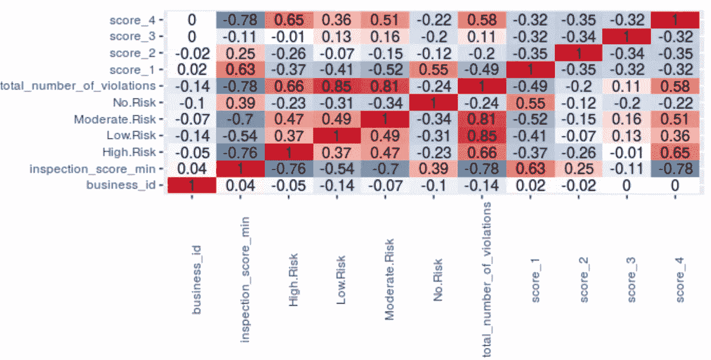
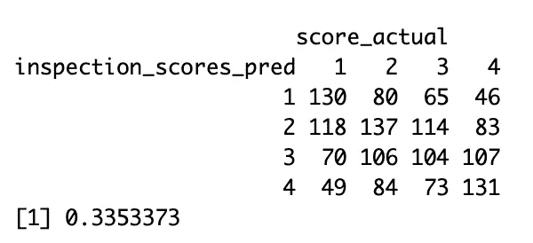
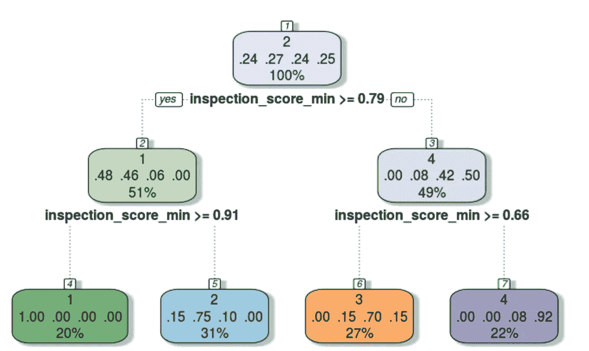

# 机器教学餐厅检查卫生评分

> 原文：<https://medium.com/analytics-vidhya/machine-teaching-restaurant-inspection-health-scores-eb7f2201a964?source=collection_archive---------7----------------------->

**简介**

在服务行业工作过之后，我一直对餐馆卫生检查的结构和评分方面着迷。对于我的实习项目，我想我可以使用餐馆检查健康得分数据集。在这篇文章中，我将强调并分享我的一些主要发现、我的挑战以及我一路走来获得的一些技巧和诀窍。为了进行分析，有七个笔记本上有精选的数据集，都可以在该项目的 GitHub 页面上找到， [Scoopv2](https://github.com/jayozer/scoopv2) 。

**背景及问题陈述**

旧金山的食品安全计划执行卫生法规，为了执行这些法规，食品安全检查员检查旧金山的 5000 多个地点，包括餐馆、酒吧、市场、面包店、手推车、体育场食品设施和任何其他为公众提供食品的设施。

冠状病毒的爆发使健康和清洁成为我们日常生活的重中之重。随着餐馆开始营业，他们的任务是更新他们的清洁方法。卫生部公布了一系列新的指导方针，要求采取额外的措施。这项倡议为卫生部制定计划来监督和执行这些指导方针带来了后勤问题。该研究旨在分析一段时间内的检查，并在推断得分时产生一个可接受的预测率(~90%)，并帮助三藩市卫生部优先考虑新冠肺炎后检查的资源。

**数据**

我选择这个主题的原因之一是数据的可用性和社会性。数据集来自于 [DataSF](https://data.sfgov.org/Health-and-Social-Services/Restaurant-Scores-LIVES-Standard/pyih-qa8i) ，是开放数据标准的一部分，带有一个用于访问的 API。为将来的工作创建连续的数据管道时，API 访问会很方便。数据集发布在一个有 54K 行的表格中。它目前设置为每周更新。然而，由于 COVID 的全市停工，自 2019 年 11 月以来一直没有更新。

尽管这是一个半精选的数据集，但 DataSF 的分析师并没有进一步清理开放的文本字段或集合。有几个简单的派生列是在连接过程中默认创建的，没有一个对我有用。这使得准备数据特别困难和耗时。

**探索性分析**

为了理解数据及其组成部分，我用各种可能的方式对其进行了分割。粒度处于检查级别，尽管这有助于聚合，但我必须使用派生表从头创建每个预测器。我面临的一些决策很普通，比如处理 nan 或地理编码缺失纬度和经度的最佳方式是什么，还有一些是独特的，比如拆分检验 id 以解析业务和检验日期。

有一件事我从来没有想到过，并且幸运地发现了，那就是商业邮政编码。旧金山市只以“9”开头。数据集中缺少邮政编码通常是意料之中的，但我惊讶地发现输入的邮政编码不正确。图表显示了广泛格式化后的分布。对于不正确的邮政编码，一些记录有可用的经度和纬度。我做了一个反向地理编码和距离测量，也可以在探索性分析笔记本。



清洗后的旧金山邮政编码分布

另一个挑战是决定如何按地理位置分割数据。原始数据集中唯一可用的值是街道名称。当我第一次搬到旧金山时，我被告知每条街道的风景都不同。当你转身时，你会看到 100 年历史的维多利亚时代建筑，崭新的公寓，或者完全破旧的建筑。下面是最卫生和最不卫生街道的列表。我恰如其分地称之为“旧金山的街道:美味和肮脏的一打”。垂直线是检查分数的中间值。很高兴看到街头信息，但我需要知道更多。



旧金山的街道:美味和肮脏的一打

我的数据集的一个缺点是它很小，只有 3 年的数据。虽然大约有 50K 条记录，但数据处于检查级别。我检查了检查数量和分数的季节性，但没有任何发现。但是检查分数与风险类别的四分位数范围是有趣的，并且形成了我的特征生成的基础。



风险类别与检查分数

风险类别与检查分数是一种有趣的关联。首先，我想知道更多关于异常值的信息，因此箱线图似乎是最好的选择。我特别使用蓝色阴影来观察每个风险类别在方框图中的差异。低风险类别，第一眼看上去很典型。在所有类别中，它的四分位间距最小，中间值最高。根据定义，这是意料之中的。这意味着评分系统与风险类别的程度直接相关。此外，IQ3 的底部约为 70，非常接近整体平均值和月平均值。只有很小的差异。需要注意的一点是异常值的违规数量。它是所有类别中最高的。我假设在暗访中得分较低的餐馆可以纠正违规行为，并支付 199 美元的罚款，以便在 30 天内再次接受检查。这可以包括在特征生成中，在意外访问中得分低的餐馆可以在 30 天内修正其得分。中度风险类别在所有类别中具有最小的 IQR。它也有相当一部分离群值。通过快速搜索，我发现违规行为的范围从“污水或废水处理不当”到“食物接触表面清洁或消毒不当”，一直到“解冻方法不当”。这些都是相当严重的违法行为，会让人生病。我觉得最可怕的是，中度风险的中位数也是相当大的。最后，高风险类别。它有很少的异常值，这是一个好消息。这一类对人类健康最危险。它的 IQR 是最大的，我最担心的是它的最大值是 100。这意味着即使你在一家 100 分的餐厅用餐，他们也有可能之前有过高风险的违规行为，并且已经纠正了。在我看来，这使得 90 分及以上的检查分数的跟踪报告更加重要。当我重新分类我的预测器时，我会考虑这一点。

**地理编码**

我在 medium 上找到的一个教程推荐 OpenCage GeoCoder。该软件包是直观的，易于使用，但它有 API 的限制。我找到了一个叫做 [GeoPy](https://pypi.org/project/geopy/) 的替代软件包，它运行速度更快，没有限制。

为 API 调用格式化数据是一个漫长而艰苦的过程，然而 regex 却帮了大忙。很难找到一个包含所有情况的正则表达式，但是我做了足够的测试来确保我包含了大部分。

此外，为了加快速度，我没有发送用于位置生成的整个数据集，而是创建了一个带有 business _ ids 但没有位置的数据框，这将我的数量降低到了 3500。从 55000 的原始数据到仅仅 3500，不算太差。嗯，还是花了一个多小时才跑完。这里的另一个技巧是确保在整个运行过程中保持登录到您的实例，这样您就可以捕捉到意外的登录刷新。下面是 API 代码。Geolocator 返回位置信息，我从中解析点字段，并从中提取纬度和经度。返回的点字段也有高度。出于好奇，我也把它退回去了，但结果都是零。

使用 GeoPy 查找纬度和经度

早些时候，我从地址解析街道名称，虽然结果很有趣，但不是我想要的粒度。作为地理编码步骤的一部分，我添加了一个新的邻域字段。该列表是通过映射 business_postal_code 字段，使用来自 SF 卫生部网站[的字典构建而成的。](http://www.healthysf.org/bdi/outcomes/zipmap.htm)

**预处理和映射**

在这个阶段，我的目标是开始创建能够帮助我推断得分预测的特征。由于数据集是在检验水平上，所以了解更多关于检验类型及其频率是有意义的。这使我能够战略性地汇总数据。当我有了汇总数据后，我无法抗拒的一件事就是用平均分来画出最好和最差的 SF 餐馆。以下是最佳榜单图。如果你喜欢交互式版本或者最坏的地图，那么去我的项目 [GitHub](https://github.com/jayozer/scoopv2) ，看看 3 _ 预处理 _ 制图笔记本。值得注意的是，最好的才是真正的最好。这些餐馆从未因任何违规行为而受到处罚。永远不会。



得分为 100 的食品机构的位置

浏览邻域级别的数据有助于我了解哪些数据可用于要素生成。通过使用唯一的数字列(我的分类器)并在业务级别汇总检查访问信息，我能够得出各种预测值，如分钟数、总数、违规类型数，甚至违规总数。这个新的数据集现在有 5K 行和 9 列，被导出到 df_features_business.csv。下一步是将数据集转移到 R Studio，但是“violation_description”字段引起了我的兴趣。由于我实习项目的目标之一是展示尽可能多的技术，我决定更深入地挖掘该领域的内容。

**关于“违例 _ 描述”的自然语言处理**

在我介绍我的方法之前，如果你像我一样使用 AWS SageMaker，这里有一个提示。您需要首先在 Jupyter 中下载这个库，然后使用下面的代码导入它。spacy 网站上建议的方法对我不起作用。

```
!python3 -m spacy download en_core_web_sm 
import en_core_web_sm
nlp = en_core_web_sm.load()
```

“违规描述”字段是一个自由文本列。这意味着检查员可以以他们喜欢的任何方式添加关于特定违规的信息。令人惊讶的是，柱内容物的分布相当均匀。在大约 35K 个违规中，有 66 个唯一条目。下面是我的明文函数:

在完成该函数后,“violation_description”列将被清理和词条化，并为聚类做好准备。我将使用 k-means 聚类，然而，我反复读到 k-medoids 在这种情况下会更好。原因是，对于 TFIDF 矢量等高维数据集，L1 距离通常比 L2 距离更有效。不幸的是，由于其他几个依赖项，我无法加载 k-medoids 库。也许，这是使用预构建的数据科学映像的缺点之一。


寻找最佳聚类数是一项挑战。不仅运行时间太长，因此我不得不调整我的功能的数量。增加 CPU 功率(没有尝试 GPU)没有帮助。通常，当对文本数据使用 k-means 时，斜率不会变平那么多。我将选择 20，因为它是一个整数，并用 20 个聚类来训练我的模型。没有必要尝试高数值并进行多次运行。此外，我多次读到经验法则说“k 等于(训练)数据集中点数的平方根。根据这个数据集，大约是 70。如果你最终尝试了，请在评论中告诉我你的结果。

我的一个目的是要看到每一个聚类中的顶部单词。以下是第三和第四组的详细信息:

```
cluster 3
number of datapoints in cluster: 5747
top 10 words and counts:
[('unclean', 5747), ('degraded', 3230), ('floor', 3230), ('wall', 3230), ('ceiling', 3230), ('contact', 2517), ('surface', 2517), ('nonfood', 1365), ('unsanitary', 1152), ('food', 1152)]

a few random violations from the cluster:
Unclean or degraded floors walls or ceilings
Unclean or degraded floors walls or ceilings

cluster 4
number of datapoints in cluster: 7434
top 10 words and counts:
[('risk', 7434), ('moderate', 4084), ('food', 3849), ('hold', 3849), ('temperature', 3849), ('vermin', 3508), ('infestation', 3508), ('high', 2284), ('low', 1066), ('violation', 77)]

a few random violations from the cluster:
Moderate risk food holding temperature
Moderate risk vermin infestation
```

**字云**

Word cloud 确认了聚类结果，但以聚合方式进行。下面是整个“violation_description”语料库的词频的词云表示。不用说，看到“害虫”和“食物”这两个词并排在一起有点怪异。


**二元模型和三元模型**

我认为多词表示是最适合这个语料库的，在我看来，bi 和三元模型的结果非常好。一个令人惊讶的结果是作为头号大人物的风险适中。当我查询 violation_type(基本上是风险分类列)时，我得到低风险作为最常出现的字符串。下面是二元模型和三元模型的一部分。

```
"moderate risk" shows up 4029 times
"risk food" shows up 3849 times
"hold temperature" shows up 3849 times
"food hold" shows up 3849 times"risk food hold" shows up 3849 times
"food hold temperature" shows up 3849 times
"degraded floor wall" shows up 3230 times
"unclean degraded floor" shows up 3230 times
```

**时间序列**

因为我有可用的检查日期，所以我创建了三个图表。每日、每月和每年的单词分布。我认为这种类型的绘图有助于了解样本密度，有时还能发现有趣的见解。在下面的年度数字中，从 2017 年到 2018 年有显著增加。我认为就像任何时间序列数据一样，这种分析可以受益于更多的观察。



违反中单词的时间序列分布 _ 描述

**KNN 和随机森林**

对于项目的机器学习部分，我决定迁移到 R Studio Cloud。这里的另一个技巧是关于警告消息的。在 R Studio Cloud 中，有可能得到许多事情的警告消息，如果您像我一样，花费了大量的时间去寻找警告而不是工作本身，您应该使用下面的方法来禁用警告:suppress warnings(suppress messages())。我的数据源是之前创建的特征数据集 df_features_business。在其中，我有我的衍生特征，例如每个类别中的风险数量、违规总数以及业务级别的最低分数。我喜欢出口到。每个部分后的 csv。它创建了几个精选的数据集，以便可以在所需的点开始分析。此外，精选/预聚合数据运行速度更快，这是提高效率的好方法，尤其是在运行多个算法时。

对于这个问题，我选择从 k-NN 算法开始有四个原因:第一个原因是我正在处理的数据集的性质。k 个最近邻分类器通过将它们分配到相似标记样本的类别，根据它们对未标记样本进行分类的特性来定义。问的问题是根据过去的数据预测餐馆的得分，我的数据集已经被标记。第二个原因是数据集中特征之间的相关性。k 最近邻分类器非常适合于分类任务，其中特征和目标类之间的关系是众多的、复杂的或者极难理解的，然而相似类类型的项目往往是相当同质的。这听起来就像餐馆检查数据集。第三，我有四个不同的类值。这是一个多类问题，不是二元的，k-NN 适用于多类问题。最后，k-NN 被认为是最简单的 ML 算法之一。有什么更好的方法从简单的事情开始，然后在此基础上继续发展。下面是相关矩阵:



关联矩阵 df _ 特征 _ 业务数据集

要准备好数据集，进一步的数据管理是必要的，这里的一个技巧是保持所有字段为数字数据类型，预测因子为因子。

我想寻找一种更好更简单的方法来预测餐厅检查分数。从数据集中，我查看 inspection_scores_mean，它的范围从 100 到 50。有 1000 多个不同的类别。做出评分决定可能不需要太多的类别，因此，我根据旧的健康检查评分系统将该变量分为 A、B、C 和 D 四个等级。A 代表 100-95 分，B 代表 94-90 分，C 代表 89-85 分，D 代表低于 85 分。我知道，范围有点陡，但我必须认识到它的分布。当我将它分成训练和测试数据集时，分数变量的比例不会是一致的。如果是这种情况，模型从 D 类别中学习的效率会比从 b 类别中学习的效率低。为此，我通过更改中断来操纵分布。我试了几次，但是我能够按比例把它们分开。我认为这是一种无害的重新分配值的方式，以达到更高的精度。

不幸的是，这在 knn 上不起作用，它悲惨地失败了。我可以说，既然我的主要目标是计算 D 和 C 分数(最差分数),那么 knn 工作正常。也许，我只需要将这些分为 2 级，而不是 4 级。通过/失败。然而，我确实通过使用决策树得到了更好的结果。



**决策树，修剪和随机森林**

选择随机森林算法有两个主要原因。首先，inspection_scores 数据集显示了线性的同质数据。第二，分数对于餐馆老板来说是一个敏感的话题，因此出于法律原因，我的方法应该是透明的，我的结果应该很容易被转录并与其他实体共享。决策树和修剪树的结果是相同的。随机森林要高一点。标准化对结果也没有任何影响。我调查了为什么修剪不能改善结果，可能有很多原因。默认情况下，模型使用 0.01 作为 CP 值，这是最小交叉验证误差树。为了测试，我手动更改了 CP 值，但是准确性没有提高。下面是并排查看所有三个模型的代码。当我必须比较多个方法的多个类时，这是我使用的一个很好的技巧:

**灵敏度和特异性**

模型的敏感度(也称为真实阳性率)衡量被正确分类的阳性样本的比例。在 A 类的随机森林中，敏感度大于 B 类、C 类和 d 类。
模型的特异性(也称为真阴性率)衡量被正确分类的阴性样本的比例。对于 D 类和 a 类，这些值非常好。这是原因之一，我认为两个分类器都可以使用布尔预测器更好地执行，但这不是我的目标，我的目标是成功地首先分离 D，然后分离 C。

在这一点上，我想也许当我分割我的训练和测试数据集时，我在测试中没有任何相关的值来正确地检查准确性。考虑到这一点，我还改变了我的训练和测试数据集分布。我尝试了 60/40，75/25 和 90/10 的分裂。在 90/10 分割的情况下，精确度略有增加，但是 knn 和决策树仍然产生相似的性能。

**可视化决策树**



修剪过的树

评估模型性能的一种方法是在几个不同的较小数据集上训练它，并在另一个较小的测试集上评估它们，即 F-fold 交叉验证。r 有一个函数，可以随机分割几乎相同大小的数据集。例如，如果 k=9，则在九个文件夹上评估模型，并在剩余的测试集上测试模型。重复该过程，直到所有子集都被评估。这种技术广泛用于模型选择，尤其是当模型有参数需要调整时。既然我们有了评估模型的方法，我们需要弄清楚如何选择最能概括数据的参数。随机森林选择随机的特征子集并构建许多决策树。该模型对决策树的所有预测进行平均。

我还尝试使用全部数据作为训练数据。我相信，如果使用更大量的数据，并将分类器设置为二进制模式，准确性会高得多。另外，另一件要注意的事情是类错误。前面我提到过，我最感兴趣的是 D (4)和 C (3)分数。虽然 D 的错误率是可以接受的，但 C 的错误率有点大。这是我随机森林奔跑的混乱矩阵。~90%的准确率不算太差。


**评估模型性能(k 倍交叉验证)**

交叉验证的整体思想是优化模型复杂性，同时最小化欠拟合/过拟合。目标是让模型在不过度拟合的情况下很好地概括。为了确保这一点，模型是(交叉)验证/合格的。下面是使用 lapply()为 randomForest 自动化 10 重 CV 的代码:我使用 10 重 CV，因为这是最常见的约定。无论如何，使用更多的数字并没有什么额外的好处。对于 10 次折叠中的每一次，ML 模型都建立在其余 90%的数据上。然后，文件夹 10%样本用于模型评估。在训练和评估模型的过程发生 10 次之后，报告所有褶皱的平均性能。

```
set.seed(99998)
folds <- createFolds(inspection_scoresV2$score, k = 10) #command to create 10 folds. Datasets for CV are created. createFolds is part of caret function.cv_results <- lapply(folds, function(x) {
 inspection_scoresV2_train <- inspection_scoresV2[-x, ]
 inspection_scoresV2_test <- inspection_scoresV2[x, ]
 inspection_scoresV2_model <- randomForest(score ~ ., data = inspection_scoresV2_train)
 inspection_scoresV2_pred <- predict(inspection_scoresV2_model, inspection_scoresV2_test)
 inspection_scoresV2_actual <- inspection_scoresV2_test$score
 kappa <- kappa2(data.frame(inspection_scoresV2_actual, inspection_scoresV2_pred))$value
 return(kappa)
})
```

这需要几分钟的时间来运行，这是意料之中的。交叉验证的整体思想是优化模型复杂性，同时最小化欠拟合/过拟合。目标是让模型在不过度拟合的情况下很好地概括。k-fold 对 randomForest 来说没有预期的效果。

最后，在进行了一些清理并重新格式化为字母等级后，我将这些数据合并回我的原始数据集以获得位置信息，然后随机绘制了 50 家预测字母等级为 d . 50 的餐馆，因为我认为这是检查员一天可以覆盖的最大数量，尤其是在不考虑设施之间距离的情况下。

**检查员的积压—第一天**

在预测 Covid 后的餐厅检查分数时，我能够达到大约 90%的准确率。我认为有足够多的餐馆长期违反旧金山卫生部的规定。检查员可以从下面 50 家预测得分为“D”的餐馆开始检查。


预测得分为 D(低于 85/100)的前 50 家餐厅

为了贴图，我用了[叶子](https://pypi.org/project/folium/)。我认为它用最少的努力创建了漂亮的交互式地图。

**最后的想法**

首先，从小事做起。小数据集，样本文件。它不仅运行速度更快，而且更容易理解结果。也就是说，在这个项目中，我浪费了不必要的时间，而不是分析整个数据集。当运行资源密集型计算时，看到一个进度条是很好的。 [tdqm](https://pypi.org/project/tqdm/) 是我使用的软件包，这里有一篇[的博客文章](/@adamshort/tqdm-10x-the-ux-of-your-python-scripts-3cd30920a728)向我介绍了它。NLP 本身就是机器学习的一个分支。我觉得我可以根据词频、相似度和情感来创造更多的特征。数据集需要更多的特征，甚至更多的数据。出于这个原因，也许在更大的数据集上进行训练会更好，例如纽约或波特兰，但是这将需要大量的正则表达式工作，因为数据收集格式彼此之间有很大的不同。