# 机器翻译(编码器-解码器模型)！

> 原文：<https://medium.com/analytics-vidhya/machine-translation-encoder-decoder-model-7e4867377161?source=collection_archive---------0----------------------->

理解和建立一个简单的模型，将英语翻译成印地语的指南。

[https://www . Microsoft . com/en-us/translator/blog/2018/03/14/human-parity-for-Chinese-to-English-translations/](https://www.microsoft.com/en-us/translator/blog/2018/03/14/human-parity-for-chinese-to-english-translations/)

# 内容-

1-引言。

2-先验知识。

3-编码器-解码器的体系结构。

4-了解模型的编码器部分。

5-在训练阶段理解模型的解码器部分。

6-在测试阶段理解模型的解码器部分。

7 码

8-结果。

9-参考文献。

# 简介-

编码器-解码器模型是使用递归神经网络解决序列间预测问题的一种方式。

它最初是为机器翻译问题开发的，尽管它已经被证明在相关的序列到序列预测问题上是成功的，例如文本摘要和问题回答。

该方法涉及两个递归神经网络，一个用于编码输入序列，称为编码器，另一个用于将编码的输入序列解码为目标序列，称为解码器。

以下是序列在序列模型中的一些应用

*   聊天机器人
*   机器翻译
*   文本摘要
*   图像字幕

# 先验知识-

*   RNN / LSTM /GRU 的概念，以及 LSTM 在喀拉斯的工作需要理解这个职位。

# 编码器-解码器的架构

常用的序列对序列模型(编码器-解码器)的总体结构如下所示

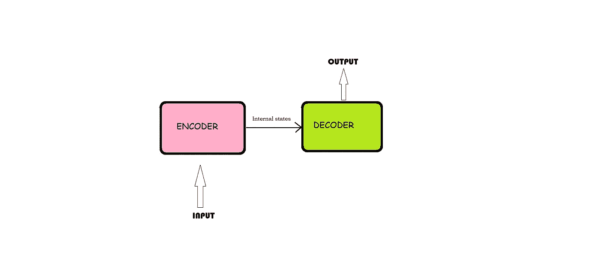

它由 3 部分组成: ***编码器、中间矢量和解码器。***

***编码器-*** 它在每个时间步接受输入序列的单个元素，对其进行处理，收集该元素的信息并将其向前传播。

***中间向量*** -这是从模型的编码器部分产生的最终内部状态。它包含关于整个输入序列的信息，以帮助解码器做出准确的预测。

***解码器-*** 给定整个句子，它预测每个时间步的输出。

# 理解模型的编码器部分-

*   编码器基本上是 LSTM/GRU 单元。
*   编码器接收输入序列，并将信息封装为内部状态向量。
*   编码器的输出被拒绝，仅使用内部状态。

让我们来理解模型的编码器部分是如何工作的-

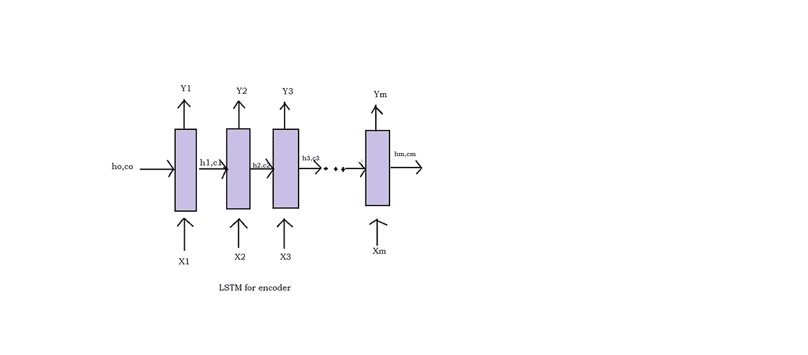

LSTM 一次只取一个元素，所以如果输入序列的长度为 m，那么 LSTM 需要 m 个时间步长来读取整个序列。

*   Xt 是时间步长 t 的输入。
*   ht 和 ct 是 LSTM 在时间步长 t 的内部状态，而对于 GRU，只有一个内部状态 ht。
*   Yt 是时间步长 t 的输出。

让我们考虑一个英语到印地语翻译的例子

***编码器的输入 Xt-***

想想英语句子——印度是个美丽的国家。这个序列可以认为是一个包含 4 个单词(印度，是，美丽，国家)的句子。所以在这里

X1 = '印度'

X2= '是'

X3=“漂亮”

X4= '国家'。

因此，LSTM 将在如下 4 个时间步骤中逐字读出该序列

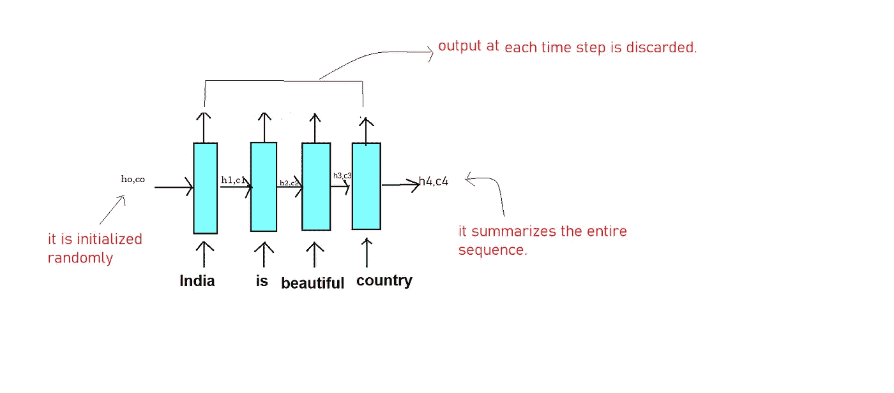

这里，每个 Xt(每个单词)使用单词嵌入表示为一个向量，它将每个单词转换为一个固定长度的向量。

***现在即将进入内部状态(ht，CT)——***

*   它学习 LSTM 已经阅读了什么，直到时间步 t。例如，当 t=2 时，它记得 LSTM 已经阅读了' *India is '。*
*   初始状态 h0、c0(两者都是向量)被随机初始化或初始化为零。
*   记住，ho，co 的量纲，等于 LSTM 晶胞中的单位数。
*   最终状态 h4，c4 包含了整个输入序列 I 的症结 *ndia 是美丽的国家。*

***编码器的输出 Yt-***

每个时间步的 Yt 是每个时间步的 LSTM 的预测值。在机器翻译问题中，我们在阅读了整个输入序列后生成输出。所以在编码器的每个时间步，Yt 是没有用的，所以我们丢弃它。

*所以总结一下模型的编码器部分——*

编码器将一个字一个字地读取英语句子，并存储在最后一个时间步长之后生成的 LSTM 的最终内部状态(称为中间向量),并且由于一旦读取了整个序列就将生成输出，因此丢弃编码器在每个时间步长的输出(Yt)。

# 在训练阶段理解模型的解码器部分-

解码器的工作在训练和测试阶段是不同的，不像模型的编码器部分在训练和测试阶段以相同的方式工作。

让我们了解一下训练阶段解码器的工作原理

以翻译 ***印度是美丽的国家*** 为例，就像编码器一样，解码器也逐字生成输出句子。

所以我们要生成输出—

*为了让解码器识别序列的开始和结束，我们将在输出序列的开头添加 START_ 并在输出序列的结尾添加 _END。*

*所以我们输出的句子会是***start_भारतखूबसूरतदेशहै_ end****

*让我们从视觉上理解工作--*

*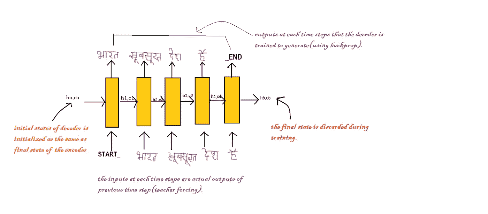*

*训练中的解码器 LSTM*

*   *解码器的初始状态(h0，c0)被设置为编码器的最终状态。可以认为解码器被训练成基于编码器收集的信息来生成输出。*
*   *首先，我们输入 START_ 以便解码器开始产生下一个字。在印地语句子的最后一个单词之后，我们让解码器学会预测结尾。*
*   *这里我们使用教师强制技术，其中每个时间步的输入是实际输出，而不是最后一个时间步的预测输出。*
*   *最后，根据每个时间步的预测输出计算损失，误差随时间反向传播以更新模型的参数。*
*   *当我们得到输出时，解码器的最终状态被丢弃，因此它是无用的。*

**直观总结编解码-**

*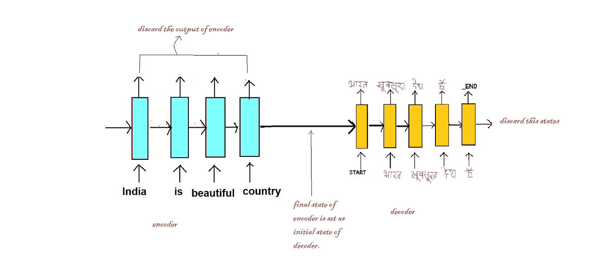*

# *在测试阶段理解模型的解码器部分-*

*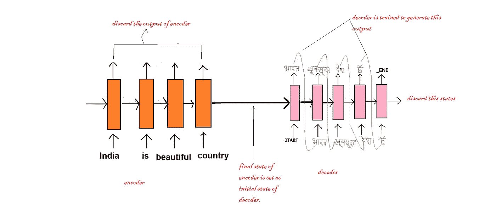*

*测试期间解码器的处理-*

*   *解码器的初始状态被设置为编码器的最终状态。*
*   *解码器中的 LSTM 在每个时间步长处理单个单词。*
*   *解码器的输入总是从 START_ 开始。*
*   *每个时间步长后产生的内部状态作为下一个时间步长的初始状态。例如，在 t=1 时，输入 START_ 后产生的内部状态作为 t=2 时的初始状态。*
*   *每个时间步产生的输出作为下一个时间步的输入。*
*   *当解码器预测结束时，我们就知道序列的结束。*

# *代码-*

*现在我们已经了解了编码器-解码器模型是如何工作的，让我们看看将英语翻译成印地语的代码。*

*   *加载数据并查看一些数据点。*

*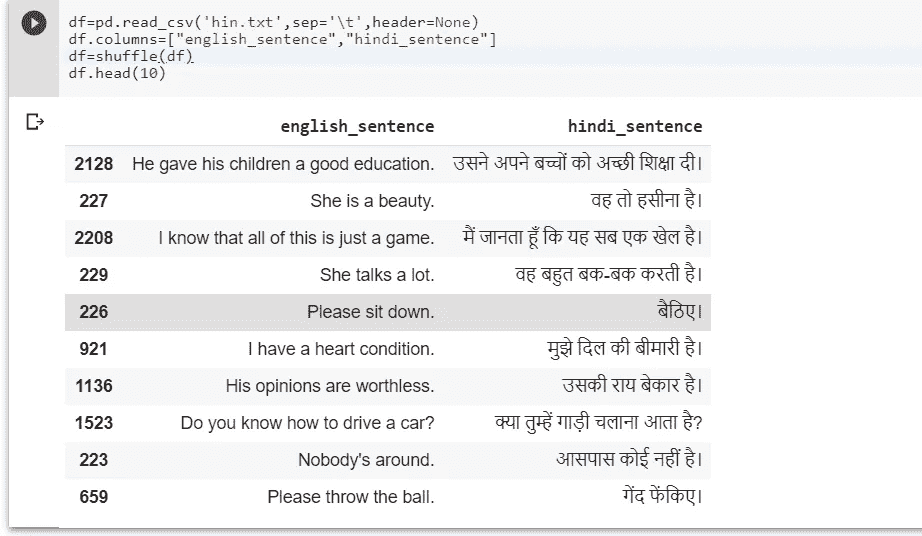*

*   *第二步是预处理数据，使其干净并易于处理。*

*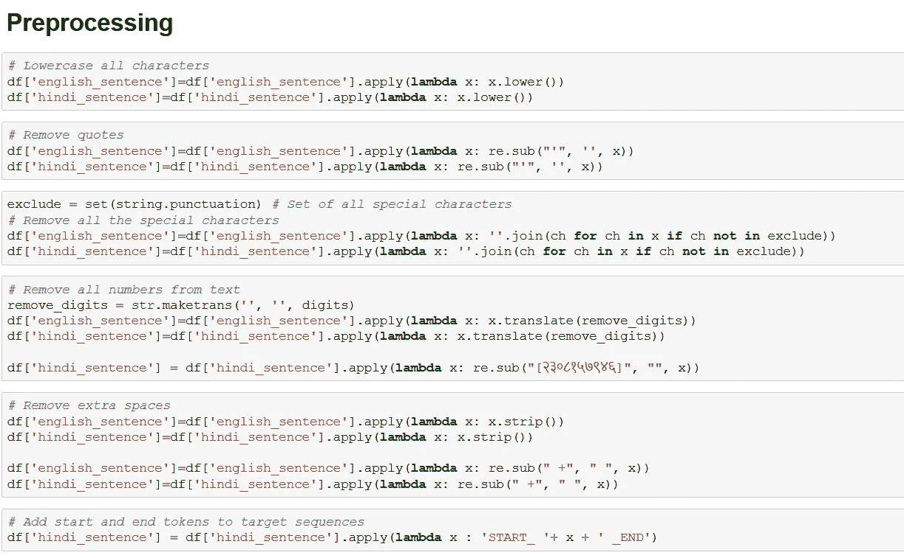*

*   *预处理后，将 START_ and _END 添加到印地语句子中，创建所有独特的英语和印地语单词的词汇，并计算英语和印地语的词汇大小和最大句子长度*

*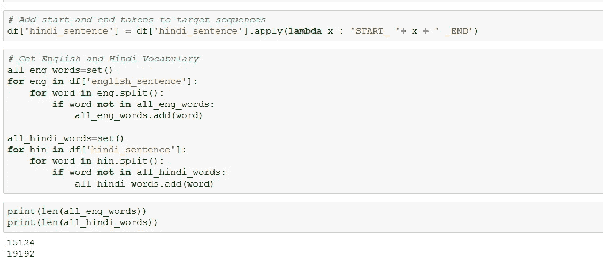*

*   *接下来，我们创建 4 个 Python 字典，将给定的单词转换成整数索引，反之亦然。*

*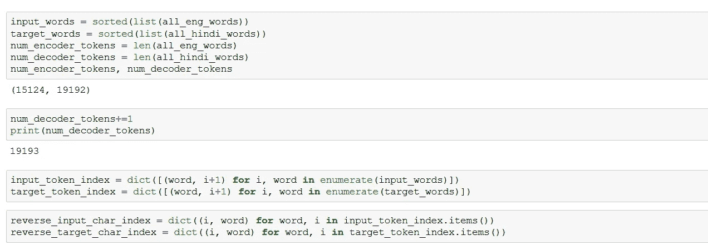*

*   *现在，我们将把数据分为训练和测试，并定义一个函数来批量生成训练和测试数据。*

*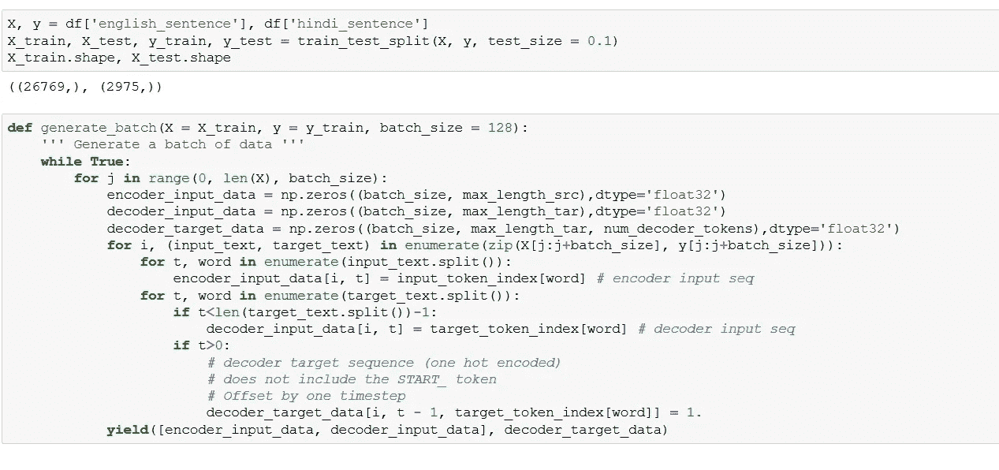*

*   *下一步是定义编码器-解码器架构。*

*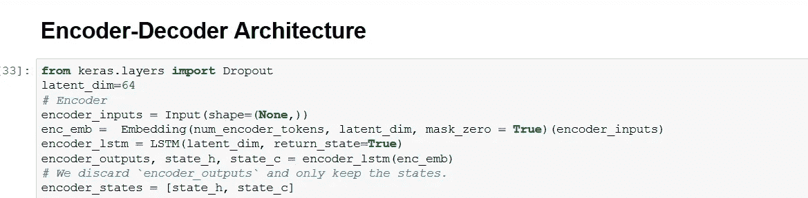*

*编码器*

*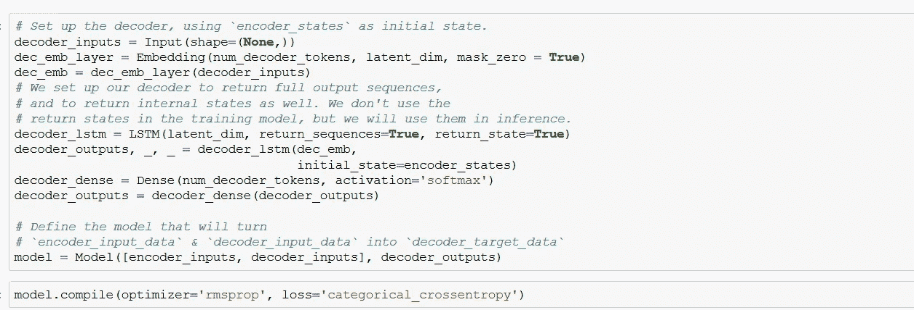*

*解码器*

*   *将模型训练 100 个纪元。训练结束后，就该对测试数据进行预测了。*
*   *因此，我们将设置测试模式如下-*

*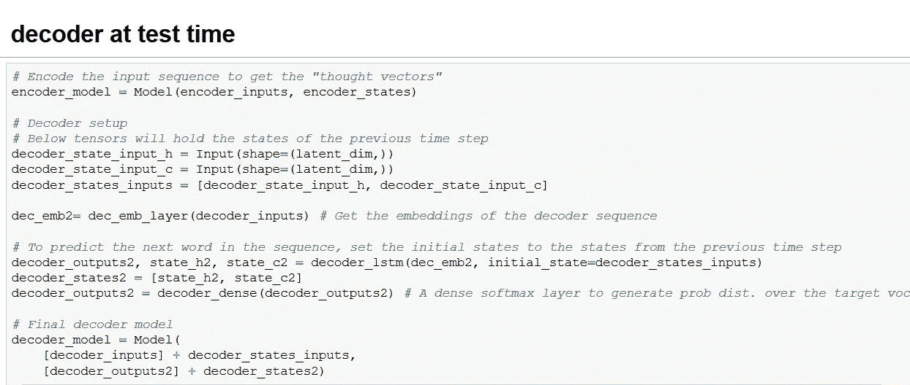*

*   *最后，我们将通过定义下面的函数并稍后调用它来生成输出。*

*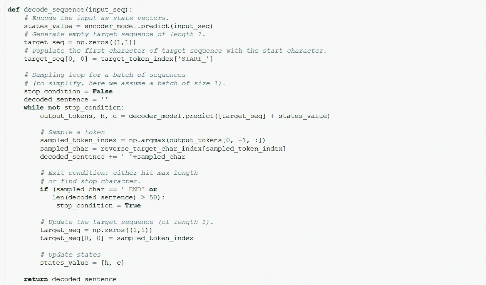*

# *结果-*

*   *训练数据的结果——下图显示我们的模型在训练数据上表现良好。*

*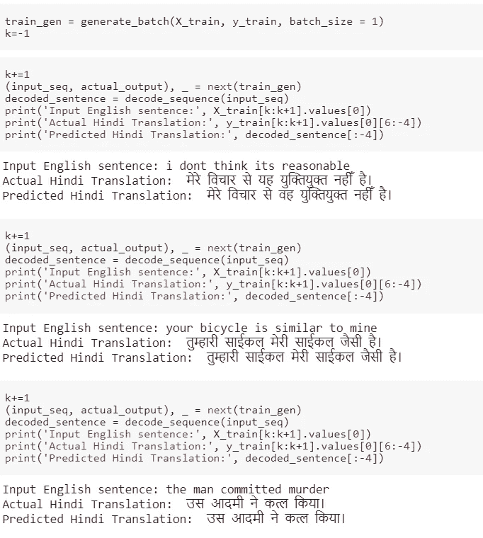*

*   *测试数据的结果——如下所示，测试数据的结果不是很好，但还可以，因为首先它不是一个最先进的模型，而是一个非常简单的模型；其次，这里使用的数据集太小，无法产生令人满意的结果。*

*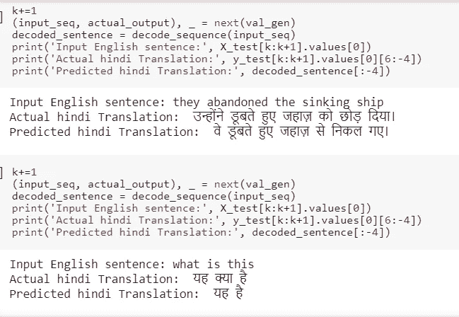*

# *参考文献-*

1.  *ht[TPS://arxiv . org/pdf/1409.3215 . pdf](https://arxiv.org/pdf/1409.3215.pdf)*
2.  *[https://blog . keras . io/a-ten-minute-introduction-to-sequence-to-sequence-learning-in-keras . html](https://blog.keras.io/a-ten-minute-introduction-to-sequence-to-sequence-learning-in-keras.html)*
3.  *[https://www . ka ggle . com/aiswaryaramachandran/英语到印地语的神经机器翻译](https://www.kaggle.com/aiswaryaramachandran/english-to-hindi-neural-machine-translation)*
4.  *[https://towards data science . com/word-level-English-to-Marathi-neural-machine-translation-using-seq 2 seq-encoder-decoder-lstm-model-1a 913 F2 DC 4a 7](https://towardsdatascience.com/word-level-english-to-marathi-neural-machine-translation-using-seq2seq-encoder-decoder-lstm-model-1a913f2dc4a7)*
5.  *AAIC*

**感谢您阅读到最后！！**