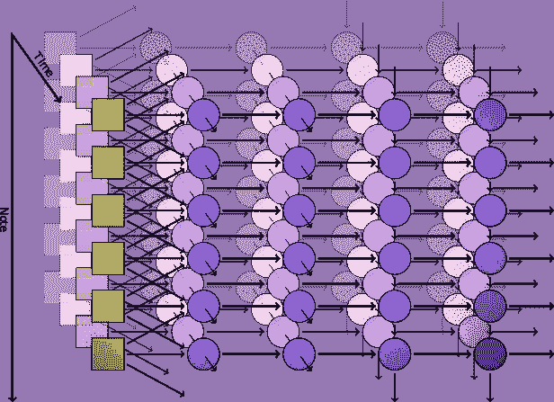
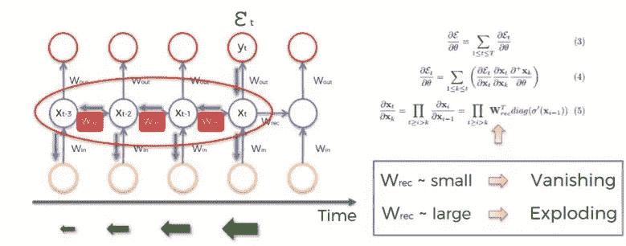
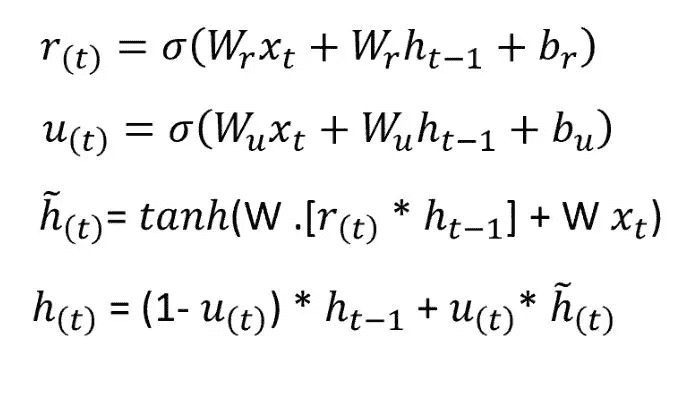
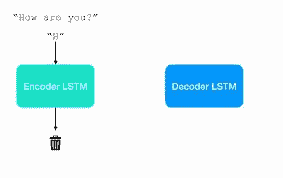
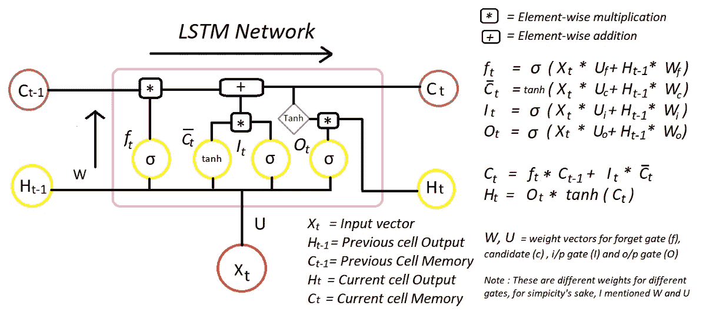
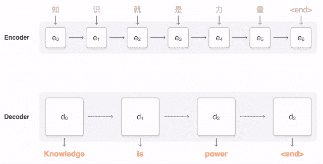
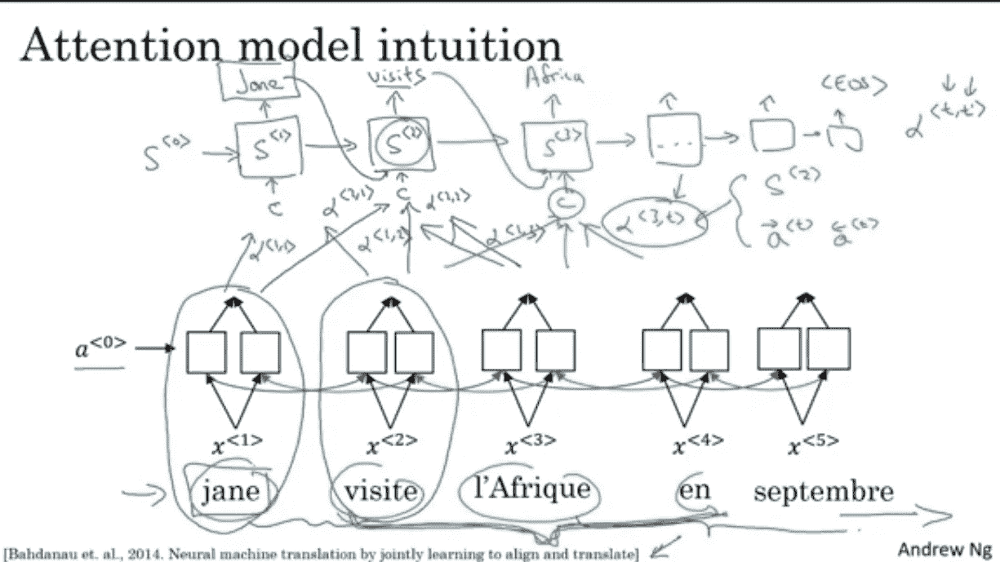

# 使用神经网络的机器翻译

> 原文：<https://medium.com/analytics-vidhya/machine-translation-using-neural-networks-61ea85b39ad4?source=collection_archive---------13----------------------->

神经机器翻译(NMT)是一种机器翻译方法，它使用人工神经网络来预测单词序列的可能性，通常在单个集成模型中对整个句子进行建模。

在开始使用神经网络进行机器翻译之前，首先，我们需要了解如何在序列中表示单词，因为您的模型处理方程和数字，它没有单词的位置，它只理解数字。为此，我们使用标记化。现在，什么是标记化？标记化用于创建一个单词字典，它在你的语料库中，去掉标点符号，进行词干分析并将其转换为小写，然后我们给每个单词分配一个特定的数字，称为标记。这为我们提供了一个字典，其中每个单词都映射到一个特定的标记。之后，我们应用一键编码，以防止具有更高权值的单词具有更高的优先级或权重。机器翻译使用如下所示的编码器-解码器架构

编码器和解码器都使用相同的神经网络模型，但扮演的角色略有不同。编码器用于对所有单词嵌入进行编码，并提取上下文和长期依存关系，然后传递给解码器以生成输出句子。有不同类型的自然语言处理模型可用于此目的。现在让我们从被称为**递归神经网络**的基本序列模型开始。

## 递归神经网络

单词 recurrent 的意思是经常或重复发生。在正常的神经网络中，我们获取一个输入 x，并通过隐藏层中的激活单元将其向前馈送，以获得输出 y，我们不从模型中的先前步骤获取任何输入。这就是我们在递归神经网络中的不同之处，在 rnns 中，我们不仅在步骤 t 从**x[t]**获得数据，而且我们还从**a[t-1]**获得信息(在前一步骤激活)，我们这样做是为了共享在文本的不同位置学习到的特征。

编码器-解码器

在机器翻译中，我们使用如上所示的编码器-解码器架构。RNN 编译码模型由两个递归神经网络组成。一种 RNN 将单词序列编码成固定长度的向量，首先通过用于形成嵌入矩阵的嵌入层，然后将其馈送到递归神经网络。在编码器部分，没有通过 softmax 层给出的输出，而是被馈送到下一个 rnn 单元。Our(嵌入字向量)乘以某个权重矩阵 W(hx)。我们先前计算的隐藏状态(它是 RNN 节点的先前输出)乘以不同的权重矩阵 W(hh)。然后将这两个乘法的结果相加，并应用类似 Relu/tanh 的非线性。这现在是我们的下一个隐藏状态 h。然后，最终的隐藏状态和权重矩阵被转发到模型的解码器部分。这里，我们使用另一个递归神经网络，现在这个网络将被输入编码器的最终状态，然后编码器将进行处理以给出将被翻译成单词的输出。为了从解码器 RNN 获得每个时间步长的输出 y，我们有另一个权重矩阵 W(S ),我们将它乘以我们的隐藏状态 h 以获得向量输出。然后将一个 softmax 应用于此，得到我们的最终输出。这个最终输出告诉你在那个时间步预测了什么词向量。

这里，当 X1 被前馈到神经网络中时，它也接收来自输入 X0 的激活函数的信息。这就是递归神经网络的特殊性和唯一性。现在让我们看看具有多个隐藏层的递归神经网络。

RNN 穿越时空

这里所有的黄色方框是我们的输入，蓝色圆圈是神经元。正如你所看到的，一个特定的神经元从上一层获取信息，也从上一时间步的一层获取信息。
现在问题来了，为什么不是标准的神经网络？
这个问题的答案是，标准的神经网络并不能很好地工作，这实际上有两个主要问题:

*输入和输出可以是不同的长度和不同的例子。所以，并不是每个例子都有相同的输入长度或输出长度。
*其次，它不共享跨文本不同位置学习的特征。

让我们看看这背后的数学原理

RNN 细胞方程

这是两个主要方程，激活方程和输出方程。让我们先来看看激活函数，这里魏如萱是分配给上一步层的激活值的权重，即 a[t-1]，Wax 是分配给当前输入的权重，ba 是偏置项。因为它们对于特定输出的重要性可能不同，所以它们被分配不同的权重。这里 g(x)是我们通常用作校正线性单位或 tanh 的激活函数。在输出等式中，Wya 是分配给带有偏置项的当前激活函数的权重。现在，这里使用的激活函数和输出方程可以是不同的。这些是简单递归神经网络中的正向传播方程。通过观察 rnn 细胞状态，我们可以更好地理解递归神经网络。

RNN 细胞链

这和我们上面讨论的是一样的。如果我们观察特定的 rnn 小区，它将仅遵循上述两个等式。

现在是反向传播。递归神经网络中的反向传播非常复杂。

RNN 细胞反向传播

当一个特定的神经元从前一层和输入细胞接受输入时，我们需要执行比标准神经网络更多的微分步骤。这是给定的激活单位 a[t]。现在我们需要根据蜡来区分它，蜡是分配给来自当前层的输入的权重。为了计算误差，我们用魏如萱对其进行微分，该加权是分配给来自前一层的激活输入的权重，我们还用偏差项对其进行微分。我们用[t]和[t-1]来区分它，以便计算总误差。我们创建一个缓存来传递已经计算过的参数值，这样我们就不需要一次又一次地计算它们，从而节省了处理时间。在 rnn 单元中向后处理一步后，我们得到损失函数，然后用它来调整权重值。参数梯度也将存储在缓存中以备后用。这就是在递归神经网络中反向传播是如何发生的。

有不同类型的递归神经网络。都是下面的状态。

递归神经网络的类型

这些服务于不同的目的，例如一对一用于单个单词翻译或单词到情感分析。多对一用于将表情符号分配给给定文本或基于文本的情感分析或预测电影评论。许多太多主要用于机器翻译目的或问答对话模式。

## 字符级语言模型

字符级语言模型是用于将输入作为字符而不是单词的模型。当你必须处理大量的未知单词时，这个模型真的很方便。在字符级语言中，模型词汇表由字母(大写和小写)、数字和符号组成。

字符级语言模型

字符级语言模型的优缺点是:
*在这个模型中我们不用担心未知单词。
*缺点是我们最终会得到更长的序列。

## 递归神经网络的消失梯度

消失梯度是递归神经网络中的一个常见问题。递归神经网络倾向于具有导致长期依赖性的长序列，即在句子中出现得更早的单词影响在句子中位置更晚的单词。

消失梯度

如果递归神经网络很深，那么来自刚输出 y 的梯度将很难传播回来影响这些早期层的权重以及网络，从而影响早期层中的计算。在 RNN 中，当有长句或长序列时，模型可能很难记住与在序列中与当前单词出现得更早的前一个单词的(单数/复数)关系。如果你的模型中有一个爆炸渐变，那么你可以应用渐变裁剪。

## 长期依赖的问题

递归神经网络的吸引力之一是它能够管理长的单词序列，并且能够以处理单词依赖性的方式处理信息。有时候，我们必须查看最新的信息来执行当前的任务。例如，假设一个语言模型试图根据前面的单词预测下一个单词。如果我们试图预测“云在天空”中的最后一个词，我们不需要任何进一步的上下文——很明显下一个词将是天空。在这种情况下，相关信息和需要它的地方之间的差距很小，rnn 可以学习使用过去的信息。

但是有些情况下，我们需要比上面看到的情况更多的依赖。考虑尝试预测文本中的最后一个单词“我在法国长大…我说一口流利的法语。”我们可以知道最后一个单词是一种基于最新信息的语言，但要准确预测哪种语言，我们需要句子开头的上下文，即“我在法国长大。”这些被称为长期依赖。基本的递归神经网络很难找出这些长期的依赖关系。这就是我们选择门控循环神经网络和长短期记忆网络的原因。

## 门控循环单元(GRU)

门控递归单元是某种高级类型的递归神经网络。gru 通常与 LSTMs 一起使用。它们在很大程度上帮助我们解决消失梯度问题以及解决长期依赖性。gru 可以用来代替编码器-解码器架构中的 rnn。代替递归神经网络，我们将使用门控递归单元。我们将有一个编码器 GRU，它将从嵌入层获取输入。rnns 和 GRU 之间的区别在于，在 RNNs 中没有存储线，但是在 GRUs 中，我们有存储线 h[t]和输出线 o[t]，输出线 o[t]被传递到编码器中的下一个单元。最后，存储器状态连同隐藏状态将被传递到解码器 GRU。解码器 GRU 将处理这两种状态，并相应地给出输出，同时考虑长期相关性。让我们看一个门控循环单元(GRU)

门控循环单元

现在，这对你来说可能看起来很复杂，但是一旦我解释了上图中每个函数的用法，你会发现它很简单。门控循环单位有称为记忆细胞的 h[t]。使用记忆单元是为了提供记忆，这对于预测前面的单词或翻译中说的单词很重要，因为当你进行从一种语言到另一种语言的翻译时，出现在一种语言中的单词可能会出现在另一种语言中，并可能影响其他单词的时态或语法。h[t]记忆细胞就是我们所知的激活细胞 a[t]，但有很大的不同。现在让我们看看，当内存单元发现一些有用的信息时，它的值是如何更新的，以及它如何知道这些信息将是有用的。为了决定是否更新存储单元的值，即选择 h[t]作为我们的新值并替换 h[t-1](来自前一步骤，使用下面的等式

> u = σ(Wu { c[t-1]，x[t] }+ bu)

这个等式将决定它是否会被替换或更新。下列方程是 GRU 晶胞所依据的四个方程

这里，如果 update (u[t] =1，那么它将被更新为新值，而如果它是(u[t]=0，那么它将保持不变。这里的 u[t]称为更新门。在计算更新门时，我们使用一个 sigmoid 函数，如果输入一个大的负值，该函数接近于零，因此存储单元的值可以保留到更晚的阶段，因为门不会让它更新，所以它不会受到消失梯度问题的影响。因此，这允许神经网络学习甚至非常长的范围相关性。关联门用于决定有多少来自过去的信息将在网络中进一步传递。相关性门的工作原理与更新门相同，但用途不同。然后是保存当前内存内容的 h'[t]。存储单元的最终值由等式 h[t]决定。在这个等式中，如果值 u[t] value 是 1，那么它将被更新为新值，如果它是 0，将使用旧值。

## 长短期记忆

长短期记忆网络是一种递归神经网络，类似于门控递归单元网络。LSTMs 能够学习长程相关性。它们被称为长短期记忆网络，因为它们通过长期学习权重，而短期指的是在每个时间步长改变的门控细胞状态值。LSTMs 也像 gru 一样使用门，但它使用完全不同的门。同理，我们用 GRUs，LSTMs 也可以用在机器翻译中。在 LSTMs 中，我们有负责长期依赖性的存储单元。每个字的嵌入向量按顺序传递给 LSTMs，然后 lst ms 对其进行处理以计算隐藏状态(激活状态)以及决定是否更新存储单元。来自编码器 LSTM 的存储器状态和激活状态被传递给解码器 LSTM。解码器 LSTM 使用编码器存储器状态和激活状态作为它们的输入，然后处理它们，以便给出输出(y[t])以及传递到下一个单元的激活状态和存储器状态。这就是 LSTM 编码器-解码器模型的工作原理。

长时记忆编码解码器

让我们看看 LSTM 细胞单位

LSTM 细胞

如你所见，这里有三个门，它们是
*更新门(i[t]):更新门用于更新存储单元 c[t-1]的值，如果它要用任何信息更新的话。
* forget gate(f[t]):使用 forget gate 是因为我们需要记忆单元来忘记性别等特定信息，所以在这种情况下，我们使用 Forget gate 来做这件事。
* Output gate(o[t]):Output gate 给出需要传递给下一层的激活单元以及 softmax 激活函数的输出，以便获得输出 y[t]。

LSTMs 对存储单元(C[t])和激活状态(h[t])使用不同的线。记忆细胞负责传递长期依存关系以及句子中早期输入的信息，以预测后面的句子。激活单元负责将最新信息传递给网络中的下一个单元，还负责预测该层的输出。更进一步，让我们看看门的方程式

这些是长短期记忆网络的方程式和符号。LSTMs 中的遗忘门与门控循环单元中最终方程的 1-u[t]部分工作相同。存储单元可以由两个门更新，即遗忘门和更新门。如果 LSTM 需要从存储单元中忘记一些信息，那么它使用“忘记门”。来自当前输入的输入被传递给所有激活功能。然后，通过输入和权重以及先前层激活和权重的逐元素相乘获得的更新门的值被用于更新该等式，然后该值被逐元素地彼此相加。存储单元的最终输出取决于更新门(u[t])值与存储单元(C'[t])和遗忘门(f[t])的新值以及存储单元(C[t-1])的先前值的逐元素乘积。也传递到 softmax 层的激活函数的最终输出由输出门和存储单元更新值的逐元素乘法给出。这种方式既考虑了近期关系，也考虑了长期依赖关系。长短期记忆网络可能有不同的版本，但它们的基本应用是相同的。通过 LSTMs，我们能够解决许多长期依赖问题。

## 注意力模型

LSTMs 和 GRUs 在大多数任务中表现更好。LSTMs 和 GRUs 是我们使用递归神经网络所能实现的一大步。但是还有另一个被称为注意力模型的重要步骤。注意力模型是最新的 RNNs 模型。诸如 BERT、GPT2、XLNet、编码器和解码器模型之类的模型是基于注意力模型的。让我们借助动画来看看注意力模型。

NMT 模型

注意力模型允许神经网络在生成翻译时只关注输入句子的一部分。目标是将复杂的任务分解成更小的注意力区域，然后依次处理。类似于人的大脑如何通过将一个新问题分成更简单的任务并逐个解决它们来解决它。在这里，一个句子的意思被映射到一个固定长度的向量，然后基于这个向量整体生成一个翻译。我们的目标不是逐字翻译句子，而是关注一般的、“高水平的”整体情绪。除了大幅提高准确性，这种注意力驱动的学习方法更容易构建，训练更快。让我们一步步来看注意力理论背后的模型

这里我们应该注意的是，这个词 x[t](简，如果 t = 1)是由注意权重α决定的。α告诉我们对第二个作品的关注程度，从输入等等，到α1，3 等等，这将一起告诉我们，我们应该关注的上下文向量 C 中的上下文是什么，这是这个 RNN 单元的输入，然后尝试生成第一个单词。

这就是它如何预测剩下的单词，在预测完单词后，它会给我们一个句尾标记。这里

> α[t，t ']= y[t]在 a[t']应该注意的量

这里我们可以将双向 GRU 或 LSTM 作为注意力模型的输入层。这使得模型在每一步上只看可能在局部窗口内输入的句子，以在生成特定的英语单词时加以注意。在自然语言处理、机器翻译领域已经有了新的发展，并且大多数最新的(SOTA)结果已经使用注意力模型实现。GLUE Benchmark 排行榜上最上面的模型使用自关注模型变形器，如 BERT、GPT-2 等。

## 结论

以上所有模型都属于神经机器翻译。与传统的统计模型不同，神经机器翻译使用单个神经网络来最大化性能。使用神经网络的机器翻译在过去几年中已经获得了很大的普及，并且已经看到它们能够比传统的统计模型执行得更好，因为神经机器翻译能够克服统计模型所面临的问题。我们看到，从最基本的机器翻译模型，即简单的 rnn，到最新的模型之一，即注意力模型，已经在神经机器翻译中设置了新的性能水平。神经机器翻译在编码器-解码器架构上工作，其中编码器和解码器使用相同的神经网络。我们可以使用不同的神经网络，如 rnns，LSTM，GRU，激活模型，或编码器解码器架构的变压器。现在问题来了，哪种模式是最好的？这个问题很难回答，因为不同的用例发现不同的模型是有用的。LSTMs 和 GRUs 仍然被证明在机器翻译中非常有效，尽管变压器和激活模型被证明更适合机器翻译。