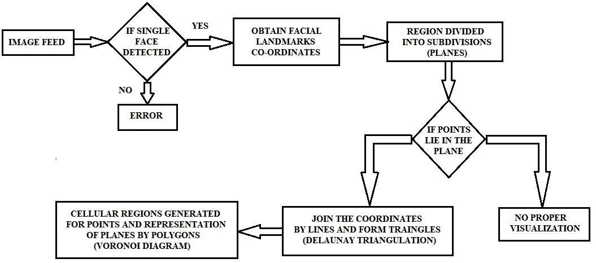
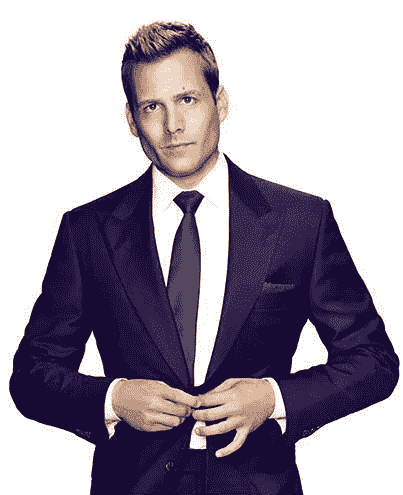
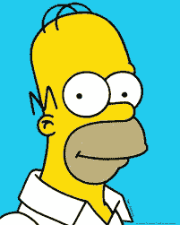
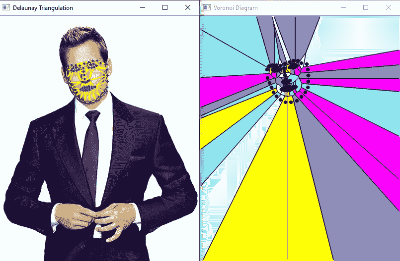
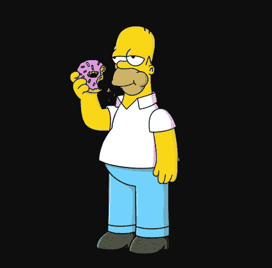

# 使用面部标志的 MachNEase-Delaunay 三角剖分和 Voronoi 图

> 原文：<https://medium.com/analytics-vidhya/machnease-delaunay-triangulation-and-voronoi-diagram-using-facial-landmarks-2edbe2353ed5?source=collection_archive---------15----------------------->

> Nam 的 MachNEase——Nami tha Guruprasad 的《让机器学习变得简单》

从来没有人想过，不管遗传、地理和环境的差异，我们的面部形态是如何的相似！？我们太忙于生活中发生的事情了！！


由[托马斯·帕克](https://unsplash.com/@thomascpark?utm_source=medium&utm_medium=referral)在 [Unsplash](https://unsplash.com?utm_source=medium&utm_medium=referral) 拍摄的照片

在我之前的[帖子](/analytics-vidhya/machnease-simple-yawn-detector-using-facial-landmarks-994e6804d2ba)(是的，继续点击链接)中，我们已经在一个用例中展示了面部标志的用法。

*   **人的面部**由于各种面部肌肉的收缩，有效地交流和表达感情。
*   **颅面遗传学研究**已经实现了对三维系统的分析，该系统具有捕捉面部细节的能力。
*   *这篇文章是面部交换、变形等各种应用的重要一步。*



**使用面部标志理解 Delaunay 三角剖分和 Voronoi 图**

# **SQUIZ 基础！！！！！！！(惊鸿一瞥)**

*   表面细分对于主体实体的形状的渲染和实体的维度特征的平滑理解是重要的。
*   多边形外壳近似于真实表面平面表示的偏移。
*   不同的点可以有多个三角形。然而，在 **Delaunay** 机制中，没有点在任何三角形的外接圆内。
*   简而言之，它们避开了银三角形(带有极端锐角的细长三角形)
*   连接这些外接圆的中心(不共线的点)将导致**沃罗诺伊**图。这些外心充当顶点，边一起形成 Voronoi 镶嵌。
*   平面中的点(种子)表现出粘附特性，导致称为“细胞”或“区域”的局部块(类似于最近邻)。
*   于是，他们表现出一种**数学** [**二元性**](https://en.wikipedia.org/wiki/Duality_(mathematics)) **性质**。

听起来很有趣！？**辅助资源** - > [**1**](https://en.wikipedia.org/wiki/Delaunay_triangulation) **，** [**2**](https://en.wikipedia.org/wiki/Voronoi_diagram) **和** [**3**](https://www.learnopencv.com/delaunay-triangulation-and-voronoi-diagram-using-opencv-c-python/) (如果你在深入调查 XDXD 的基本面，无耻地要求你回到这个博客)。

# 将面部标志坐标存储在文件中:

*   找到面部的地标坐标——使用了在 ***dlib*** 库中实现的形状估计器

```
#obtain the image feed
#path of the file - if stored in the same directory. Else, give the relative path
**frame = cv2.imread([filename])** #[filename] - ex : "image.jpg" (path of the image)
#for detecting faces
**detector = dlib.get_frontal_face_detector()** #facial landmarks - identifier
**predictor = dlib.shape_predictor("shape_predictor_68_face_landmarks.dat")****gray = cv2.cvtColor(frame, cv2.COLOR_BGR2GRAY)**
#clahe - Contrast Limited Adaptive Histogram Equalization - to avoid over - brightness, contrast limitation and amplification of noise
#image is divided into small blocks called "tiles" (tileSize is 8x8 by default in OpenCV)
#if histogram bin is above the specified contrast limit - pixels are clipped and distributed uniformly
#here bi-polar interpolation is implemented
**clahe = cv2.createCLAHE(clipLimit=2.0, tileGridSize=(8,8))** #optional arguments
**clahe_image = clahe.apply(gray)**
```

*   我选择了 [**哈维·斯佩克特**](https://suits.fandom.com/wiki/Harvey_Specter) 和 [**荷马·辛普森**](https://en.wikipedia.org/wiki/Homer_Simpson) 作为我的模特。



**“我没有梦想，我有目标”**



**“嗯……甜甜圈”**

*   估计器给 **68 个标志点**，包括眼角、鼻尖、嘴唇等
*   检测到的面部上的标志坐标现在堆叠在文本文件中

```
#detect the faces in the image
**detections = detector(clahe_image, 1) 
for k,d in enumerate(detections):**
    #for every detected face
    #create a text file to save the landmark coordinates
    **coordinates_txt = open([filename] + ".txt","w")** #[filename] - ex : "abc" **
    shape = predictor(clahe_image, d) 
    for i in range(1,68):**
        #68 landmark points on each face
        **cv2.circle(frame, (shape.part(i).x, shape.part(i).y), 1, (0,0,255), thickness=2)** #For each point, draw a red circle with thickness2 on the frame
        **coordinates_txt.write(str(shape.part(i).x) + " " + str(shape.part(i).y) + "\n")**
        #drawing the landmarks with thickness 3 - yellow in color#display the imageframe
**cv2.imshow("image", frame)**
```

# 理解 DELAUNAY 三角剖分和 VORONOI 图；

*   **检查**该点是否在定义的平面/区域内

```
**def region(plane, point):** # to check if the point is inside the plane / region defined
    **if point[0] < plane[0]:
        return False
    elif point[1] < plane[1]:
        return False
    elif point[0] > plane[2]:
        return False
    elif point[1] > plane[3]:
        return False
    return True**
```

*   基于 **Delaunay 条件**执行区域细分并生成三角形(查看基础部分)

```
**def delaunay_triangulation(image, subdiv, color):**
    #subdivision surface evaluation for the image (shape, surface etc)
    #color for drawing of lines for the traingulation in the region
   ** triangles = subdiv.getTriangleList();**
    #triangle list is generated for the subdivisioned area
 **size = image.shape**    #image size is calculated
 **p = (0, 0, size[1], size[0])**    #plane demarkation to check if the points lie in the region
   ** for tr in triangles:
        p1 = (tr[0], tr[1])
        p2 = (tr[2], tr[3])
        p3 = (tr[4], tr[5])
        if region(p, p1) and region(p, p2) and region(p, p3):**
            #if the points lie in the plane, then connect the dots
            **cv2.line(image, p1, p2, color, 1, cv2.LINE_AA, 0)
            cv2.line(image, p2, p3, color, 1, cv2.LINE_AA, 0)
            cv2.line(image, p3, p1, color, 1, cv2.LINE_AA, 0)**
```

*   **用多边形镶嵌**图像的表面，以便更好地细分平面，**生成**“种子”用于构建**芙诺以图**

```
**def draw_voronoi(image, subdiv):**
    **(facets, centers) = subdiv.getVoronoiFacetList([])**
    #points in the plane - set of seeds
    #each seed - consists of region with all points closer to the seed than any other
    #similar to nearest neighbour algorithm
    **array_colors = [[255,0,255],[255,248,220],[188,143,143],[0,255,255],[240,230,140]]**
    #colors for the set of planes 
    **for i in range(0,len(facets)) :
        ifacet_arr = []
        for f in facets[i] :
            ifacet_arr.append(f)
        ifacet = np.array(ifacet_arr, np.int)
        color = array_colors[random.randint(0,4)]**
        #random colors for different polygons 
        **cv2.fillConvexPoly(image, ifacet, color, cv2.LINE_AA, 0);
        ifacets = np.array([ifacet])
        cv2.polylines(image, ifacets, True, (0, 0, 0), 1, cv2.LINE_AA, 0)
        cv2.circle(image, (centers[i][0], centers[i][1]), 3, (0, 0, 0), cv2.FILLED, cv2.LINE_AA, 0)**
```

# 可视化:(现在，这很有趣！！！！)

*   获取**图像馈送**

```
**img = cv2.imread([filename]);** #[filename] - ex : "image.jpg" (path of the image)
#create a copy / duplicate of the image 
**dup = img.copy();** #obtain image size
**size = img.shape**
```

*   创建一个**平面**及其**细分**

```
**plane = (0, 0, size[1], size[0])
subdiv = cv2.Subdiv2D(plane);**
```

*   提取**点阵列**以检查其在区域/平面图中的有效性

```
**points = []** #read the landmark coordinates from the "txt" file for validation
**with open([filename]) as file :** #[filename] - ex : "abc.txt" (path of the file) **for line in file :
        x, y = line.split()
        points.append((int(x), int(y)))**
```

*   **三角测量**带有一些修饰的机制

```
**for p in points :
    subdiv.insert(p)**
    #animate the triangulation
    **if True :**
        **copy = dup.copy()
**        #construct delaunay triangles 
        **delaunay_triangulation(copy, subdiv, (0, 255, 255));
        cv2.imshow('Delaunay Triangulation', copy)
        cv2.waitKey(100)****delaunay_triangulation( img, subdiv, (0, 255, 255) );**#marks the points on the image
**for p in points:
    cv2.circle(img, p, 2, (255,0,0), cv2.FILLED, cv2.LINE_AA, 0)**
```

*   构建 **Voronoi** 图

```
**img_voronoi = np.zeros(img.shape, dtype = img.dtype)
draw_voronoi(img_voronoi,subdiv)**
```

*   创建两个独立的**窗口**:

1.  **德劳内三角剖分**
2.  **芙诺以图**

```
cv2.imshow('Delaunay Triangulation',img)
cv2.imshow('Voronoi Diagram',img_voronoi)
cv2.waitKey(0)
```

# 执行:

转到您的终端并粘贴以下命令:(如果您已经将上述内容存储在 python 文件中。Jupyter 笔记本？？没关系，你很敬业！！)

```
**python filename.py** 
```

# 耶！！！你看到这有多酷了！！！当然，还有哈维·斯佩克特！；)



**“当你背靠着墙的时候，把那该死的东西打碎”**

荷马一无所获！！！(他被甜甜圈淹死了！！)



**“哦！!"**

## 等等！！你刚刚复制粘贴了所有该死的代码块吗？？？？？嗯，那很辛苦。没关系，你学到了新的令人兴奋的东西…

> 你可以在这里找到完整的代码:【https://github.com/nam1410/MachNEase-德劳内-三角测量-使用面部标志的 Voronoi 图

## 对机器学习、数据科学等感兴趣..？？：

在的帮助下潜入这片海洋

> [带 Nam 的机器](https://github.com/nam1410)

我将在我的个人资料中上传简单/可实施的项目，跟随令人惊叹的定制饲料的帐户。

*联系我*

> *领英:[https://www.linkedin.com/in/namitha-guruprasad-216362155/](https://www.linkedin.com/in/namitha-guruprasad-216362155/)*
> 
> *Namitha Guruprasad，学生，印度 Bengaluru*