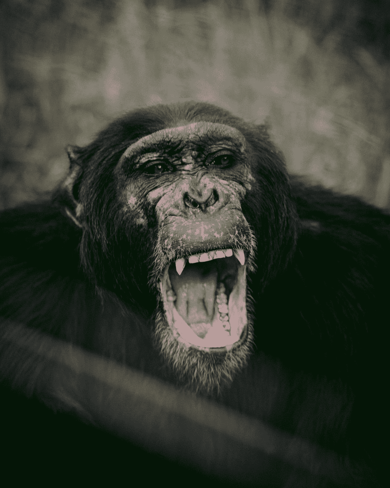
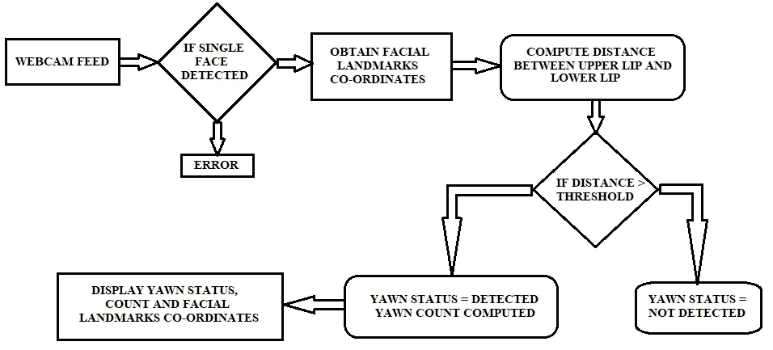
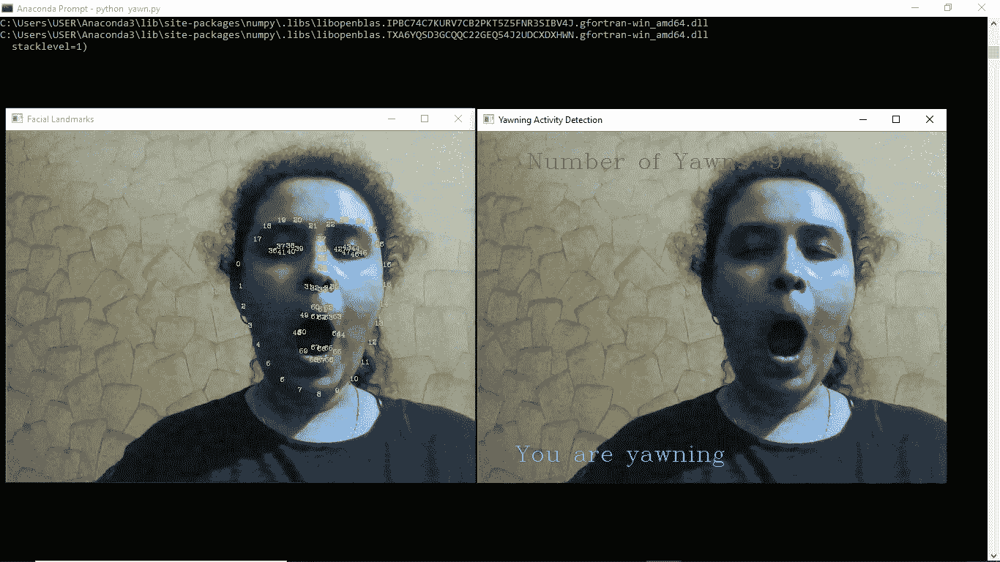

# MachNEase——使用面部标志的简单哈欠活动检测

> 原文：<https://medium.com/analytics-vidhya/machnease-simple-yawn-detector-using-facial-landmarks-994e6804d2ba?source=collection_archive---------19----------------------->

> **Nam 的 MachNEase—Nami tha Guruprasad 的机器学习变得简单**

T2:有没有想过你每天打哈欠几次？！Naaayyy…我们有更好的事情要做！！！



照片由[姆旺吉·加塞卡](https://unsplash.com/@thirdworldhippy?utm_source=medium&utm_medium=referral)在 [Unsplash](https://unsplash.com?utm_source=medium&utm_medium=referral) 拍摄

好奇想知道你打哈欠的次数吗？嗯，你就差一步了！！

*   **人的面部**由于各种面部肌肉的收缩，有效地交流和表达感情。
*   极度疲劳、无聊和缺乏兴趣是嗜睡和最终打哈欠的根本原因。
*   **确定面部标志**是检测打哈欠活动的根本方法。
*   因此，使用**计算机视觉可以设计出有效的面部图像处理系统是合乎逻辑的。**



**使用面部标志检测哈欠的工作流程**

# 安装和导入基本库:

*   **OpenCV —** 主要针对实时计算机视觉的编程函数库([文档](https://opencv.org/)

```
**pip install opencv-python**
```

*   **DLib —** 用 C++编写的通用跨平台软件库([文档](http://dlib.net/))

```
**pip install dlib**
```

*   **NumPy—**Python 编程语言的库，增加了对大型多维数组和矩阵的支持，以及对这些数组进行操作的大量高级数学函数([文档](https://numpy.org/))

```
**pip install numpy**
```

现在，导入所有这些库:

```
**import cv2
import dlib
import numpy as np**
```

# 获取面部标志坐标:

*   为了找到面部上的界标坐标，使用在 ***dlib*** 库中实现的形状估计器。

```
**detector = dlib.get_frontal_face_detector()** #For detecting faces
**landmark_path="shape_predictor_68_face_landmarks.dat"** 
#Path of the file - if stored in the same directory. Else, give the relative path
**predictor = dlib.shape_predictor(landmark_path)** #For identifying landmarks
```

*   估计器给 **68 个标志点**，包括眼角、鼻尖、嘴唇等。
*   **识别网络摄像头中检测到的人脸数量**。*确保活动检测只有一个对象。*

```
#Obtaining Facial Landmark coordinates
**def get_facial_landmarks(image):
    face = detector(image, 1)**
    #Detecting faces in image
 **if len(face) > 1:**   **     return "Multiple faces detected in the frame!!"
    if len(face) == 0:
        return "No face detected in the frame!!"**
    #Return the coordinates
    #Predictor identifies all the 68 landmarks for the detected face
    **return np.matrix([[pred.x, pred.y] for pred in predictor(image, face[0]).parts()])**
```

*   **在检测到的人脸上标注 68 个人脸标志坐标**

```
#Drawing the landmarks : yellow in color 
**def landmarks_annotation(image, facial_landmarks):**
    #Different image window for facial landmarks
   ** image = image.copy()**
    **for coord, p in enumerate(facial_landmarks):**
        #Extracting coordinate values and the location / matrix of the coordinates
       ** position = (p[0, 0], p[0, 1])**
        #Identify and draw the facial landmarks
       ** cv2.putText(image, str(coord), position, cv2.FONT_HERSHEY_COMPLEX, 0.3, (0, 255, 255))
    return image**
```

# 计算嘴唇距离:

*   使用地标计算**上唇**的质心值

```
#Landmark coordinates for upper lip identified in the face 
**def upperlip(facial_landmarks):
    ulip = []**
    #create an array to store the landmark coordinates of the upper lip
    **for i in range(50,53):**
        #The range is predefined in "shape_predictor_68_face_landmarks.dat"
       ** ulip.append(facial_landmarks[i])**
   ** for i in range(61,64):**
        #The range is predefined in "shape_predictor_68_face_landmarks.dat"
        **ulip.append(facial_landmarks[i])**
    #Locate the mean value of the upper lip coordinates
   ** ulip_mean = np.mean(ulip, axis=0)
    return int(ulip_mean[:,1])**#centroid value
```

*   使用地标计算**下唇**的质心值

```
#Landmark coordinates for lower lip identified in the face 
**def lowerlip(facial_landmarks):
    llip = []**
    #create an array to store the landmark coordinates of the lower lip
   ** for i in range(65,68):**
        #The range is predefined in "shape_predictor_68_face_landmarks.dat"
       ** llip.append(facial_landmarks[i])
    for i in range(56,59):**
        #The range is predefined in "shape_predictor_68_face_landmarks.dat"
       ** llip.append(facial_landmarks[i])**
    #Locate the mean value of the lower lip coordinates
   ** llip_mean = np.mean(llip, axis=0)
    return int(llip_mean[:,1])**#centroid value
```

*   通过**使用上下嘴唇各自的质心计算上下嘴唇之间的距离**来检测打哈欠活动

```
#Detect the yawning activity
**def yawning(image):**
    #Obtain the facial Landmark coordinates
    **facial_landmarks = get_facial_landmarks(image)
    if type(facial_landmarks) == str:
        return image, 0**
    #Obtain the frame / image with annotated facial landmarks
 **landmarks_image = landmarks_annotation(image, facial_landmarks)**    #Obtain Lip centroids
   ** upperlip_centroid = upperlip(facial_landmarks)
    lower_lip_centroid = lowerlip(facial_landmarks)
**    #Calculate the distance between the centroids
   ** lips_dist = abs(upperlip_centroid - lower_lip_centroid)
    return landmarks_image, lips_dist**
```

# 显示哈欠状态并计数:(游戏现在开始！！！！)

*   **初始化打哈欠状态并计数**

```
**yawn_status = False 
yawn_count = 0**
```

*   **创建**现场直播**对象**

```
**video_capture = cv2.VideoCapture(0)**
```

*   **通过调用其函数检测打哈欠活动**

```
**while True:
    _, image_frame = video_capture.read()**
    #Identify the yawning activity
 **landmarks_image, lips_dist = yawning(image_frame)**    #Update the yawn status
 **previous_status = yawn_status**
```

*   检查嘴唇之间的**距离是否偏心**

*(阈值:主观)* ***【这是你的哈欠被检测到并被计数的地方:D】***

*   如果是，那么**显示**状态和你的哈欠数

```
#comes under while loop
#lips distance is subjective and changes from subject to subject based on their facial structures
   ** if lips_dist > 40:
        yawn_status = True
        output_text = " Number of Yawns: " + str(yawn_count + 1)
        cv2.putText(image_frame, "You are yawning", (50,450), cv2.FONT_HERSHEY_COMPLEX, 1,(255,255,0))
        cv2.putText(image_frame, output_text, (50,50), cv2.FONT_HERSHEY_COMPLEX, 1,(0,0,255))

    else:
        yawn_status = False 

    if previous_status == True and yawn_status == False:
        yawn_count += 1**
```

*   创建两个独立的**窗口**:

1.  **面部标志**
2.  **打哈欠活动**

```
**cv2.imshow('Facial Landmarks', landmarks_image )
cv2.imshow('Yawning Activity Detection', image_frame )**
```

*   **按 Q** 停止本次检测活动

```
**if cv2.waitKey(1)  & 0xFF == ord('q'):
        break**
```

*   清理你做过的乱七八糟的事情是一个好习惯。因此，终止网络摄像头对象并转储所有打开的窗口。

```
**video_capture.release()
cv2.destroyAllWindows()**
```

# 执行:

转到您的终端，粘贴以下命令:

这里，文件名:“哈欠 _ 检测器. py”

```
**python yawn_detector.py**
```

# 耶，耶！！！你刚打完呵欠，看到嘴巴大张！！！！！！



**是啊，我知道，我的脸好恶心:P**

## 等等！！你刚刚复制粘贴了所有该死的代码块吗？？？？？嗯，那很辛苦。没关系，你学到了新的令人兴奋的东西…

> 你可以在这里找到**的全部代码**:[https://github.com/nam1410/MachNEase——简单哈欠检测器使用面部标志](https://github.com/nam1410/MachNEase--Simple-Yawn-Detector-using-Facial-Landmarks)

## 对机器学习、数据科学等感兴趣..？？：

在的帮助下潜入这片海洋

> [**带 Nam 的机器**](https://github.com/nam1410)

我将在我的个人资料上传容易/可实施的项目。关注帐户，获取令人惊叹的定制内容。

***联系我:***

> **LinkedIn**:[https://www.linkedin.com/in/namitha-guruprasad-216362155/](https://www.linkedin.com/in/namitha-guruprasad-216362155/)
> 
> **Namitha Guruprasad，印度班加卢鲁的学生**