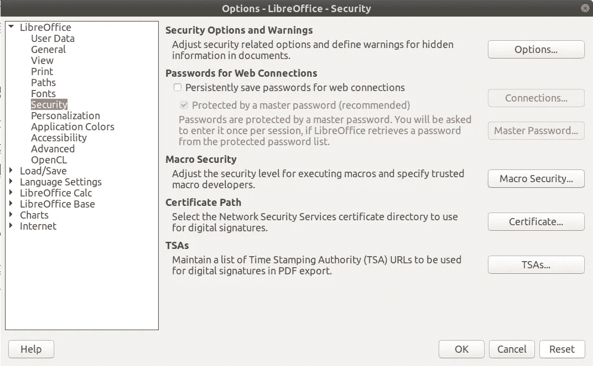
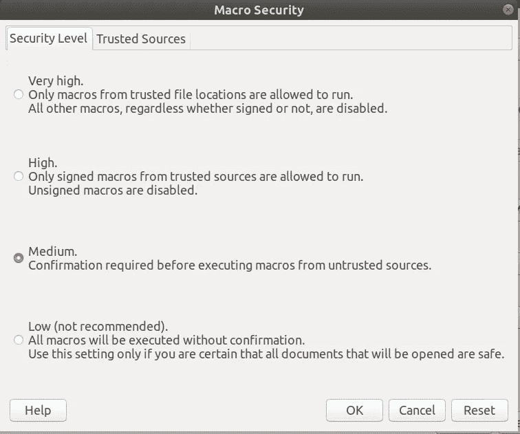

# 使用 Python 在 OpenOffice/LibreOffice 中进行宏编程[EN]

> 原文：<https://medium.com/analytics-vidhya/macro-programming-in-openoffice-libreoffice-with-using-python-en-a37465e9bfa5?source=collection_archive---------0----------------------->


开源世界正在飞速发展。为此，我已经开始学习 LibreOffice 中的宏编程。在我将要写的关于宏编程的前两三个故事中，我将主要使用这个[教程](http://christopher5106.github.io/office/2015/12/06/openoffice-libreoffice-automate-your-office-tasks-with-python-macros.html)。但它有一些缺失的部分，从零开始有点复杂。所以如果你有任何我没有提到的问题，你可以看看这个。

# **什么是图书馆办公室？**

LibreOffice 相当于开源软件界的微软 Office。还有一种类似 LibreOffice 的办公方式叫做 OpenOffice。OpenOffice 与 LibreOffice 几乎相同，我在 OpenOffice 中对 LibreOffice 所做的工作也是如此。如果你愿意，你可以从[这里](https://www.howtogeek.com/187663/openoffice-vs.-libreoffice-whats-the-difference-and-which-should-you-use/)看到它们之间的区别。

# **图书馆的组成**

图书馆办公室有四个主要部分。Writer 是文字处理器，Calc 是电子表格程序，Impress 是演示程序，Draw 是类似微软的 Visio 的程序。

# 开始使用宏

要开始在 LibreOffice 中使用宏，我们需要先进行设置。让我们现在做这些。

我们应该去**图书馆>工具>选项>图书馆>安全**



并更改**宏安全>介质**



这样，LibreOffice 将允许我们使用我们的宏，但也将保护我们免受我们不知道来源的宏的影响。

# 为什么是 Python？

宏是在 office 套件中运行的程序代码片段，有助于自动化日常任务。具体来说，在 LibreOffice API 中，多亏了通用网络对象(UNO ),这些代码可以用如此多的编程语言编写。其中有:Open/LibreOffice Basic(感谢 [Foad S Farimani](/@f.s.farimani?source=responses-----a37465e9bfa5----1----------------------------) 的更正:)、Java、C/C++、Javascript、Python。

那么我们应该使用哪种语言呢？由于 LibreOffice 是多平台的，我们可以在不同的平台上使用我们的文档，如 Mac、Windows 和 Linux。所以我们需要一种跨平台的语言来在不同的平台上运行我们的宏。因此，我们可以取消 Visual Basic。

Java 和 C/C++需要编译，更加复杂和冗长。所以我们也可以排除这些。

如果我们选择 JavaScript，我们在处理数字时可能会遇到一些问题。例如，它有舍入误差(Javascript 中的`0.1 + 0.2`不等于`0.3`)。所以我们也可以排除这个。但是 Python 在数值计算方面非常强大，这要归功于它的库。库 likeNumpy 和 Numexpr 非常适合这项工作。所以宏编程应该选择 Python 3。

# 从命令行连接到 LibreOffice

在我们创建自己的宏之前，让我们看看如何通过从命令行连接到 LibreOffice 来使用 Python 操作 LibreOffice。

首先，用一个打开的套接字启动 LibreOffice Calc，以便从 shell 进行通信。

对于 Linux:

```
soffice --calc --accept="socket,host=localhost,port=2002;urp;StarOffice.ServiceManager"
```

**更新**:我更新了我的 Libreoffice 之后，office command 就不再工作了。要联系 office，您可以这样写:

```
/opt/libreoffice$VERSION/program/soffice --calc --
```

$VERSION 是您的 libreoffice 版本。

对于 Mac OS:

```
/Applications/LibreOffice.app/Contents/MacOS/soffice --calc \
--accept**=**"socket,host=localhost,port=2002;urp;StarOffice.ServiceManager"
```

对于 Windows:

```
"C:\\Program Files (x86)\LibreOffice 5\program\soffice.exe" --calc --accept="socket,host=localhost,port=2002;urp;"
```

将这些命令写入注释行，这将打开 Calc。

(如果您有任何问题，请看一下[提出的解决方法](http://www.openoffice.org/udk/python/python-bridge.html)。)

现在我们必须打开 Python Shell。

对于 Linux:

我们需要开放另一个终端，因为这个终端正忙于开放图书馆。在新的终端中写下这个。

```
python3
```

***更新:*** *这可能会在您尝试下一个命令时给出此错误:*

```
ModuleNotFoundError: No module named ‘uno
```

如果发生这种情况，你应该使用 LibreOffice 附带的 Python 解释器。您可以在:找到它

```
/opt/libreoffice$VERSION/program/python
```

对于 Mac OS:

```
/Applications/LibreOffice.app/Contents/MacOS/python
```

*(更新)Mac OS 的正确路径(感谢* [Foad S Farimani](/@f.s.farimani?source=post_page-----f6b6eb540c07--------------------------------) ):

```
*/Applications/LibreOffice.app/Contents/Resources/python*
```

对于 Windows:

```
"C:\\Program Files (x86)\LibreOffice 5\program\python.exe"
```

现在我们在打开的 Python Shell 上写这些代码。

```
import socket  *# only needed on win32-OOo3.0.0*
import uno*# get the uno component context from the PyUNO runtime*
localContext **=** uno**.**getComponentContext()*# create the UnoUrlResolver*
resolver **=** localContext**.**ServiceManager**.**createInstanceWithContext(
				"com.sun.star.bridge.UnoUrlResolver", localContext )*# connect to the running office*
ctx **=** resolver**.**resolve( "uno:socket,host=localhost,port=2002;urp;StarOffice.ComponentContext" )
smgr **=** ctx**.**ServiceManager*# get the central desktop object*
desktop **=** smgr**.**createInstanceWithContext( "com.sun.star.frame.Desktop",ctx)*# access the current writer document*
model **=** desktop**.**getCurrentComponent()
```

这些行对于每个文档(文本、电子表格、演示文稿、绘图)都是常见的。

现在让我们与文档进行交互。

因为我们用参数`--calc`打开 LibreOffice，所以让我们试试电子表格命令。

```
*# access the active sheet*
active_sheet **=** model**.**CurrentController**.**ActiveSheet

*# access cell C4*
cell1 **=** active_sheet**.**getCellRangeByName("C4")

*# set text inside*
cell1**.**String **=** "Hello world"

*# other example with a value*
cell2 **=** active_sheet**.**getCellRangeByName("E6")
cell2**.**Value **=** cell2**.**Value **+** 1
```

如果我们用`--writer` 参数打开 LibreOffice，我们还可以做以下操作。

```
*# access the document's text property*
text **=** model**.**Text

*# create a cursor*
cursor **=** text**.**createTextCursor()

*# insert the text into the document*
text**.**insertString( cursor, "Hello World", 0 )
```

恭喜你！现在你可以用 Python 从外部控制 LibreOffice。我在这里完成这个。在我的下一篇文章中，我将讨论嵌入式宏。再见:)

要查看更高级的例子，您可以查看我为这个博客系列创建的知识库。

[](https://github.com/rebahozkoc/libreofficepythonmacros) [## GitHub-rebahozkoc/libre office Python macros:libre office Python 宏示例

### LibreOffice Python Macros 是一个处理 LibreOffice 文档的项目。项目是用 Python 写的。它有…

github.com](https://github.com/rebahozkoc/libreofficepythonmacros) 

创建本系列文章时，我会参考以下重要资源:

[](https://muhammetkara.com/) [## 穆罕默德·卡拉

muhammetkara.com](https://muhammetkara.com/) [](http://christopher5106.github.io/office/2015/12/06/openoffice-libreoffice-automate-your-office-tasks-with-python-macros.html) [## OpenOffice / LibreOffice 中面向接口的编程:用 Python 自动化您的办公任务…

### OpenOffice 和 LibreOffice 是主要的开源办公套件，开源相当于微软的 Office，以…

christopher5106.github.io](http://christopher5106.github.io/office/2015/12/06/openoffice-libreoffice-automate-your-office-tasks-with-python-macros.html)  [## www.pitonyak.org/oo.php

### Andrew Pitonyak 我的 OpenOffice.org 宏文档(更新于美国东部时间 2015 年 6 月 12 日 11:19:53 PM)包含许多示例。这个…

www.pitonyak.org](http://www.pitonyak.org/oo.php)