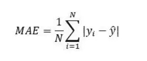
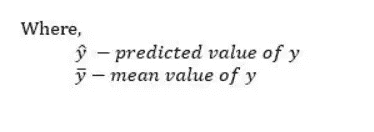
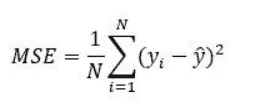
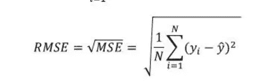
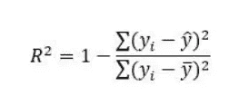
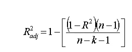

# MAE、MSE、RMSE、决定系数、调整后的 R 平方——哪个指标更好？

> 原文：<https://medium.com/analytics-vidhya/mae-mse-rmse-coefficient-of-determination-adjusted-r-squared-which-metric-is-better-cd0326a5697e?source=collection_archive---------0----------------------->

线性回归的目的是找到一条使所有数据点的预测误差最小的直线。

任何机器学习模型的基本步骤是评估模型的准确性。均方差、平均绝对误差、均方根误差和 R 平方或决定系数度量用于评估回归分析中模型的性能。

*   平均绝对误差表示数据集中实际值和预测值之间绝对差值的平均值。它测量数据集中残差的平均值。

*   均方误差表示数据集中原始值和预测值之间的平方差的平均值。它测量残差的方差。

*   均方根误差是均方误差的平方根。它测量残差的标准偏差。

*   决定系数或 R 平方表示线性回归模型所解释的因变量中方差的比例。这是一个无标度分数，即无论数值大小，R 平方的值都小于 1。

*   调整后的 R 平方是 R 平方的修改版，它针对模型中自变量的数量进行调整，并且它将始终小于或等于 R，在下面的公式中 **n** 是数据中的观测值数量， **k** 是数据中自变量的数量。

## 这些评估指标之间的差异

*   相对于平均绝对误差(MAE ),均方误差(MSE)和均方根误差对大的预测误差不利。但是，RMSE 比 MSE 更广泛地用于评估回归模型与其他随机模型的性能，因为它与因变量(Y 轴)具有相同的单位。
*   MSE 是一个可微函数，与 MAE 这样的不可微函数相比，它更容易执行数学运算。因此，在许多模型中，RMSE 被用作计算损失函数的默认指标，尽管它比 MAE 更难解释。
*   MAE、MSE 和 RMSE 的值越低，意味着回归模型的精确度越高。然而，更高的 R 平方值被认为是可取的。
*   R 平方和调整的 R 平方用于解释线性回归模型中的自变量如何解释因变量的可变性。r 的平方值总是随着自变量的增加而增加，这可能导致模型中冗余变量的增加。然而，调整后的 R 平方解决了这个问题。
*   调整后的 R 平方考虑了预测变量的数量，并用于确定模型中独立变量的数量。如果额外变量增加的 R 平方不够显著，则调整后的 R 平方的值会减少。
*   要比较不同线性回归模型的精度，RMSE 是比 R 平方更好的选择。

**结论**

RMSE 和 R 平方都量化了线性回归模型对数据集的拟合程度。RMSE 表示回归模型预测响应变量绝对值的能力，而 R 平方表示预测变量解释响应变量变化的能力。