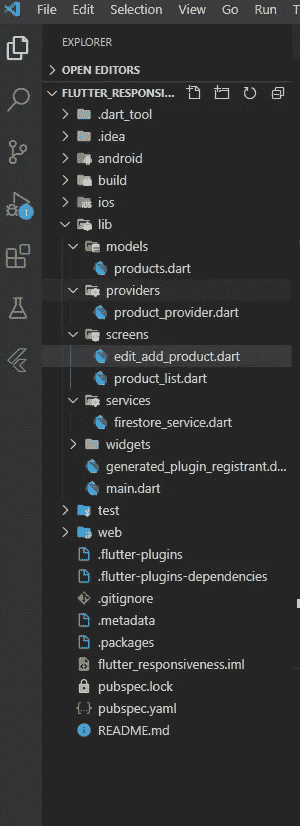

# 颤动、供应商和 Firestore 的魔力

> 原文：<https://medium.com/analytics-vidhya/magic-of-flutter-provider-and-firestore-66f1a86903c3?source=collection_archive---------2----------------------->


大家好，今天我们将通过简单的步骤学习 firestore 作为后端的 flutter。在开始阅读本文之前，您应该已经在您的应用程序中集成了一个 firebase，并设置了一个 firestore 作为带有测试模式的数据库。我们将为产品建立一个简单的应用程序，并在其上应用 CRUD 操作。

第一步:让我们先进入项目结构，你必须有和我一样的项目结构，这样事情会对你更清楚。



步骤 2:将以下依赖项复制粘贴到您的 pubspec.yaml 文件中:

```
**cloud_firestore**: ^0.13.4+2
**provider**: ^4.0.5
**uuid**: ^2.0.4
```

1.  cloud_firestore:这允许在我们的 flutter 应用程序中使用 firestore 函数。
2.  提供商:这将用于管理我们的应用程序的状态，即区分用户界面和逻辑部分。
3.  UUID:这个包将被用来生成一个产品的 ID。

步骤 3:首先转到 models 文件夹并创建一个 product.dart 类。模型类基本上被称为用户生成的数据类型，其中数据根据用户需求进行分类。

```
**class** Product{
  String **productId**;
  String **productName**;
  double **price**;

  Product({**this**.**price**,**this**.**productId**,**this**.**productName**});

  Map<String,**dynamic**> createMap(){
    **return** {
      **'productId'**: **productId**,
      **'productName'**: **productName**,
      **'productPrice'**: **price** };
  }

  Product.fromFirestore(Map<String,**dynamic**> firestoreMap): 
**productId** = firestoreMap[**'productId'**],
   **productName** = firestoreMap[**'productName'**],
   **price** = firestoreMap[**'productPrice'**];
}
```

在这个类中，我们有三个属性:

a)字符串 productId。

b)字符串 productName。

c)双倍价格。

我们创建了一个命名的构造函数，即顺序，而传递数据给构造函数是没有必要的。

product.dart 模型类中定义了两个函数:

1.  Map <string dynamic="">createmap():这意味着它将产品属性转换成地图，并将其作为地图返回。</string>
2.  product . from Firestore(Map < String，dynamic firestoreMap):这意味着 firestore 以地图的形式返回数据，因此该方法用于将地图转换为属性，这意味着 create map 函数反之亦然。

步骤 4:转到 provider 文件夹，在其中创建一个名为 products_provider.dart 的新类，并将以下代码复制粘贴到其中。

```
**class** ProductProvider **with** ChangeNotifier{
  String **_name**;
  String **_productId**;
  double **_price**;

//getters: String **get getName** => **_name**;
  double **get getPrice** => **_price**;

*//Setters:* **void** changeProductName(String val) {
    **_name** = val;
    notifyListeners();
  }

  **void** changeProductPrice(String val) {
    **_price** = double.*parse*(val);
    notifyListeners();
  }
```

我们创建了三个私有属性下划线将属性定义为私有，并且简单地为我们的属性创建了 getters 和 setters。因为我们没有得到任何产品 id 和设置，因为它将是动态或自动生成的。

步骤 5:转到 main.dart，删除所有代码，并复制粘贴以下代码:

```
**import 'package:flutter/material.dart'**;
**import 'package:flutter_responsiveness/providers/product_provider.dart'**;
**import 'package:flutter_responsiveness/screens/edit_add_product.dart'**;
**import 'package:provider/provider.dart'**;
**import './screens/product_list.dart'**;
**import './services/firestore_service.dart'**;**void** main()=>runApp(MyApp());

**class** MyApp **extends** StatelessWidget {
  @override
  Widget build(BuildContext context) {
    **return** MultiProvider(
      providers: [
        ChangeNotifierProvider.value(value: ProductProvider()),
      ],
          child: MaterialApp(
        debugShowCheckedModeBanner: **false**,
        theme: ThemeData(
          primaryColor: Colors.*blueAccent*[700],
          accentColor: Colors.*indigoAccent*[700],
          canvasColor: Colors.*white*,
        ),
        home: ProductList(),
      ),
    );
  }
}
```

多提供商使我们能够在我们的应用程序中使用多个提供商。它包含接受提供者数组的提供者属性和包含小部件的子属性。

步骤 6:转到屏幕文件夹，创建一个名为 product_list.dart 的新文件，并复制粘贴以下代码:

```
**import 'package:flutter/material.dart'**;

**class** ProductList **extends** StatelessWidget {
  @override
  Widget build(BuildContext context) {
    **return** Scaffold(
      appBar: AppBar(
        title: Text(**'Product'**),
        actions: [
          IconButton(
            icon: Icon(
              Icons.*add*,
            ),
            onPressed: () {},
          ),
        ],
      ),
    );
  }
}
```

简单地说，我们有一个带有标题和动作的图标按钮的应用程序栏小部件。动作是在应用程序栏右侧定义的小部件。

步骤 7:在 screens 文件夹中创建另一个名为 edit_add_product.dart 的类，并复制粘贴以下代码:

```
**import 'package:flutter/material.dart'**;
**import 'package:provider/provider.dart'**;
**import '../providers/product_provider.dart'**;

**class** AddEditProduct **extends** StatefulWidget {
  **static const** *routeArgs* = **'/add-edit-screen'**;

  @override
  _AddEditProductState createState() => _AddEditProductState();
}

**class** _AddEditProductState **extends** State<AddEditProduct> {
  **final _formKey** = GlobalKey<FormState>();**final nameController** = TextEditingController();
**final priceController** = TextEditingController();@override
**void** dispose() {
  **super**.dispose();
  **nameController**.dispose();
  **priceController**.dispose();
}
  @override
  Widget build(BuildContext context) {
    **final** productProvider = Provider.*of*<ProductProvider>(context);
    **return** Scaffold(
      appBar: AppBar(
        title: Text(**'Add or Edit Product'**),
      ),
      body: Center(
          child: Form(
        key: **_formKey**,
        child: SingleChildScrollView(
          child: Padding(
            padding: **const** EdgeInsets.all(10.0),
            child: Column(
              children: [
                TextFormField( controller: **nameController**,                                                     validator: (value) {
                    **if** (value.**isEmpty**) {
                      **return 'Please Enter Name'**;
                    }
                    **return null**;
                  },
                  decoration: InputDecoration(
                    hintText: **'Enter Product Name'**,
                  ),
                  onChanged: (val) => productProvider.changeProductName(val),
                ),
                TextFormField( controller: **priceController**,
                  validator: (value) {
                    **if** (value.**isEmpty**) {
                      **return 'Please Enter Price'**;
                    }
                    **return null**;
                  },
                  decoration: InputDecoration(
                    hintText: **'Enter Product Price'**,
                  ),
                  onChanged: (value) =>
                      productProvider.changeProductPrice(value),
                ),
                SizedBox(
                  height: 20,
                ),
                RaisedButton(
                  child: Text(**'Save'**),
                  onPressed: () {

                  },
                  color: Theme.*of*(context).**accentColor**,
                  textColor: Colors.*white*,
                ),
                RaisedButton(
                  child: Text(**'Delete'**),
                  onPressed: () {
                  },
                  color: Colors.*red*,
                  textColor: Colors.*white*,
                )
              ],
            ),
          ),
        ),
      )),
    );
  }
}
```

onchanged 方法采用参数化函数，该函数包含字符串数据，我们还使用产品提供者的 setter 来更改产品的名称和价格。

正如你所看到的，我们正在使用表单，我已经在 flutter 中介绍了表单，所以你可以查看我的表单及其验证的中间文章:

[](/@mashoodsidd97/forms-and-its-validation-in-flutter-1c2b3f9c985c) [## 颤振中的形式及其验证

### 大家好，我希望你们都做得很好，今天我们将讨论一个 flutter 应用程序中的表单，这篇文章…

medium.com](/@mashoodsidd97/forms-and-its-validation-in-flutter-1c2b3f9c985c) 

此外，代码有多个可用的小部件，我们也可以进行一些代码重构，我的这篇文章深入而简单地解释了代码重构的步骤，请点击此处:

[](/@mashoodsidd97/refactoring-flutter-widgets-into-sub-widgets-3cf0f1f29645) [## 将 Flutter 小部件重构为子小部件

### 大家好，今天我将讨论构建一个 flutter 应用程序最重要的部分是代码重构…

medium.com](/@mashoodsidd97/refactoring-flutter-widgets-into-sub-widgets-3cf0f1f29645) 

我不会做任何代码重构或表单解释，因为这篇文章太长了。

现在让我们转向 flutter 的 CRUD 操作，

步骤 8:转到 services，创建一个名为 firestore_services.dart 的新文件，并将以下代码复制粘贴到其中:

```
**import 'package:cloud_firestore/cloud_firestore.dart'**;
**import 'package:flutter_responsiveness/models/product.dart'**;

**class** FireStoreService {
  Firestore **_db** = Firestore.*instance*;

  Future<**void**> saveProduct(Product product) {
    **return _db** .collection(**'Products'**)
        .document(product.**productId**)
        .setData(product.createMap());
  }

  Stream<List<Product>> getProducts() {
    **return _db**.collection(**'Products'**).snapshots().map((snapshot) => snapshot
        .**documents** .map((document) => Product.fromFirestore(document.**data**))
        .toList());
  }

  Future<**void**> removeItem(String productId) {
    **return _db**.collection(**'Products'**).document(productId).delete();
  }
}
```

Firestore 以收集和文档为基础。这是一种不同于 SQL 数据库的方法。

1.  保存产品:这种方法将数据保存到我们的 firestore 中。我写的代码意味着 firestore 在集合上工作，这是一种不同于 SQL 数据库的方法，我们创建了一个 firestore 实例来使用它的功能。_db.collections('产品')表示转到 firestore 并添加一个包含产品和串联的新集合。documents 意味着我们在集合内部传递我们自己的自定义 id，setData 意味着我们希望保存在这个集合中的数据，它应该是 Map 的形式。
2.  GetProducts:这个方法返回一个流。一个流就像一个管道，你在一端放一个值，如果在另一端有一个监听器，这个监听器将会接收这个值。一个流可以有多个侦听器，当它被放入管道时，所有这些侦听器将接收相同的值。代码行解释:

```
**_db**.collection(**'Products'**).snapshots().map((snapshot) => snapshot
        .**documents** .map((document) => Product.fromFirestore(document.**data**))
        .toList());
```

这意味着转到产品集合，获取返回数据流的快照，并对其进行映射，这意味着映射您从流中获得的数据，这需要一个函数，在该函数中，我们访问产品集合中的文档，并且还映射该文档，因为 firestore 以映射的形式返回数据，所以我们需要将其转换为属性，以便我们可以将它们填充到我们的小部件中，因为我们已经创建了该方法 它将 map 转换为产品模型类中的属性，即来自 firestore 的属性，因此我们可以访问它并传递文档。 toList()放在方法的末尾，以列表的形式返回数据。

3.移除项目方法:该方法只需获取一个产品 id，并将其从应用程序和后端删除，由于我们使用的是流，我们不需要刷新应用程序来查看更改，流使我们更容易检测应用程序中的实时更改。

步骤 9:现在转到 products_provider.dart 类:

a)导入 Firestore 服务类别和 UUID:

```
**import '../services/firestore_service.dart'**;
**import 'package:uuid/uuid.dart'**;
```

b)在 ProductProvIDer 和 UUID 中创建 products_provider 的最终字段以获得随机 id

```
**final service** = FireStoreService();
**var uuid** = Uuid();
```

c)现在在产品提供商内部创建一个方法，将数据保存到 firestore 中:

```
**void** saveData() {
**var** newProduct =    Product(productName: **getName**, productId: **uuid**.v4(), price: **getPrice**);**service**.saveProduct(newProduct);}
```

与在我们的服务类中一样，我们的 saveProduct 将产品模型类作为参数，因此我们需要首先定义一个产品，然后将其传递到保存产品的参数中，其中 getName 是设置为 edit_add_product.dart 类的名称，如下所示:

```
TextFormField(
  validator: (value) {
    **if** (value.**isEmpty**) {
      **return 'Please Enter Name'**;
    }
    **return null**;
  },
  controller: **nameController**,
  decoration: InputDecoration(
    hintText: **'Enter Product Name'**,
  ),
  onChanged: (val) => productProvider.changeProductName(val),
),
```

getPrice 也是如此。产品是 UUID.v4，这将是我们在 firestore 中添加的每个产品的唯一 ID。

步骤 10:让我们回到 edit_add_product.dart 类，转到 Save Raised Button compressed 方法，用下面的代码替换 Save Raised Button 的代码:

```
RaisedButton(
  child: Text(**'Save'**),
  onPressed: () {
    **if**(**_formKey**.**currentState**.validate())
    {
    productProvider.saveData();
    Navigator.*of*(context).pop();
  }
  },
  color: Theme.*of*(context).**accentColor**,
  textColor: Colors.*white*,
),
```

在这种情况下，我们验证表单，如果输入了所有字段，则将数据保存到 firebase，pop 意味着在将数据添加到 firestore 后，立即从屏幕堆栈中弹出屏幕。

现在运行应用程序，按下应用程序栏上的“+”按钮，然后输入产品名称和价格，您会看到数据已添加到 firestore 中。

第十一步:让我们回到正题。dart 文件，因为我们以流的形式获得产品数据，所以我们也必须注册它，这是我在 flutter 应用程序中使用 firestore 的方法。也有不同的方法，您可以在文档中找到更多信息，或者在 googling 上搜索不同的方法。让我们回到正题，更换主。dart 代码与此代码:

```
**import 'package:flutter/material.dart'**;
**import 'package:flutter_responsiveness/providers/product_provider.dart'**;
**import 'package:flutter_responsiveness/screens/edit_add_product.dart'**;
**import 'package:provider/provider.dart'**;
**import './screens/product_list.dart'**;
**import './services/firestore_service.dart'**;
**void** main()=>runApp(MyApp());

**class** MyApp **extends** StatelessWidget {
  @override
  Widget build(BuildContext context) {
        **final** firestoreService = FireStoreService();

    **return** MultiProvider(
      providers: [
        ChangeNotifierProvider.value(value: ProductProvider()),
        StreamProvider.value(value: firestoreService.getProducts()),
      ],
          child: MaterialApp(
        debugShowCheckedModeBanner: **false**,
        theme: ThemeData(
          primaryColor: Colors.*blueAccent*[700],
          accentColor: Colors.*indigoAccent*[700],
          canvasColor: Colors.*white*,
        ),
        home: ProductList(),
      routes: {
        AddEditProduct.*routeArgs*:(ctx)=>AddEditProduct(),
      },
      ),
    );
  }
}
```

我们使用 stream provider 从 firebase 获取所有产品，以获得对我们的数据采取的每个操作的更新。

步骤 12:现在转到 product_list.dart 并复制粘贴以下代码:

```
**import 'package:flutter/material.dart'**;
**import 'package:flutter_responsiveness/models/product.dart'**;
**import 'package:flutter_responsiveness/screens/edit_add_product.dart'**;
**import 'package:provider/provider.dart'**;

**class** ProductList **extends** StatelessWidget {
  @override
  Widget build(BuildContext context) {
    **final** productList = Provider.*of*<List<Product>>(context);
    **return** Scaffold(
      appBar: AppBar(
        title: Text(**'Product'**),
        actions: [
          IconButton(
            icon: Icon(
              Icons.*add*,
            ),
            onPressed: () {
          Navigator.*of*(context).pushNamed(AddEditProduct.*routeArgs*);
            },
          ),
        ],
      ),
      body: productList != **null** ? ListView.builder(
              itemCount: productList.**length**,
              itemBuilder: (ctx, i) => ListTile(
                title: Text(productList[i].**productName**),
                trailing: Text(productList[i].**price**.toString()),
                onTap: () => Navigator.*of*(context)
                    .pushNamed(AddEditProduct.*routeArgs*, arguments: {
                  **'productId'**: productList[i].**productId**,
                  **'productName'**: productList[i].**productName**,
                  **'productPrice'**: productList[i].**price**,
                }),
              ),
            )
          : Center(
              child: CircularProgressIndicator(),
            ),
    );
  }
}
```

我们创建了一个供应商产品列表。因为“of”是一个泛型类型，所以我们需要在<>括号中传递数据类型。所以我们通过了列表<products>，因为我们想要得到所有的产品。创建正文部分我们使用三元运算符检查，如果产品不为空，则创建一个 listview.builder，其中 item count 是列表项的长度，builder 获取每个项的上下文和索引。我们使用粗箭头符号返回列表平铺窗口小部件，标题和尾部表示它将位于屏幕的最右侧，我们还使用了列表平铺窗口小部件上的 tap，在该窗口小部件中，我们将转到 Add_Edit_product 类，参数表示我们要传递给该类的数据，我们将地图数据传递给 add_edit_product， 除非你需要将数据传递给正在进行的类，否则并不总是需要使用参数，同样在这之后':'我们返回循环进度指示器，当我们获得数据时，它将自动隐藏，我们的列表视图将填充数据。</products>

让我们热重启应用程序，并检查您的第一个屏幕将填充您输入的数据。

步骤 13:现在是更新数据的时候了，首先转到产品提供者并在里面保存数据拷贝-替换以下代码:

```
**void** saveData() {
  **if** (**_productId** == **null**) {
    **var** newProduct =
        Product(productName: **getName**, productId: **uuid**.v4(), price: **getPrice**);
    **service**.saveProduct(newProduct);
  } **else** {
    **var** updatedProduct =
        Product(productName: **getName**, price: **getPrice**, productId: **_productId**);
    **service**.saveProduct(updatedProduct);
  }
}
```

我们在这里检查产品 id 是否为空，这意味着如果我们发现任何产品 id，我们将向 firestore 添加新数据，这意味着我们将向 Firestone 更新该数据。

步骤 14:让我们转向 add_edit_products 并在其中创建 init 状态:

```
@override
**void** initState() {
  **super**.initState();
  **new** Future.delayed(Duration(microseconds: 10), () {
    **routeData** =
        ModalRoute.*of*(**context**).**settings**.**arguments as** Map<String, **dynamic**>;
  }).then((_) => **routeData** == **null** ? **new** Future.delayed(Duration.*zero*, () {
          clearData();
          **final** productProvider =
              Provider.*of*<ProductProvider>(**context**, listen: **false**);
          productProvider.loadValues(Product());
        })
      : Future.delayed(Duration.*zero*, () {
          print(**routeData**);
          **nameController**.**text** = **routeData**[**'productName'**];
          **priceController**.**text** = **routeData**[**'productPrice'**].toString();

          **final** productProvider =
              Provider.*of*<ProductProvider>(**context**, listen: **false**);
          Product p = Product(
            productId: **routeData**[**'productId'**],
            price: **routeData**[**'productPrice'**],
            productName: **routeData**[**'productName'**],
          );
          productProvider.loadValues(p);
        }));
}
```

我们将产品列表中的数据作为映射参数传递给 add_edit_product 类，因此我们接受它，如下所示:

```
**routeData** =
        ModalRoute.*of*(**context**).**settings**.**arguments as** Map<String, **dynamic**>;
```

由于 init，状态不能直接访问上下文，因为它是有状态小部件的第一个生命周期方法，所以要访问 init 状态中的上下文，我们使用 Future。延迟，其中包含持续时间和方法，这意味着当给定的操作在未来完成时，我们希望运行这些代码行，因此在内部，我们检查路线数据是否为空，然后我们在文本字段中输入新数据，否则我们将更新文本字段中的数据，这些数据将自动填充以供编辑。

因为如果我们编辑或添加一个产品，数据将一直存在，所以我们需要加载并告诉提供者，所以我们将在 products_provider.dart 类中创建一个新方法:

```
loadValues(Product product) {
  **_name** = product.**productName**;
  **_price** = product.**price**;
  **_productId** = product.**productId**;
}
```

这个方法根据添加或更新数据来更新我们的状态。

现在运行应用程序，点击列表项，您会看到数据已填充到文本字段中，尝试更改字段中的数据，然后点击保存，您会看到应用程序中的数据因 streams 和 firestore 而更新。

步骤 15:现在让我们从 Firestore 中删除该项目，转到 products_provider 类并添加该方法:

```
**void** removeData() {
  **service**.removeItem(**_productId**);
}
```

此方法将从 firestore 中移除该项目。

步骤 16:让我们转到 add_edit_product 类，在第二个凸起的 delete 按钮内用下面的代码替换它:

```
RaisedButton(
  child: Text(**'Delete'**),
  onPressed: () {
    productProvider.removeData();
    Navigator.*of*(context).pop();
  },
  color: Colors.*red*,
  textColor: Colors.*white*,
)
```

这将删除以下数据，并从屏幕堆栈中弹出屏幕。

从头开始运行应用程序，并通过添加、更新和删除以及读取数据进行检查。

如有任何疑问，请给我留言或评论。

今天到此为止。对于 firestore 和 provider 来说，这确实是一次深度探索和一篇大文章。

我已经尽了很大努力用最简单的方式来写这篇文章，所以不要忘记鼓掌和关注。

Github 回购链接:

[](https://github.com/Mashood97/flutter_firestore) [## Mashood97/flutter_firestore

### 扑火商店。在 GitHub 上创建一个帐户，为 Mashood97/flutter_firestore 开发做贡献。

github.com](https://github.com/Mashood97/flutter_firestore) 

别忘了开始回购，跟我来。

谢谢你。