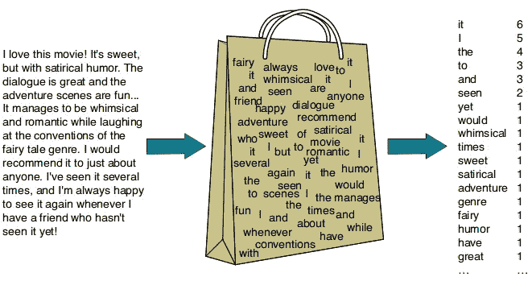
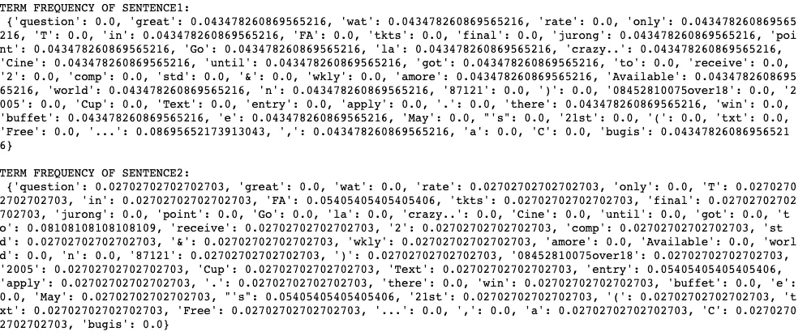
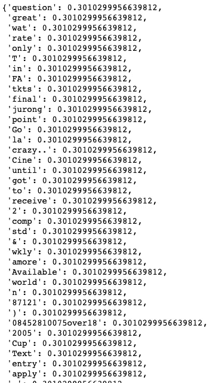

# TF-IDF 的魔力

> 原文：<https://medium.com/analytics-vidhya/magic-of-tf-idf-202649d39c2f?source=collection_archive---------10----------------------->


## 词频逆文档频(TFIDF)可以创造奇迹！

您知道吗，术语频率逆文档频率是 Karen sprck Jones 在 1972 年的一篇论文中提出的——“术语特异性的统计解释及其在检索中的应用”？😲


凯伦·斯皮克·琼斯

好吧！回到目前的场景，在从 **TFIDF** 开始之前，让我简单解释一下 **BoW** ，以便更容易理解为什么要引入 TFIDF。

## 单词袋(蝴蝶结)

单词包(BoW)是一种文本表示，它携带文档中单词出现的信息。它被称为单词包，因为它包含了文档中的所有单词，其中单词在文档中的 ***顺序和结构是未知的*** 。迷惑？简单地说，这就像我们有一个空袋子，我们有一个文档词汇表的集合。我们把单词一个接一个地放进袋子里，我们得到了什么？装满单词的袋子。😲



来源:[https://dude perf 3c t . github . io/lstm/gru/NLP/2019/01/28/LSTM 和 gru 部队/](https://dudeperf3ct.github.io/lstm/gru/nlp/2019/01/28/Force-of-LSTM-and-GRU/)

制作单词袋模型，[注:以[单词袋](https://machinelearningmastery.com/gentle-introduction-bag-words-model/#:~:text=A%20bag%2Dof%2Dwords%20is,the%20presence%20of%20known%20words.)的温和介绍为例]

1.  **收集资料** *【这是最好的时代，
    这是最坏的时代，
    这是智慧的时代，
    这是愚昧的时代】*
2.  **做一个数据的词汇** 【“它”、“曾经”、“最好”、“的”、“时代的”、“最坏的”、“年龄的”、“智慧的”、“愚蠢的”】
3.  **创建矢量
    “那是最坏的时代”= [1，1，1，0，1，1，1，0，0]
    “那是智慧的时代”= [1，1，1，0，1，0，0，1，1，0]
    “那是愚昧的时代”= [1，1，1，0，1，0，0，0，1]**
4.  使用计数法或频率法(如 TFIDF)对单词评分。我们将在本文中讨论这一点。

**现在让我们开始使用 TFIDF 吧！！！**

# 术语频率逆文档频率(TFIDF)

引入 erm 频率逆文档频率(TFIDF)来克服 BOW 问题。

TFIDF 是反映单词对文档的重要性的统计度量。TF-IDF 主要用于文档搜索和信息检索，通过评分给出单词在文档中的重要性。TFIDF 得分越高，该术语越稀有，反之亦然。

文档中一个单词的 TF-IDF 是通过乘以两个不同的度量来计算的:术语频率和逆文档频率。

> **TFIDF = TF * IDF**

*哪里*，

TF(term) =术语在文档中出现的次数/文档中的术语总数

IDF(术语)= log(文档总数/包含术语的文档数)

## TFIDF 的一些应用:

1.  信息检索
2.  文本挖掘
3.  用户建模
4.  关键词提取
5.  搜索引擎

## 在 Python 中实现 TFIDF

从一个简单的例子开始，

```
**sentence1** = “Go until jurong point, crazy.. Available only in bugis n great world la e buffet… Cine there got amore wat…”**sentence2** = “Free entry in 2 a wkly comp to win FA Cup final tkts 21st May 2005\. Text FA to 87121 to receive entry question(std txt rate)T&C’s apply 08452810075over18's”
```

**上面这句话的词汇**形成了:

```
{'question', 'great', 'wat', 'rate', 'only', 'T', 'in', 'FA', 'tkts', 'final', 'jurong', 'point', 'Go', 'la', 'crazy..', 'Cine', 'until', 'got', 'to', 'receive', '2', 'comp', 'std', '&', 'wkly', 'amore', 'Available', 'world', 'n', '87121', ')', '08452810075over18', '2005', 'Cup', 'Text', 'entry', 'apply', '.', 'there', 'win', 'buffet', 'e', 'May', "'s", '21st', '(', 'txt', 'Free', '...', ',', 'a', 'C', 'bugis'}
```

创建**频率** **字典**

```
**def** create_word_dict(total, sentence):
    wordDict = dict.fromkeys(total, 0)
    **for** word **in** sentence:
        wordDict[word] += 1
    **return** wordDict
```

## 计算词频

**词频(TF)** 是文档中一个词的计数。有几种方法可以计算这个频率，最简单的是一个单词在文档中出现的实例的原始计数。

```
**def** computeTF(wordDict, doc):     
    tfDict = {}
    corpusCount = len(doc)     
    **for** word, count **in** wordDict.items():         
        tfDict[word] = count/float(corpusCount)     
    **return**(tfDict)
```



术语频率结果

## 计算逆文档频率

**逆文档频率(idf)** 告诉我们一个单词在整个文档集中的常见或罕见程度。该指标的计算方法是，将文档总数除以包含一个单词的文档数，然后计算对数。如果一个术语频繁地与其他文档一起传播，可以说它不是一个相关的词，如“the”、“is”、“are”等停用词。

```
**def** computeIDF(docList):
    idfDict = {}
    N = len(docList)

    idfDict = dict.fromkeys(docList[0].keys(), 0)
    **for** word, val **in** idfDict.items():
        idfDict[word] = math.log10(N / (float(val) + 1))

    **return** (idfDict)
```



IDF 结果

**最后，计算 TFIDF**

```
**def** computeTFIDF(tfBow, idfs):
    tfidf = {}
    **for** word, val **in** tfBow.items():
        tfidf[word] = val*idfs[word]
    **return**(tfidf)
```


TFIDF 的结果

**注意**:主要的直觉是，如果一个单词在一个文档中频繁出现，我们认为它是重要的，但是如果一个单词在太多其他文档中出现，它给我们一种直觉，它不是一个唯一的标识符，所以我们通过使用 tfidf 给它一个低分数来标记那些术语不那么重要。

G 上述代码的 ithub 链接以及其他使用 tfidf 的代码:[https://github.com/pemagrg1/Magic-Of-TFIDF](https://github.com/pemagrg1/Magic-Of-TFIDF)

## 作业:

一些你可以自己尝试的东西…

1.  采取任何电影评论列表，获得最相关的词，以及 TFIDF 热门词。对于预处理**，**使用单词 tokenize，lower，lemma，标点移除，num 移除，移除单个字符。然后，得到词频和 TFIDF 顶词。https://www.kdnuggets.com/2018/08/wtf-tf-idf.html
2.  如果不想从头开始编写 TFIDF，也可以使用 Sklearn 的 TFIDF 矢量器。使用 sk-learn Tfidf 矢量器，您可以向量化您的语料库并应用聚类算法。

## 参考资料:

[1][https://www.kdnuggets.com/2018/08/wtf-tf-idf.html](https://www.kdnuggets.com/2018/08/wtf-tf-idf.html)

[2]https://en.wikipedia.org/wiki/Tf%E2%80%93idf

[3]http://www.tfidf.com/

[https://monkeylearn.com/blog/what-is-tf-idf/](https://monkeylearn.com/blog/what-is-tf-idf/)

[5][https://towardsdatascience . com/TF-IDF-for-document-ranking-from-scratch-in-python-on-real-world-dataset-796 d339a 4089](https://towardsdatascience.com/tf-idf-for-document-ranking-from-scratch-in-python-on-real-world-dataset-796d339a4089)

[6][https://www . coursera . org/learn/audio-signal-processing/lecture/4 qzav/DFT](https://www.coursera.org/learn/audio-signal-processing/lecture/4QZav/dft)

[7][https://towards data science . com/natural-language-processing-feature-engineering-using-TF-IDF-E8 b 9d 00 e 7 e 76](https://towardsdatascience.com/natural-language-processing-feature-engineering-using-tf-idf-e8b9d00e7e76)

[8][https://towardsdatascience . com/TF-IDF-for-document-ranking-from-scratch-in-python-on-real-world-dataset-796d 339 a 4089](https://towardsdatascience.com/tf-idf-for-document-ranking-from-scratch-in-python-on-real-world-dataset-796d339a4089)

[9][https://machine learning mastery . com/gentle-introduction-bag-words-model/#:~:text = A % 20 bag % 2d of % 2d words % 20 is，the % 20 presence % 20 of % 20 know % 20 words。](https://machinelearningmastery.com/gentle-introduction-bag-words-model/#:~:text=A%20bag%2Dof%2Dwords%20is,the%20presence%20of%20known%20words.)

## 用于实施的附加介质资源

1.  [新闻多类分类的基本自然语言处理教程](/@armandj.olivares/a-basic-nlp-tutorial-for-news-multiclass-categorization-82afa6d46aa5)
2.  [使用自然语言处理寻找最重要的句子& TF-IDF](/hackernoon/finding-the-most-important-sentences-using-nlp-tf-idf-3065028897a3)
3.  [使用 Tf-Idf](/@acrosson/summarize-documents-using-tf-idf-bdee8f60b71) 汇总文件
4.  [文档分类](/machine-learning-intuition/document-classification-part-2-text-processing-eaa26d16c719)
5.  [基于内容推荐器](/free-code-camp/how-to-process-textual-data-using-tf-idf-in-python-cd2bbc0a94a3)
6.  [推特情绪分析](https://towardsdatascience.com/another-twitter-sentiment-analysis-with-python-part-9-neural-networks-with-tfidf-vectors-using-d0b4af6be6d7)
7.  Fi [用 BOW，TFIDF 和 Xgboost](https://towardsdatascience.com/finding-similar-quora-questions-with-bow-tfidf-and-random-forest-c54ad88d1370) 寻找相似的 Quora 问题