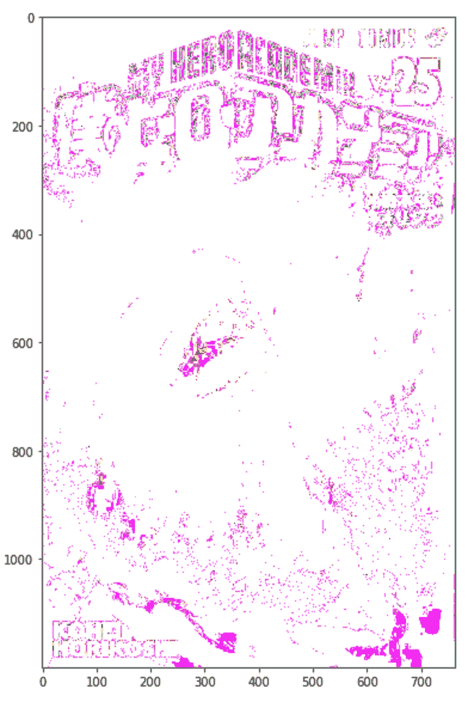

# maho tas—Python 的图像处理和操作

> 原文：<https://medium.com/analytics-vidhya/mahotas-image-processing-and-manipulation-for-python-ddb1edb68880?source=collection_archive---------2----------------------->

Mahotas 是一个用于 Python 的计算机视觉和图像处理库。库是函数和方法的集合，允许您执行许多操作，而不必编写数百行代码。我们都使用图书馆；从 numpy 到熊猫到 matplotlib 等等。否则你就要用 c 语言写代码了。我喜欢快捷方式！


查克也喜欢它👍

Mahotas 包括许多算法，这些算法使用数组和一个非常干净的 Python 接口进行操作。Mahotas 算法是用 C++实现的，但几乎总是调用 Python 函数来检查类型，然后调用内部函数。这使得它比仅用 C++编写稍微慢一些，但仍然比只使用 python 快得多。主要是为了 C++的处理速度和能力才这样开发的。

Mahotas 目前有超过 100 个用于图像处理和计算机视觉的功能，并且还在不断增长。

mahotas 功能的一些示例列表:

*   **色彩空间转换***
*   **卷积***
*   凸点计算
*   [撞上了&小姐。细化](http://mahotas.readthedocs.io/en/latest/api.html#mahotas.hitmiss)
*   [形态学处理](http://mahotas.readthedocs.io/en/latest/morphology.html)
*   Sobel 边缘检测
*   [加速鲁棒特征(SURF)，局部特征的一种形式](http://mahotas.readthedocs.io/en/latest/surf.html)
*   [阈值处理](http://mahotas.readthedocs.io/en/latest/thresholding.html)
*   [分水岭](http://mahotas.readthedocs.io/en/latest/api.html#mahotas.cwatershed)
*   泽尼克&哈拉里克，[局部二元模式](http://mahotas.readthedocs.io/en/latest/lbp.html)，以及 TAS 特征

## 为什么是 Mahotas:

1.  **快码:**性能是它的一大关键。因为 Mahotas 是建立在 C++之上的，它真的和计算一样快。加上数组可以 Mahotas 可以有效地计算大量的数据。
2.  **简单代码:**代码要简单，一般一两行就能得到一个效果。你不会在你的代码中写短篇故事。
3.  最小依赖性: Mahotas 被建造得尽可能独立；从其他模块。这意味着在大多数情况下，只需要导入 Mahotas 就可以运行它的功能。现在，mahotas 依赖于 C++编译器，数值计算。Numpy 的模块是不需要的，编译器涵盖了这一点。但是数组用于将图像转换成数值(用于图像处理)。

## 好了，到了有趣的部分

**色彩空间转换**

首先，我们需要从 pylab 导入 Mahotas 和 imshow，以显示图像和编辑图像:

```
import mahotas as mh
from pylab import imshow, show
```

将 Mahotas 缩写为 mh 也是标准做法。

接下来我们需要一个图像来操作:

```
#loading image and converting image into an array of RGB values
im = mh.imread('myheroacademia_vol_25.jpg')
im>>array([[[148,  55, 144],
        [148,  55, 144],
        [148,  55, 144],
        ...,
        [146,  56, 143],
        [135,  50, 133],
        [225, 142, 222]],

       [[148,  55, 144],
        [148,  55, 144],
        [148,  55, 144],
        ...,
        [146,  56, 143],
        [135,  50, 133],
        [225, 142, 222]],

       [[148,  55, 144],
        [148,  55, 144],
        [148,  55, 144],
        ...,
        [146,  56, 143],
        [135,  50, 133],
        [225, 142, 222]],

       ...,

       [[143,  56, 151],
        [148,  54, 150],
        [152,  52, 148],
        ...,
        [  8,   4,   3],
        [  4,   5,   7],
        [ 69,  86,  96]],

       [[145,  55, 153],
        [148,  54, 151],
        [152,  52, 150],
        ...,
        [  8,   4,   3],
        [  4,   5,   7],
        [ 69,  86,  96]],

       [[145,  55, 155],
        [149,  53, 153],
        [152,  52, 150],
        ...,
        [  8,   4,   3],
        [  4,   5,   7],
        [ 69,  86,  96]]], dtype=uint8)
```

我们可以称图像的形状为:

```
# This will display the width, height (in pixels) and how many color channels the image hasim.shape
>>(1200, 763, 3)
```

RGB 图像被表示为形状为`(h,w,3)`的三维数组，其中每个像素由三个值表示，红/绿/蓝。

我们用函数 imshow()来查看图像

```
# displaying the image with figsize
ax.imshow(im)
>>
```


在博库没有学术界的主要薇莉安——东村志平，这样一个坏蛋！

接下来，我们将转置图像(im)的 RGB 值。这将一个值分配给图像转换后的数组，分别转换为绿色、蓝色和红色值。

```
r,g,b = im.transpose((2,0,1))
```

## 现在操纵:

我们可以从简单开始，使用 mahotas 函数将图像从 RGB 变为棕褐色:

```
tomura_sepia = mh.colors.rgb2sepia(im)
imshow(tomura_sepia)
>>
```


漂亮简单的棕褐色，没有 photoshop。

我们也可以对图像使用伽玛校正，以提高 RGB 值的亮度(光的强度)

```
# Changing the gamma values to the second power
imshow(im ** 2.0)
>>
```



好吧，也许我曝光过度了，哈哈

让我们降低伽玛校正，以便更好地查看图像:

```
imshow(im ** 0.02)
>>
```


好点了

我们可以通过向后拉伸伽玛来恢复原始图像:

```
imshow(mh.stretch(im ** 1.0))
>>
```


恢复正常

我们还可以单独编辑 RGB 灰度值:

```
imshow(mh.as_rgb(r ** .7, g ** 2 , b ** .7))
>>
```


不是我想要的样子，让我们调整一下。

```
ax.imshow(mh.as_rgb(r ** 1.9, g , b **3))
>>
```


酷多了😎

接下来，我们可以在保存 RGB 值更改并添加以下内容后导出图像:

```
im_filtered = mh.as_rgb(r ** 1.9, g , b **3)

mh.imsave('myheroacademia_vol_25_changed_RGB.jpg', im_filtered)
```

## 沃尔多在哪？

**卷积**

Mahotas 实现的另一个惊人特性是演示“Wally”，在美国他被称为“Waldo”:

首先，您需要导入:

```
import mahotas as mh
import mahotas.demos
```

接下来，我们需要从演示中加载图像“wally”并显示它:

```
wally = mh.demos.load('wally')
imshow(wally)
show()
>>
```


你能找到沃尔多吗？英雄联盟

我们需要将 wally 图像转换为 float 并转置图像，将新的 float 图像拆分为 R、G、B 通道，并获得白色通道:

```
waldo_float = wally.astype(float)
r,g,b = waldo_float.transpose((2,0,1))# w is the color white's channel
w = waldofloat.mean(2)
```

之后，我们需要在 y 轴上建立一个+1，-1，+1，-1 的模式。

```
pattern = np.ones((24,16), float)
for i in range(2):
    pattern[i::4] = -1
```

接下来，我们使用上面的模式对红色减去白色进行卷积。这将对沃尔多的衬衫在哪里产生强烈的反应。

```
v = mh.convolve(r-w, pattern)
```

现在我们需要做一个面具。图像编辑技术中的遮罩，用于隐藏或暗化图像中不需要的像素:

```
mask = (v == v.max())
mask = mh.dilate(mask,np.ones((48,24)))wally -= np.array(.8*wally * ~mask[:,:,None], dtype=wally.dtype)
```

最后，我们只需要显示图像:

```
imshow(wally)
>>
```


他在那里！！！

当我看到这个时，数组编辑图像的能力给我留下了深刻的印象。我希望你也是。