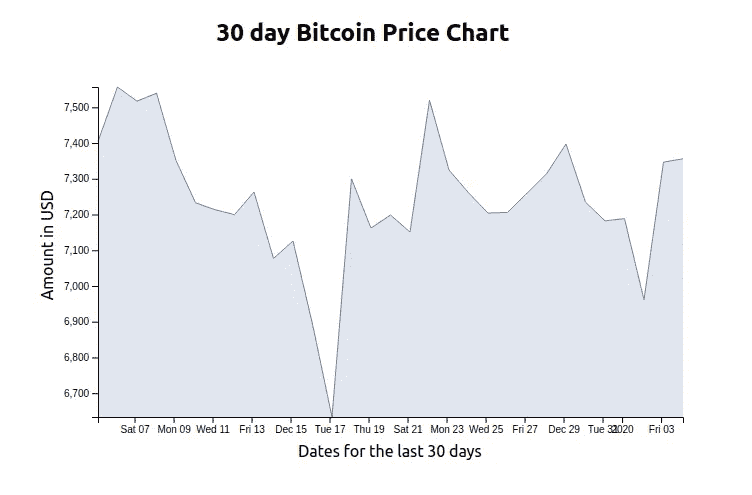

# 用 React 和 D3 做一个巧妙的比特币价格图。

> 原文：<https://medium.com/analytics-vidhya/make-a-clever-bitcoin-price-chart-with-react-and-d3-e6359d604b54?source=collection_archive---------7----------------------->


在过去的两年里，我一直在与 React 和 D3 合作，在我的远程工作中为世界各地的初创公司和成熟公司构建定制的交互式图表:)。在那段时间里，我真的很享受使用这些工具进行可视化时所获得的灵活性，我将与你分享我的丰富经验。是的，你！

一些人喜欢将数据可视化视为传达故事的有效方式，讲述一些有趣的见解，这些见解是某人在数据中发现的，他们希望与观众分享。人们常说一张图片代表一千个单词，我也喜欢认为数据可视化的工作方式是相同的。

在这篇博文中，我们将使用 D3(一个几乎完美灵活的 JavaScript 库)构建一个由 coindesk 支持的定制 30 天比特币价格图表，同时利用 React(一个用于构建用户界面的 JavaScript 库)。

这就是我们要构建的东西，也是我将在本文中向您介绍的内容。如果你想看实际操作，这里有一个现场演示。



在我开始使用 D3 之前，我必须做一些家庭工作，以确保我对一项像样的技术抱有信心，我在 npm 和 GitHub 上的发现给我开了绿灯。

**D3 有:**

*   npm 上每周超过 474，000 次下载。
*   GitHub 上超过 89，000 颗星星。
*   迄今已发行 228 次。
*   超过 3000 个依赖包。
*   它已经存在了 8 年了。

# **实施比特币价格图表**

我需要的 30 天比特币价格图表是:

**根组件**

*   从免费的 coindesk API 获取原始数据。注意，coindesk 是一个专门研究比特币和数字货币的新闻网站。
*   管理原始数据的更新
*   管理需要重新绘制图表的交互状态(过滤、聚合、排序等)。)

**子组件**

*   作为属性传入原始数据。
*   将原始数据转换为屏幕空间。
*   呈现计算的数据。
*   管理不需要重绘图表的交互状态(悬停、单击)。

**在哪里计算数据**

*   我们将从*getDerivedStateFromProps*方法计算我们的数据，因为它简单明了。你还应该注意到，只要 React 可以在它的 **render** 函数中访问它，D3 计算就可以在的任何地方进行*(这对你的项目有意义)。*

> 永远不要让 D3 和 React 管理 DOM 的相同部分!!
> 还是虫子！！—雪莉·吴

**D3 轴**

*   轴对于使数据可读非常重要，D3 使得创建它们变得容易。
*   在 React 生命周期开始时创建`axisLeft()`或`axisBottom()`并设置相应的比例。
*   在 *render* 方法中创建一个 *svg* group 元素。
*   在 *componentDidUpdate 中的组元素上调用轴。*

# 下面是我如何做的。

为了快速开始这个项目，我用 create-react-app 引导了这个应用程序，这是一个学习 react 的舒适环境，也可能是在 React 中开始构建新的单页应用程序的最佳方式。在引擎盖下，它使用了 Babel 和 webpack，但是你不需要了解它们的任何东西。

我将从我的根组件`App.js`中的代码开始，它负责从 [free coindesk AP](https://api.coindesk.com/v1/bpi/historical/close.json) I 获取数据，格式化原始数据并将其作为道具传递给子组件。

`**App.js**`

```
import React from "react";
import Chart from "./Chart";class App extends React.Component {
constructor(props) {
  super(props);
  this.state = {
    data: []
  };
}componentDidMount() {
  fetch(`https://api.coindesk.com/v1/bpi/historical/close.json`)
    .then(response => response.json())
    .then(data => {
      this.setState({
       data: Object.keys(data.bpi).map(date => {
       return {
          date: new Date(date),
          price: data.bpi[date]
         };
      })
    });
  })
   .catch(error => console.log(error));
} render() {
  const { data } = this.state;return (
     <div>
       <h2 style={{ textAlign: "center" }}>
         30 day Bitcoin Price Chart
       </h2>
       <Chart data={data} />
     </div>
      );
   }
}
export default App;
```

好吧，我知道这有点多的代码，但我会试着分解它。你应该关注的是在*componentdimount*生命周期方法中的获取浏览器 API。当组件被挂载时，在调用 *render* 方法之前，向 coindesk API 发出一个获取请求，该 API 返回一个使用 [JavaScript promises](https://developer.mozilla.org/en-US/docs/Web/JavaScript/Reference/Global_Objects/Promise) 适当处理的承诺。

返回的比特币价格指数(bpi)数据在数组中是这种格式`"2019-12-05":7404.4033`,因此在将它添加到状态之前，需要将日期格式化为实际的日期对象，而不是字符串。这些实际日期对象将有助于在实际图表上创建水平轴的刻度。然后，这些数据作为道具传递给子组件。

`**Chart.js**`

```
import React from "react";
import * as d3 from "d3";const width = 650;
const height = 400;
const margin = {
  top: 20,
  right: 5,
  bottom: 50,
  left: 60
};class Chart extends React.Component {
  constructor(props) {
    super(props);
    this.state = {
      data: null
    };
  } xAxis = d3.axisBottom();
  yAxis = d3.axisLeft(); static getDerivedStateFromProps(nextProps, prevState) { const { data } = nextProps;
   if (!data) return {}; const xExtent = d3.extent(data, d => d.date); const yExtent = d3.extent(data, d => d.price); const xScale = d3
    .scaleTime()
    .domain(xExtent)
    .range([margin.left, width - margin.right]); const yScale = d3
    .scaleLinear()
    .domain(yExtent)
    .range([height - margin.bottom, margin.top]); const line = d3
    .line()
    .x(d => xScale(d.date))
    .y(d => yScale(d.price)); const minY = d3.min(data, d => d.price); const area = d3
    .area()
    .x(d => xScale(d.date))
    .y0(d => yScale(minY))
    .y1(d => yScale(d.price)); return { xScale, yScale, data, line, area }; } componentDidUpdate() { this.xAxis.scale(this.state.xScale);
    d3.select(this.refs.xAxis).call(this.xAxis); this.yAxis.scale(this.state.yScale);
    d3.select(this.refs.yAxis).call(this.yAxis); } render() { const styles = {
    container: {
      display: "grid",
      justifyItems: "center"
    }
  }; const { data, line, area } = this.state; return (
    <div style={styles.container}>
      <svg width={width} height={height}>
        <path
          id={"line"}
          d={line(data)}
          stroke="#6788ad"
          fill="transparent"
        /> <path
          id={"area"}
          d={area(data)}
          fill="#6788ad"
          style={{ opacity: 0.2 }}
        /> <text
          transform={`translate(${width / 2 - margin.left -margin.right}, ${height - 10})`}
        >
        Dates for the last 30 days
        </text> <text
          transform={`translate(15, ${(height - margin.bottom) /1.5}) rotate(270)`}
        >
        Amount in USD
        </text> <g
          ref="xAxis"
          transform={`translate(0, ${height - margin.bottom})`}
        /> <g ref="yAxis" transform={`translate(${margin.left}, 0)`} /> </svg>
    </div>
   );
  }
}export default Chart;
```

好的，我知道这真的有很多代码，因为这是最重要的部分。你不用担心，我会帮你的！让我们开始分解它。

接下来的步骤没有一个是非常困难的，只是一开始把它们连接在一起有点棘手。

在做任何事情之前，你需要先从 npm 或者 yarn 安装 D3。

对于 npm 用户，使用命令`npm install d3`，对于 yarn 用户，使用命令`yarn add d3`

**步骤 1 —接收数据**

```
const { data } = nextProps;if (!data) return {};
```

我们在文件中的重点应该是图表组件中的 *getDerivedStateFromProps* 方法。它从根组件接收属性并提取数据属性。如果数据不可用，它将什么也不做。

**步骤 2——计算水平和垂直比例**

```
const xExtent = d3.extent(data, d => d.date);const yExtent = d3.extent(data, d => d.price);const xScale = d3
    .scaleTime()
    .domain(xExtent)
    .range([margin.left, width - margin.right]);const yScale = d3
    .scaleLinear()
    .domain(yExtent)
    .range([height - margin.bottom, margin.top]);
```

如果数据可用，则通过利用 D3 的`[scaleTime()](https://github.com/d3/d3-scale#time-scales)` `[scaleLinear()](https://github.com/d3/d3-scale#linear-scales)`方法计算水平和垂直比例。结果分别存储在 *xScale* 和 *yScale* 变量中。在这两种情况下，指定范围的数组值时都会考虑边距。

**步骤 3——计算线和面积**

```
const line = d3
    .line()
    .x(d => xScale(d.date))
    .y(d => yScale(d.price));const minY = d3.min(data, d => d.price);const area = d3
    .area()
    .x(d => xScale(d.date))
    .y0(d => yScale(minY))
    .y1(d => yScale(d.price));return { xScale, yScale, data, line, area };
```

图表的线条和面积也是利用 D3 的`[line()](https://github.com/d3/d3-shape#lines)`和`[area()](https://github.com/d3/d3-shape#areas)`方法计算的，结果分别存储在*线条*和*面积*变量中。然后，*getDerivedStateFromProps*方法将返回 *xScale* 、 *yScale* 、 *line* 和 *area* 变量以及*数据*属性，然后可以从 state 的 *render* 方法中访问这些属性。

**步骤 4——将线条和区域渲染到 *svg。***

```
<path
   id={"line"}
   d={line(data)}
   stroke="#6788ad"
   fill="transparent"
 /><path
   id={"area"}
   d={area(data)}
   fill="#6788ad"
   style={{ opacity: 0.2 }}
 />
```

在 render 方法中，我们返回一个具有宽度和高度属性的 *svg* 元素。然后，我们为线和区域添加两个路径元素，同时向它们传递来自 state 的数据。此时，我们应该能够在 react 应用程序中看到折线图和面积图。

**步骤 5——添加轴**

```
xAxis = d3.axisBottom();
yAxis = d3.axisLeft();
```

就在 getDerivedStateFromProps 方法之上，我们创建了两个轴。通过利用 D3 的`[axisBottom()](https://github.com/d3/d3-axis#axisBottom)`和`[axisLeft()](https://github.com/d3/d3-axis#axisLeft)`方法控制 x 轴和 y 轴。

```
<g
   ref="xAxis"
   transform={`translate(0, ${height - margin.bottom})`}
/><g ref="yAxis" transform={`translate(${margin.left}, 0)`} />
```

在 render 方法的 *svg* 元素中，我们添加了两个 group 元素，每个元素都有一个对 xAxis 或 yAxis 的引用。

```
componentDidUpdate() {this.xAxis.scale(this.state.xScale);
d3.select(this.refs.xAxis).call(this.xAxis);this.yAxis.scale(this.state.yScale);
d3.select(this.refs.yAxis).call(this.yAxis);}
```

这些引用在 *componentDidUpdate* 方法中使用，以调用组元素上的轴，但在此之前，我们需要首先向轴添加刻度。

好了，我现在在最后冲刺阶段:)

**第六步——标记轴**

```
<text
   transform={`translate(${width / 2 - margin.left -margin.right}, ${height - 10})`}
>
 Dates for the last 30 days
</text><text
  transform={`translate(15, ${(height - margin.bottom) /1.5}) rotate(270)`}
>
 Amount in USD
</text>
```

最后一步是给图表的轴添加标签。想象一个没有标记轴的图表，嗯？！这意味着关于图表的一些信息仍然会丢失。因此，我们在 render 方法中向 *svg* 元素添加了两个文本元素。一个文本元素将为 x 轴添加一个标签，为 y 轴添加一个标签。

你已经用 React 和 D3 成功地可视化了比特币的 30 天价格图。不太难。

**结论**

乍一看，用 React 和 D3 可视化比特币数据似乎有点令人生畏。实际上，D3 有助于简化主要因素(创建路径和比例)。一旦做到这一点，剩下的就很简单了。

过几周甚至几天再来看看，我将会写一些关于用 React 和 D3 在条形图中添加画笔的内容，这样就可以只检索特定域内的数据，或者关于 React 和 D3 的类似内容。

感谢您的阅读，我希望这能让您了解 React 和 D3 如何一起创建定制的数据可视化。

**我对 React 和 D3 的数据可视化非常感兴趣。如果你** [**在 Twitter 上关注我，**](https://twitter.com/ahebwa49) **我不会浪费你的时间。？**