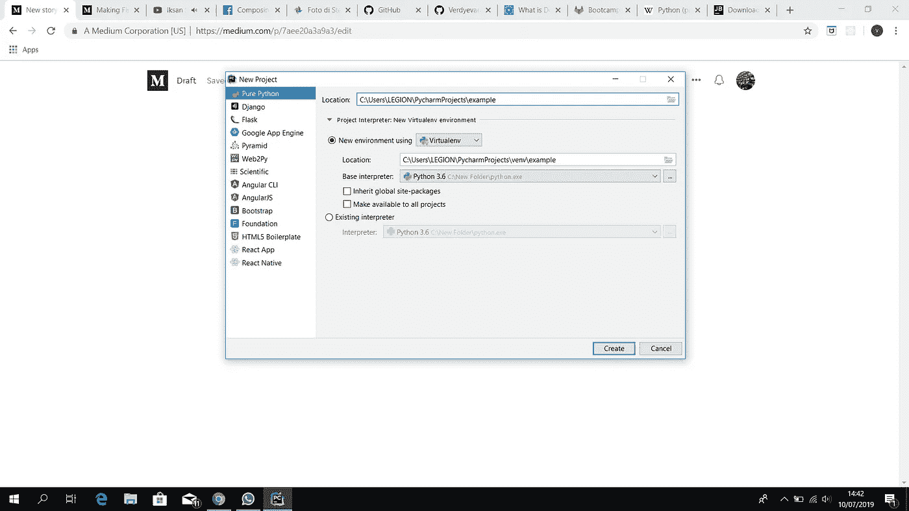
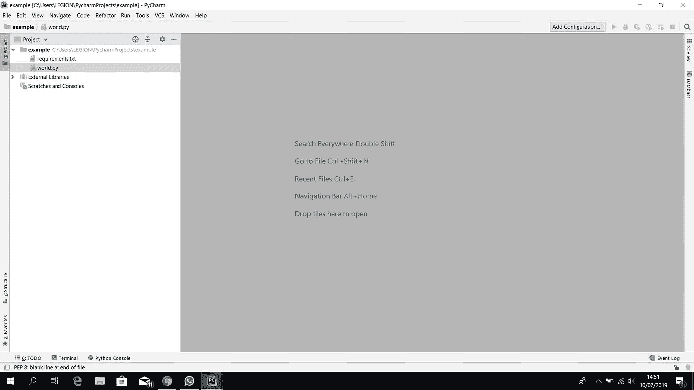
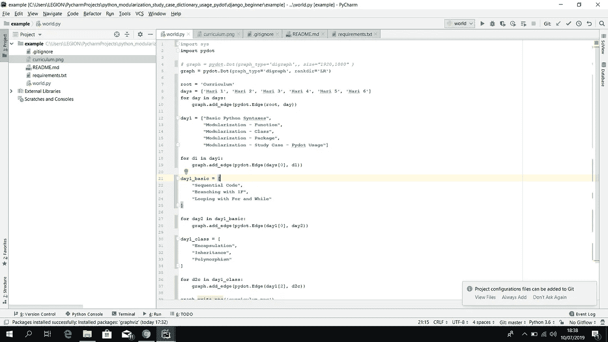
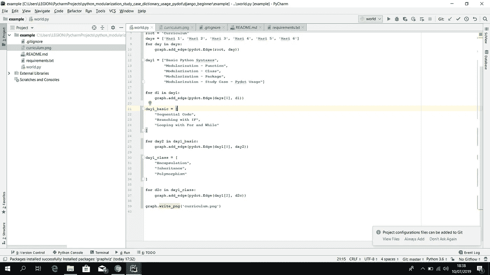
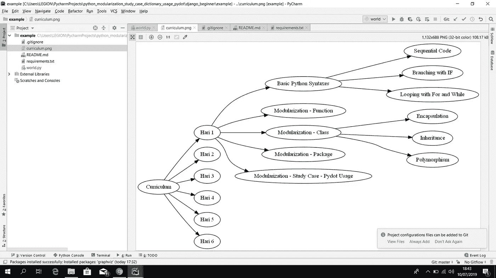

# 用 Python 和 Graphviz 制作思维导图

> 原文：<https://medium.com/analytics-vidhya/make-a-mindmap-with-python-and-graphviz-7aee20a3a9a3?source=collection_archive---------0----------------------->

Python 是一种开源编程语言，易于阅读且功能强大。这也意味着 Python 比 C 之类的编译语言要慢，因为它不直接运行机器代码。对于初学者来说，Python 是一种很好的编程语言。今天，我想分享一下如何在 python 上制作迷你思维导图。尽情享受吧！

1.  )首先，你要安装 Pycharm，你可以从下面这个链接安装[https://www.jetbrains.com/pycharm/download/#section=windows](https://www.jetbrains.com/pycharm/download/#section=windows)。
2.  )接下来在 Pycharm 上做一个新项目，把虚拟环境设置成这样。

3.)接下来，制作一个新的 python 文件和 requirements.txt。

4.)在 requirements.txt 中键入 pydot，点击安装包。

5.)在 world.py 中这样输入。

6.)在运行这个之前，你必须在 https://chocolatey.org/的[上安装 chocolatey，在 https://www.graphviz.org/的](https://chocolatey.org/)[上安装 graphviz，然后在终端上安装 choco。](https://www.graphviz.org/)

7.)最后，右击你的鼠标，点击运行，你就有了这个。

这是一个简单的图表，你可以用 Python 和 Graphviz 制作，我希望你能理解它的轮廓，接下来你可以用 Python 和 Graphviz 做一些改进。在接下来的文章中，我想分享如何使用 django 创建一个新闻 djangoblog 的例子。

敬请关注我的下一篇文章，谢谢。