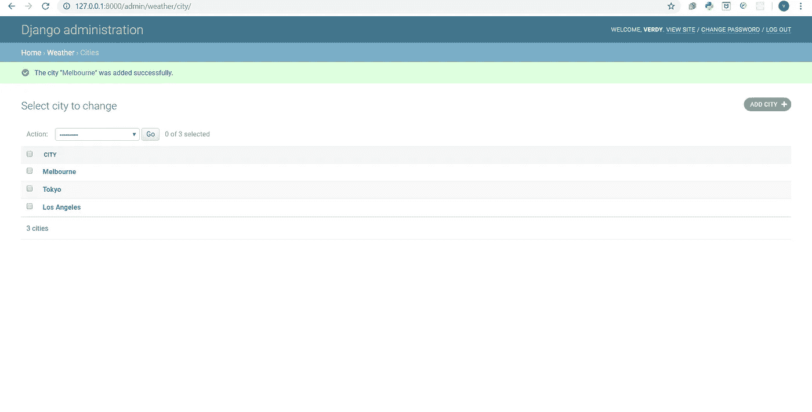
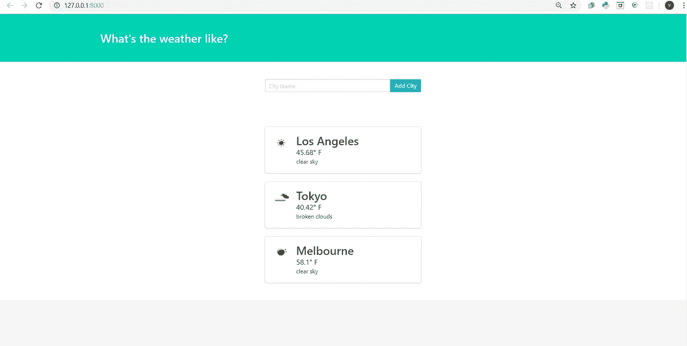
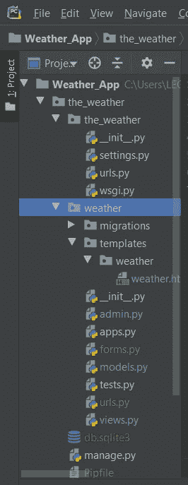
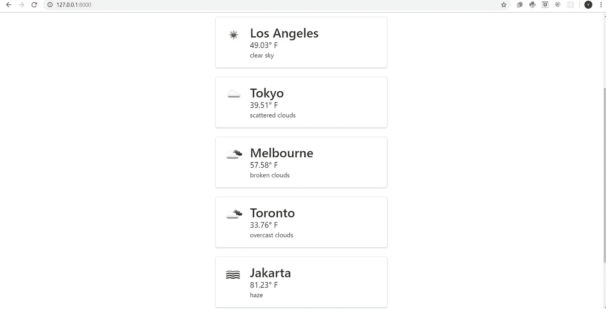

# 使用 Django 制作一个天气应用程序

> 原文：<https://medium.com/analytics-vidhya/make-a-weather-application-using-django-a9a131e3bae7?source=collection_archive---------6----------------------->

你好，这次我想分享一下如何用 django 做一个天气应用。这个天气应用程序将向您显示我们想要了解的城市的温度和一些云的描述。让我们开始吧！

首先你必须在你的终端上运行这个来安装 django。

```
**django-admin startproject the_weather
cd the_weather
python manage.py startapp weather**
```

然后打开 settings.py，在 INSTALLED_APPS 上添加“天气”。然后我们想先在我们的网站上创建一个超级用户，在你的终端上运行这个。

```
**python manage.py migrate
python manage.py createsuperuser**
```

然后在空白处填入您自己的用户名和密码。接下来，通过在终端中键入 python manage.py runserver 来尝试运行网站，并填写您之前制作的用户名和密码。

接下来，在“天气”目录下创建一个名为“模板”的文件目录，并在“模板”目录下创建一个名为“天气”的新文件目录，在“天气”目录下创建一个名为“天气. html”的新 html 文件，删除 HTML 中的代码，从[https://github . com/Verdyevan/Weather _ App/blob/master/the _ Weather/Weather/templates/Weather/Weather . HTML](https://github.com/Verdyevan/Weather_App/blob/master/the_weather/weather/templates/weather/weather.html)中复制 HTML 代码，并粘贴到“天气. HTML”中。

在 urls.py 上像这样键入

```
**from django.contrib import admin
from django.urls import path, include

urlpatterns = [
    path('admin/', admin.site.urls),
    path('', include('weather.urls')),
]**
```

在“天气”目录下创建一个名为“urls.py”的新 python 文件，并在其中键入以下代码

```
**from django.urls import path
from . import views

urlpatterns = [
    path('', views.index),
]**
```

然后在 views.py 上键入这段代码，并尝试通过在终端上键入 python manage.py runserver 来运行服务器。

```
**from django.shortcuts import render

def index(request):
    return render(request, 'weather/weather.html')**
```

之后，在终端中运行“pipenv install requests ”,在等待安装时，您可以在 views.py 上添加一些代码，以便在您的网站上像这样设置 api。

```
**import requests
from django.shortcuts import render

def index(request):
    url = 'http://api.openweathermap.org/data/2.5/weather?q={}&units=imperial&appid=271d1234d3f497eed5b1d80a07b3fcd1'
    city = 'Las Vegas'

    r = requests.get(url.format(city)).json()

    city_weather = {
        'city': city,
        'temperature': r["main"]["temp"],
        'description': r["weather"][0]["description"],
        'icon': r["weather"][0]["icon"],
    }
    context = {'city_weather' : city_weather}
    return render(request, 'weather/weather.html', context)**
```

去 weather.html 把代码改成这样。

*   要更改城市，请在第 56 行输入 {{ city_weather.city }}
*   要更改温度，请在第 58 行{ { city _ weather . temperature } } F处输入此值
*   要更改描述，请在第 59 行
    { { city _ weather . description } }
*   要更改图标，请在第 50 行键入此内容

尝试运行代码，它将被更改为该城市的当前天气。这将工作，但只有一个城市，我们必须改变城市的看法。如果我们想改变另一个当前城市的天气。所以在 models.py 上输入这个。

```
**from django.db import models

class City(models.Model):
    name = models.CharField(max_length=25)

    def __str__(self):
        return self.name

    class Meta:
        verbose_name_plural = 'cities'**
```

在终端上运行 python manage.py makemigrations 和 python manage.py migrate。在 admin.py 上输入这个。

```
**from django.contrib import admin
from .models import City

admin.site.register(City)**
```

运行服务器，查看管理网站，并添加一些像这样的城市。



我们希望在我们的网站上显示这三个城市的当前天气。因此，如果我们想这样做，就像这样在 views.py 上添加一些代码。

```
**import requests
from django.shortcuts import render
from .models import City

def index(request):
    url = 'http://api.openweathermap.org/data/2.5/weather?q={}&units=imperial&appid=271d1234d3f497eed5b1d80a07b3fcd1'
    city = 'Las Vegas'

    cities = City.objects.all()

    weather_data = []

    for city in cities:
        r = requests.get(url.format(city)).json()

        city_weather = {
            'city': city.name,
            'temperature': r["main"]["temp"],
            'description': r["weather"][0]["description"],
            'icon': r["weather"][0]["icon"],
        }
        weather_data.append(city_weather)

    context = {'weather_data' : weather_data}
    return render(request, 'weather/weather.html', context)**
```

然后转到“weather.html”并键入:

*   在第 46 行，在 weather_data %}中为 city_weather 键入{%
*   在第 66 行键入

你会变成这样。



在天气目录中创建一个名为“forms.py”的新 python 文件。



然后在上面打这个。

```
**from django.forms import ModelForm, TextInput
from .models import City

class CityForm(ModelForm):
    class Meta:
        model = City
        fields = ['name']
        widgets = {'name' : TextInput(attrs={'class' : 'input', 'placeholder' : 'City Name'})}**
```

返回到 views.py 并键入以下内容。

```
**import requests
from django.shortcuts import render
from .models import City
from .forms import CityForm

def index(request):
    url = 'http://api.openweathermap.org/data/2.5/weather?q={}&units=imperial&appid=271d1234d3f497eed5b1d80a07b3fcd1'

    if request.method == "POST":
        pass

    form = CityForm()

    cities = City.objects.all()

    weather_data = []

    for city in cities:
        r = requests.get(url.format(city)).json()

        city_weather = {
            'city': city.name,
            'temperature': r["main"]["temp"],
            'description': r["weather"][0]["description"],
            'icon': r["weather"][0]["icon"],
        }
        weather_data.append(city_weather)

    context = {'weather_data' : weather_data, 'form' : form}
    return render(request, 'weather/weather.html', context)**
```

在“weather.html”上，将一些代码更改为:

*   删除第 29 行，改为{{ form.name }}
*   在第 33 行键入这样的代码
*   在第 26 行下面，键入如下代码

最后，如果我们在搜索栏中键入一个城市并提交它，我们希望显示该城市的当前天气，所以在您的 views.py 中，在第 8 行下面像这样键入。

```
**if request.method == "POST":
    form = CityForm(request.POST)
    form.save()**
```

试着运行服务器，添加一些城市，你就会得到你想要的。



所以这就是这个教程，下一篇文章也许我想分享这个网站的发展，就像你可以删除城市或添加一些描述或什么的。

谢谢，请继续关注我的下一篇文章！