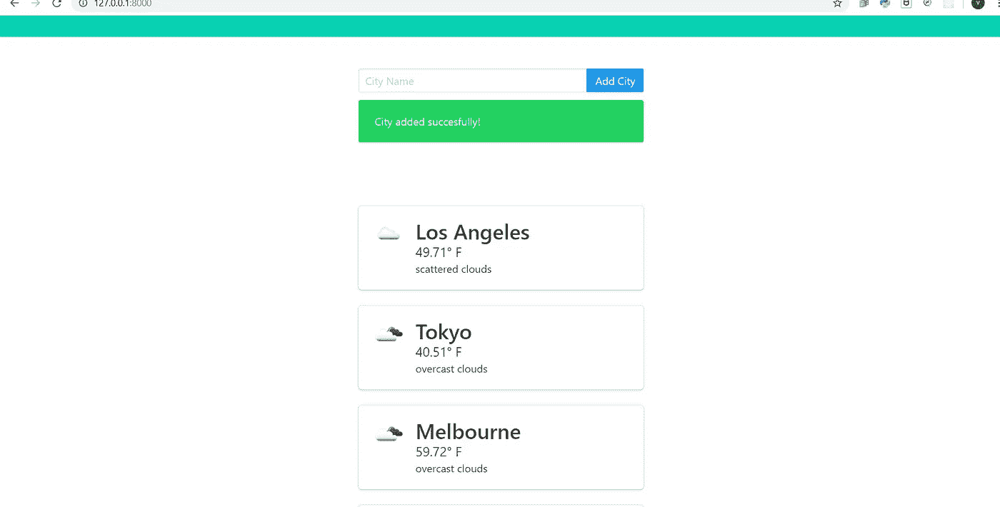
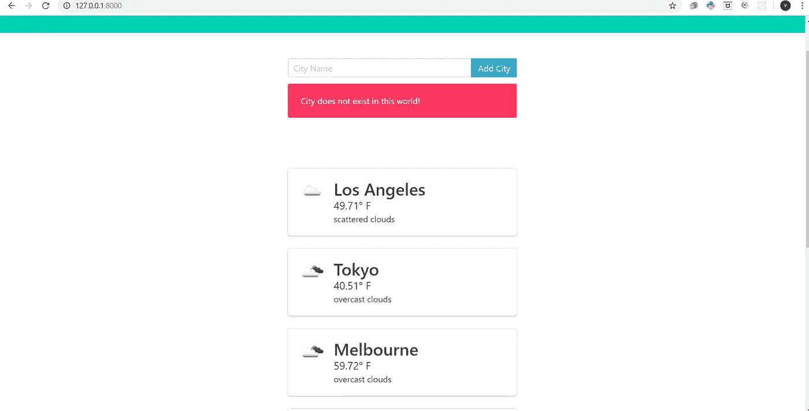
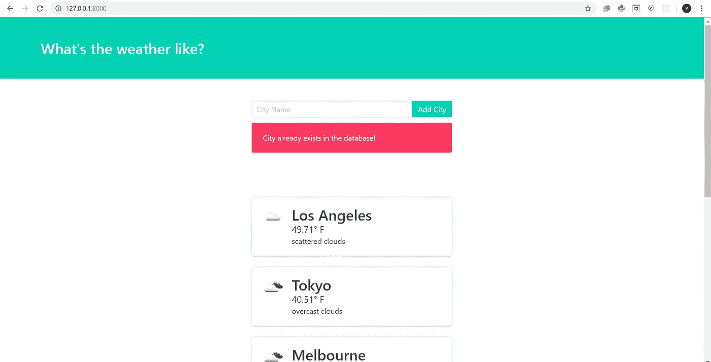

# 使用 Django 第 2 部分制作一个天气应用程序

> 原文：<https://medium.com/analytics-vidhya/make-a-weather-application-using-django-part-2-9b8c47229bb3?source=collection_archive---------11----------------------->

大家好，今天我想继续上一篇关于如何使用 django 制作天气应用的文章。这一次我想增加一些功能，如删除城市，防止重复的城市在列表中，等等。所以，让我们开始吧！

如果我们在搜索栏中添加一个城市，例如“纽约”，现在我们将尝试添加同一个城市，我们的列表中将会有两个“纽约”。所以我们必须解决这个问题，在你的视图中输入粗体部分。

```
import requests
from django.shortcuts import render
from .models import City
from .forms import CityForm

def index(request):
    url = 'http://api.openweathermap.org/data/2.5/weather?q={}&units=imperial&appid=271d1234d3f497eed5b1d80a07b3fcd1'

   ** err_msg = ''

    if request.method == "POST":
        form = CityForm(request.POST)

        if form.is_valid():
            new_city = form.cleaned_data['name']
            existing_city_count = City.objects.filter(name=new_city).count()

            if existing_city_count == 0:
                form.save()
            else:
                err_msg = 'City already exists in the database!'**

    form = CityForm()

    cities = City.objects.all()

    weather_data = []

    for city in cities:
        r = requests.get(url.format(city)).json()

        city_weather = {
            'city': city.name,
            'temperature': r["main"]["temp"],
            'description': r["weather"][0]["description"],
            'icon': r["weather"][0]["icon"],
        }
        weather_data.append(city_weather)

    context = {'weather_data' : weather_data, 'form' : form}
    return render(request, 'weather/weather.html', context)
```

因此，现在如果您尝试添加一个已经在我们的城市列表中列出的城市，它将不会再次出现。接下来是我们要添加的城市必须存在于这个世界上。在 views.py 上键入粗体部分。

```
import requests
from django.shortcuts import render
from .models import City
from .forms import CityForm

def index(request):
    url = 'http://api.openweathermap.org/data/2.5/weather?q={}&units=imperial&appid=271d1234d3f497eed5b1d80a07b3fcd1'

    err_msg = ''
  **  message = ''
    message_class = ''**

    if request.method == "POST":
        form = CityForm(request.POST)

        if form.is_valid():
            new_city = form.cleaned_data['name']
            existing_city_count = City.objects.filter(name=new_city).count()

            if existing_city_count == 0:
               ** r = requests.get(url.format(new_city)).json()**

                **if r['cod'] == 200:
                    form.save()
                else:
                    err_msg = 'City does not exist in this world!'
            else:
                err_msg = 'City already exists in the database!'**

       ** if err_msg:
            message = err_msg
            message_class = "is-danger"
        else:
            message = "City added succesfully!"
            message_class = "is-success"**

    form = CityForm()

    cities = City.objects.all()

    weather_data = []

    for city in cities:
        r = requests.get(url.format(city)).json()

        city_weather = {
            'city': city.name,
            'temperature': r["main"]["temp"],
            'description': r["weather"][0]["description"],
            'icon': r["weather"][0]["icon"],
        }
        weather_data.append(city_weather)

  **  context = {
        'weather_data' : weather_data,
        'form' : form,
        'message' : message,
        'message_class' : message_class,
    }**
    return render(request, 'weather/weather.html', context)
```

现在转到“weather.html ”,将这段代码添加到第 37 行下面:

```
**
    <div class="notification {{ message_class }}">{{ message }}</div>
**
```

现在尝试运行服务器，您将看到如下描述



如果我添加新城市



如果我加上世界上不存在的城市帽子



如果我添加列表中已经存在的城市

现在，我们希望允许用户删除城市。首先，我们要显示删除图标，在第 67 行下面的“weather.html”中键入这个图标。

```
**<div class="media-right">
    <a href="'#">
        <button class="delete"></button>
    </a>
</div>**
```

接下来转到 views.py 并输入粗体部分。

```
import requests
from django.shortcuts import render**, redirect**
from .models import City
from .forms import CityForm

def index(request):
    url = 'http://api.openweathermap.org/data/2.5/weather?q={}&units=imperial&appid=271d1234d3f497eed5b1d80a07b3fcd1'

    err_msg = ''
    message = ''
    message_class = ''

    if request.method == "POST":
        form = CityForm(request.POST)

        if form.is_valid():
            new_city = form.cleaned_data['name']
            existing_city_count = City.objects.filter(name=new_city).count()

            if existing_city_count == 0:
                r = requests.get(url.format(new_city)).json()

                if r['cod'] == 200:
                    form.save()
                else:
                    err_msg = 'City does not exist in this world!'
            else:
                err_msg = 'City already exists in the database!'

        if err_msg:
            message = err_msg
            message_class = "is-danger"
        else:
            message = "City added succesfully!"
            message_class = "is-success"

    form = CityForm()

    cities = City.objects.all()

    weather_data = []

    for city in cities:
        r = requests.get(url.format(city)).json()

        city_weather = {
            'city': city.name,
            'temperature': r["main"]["temp"],
            'description': r["weather"][0]["description"],
            'icon': r["weather"][0]["icon"],
        }
        weather_data.append(city_weather)

    context = {
        'weather_data' : weather_data,
        'form' : form,
        'message' : message,
        'message_class' : message_class,
    }
    return render(request, 'weather/weather.html', context)

**def delete_city(request, city_name):
    return redirect('home')**
```

转到“weather/urls.py”并输入粗体部分。

```
from django.urls import path
from . import views

urlpatterns = [
    path('', views.index**, name='home'**),
    **path('delete/<city_name>/', views.delete_city, name='delete_city')**
]
```

接下来进入“weather.html ”,输入粗体部分。

```
<div class="media-right">
    **<a href="">**
        <button class="delete"></button>
    </a>
</div>
```

最后，转到 views.py 并键入粗体部分。

```
import requests
from django.shortcuts import render, redirect
from .models import City
from .forms import CityForm

def index(request):
    url = 'http://api.openweathermap.org/data/2.5/weather?q={}&units=imperial&appid=271d1234d3f497eed5b1d80a07b3fcd1'

    err_msg = ''
    message = ''
    message_class = ''

    if request.method == "POST":
        form = CityForm(request.POST)

        if form.is_valid():
            new_city = form.cleaned_data['name']
            existing_city_count = City.objects.filter(name=new_city).count()

            if existing_city_count == 0:
                r = requests.get(url.format(new_city)).json()

                if r['cod'] == 200:
                    form.save()
                else:
                    err_msg = 'City does not exist in this world!'
            else:
                err_msg = 'City already exists in the database!'

        if err_msg:
            message = err_msg
            message_class = "is-danger"
        else:
            message = "City added succesfully!"
            message_class = "is-success"

    form = CityForm()

    cities = City.objects.all()

    weather_data = []

    for city in cities:
        r = requests.get(url.format(city)).json()

        city_weather = {
            'city': city.name,
            'temperature': r["main"]["temp"],
            'description': r["weather"][0]["description"],
            'icon': r["weather"][0]["icon"],
        }
        weather_data.append(city_weather)

    context = {
        'weather_data' : weather_data,
        'form' : form,
        'message' : message,
        'message_class' : message_class,
    }
    return render(request, 'weather/weather.html', context)

def delete_city(request, city_name):
    **City.objects.get(name=city_name).delete()**
    return redirect('home')
```

现在，尝试运行服务器，如您所见，如果您愿意，可以删除城市。

我们的教程到此结束，希望这对想学习的人有用。

谢谢，请继续关注我的下一篇文章！