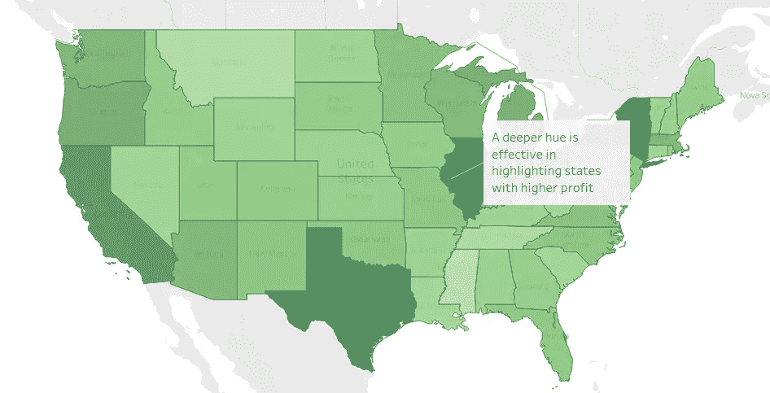
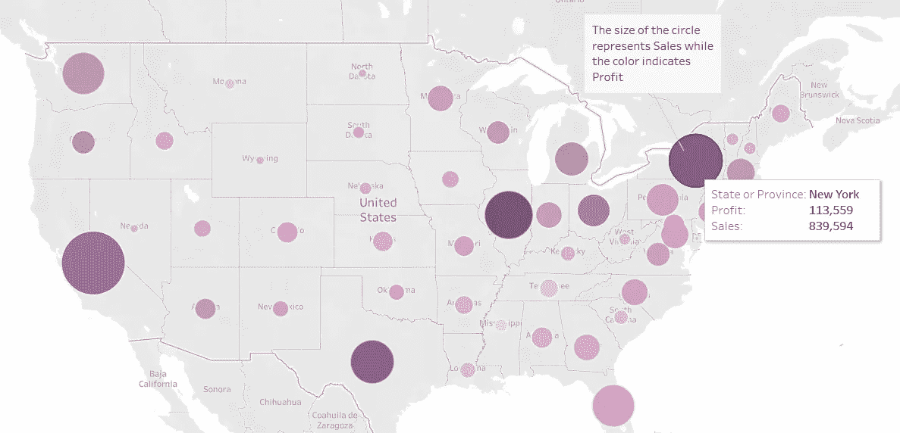
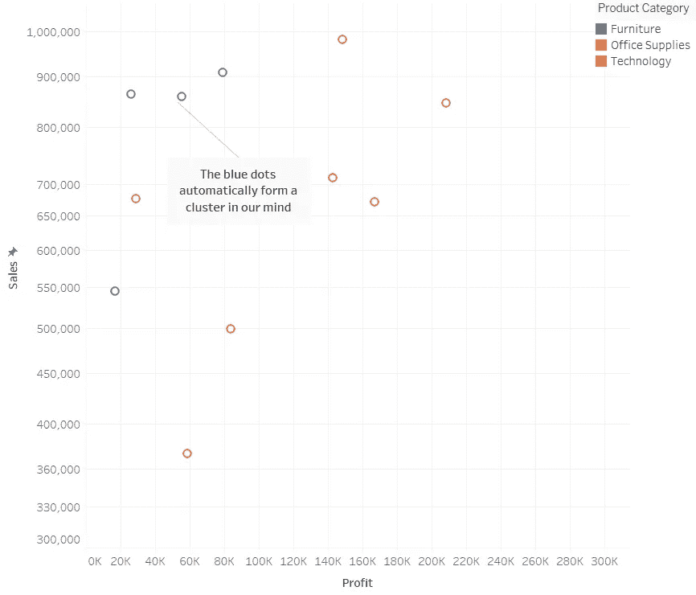

# 使数据可视化更容易理解

> 原文：<https://medium.com/analytics-vidhya/make-data-visualizations-easier-to-understand-17422be3f931?source=collection_archive---------20----------------------->

自过去十年以来，数据正在融入我们生活的几乎所有方面。我们在越来越小的空间里存储更多信息的能力鼓励我们确保不遗漏任何信息。收集信息的便利性，以及基于过去行为预测未来事件的需要，已经允许在各行各业中集成数据收集。从网页的浏览量到我们行走的步数，我们想知道每一个可以让我们更好地了解我们生活的指标。

虽然收集的数据量在增加，但我们从这些数据中提取价值的能力却跟不上增长的速度。浏览和处理数百万行数据是不可能的——即使这些行被聚合成几百条记录。

这就需要数据可视化——一种用图形表示信息的方法，利用人类固有的直觉和感知，在相对较短的时间内交流大量信息。

数据专家使用程序和工具梳理存储的数据，并从中发现有价值的模式。使用图形和图表可视化结果减轻了我们大脑的认知负荷，因为它们具有前注意属性——我们的大脑无需任何有意识的努力就能感知的视觉属性。这些属性分为三大类，帮助我们处理信息——*颜色、形状、*和*运动。*

让我们通过一个例子更深入地理解这些意味着什么。

使用的数据集是[超市数据](https://data.world/stanke/sample-superstore-2018)——来自美国一家商店的虚拟订单列表。数据集由全国不同类别商品的销售额和利润组成，我们可以通过 Tableau 这样的工具直观地表示出来。

# 颜色

不同的颜色和色调有助于我们将信息元素从它们的环境中以及彼此之间区分开来。这省去了我们连续搜索数据的努力。

作者可视化

渐变的颜色也有助于传达强度。在地图上表示单个指标(每个州的利润)可以根据填充的绿色阴影传达利润高低的州。我们的大脑会自动推断，较浅的颜色表示利润较低，而较深的颜色表示利润较高。

颜色也有与之相关的文化内涵。深红色普遍代表危险，但当它与绿色结合使用时，它可以表示“不”(绿色的“是”)。

# 形式

视觉元素的形式可以用来吸引人们的注意力。大小、形状、分组、长度都是我们的大脑毫不费力就能掌握的各种形式。

作者可视化

在上面的地图中，请注意我们如何将颜色和形状线索结合在一起，以突出不同州的销售额和利润。

然而，避免同时过度使用太多的线索是很重要的，因为它会让浏览者不知所措(这违背了有效可视化的目的)。

分组是另一种形式，它依赖于我们将单独的标记组合在一起的能力。它基于心理学的[格式塔原理](https://www.interaction-design.org/literature/topics/gestalt-principles),描述了人类通常如何通过分组相似的元素、识别模式和简化复杂的图像来看待物体。

作者可视化

上面的散点图突出了超市中不同类别的销售额和利润之间的关系。我们根据颜色和接近程度自动对这些点进行分组。这可以帮助我们得出这样的见解——家具类别(蓝色)销售额高，但利润率低。

# 活动

闪光和运动是吸引我们注意力的两种运动。运动的存在有助于我们理解从一点到另一点的过程。闪烁，或闪烁，是用来立即引起人们对某一特定元素的注意。建议只在绝对必要的时候使用闪光灯，因为当我们想把注意力集中在其他地方时，让我们的眼睛被吸引到某个地方会变得很烦人。

# 结论

我们的思想、学习和心理结构背后的科学在认知科学的学科下得到广泛研究，Power BI 和 Tableau 等现代可视化工具有助于应用多年的研究来有效地丰富数据的可视化处理。

…………………………………………………………………………………

> 我是一名独立的数据分析师，擅长 Tableau、Python 和 SQL，积极寻求合同、自由职业或远程机会。可以在 unnati.palan@gmail.com([Linkedin](https://www.linkedin.com/in/unnati-palan/)|[Tableau Public](https://public.tableau.com/profile/unnati7899#!/)|[Github](https://github.com/unnatipalan))找到我