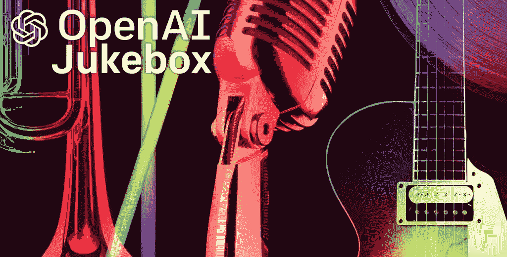
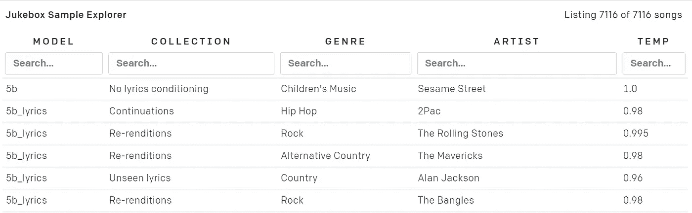

# 用人工智能制作音乐(OpenAI Jukebox)

> 原文：<https://medium.com/analytics-vidhya/make-music-with-artificial-intelligence-openai-jukebox-6677928bd186?source=collection_archive---------6----------------------->



OpenAI 的团队一直在研究一种能够自发生成新颖音乐的神经网络，目前它被认为是该领域的最先进技术。他们的方法包括对原始音频波形进行建模——这与之前象征性地发展音乐(如钢琴卷帘窗)的尝试不同。这对模型输出的结果有许多影响，最重要的是在唱歌时复制人声的能力。他们公开了他们所有的代码和训练过的模型，这样我们就可以自己尝试了。

点唱机网站可以在这里找到[，但是为了方便起见，你可以点击](https://openai.com/blog/jukebox/)[这个链接打开一个 Google Colab 页面](https://colab.research.google.com/github/openai/jukebox/blob/master/jukebox/Interacting_with_Jukebox.ipynb)，里面有一个 python 笔记本，里面包含了用点唱机模型生成音乐的所有设置和示例用法。

笔记本开始安装 GitHub 页面上的代码，检查是否使用了 GPU，并导入必要的库。

```
!pip install git+https://github.com/openai/jukebox.git!nvidia-smiimport jukebox
import torch as t
import librosa
import os
from IPython.display import Audio
from jukebox.make_models import make_vqvae, make_prior, MODELS, make_model
from jukebox.hparams import Hyperparams, setup_hparams
from jukebox.sample import sample_single_window, _sample, \
sample_partial_window, upsample
from jukebox.utils.dist_utils import setup_dist_from_mpi
from jukebox.utils.torch_utils import empty_cache
rank, local_rank, device = setup_dist_from_mpi()
```

在接下来的部分，你必须对他们的笔记本进行修改。如果你想保存你创作的音乐，你需要安装你的 google drive。为此，创建一个新的单元格并复制/粘贴以下代码。

```
from google.colab import drive
drive.mount('/content/drive')
```

当您运行上面的代码时，输出将包含一个链接，要求您使用 google 帐户登录，然后向您提供一个授权代码，您必须复制并粘贴到文本框输出中。一旦你按下回车键，它会告诉你，你已经成功地安装了你的谷歌驱动器。现在，您所要做的就是在下一个代码块中更改“hps.name”变量，以引用您的 google drive 文件夹——如下所示。

```
model = "5b_lyrics" # or "1b_lyrics"
hps = Hyperparams()
hps.sr = 44100
hps.n_samples = 3 if model=='5b_lyrics' else 8
hps.name = '/content/drive/My Drive/'
chunk_size = 16 if model=="5b_lyrics" else 32
max_batch_size = 3 if model=="5b_lyrics" else 16
hps.levels = 3
hps.hop_fraction = [.5,.5,.125]vqvae, *priors = MODELS[model]
vqvae = make_vqvae(setup_hparams(vqvae, dict(sample_length = 1048576)), device)
top_prior = make_prior(setup_hparams(priors[-1], dict()), vqvae, device)
```

接下来的代码块将为您的模型指定额外的参数。您可以指定 sample_length_in_seconds，这将决定您制作的歌曲有多长—请注意，非常长的歌曲将需要很长的时间来处理，Colab 在其免费层有 12 小时的会话超时，因此建议坚持 60 秒或更短。

```
sample_length_in_seconds = 60hps.sample_length = (int(sample_length_in_seconds*hps.sr)//top_prior.raw_to_tokens)*top_prior.raw_to_tokens
assert hps.sample_length >= top_prior.n_ctx*top_prior.raw_to_tokens, f'Please choose a larger sampling rate'
```

接下来你要指定一个艺术家，流派，以及你希望你的艺术家唱的歌词。为了确定可供选择的艺术家和流派，您可以查看一下[点唱机样本浏览器](https://jukebox.openai.com/)。



自动存储塔示例资源管理器—jukebox.openai.com

搜索功能允许您浏览模特接受过训练的艺术家和流派；型号在左栏中指定，具体取决于您选择的是 5b _ 歌词还是 1b _ 歌词。不要担心，如果您的选择不可用，这个部分中有一行代码会警告您。至于歌词，我发现把从随机文本生成器中提取的文本放进去，只是为了看看模型如何处理它，这相当有趣。但是，如果你真的想创作出像样的音乐，你可能需要在这一步下点功夫，让歌词包含模型之前已经合理看到的语言模式。

```
metas = [dict(artist = "Death Cab for Cutie",
 genre = "Pop Rock",
 total_length = hps.sample_length,
 offset = 0,
 lyrics = """To shewing another demands to. Marianne property cheerful informed at striking at. Clothes parlors however by cottage on. In views it or meant drift to. Be concern parlors settled or do shyness address. Remainder northward performed out for moonlight. Yet late add name was rent park from rich. He always do do former he highly.""",),] * hps.n_sampleslabels = [None, None, top_prior.labeller.get_batch_labels(metas, 'cuda')]
```

接下来，我们得到一些最终参数，包括采样温度。这个变量将调整你的歌曲的随机性。值为 1.0 意味着您希望模型非常接近艺术家和流派的确切音乐模式。他们推荐 0.98 或 0.99 的值来体现一定程度的新颖性。

```
sampling_temperature = .98lower_batch_size = 16
max_batch_size = 3 if model == "5b_lyrics" else 16
lower_level_chunk_size = 32
chunk_size = 16 if model == "5b_lyrics" else 32
sampling_kwargs = [dict(temp=.99, fp16=True,  max_batch_size=lower_batch_size,
chunk_size=lower_level_chunk_size),
dict(temp=0.99, fp16=True, max_batch_size=lower_batch_size,
chunk_size=lower_level_chunk_size),
dict(temp=sampling_temperature, fp16=True,
max_batch_size=max_batch_size, chunk_size=chunk_size)]
```

最后，我们到达开发高级音乐样本的代码块。我说的高级，指的是点唱机生成音乐的方式；Jukebox 采用三种不同级别的音频质量，最高级别(级别 2)处理“粒度最细”或最不详细的波形，意在识别音乐中的主要特征，然后生成级别 1 和级别 0 波形，通过称为上采样的过程添加歌曲的细节。运行这个代码块输入前面指定的所有参数，并生成我们的级别 2 样本。他们说每 20 秒的音乐样本大约需要 10 分钟，但是准备好每 20 秒需要 20 分钟。

```
zs = [t.zeros(hps.n_samples,0,dtype=t.long, device='cuda') for _ in range(len(priors))]
zs = _sample(zs, labels, sampling_kwargs, [None, None, top_prior], [2], hps)
```

运行完这段代码后，您将能够访问您刚刚在 google drive 中制作的歌曲！它将存储在一个名为 level_2 的文件中，听起来会非常粗糙，但如果你喜欢一般的声音，它会在你经历非常耗时的对歌曲进行上采样之前给你一个想法。如果您决定继续上采样过程，笔记本会让您运行一段代码来帮助清理一些内存，如下所示。

```
if True:
 del top_prior
 empty_cache()
 top_prior=None
upsamplers = [make_prior(setup_hparams(prior, dict()), vqvae, 'cpu') for prior in priors[:-1]]
labels[:2] = [prior.labeller.get_batch_labels(metas, 'cuda') for prior in upsamplers]
```

最后，我们得到了令人难以置信的处理密集型、非常耗时的单行代码，它调用了“上采样”函数。强烈建议您在夜间运行这行代码，因为这可能需要几个小时。然而，所有这些处理的结果就是你的最终产品:一首新颖的歌曲。这可能听起来有点滑稽，取决于你的输入参数，但这将是你的滑稽。如果你早上醒来，发现你的 google drive 里没有你完成的歌曲的 level_0 文件，你很可能与 Colab 服务器断开了连接。在这种情况下，你可以尝试减少你正在制作的歌曲的长度，或者选择尝试付费的 Colab 笔记本电脑，它不会让你断开连接。

```
zs = upsample(zs, labels, sampling_kwargs, [*upsamplers, top_prior], hps)
```

就是这样；整个过程其实很简单。祝你的音乐事业好运，希望你的最终结果不会像我的某些人那样听起来像个恶魔。