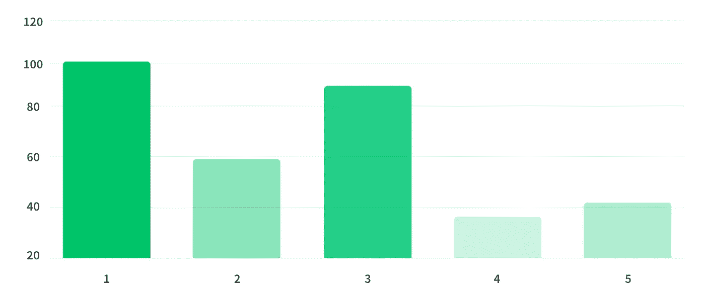
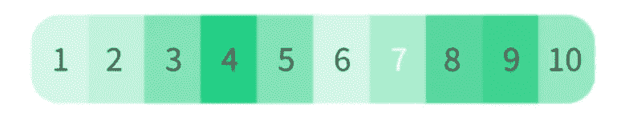
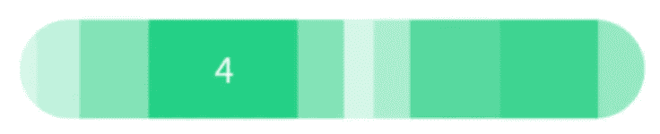

# 数据可视化|让您的条形图变得有趣！

> 原文：<https://medium.com/analytics-vidhya/make-the-your-bar-chart-interesting-38da38e331ec?source=collection_archive---------21----------------------->

在 [Unsplash](https://unsplash.com?utm_source=medium&utm_medium=referral) 上由 [Balázs Kétyi](https://unsplash.com/@balazsketyi?utm_source=medium&utm_medium=referral) 拍摄的照片

当需要可视化表示**数量**和**比较**的数字时，有很多种图表可供使用。

*   **饼状图？🤔** 不过还是把饼状图留着当甜点吧。你可以在这里找到更多的
*   **折线图？**🤔
    建议用于呈现趋势，而非比较。
*   **条形图？🤔这是一种非常简单的图表，常用于比较**

使用条形图展示数据

**嗯，我们能做点什么让它变得更有趣吗？为什么不呢？** 让我们利用**色调**，摆弄一下**体重和身高**，甚至一些**数学形状**，比如圆形或长方形。作为一个额外的收获，它可以在设计中为你节省很多空间！

这里有一些方法可以看看

1.  **通过颜色阴影可视化**

**通过颜色阴影可视化**

不同色调的颜色可以表现出密度、层次和比例。颜色越深，意义越强烈，反之亦然。
在这种情况下，颜色阴影最深的方框的票数最高。

**2。通过颜色阴影可视化&尺寸**

**通过颜色阴影可视化&尺寸**

这些颜色看起来够好了吗？有些人可能对颜色有问题。因此，让我们也来玩玩维度，让它在视觉上更加清晰。

数量最少的物品将占最少的部分。同时，拥有最多数量的将是最大的。可以根据百分比或者原数来分。

在上面的例子中，不用思考，我们可以很快看到每个类别与其他类别甚至整体相比有多大或多小，或多或少的数量或规模。

**3。玩其他形状**

**玩其他形状**

这个怎么样？
是不是看起来更有趣更有创意？

圆形通常很好地呈现了规模或密度。从传统形状改为圆形可能有助于设计看起来更干净。

你怎么看？和我还有其他人一起分享吧！