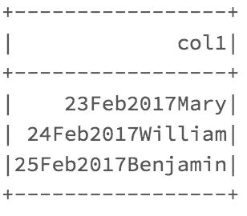
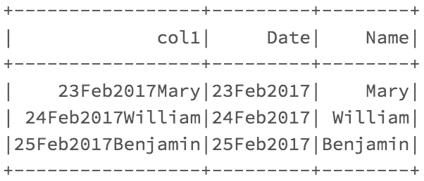
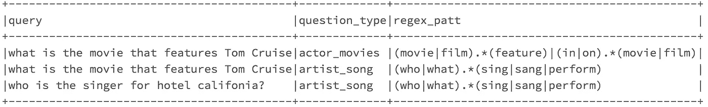
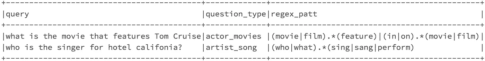
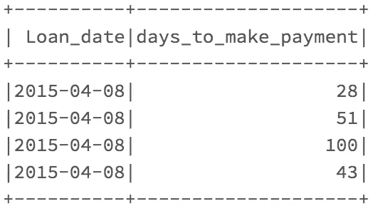
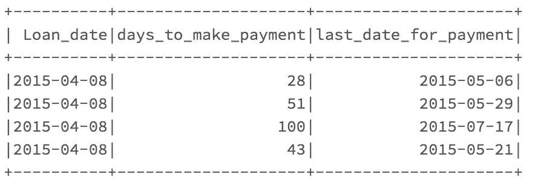

# 使用表达式使基于 Apache Spark column 的内置函数更加动态，并避免使用 UDF。

> 原文：<https://medium.com/analytics-vidhya/make-your-apache-spark-column-based-in-built-functions-more-dynamic-and-avoid-udfs-using-54486f1dbf47?source=collection_archive---------1----------------------->

**(Spark2.4 和 Python3)**

***Spark*******2.4+***为 Python 和 Scala 提供了全面而健壮的 API，允许开发者实现各种基于 sql 的函数，用于大规模操作和转换数据。正如在 API 中看到的，这些函数可以接受两种类型的输入；完整的**列值(col)** ，或**值**(它们是**静态的**，不会因处理的每一行而改变)。*

**

***PySpark API:**[https://spark . Apache . org/docs/latest/API/python/PySpark . SQL . html](https://spark.apache.org/docs/latest/api/python/pyspark.sql.html)*

## ****例如:****

***相关函数:** ( *以 2 列为输入*)*

*`pyspark.sql.functions.**corr**` **( *栏 1* ，*栏 2* )***

**相关性将被计算到****col 1 和 col2*** 的每行组合中*

***子串函数** :(str( **列**)、pos( **值**)、len( **值**))*

*`pyspark.sql.functions.**substring**` **( *str* ， *pos* ， *len* )***

**因此，与可以接受 col 的 str 不同，pos 和 len 是文字值，不会为每一行* ***改变*** *。**

> *这里，您可以使用**表达式**使您的子串函数**更加动态，**允许它**将 pos 和 len 值作为整个列**，而不是**分配静态的文字值。***

*如果你试图在 **PySpark 语法中给你的 **pos 和 len 位置**分配列，如上图**，**所示，你会得到一个错误:***

```
*TypeError: Column is not iterable*
```

# ***什么是表情？***

*从表面上看，您可以看到它们允许您在 spark 代码中编写 **sql 类型语法**。然而，当你深入观察时，你会发现它们有能力在内置功能中激发你的火花。*

*表达式有两种用法，*pypspark . SQL . functions . expr***或者 *df。select expr*T6。***

*****一些基本语法**:***

```
***df.selectExpr("age * 2", "abs(age)").collect()df.select(expr("length(name)")).collect()***
```

> ***除此之外，表达式基本上允许您用**输入列值(col)** **来代替文字值**，这在文档中显示的常用 Pyspark api 语法中是**不可能**做到的。***

***现在我将提供使用表达式和内置函数的例子，以一种动态和可伸缩的方式处理现实世界的 spark 问题。***

## ***示例 1:***

***假设您有一个 DataFrame(df ),它具有 StringType 的 col1 列，您必须**解包**并**创建两个新列(日期和名称)**。我们将使用一个更动态的**子串**函数来解包我们的列。***

******

***你可以看到，日期字符串是每次 **(9)** 的**相同字符串长度**，然而，用于名称的字符串长度是**不断变化的(Mary:4，William:8，Benjamin:9)。*****

***pyspark api **中的常规子串函数将使我们能够解包日期**、**，但是对于名称，我们将使用表达式**来执行该函数。***

```
***from pyspark.sql import functions as F
df.withColumn(“Date”, F.substring(“col1”,1,9))\
.withColumn("name, **F.expr(“””substr(col1,10,length(col1))”””)**).show()***OR***from pyspark.sql import functions as F
df.withColumn("Date", F.substring("col1",1,9))\
.withColumn("Length", F.length("col1"))\
.withColumn("Name", **F.expr("""substr(col1,10,Length)""")**)\
.drop("Length").show()***
```

******

***正如您在**粗体中所看到的，**这两个表达式 **(F.expr)** 允许您向您的**子串函数**提供一个列 **(length(col1)或 Length column)** ，这基本上使得**对每一行** **都是动态的，而无需使用 UDF** (用户定义的函数)。***

> ***这将节省大量宝贵的**计算资源**和时间，因为**赋予您 spark 内置函数**到**像 UDF** 一样运行，而没有与 UDFS 相关的所有**计算开销。*****

***我在 *stackoverflow* 上回答过一个**类似的问题**:[https://stack overflow . com/questions/60426113/how-to-add-delimiters-to-a-CSV-file/60428023 # 60428023](https://stackoverflow.com/questions/60426113/how-to-add-delimiters-to-a-csv-file/60428023#60428023)。使用表达式的理由有点不同，因为字符串**的长度没有改变**，这是出于懒惰(我不想计算字符串的长度)。***

## ***示例 2:***

***这个例子实际上直接来自我回答的一个 stackoverflow 问题:[https://stack overflow . com/questions/60494549/how-to-filter-a-column-in-a-data-frame-by-the-regex-value-of-another-column-in-s/60494657 # 60494657](https://stackoverflow.com/questions/60494549/how-to-filter-a-column-in-a-data-frame-by-the-regex-value-of-another-column-in-s/60494657#60494657)***

***假设您有一个 DataFrame，其中有一个 StringType 类型的列(**查询**)，您必须对其应用一个 **regexp_extract** 函数，并且您有另一个列( **regex_patt** )，其中包含该 regex 的所有模式，**逐行。**如果您不知道如何使 regexp_extract 函数对每一行都是动态的，**您将构建一个 UDF，将两列**作为输入，并计算每一行的正则表达式。**(会很慢，成本效率低)**。***

******

****这个问题主要是想过滤掉与给定模式不匹配的行。****

***PySpark api 有一个内置的 **regexp_extract:*****

```
***pyspark.sql.functions.**regexp_extract**(*str*, *pattern*, *idx*)***
```

***但是，我 **t 只把 str 作为列**，**而不是模式**。该模式必须在函数中指定为**静态字符串值。因此，我们可以使用一个**表达式向函数的模式部分**发送一列:*****

```
***from pyspark.sql import functions as F
df.withColumn("query1", **F.expr("""regexp_extract(query, regex_patt)""")**).filter(F.col("query1")!='').drop("query1").show(truncate=False)***
```

******

*****粗体显示的表达式**允许我们逐行应用正则表达式**并过滤掉不匹配的行**，因此使用**过滤器移除了第 2 行**。*******

***如上所述**，如果您试图将 **regex_patt 作为一列**放入您的**常用 pyspark regexp_replace 函数语法**中，您会得到以下错误:*

```
*TypeError: Column is not iterable*
```

***例 3:***

*假设您有一个显示在下面的数据框架**，它有一个 **loan_date 列(DateType)** 和 days_to_make_payment 列( **IntegerType** )。您想要计算付款的最后日期**，这基本上是*将天数列添加到日期列，以获得新的日期***。*******

********

****您可以使用 spark 内置的 **date_add** 函数来完成此操作:****

```
****pyspark.sql.functions.**date_add**(*start*, *days*)****
```

*****它返回开始后第天的日期。* **然而**，使用这个语法，它**只允许我们把*开始*作为列**，而把***作为静态整数值。****因此，我们可以使用一个**表达式将 days_to_make_payment 列作为 *days*** 发送到我们的函数中。*****

```
**from pyspark.sql import functions as F
df.withColumn(“last_date_for_payment”, **F.expr(“””date_add(Loan_date,days_to_make_payment)”””)**).show()**
```

********

****我只想最后一次重申**如果您使用常用的 pyspark 语法将**天 _ 到 _ 付款**到*天*写成这样:******

```
****from pyspark.sql import functions as F
df.withColumn("last_date_for_payment", F.date_add(F.col("Loan_date"),F.col("days_to_make_payment"))).show()****
```

********你会得到这个错误:********

```
****TypeError: Column is not iterable****
```

# ******结论:******

******Spark 是大数据处理引擎的黄金标准，它有一个庞大的开源社区一直在为此做出贡献。它有太多的功能可以让你执行 Pb 级的转换。也就是说，当涉及到**UDF(需要将数据从执行器的 JVM 移动到 Python 解释器)**和 **Joins(在分区/内核之间混洗数据)**时，人们应该**很好地意识到它的局限性**，并且人们应该总是**尝试将其内置函数推到它们的极限**，因为它们对于大数据任务 ***是高度优化和可伸缩的*。********