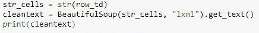

# 创建您的新冠肺炎数据集

> 原文：<https://medium.com/analytics-vidhya/make-your-covid-19-dataset-ab70eadc702?source=collection_archive---------24----------------------->

全球正面临前所未有的冠状病毒威胁，我们需要随时了解这种病毒传播的最新情况。数据是一种重要的资源，如今检索数据很容易——我们只需谷歌一下，但参与提取数据的过程是一项可以培养洞察力和正确看待事物的活动。

*虽然有许多网站包含数据集，我们随时可用，您可以通过网络搜集包含新冠肺炎相关信息的相关表格来制作您的数据集。这是我的第一篇文章，我们将一起尝试建立我们的数据集！*

src:谷歌图片

以下是您需要的重要 Python 库(如果您想了解关于该库的更多信息，可以访问链接):

1.  [**Pandas**](https://pypi.org/project/pandas/) -你将需要它来操作我们将在网络抓取后生成的数据帧(是的，我们将从一个可靠的网站获取我们的数据集)。
2.  [**Plotly**](https://pypi.org/project/plotly/) -一种更具交互性和综合性的数据可视化方法。
3.  [**beautiful soup**](https://pypi.org/project/beautifulsoup4/)**-**用于从 HTML 和 XML 文件中提取数据的 Python 库。
4.  [**urllib**](https://pypi.org/project/urllib3/)**-**一个集合了几个处理 URL 的模块的包。

*但是等等，什么是网页抓取？*

网页抓取是指抓取网页并从中提取数据。抓取是指下载页面(当您查看页面时，浏览器会这样做)。因此，网页抓取是网页抓取的主要组成部分，以获取网页供以后处理。一旦取出，就可以进行提取。可以对页面内容进行解析、搜索、重新格式化，将其数据复制到电子表格中，等等。

更多关于使用 beautifulsoup [*这里*](https://towardsdatascience.com/introduction-to-web-scraping-with-beautifulsoup-e87a06c2b857)

推荐使用 [*Jupyter 笔记本*](https://jupyter.org/install) 编写代码，因为它有如此多的灵活性。

现在我们有了自己的设置，让我们开始我们的旅程…

[活动发起人](https://unsplash.com/@campaign_creators?utm_source=medium&utm_medium=referral)在 [Unsplash](https://unsplash.com?utm_source=medium&utm_medium=referral) 上的照片

> **第一步:进口必需品**

一如既往，我们的第一步将是导入重要的库。

导入必要的模块后，您应该指定包含数据集的 URL，并将其传递给 urlopen()以获取页面的 HTML。

> **第二步:制作一个漂亮的汤品**

这是通过将 html 传递给 BeautifulSoup()函数来完成的。漂亮的 Soup 包用于解析 html，即获取原始 html 文本并将其分解成 Python 对象。第二个参数“html.parser”是 html 解析器，此时您不需要担心它的细节。

soup 对象允许您提取关于您正在抓取的网站的有趣信息，例如获取页面的标题。

您可以使用 soup 的 [find_all()](https://www.crummy.com/software/BeautifulSoup/bs4/doc/#calling-a-tag-is-like-calling-find-all) 方法来提取网页中有用的 html 标签。有用标签的例子包括超链接的< a >，表格的< table >，表格行的< tr >，表格标题的< th >，表格单元格的< td >。例如，下面的代码显示了如何提取网页中的所有超链接。

> **步骤 3:从网站中提取表格行**

该表包含印度新冠肺炎病例的官方记录。你可以在谷歌上搜索包含有新冠肺炎病例相关信息的定期更新表格的网站。

表格 HTML 标签

我使用的表格包含了印度新冠肺炎各邦的情况。

您应该首先以列表形式获取所有表格行，然后将该列表转换为数据框。下面是一个“for”循环，它遍历表格行并打印出行的单元格。

上面的输出显示每一行都打印有嵌入其中的 html 标记。这不是我们想要的。你可以用漂亮的汤或者正则表达式来移除 html 标签。

使用美味的汤

移除 html 标签最简单的方法是使用 Beautiful Soup，只需要一行代码就可以做到。将感兴趣的字符串传递给 BeautifulSoup()并使用 get_text()方法提取没有 html 标记的文本。

使用[正则表达式](https://docs.python.org/3/library/re.html)是非常不鼓励的，因为它需要几行代码并且很容易出错。它需要导入' re '(用于[正则表达式](https://docs.python.org/3/library/re.html))模块。下面的代码显示了如何构建一个正则表达式来查找< td > html 标记中的所有字符，并用一个空字符串替换每个表格行中的字符。

首先，通过将一个字符串传递给 re.compile()来编译正则表达式。点、星和问号(。*?)将匹配一个左尖括号，后面跟任何东西，后面跟一个右尖括号。它以非贪婪的方式匹配文本，也就是说，它匹配尽可能短的字符串。如果省略问号，它将匹配第一个左尖括号和最后一个右尖括号之间的所有文本。编译正则表达式后，可以使用 re.sub()方法查找正则表达式匹配的所有子字符串，并用空字符串替换它们。下面的完整代码生成一个空列表，提取每一行的 html 标记之间的文本，并将其附加到分配的列表中。

使用正则表达式会使代码变得冗长

> **第四步:将列表转换成数据帧**

数据框不是我们想要的格式。要清理它，您应该在逗号位置将“0”列拆分成多个列。这是通过使用 str.split()方法完成的。

这看起来好多了，但仍有工作要做。数据框的每一行都有多余的方括号。您可以使用 [strip()](https://www.tutorialspoint.com/python/string_strip.htm) 方法删除列“0”上的左方括号

该表缺少表头。您可以使用 find_all()方法来获取表格标题。与表格行类似，您可以使用 Beautiful Soup 来提取表格标题的 html 标记之间的文本。

然后，您可以将标题列表转换为 pandas 数据框。类似地，您可以在所有行的逗号位置将列“0”拆分为多个列。

可以使用 concat()方法将两个数据帧连接成一个数据帧

下面显示了如何将第一行指定为表格标题。

此外，请注意表头是如何复制为数据框中的第一行的。可以使用 [drop()](https://pandas.pydata.org/pandas-docs/stable/reference/api/pandas.DataFrame.drop.html) 命令将其删除。

此时，您的数据集应该看起来不错。

最终表格示例

> **第五步:数据可视化**

这是最后一步，因为我们有自己的数据，只需要在我们的机器上漂亮地展示出来。此时，您可以参考许多教程和文章来利用您提取的数据，并以您喜欢的方式呈现出来。我用 Plotly 表示简单的条形图和饼图。更多信息可在[这里](https://plotly.com/python/getting-started/?utm_source=mailchimp-jan-2015&utm_medium=email&utm_campaign=generalemail-jan2015&utm_term=bubble-chart)找到。

我对数据的最终表示如下:

*就这样，我们的小实验结束了。我希望这篇文章有助于提高你的学习。*

*呆在家里，保持安全！*